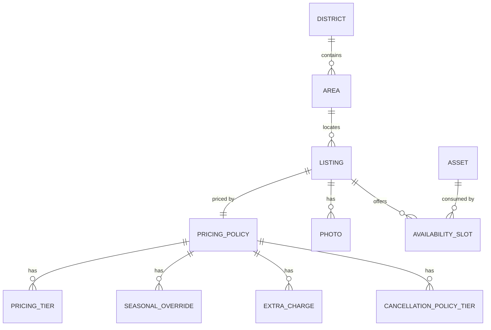
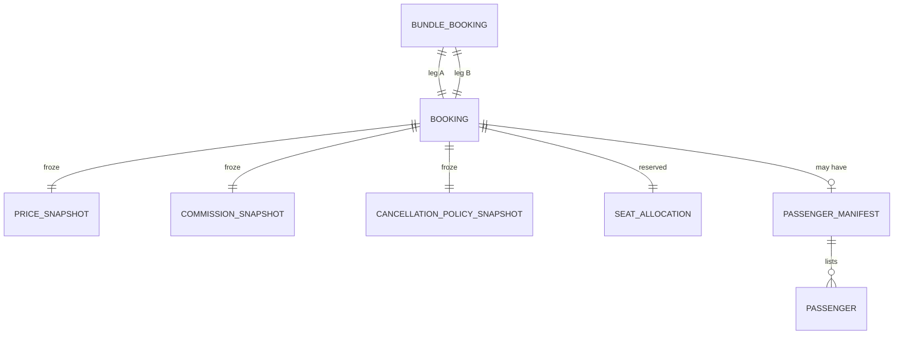
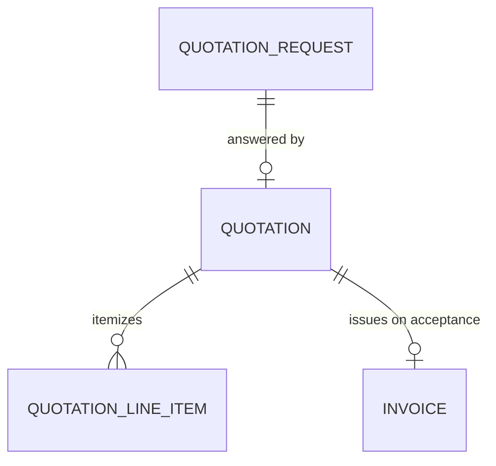

## TL;DR

- **Within** a context: associations between aggregate roots and their entities and value objects.
- **Across** contexts: stable **identity references**, **snapshots**, or **published contracts** only.
- Mermaid diagrams here are conceptual, not database foreign keys.

## About this document

Restates [Domain models](/docs/30-49-domains/domain-models/domain-models) §3 and §2 cross-context rules.

| Topic | Document |
| --- | --- |
| ERD diagrams | [Conceptual ERD diagrams](/docs/30-49-domains/data-model/erd-diagrams) |
| Cross-context rules | [Consistency and integration](/docs/30-49-domains/data-model/consistency-and-integration) |

---

## Intra-context relationships

Associations below are inside one bounded context. Cross-context links are in the next section.

Entities and containment match [Domain models](/docs/30-49-domains/domain-models/domain-models) §3.

### Identity & Access
- An **Account** has zero or more **OAuth identities** (external credentials linked to it), all inside the Account boundary.
- An **Account** carries exactly one marketplace **Role** (`Tourist | Corporate | Provider`) and one **Language Preference** value, plus a **LockoutWindow** value (count + until-instant).
- An **Admin** principal is a separate authenticatable identity; it does not share the Account aggregate and is not a Role value on Account.

### Provider Onboarding & Verification
- A **Provider** (ProviderApplication) carries a **VerificationChecklist** (item → satisfied) and owns its uploaded **Documents** (license/registration/insurance/ID) as entities within the application boundary.
- A **Provider** relates to one or more **LicenseRecord** aggregates (number + valid-until) and, on approval, one **SupportTrial**. Approval, checklist outcome, and support-trial start are one transaction; document upload is independent.

### Catalog & Inventory
- A **ProviderAsset** belongs to exactly one Provider and carries `license_plate_or_vin`, `capacity`, and `vehicle_category` (PRD taxonomy: Alphard, HiAce, Sedan, Limousine; bus bands 20/40/50).
- A **Listing** references exactly one **PricingPolicy** and owns its **Photo** entities (the first being the representative thumbnail; ≥1 required to publish, `INV-10`). Publish requires the Provider's Merchant Account verified (`INV-12`).
- A **PricingPolicy** owns its **PricingTier** (group-size band), **SeasonalOverride**, **ExtraCharge**, and **CancellationPolicyTier** entities (up to 4 cancellation tiers; up to 5 non-overlapping group tiers, `PRC-4`, `C-08`).
- An **AvailabilitySlot** is bound to exactly one **Asset** (the specific vehicle or guide it consumes) and owns the `available_seats` counter; overlap constraints are **per-Asset** (`CON-4`).
- A **District** (`prefecture` or `designated_city`) contains zero or more **Area** entities (municipality or ward). A **Listing** is located within exactly one Area. A District/Area with zero Published Listings is not presented (`INV-8`). Geography is seeded from official administrative codes; coordinates are city-hall centroids for map pins and near-me — not boundary polygons ([ADR-013](/docs/30-49-domains/architecture-decisions/adr-013-geography-reference-data)).
- `calculate_quote` produces a **PriceBreakdown** value (computed, not stored as a cross-context authoritative fact) from the Listing's PricingPolicy and the requested parameters (`PRC-1..6`).

This diagram is illustrative: Catalog aggregate associations inside one bounded context (not database foreign keys).

> Note: the diagram is **conceptual**. `||--o{` denotes a one-to-many domain association and `||--||` a one-to-one association; they are not foreign keys, cardinality constraints on tables, or storage relationships.

- An **AvailabilitySlot** is bound to exactly one **ProviderAsset** (the specific vehicle or guide it consumes) and owns the `available_seats` counter; overlap constraints are **per-Asset** (`CON-4`). A per-vehicle (flat-rate) booking consumes 100% of slot capacity immediately (`CON-6`).

### 6.4 Booking & Checkout
- A **CheckoutSession** owns its **PriceSnapshot**, **CommissionSnapshot**, and **CancellationPolicySnapshot** value objects, a **FulfillmentPayload** (pickup/dropoff addresses, optional flight number, passenger name/phone, luggage count, optional special notes — `BKG-11`), a **SeatAllocation** (slot reference + seat count), and a session lifecycle state. Snapshots are frozen at session creation (`PRC-8`, `BKG-9`).
- On payment success, a **Booking** is materialized from the CheckoutSession: snapshots and Fulfillment Payload are copied; state enters **`CONFIRMED`** for B2C card checkout (`BKG-10`).
- A **Booking** owns its copied **PriceSnapshot**, **CommissionSnapshot**, **CancellationPolicySnapshot**, **FulfillmentPayload**, **SeatAllocation**, **BookingState**, and **CancellationContext** (initiator + reason, modeled so the refund rule is derivable, `AMB-014`).
- A **Booking** has zero or one **PassengerManifest** (only on a confirmed group Booking); a manifest owns its **Passenger** entities (name + age group) (`BKG-6`).
- A **BundleBooking** links exactly two **Booking** aggregates; each Booking still runs its own lifecycle and carries its own independent CommissionSnapshot (`BKG-3`).

This diagram is illustrative: Booking-owned snapshots, manifest, and bundle link (write-once facts and lifecycle-owned state).

### Payments & Payouts
- A **Payment** records the buyer-side capture **held by the payment provider** for one CheckoutSession then Booking; its amount equals the snapshotted gross (`FIN-3`, `PAY-13`). No Red Cab balance is represented (`INV-13`).
- A **ProviderMerchantAccount** belongs to exactly one Provider (`provider_id`, 1:1); mirrors provider sub-merchant state and exposes a derived `status` for publish and settlement gating (`INV-12`, `LC-12`, `PAY-14`).
- A **PayoutQueueEntry** carries the frozen Net Payout Amount for one Booking after completion; entry lifecycle is `QUEUED → PROCESSING → DISBURSED | FAILED` (`LC-13`, `LC-14`). Snapshots the destination Provider Merchant Account reference at settlement-release initiation (`provider` discriminator + opaque `provider_ref`; `FIN-3`).
- A **Refund** records a return of funds for one Booking, computed from the snapshot (`PAY-6`).
- A **CommissionRateSetting** is the single platform-wide rate, read at checkout to populate a Booking's snapshot; it owns no per-Booking fact (`PAY-2`).
- A **ReconciliationRecord** records a bank-transfer receipt fact for a corporate Booking (`PAY-9`).

### Corporate Quotation & Invoicing
- A **QuotationRequest** may give rise to one **Quotation**; a **Quotation** owns its **QuotationLineItem** entities (service/date/pax/unit price/total) and a **ConsumptionTax** (10%) value (`PAY-10`).
- An accepted **Quotation** gives rise to one **Invoice** (Seikyusho) and, through the anti-corruption boundary, one Booking via create-from-quote (`LC-11`).

This diagram is illustrative: Corporate quotation artifacts before the ACL into Booking.

### 6.7 Reviews & Ratings
- A **Review** belongs to exactly one completed Booking (at most one Review per Booking, `INV-5`), owns its review **Photo** entities, and may own one **ProviderResponse** once published.
- A **RatingSummary** aggregates the approved Reviews for one Listing into a **RatingScore** (average + count), recalculated only from approved Reviews (`OPR-6`).

### Notifications
- A **NotificationDispatch** is one rendered message addressed to one recipient over one **Channel** (Email/SMS), carrying a snapshot of the recipient's language at send time and a template reference.

---

## Cross-context references

Across context boundaries, aggregates relate **only by identity** or through an **immutable snapshot**. They are never embedded or co-owned ([Domain models](/docs/30-49-domains/domain-models/domain-models) §2).

The table lists canonical cross-context references.

| From (context) | References (by id) / consumes (snapshot/contract) | To (owner) | Nature |
| --- | --- | --- | --- |
| Provider (PRV) | `account_id` (the principal behind the Provider) | Account (IAM) | id reference |
| Booking (BKG) | `tourist_id` / buyer principal | Account (IAM) | id reference |
| Quotation (COR) | Corporate Client principal | Account (IAM) | id reference |
| Catalog (CAT) | Provider Status read `{ provider_id, status, license_valid_until }` | Provider (PRV) | conformist read contract |
| Catalog (CAT) | payout capability read `{ provider_id, status, payouts_enabled, verified_at }` | Payments (PAY) | conformist read contract |
| Listing (CAT) | `provider_id` | Provider (PRV) | id reference |
| Booking (BKG) | `listing_id`, `slot_id`, `provider_id`, `checkout_session_id` (provenance) | Listing / AvailabilitySlot / Provider (CAT, PRV) | id reference |
| CheckoutSession (BKG) | `listing_id`, `slot_id`, `provider_id`, `tourist_id` | Listing / AvailabilitySlot / Provider / Account | id reference |
| CheckoutSession (BKG) | `PriceBreakdown` (input to PriceSnapshot) | PricingPolicy (CAT) | computed value contract, then snapshotted |
| CheckoutSession (BKG) | Commission Rate value (input to CommissionSnapshot) | CommissionRateSetting (PAY) | read at session creation, then snapshotted |
| Booking (BKG) | copies Price/Commission/Cancellation snapshots from CheckoutSession | CheckoutSession (BKG) | snapshot copy at materialization |
| Payment (PAY) | `checkout_session_id`, then `booking_id` + **Commission Snapshot** | CheckoutSession / Booking (BKG) | id reference + read-only snapshot |
| Quotation (COR) | `PriceBreakdown` for line items | PricingPolicy (CAT) | computed value contract |
| Booking (BKG) | created-from-quote command carrying `quotation_id` | Quotation (COR) | id reference across ACL |
| Review (REV) | completion fact `{ booking_id, tourist_id, listing_id, completed_at }` | Booking (BKG) | id reference + immutable fact |
| RatingSummary (REV) | `listing_id` | Listing (CAT) | id reference |
| Catalog (CAT) | `RatingRecalculated` score for display | RatingSummary (REV) | published value, display only |
| NotificationDispatch (NOT) | recipient principal + snapshotted language | Account (IAM) | id reference + snapshot |

Rules that hold for every cross-context reference:

- The referencing context **never** reads the referenced aggregate's internals or mutates it. It uses the published query or contract, or holds a snapshot ([Bounded contexts](/docs/30-49-domains/bounded-contexts)).
- A reference is by **stable identity**, so the referenced aggregate can evolve without breaking the reference.
- Where a downstream decision must be immune to upstream change, the fact is **snapshotted** rather than referenced live (see [Immutable snapshots](/docs/30-49-domains/data-model/snapshots)).
- The **Corporate → Booking** reference crosses an **anti-corruption boundary**: corporate vocabulary (line items, PO concepts, credit terms) is translated into Booking's command language and never leaks into Booking.
