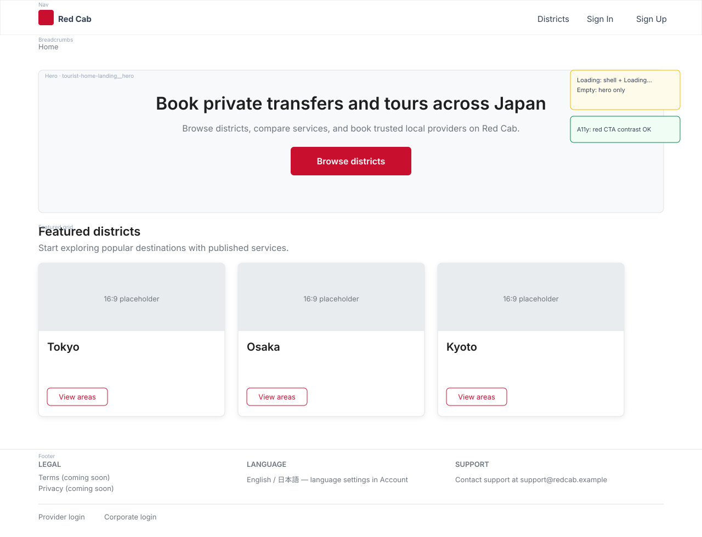
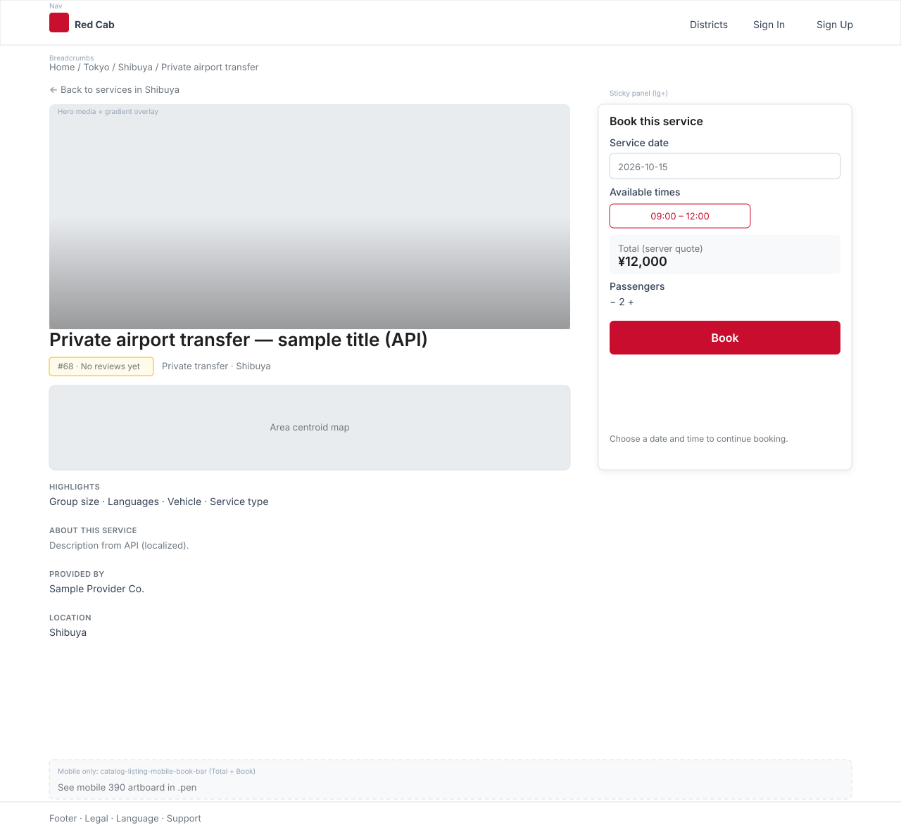
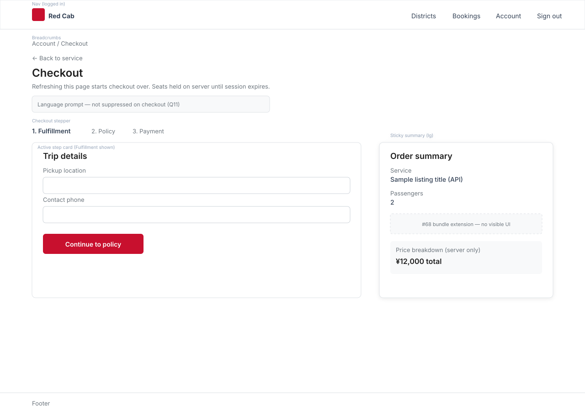

## TL;DR

- **Ships:** Tourist-scoped **brand tokens** (Sass + optional CSS vars on `.tourist-shell-layout`), wireframes (Home, listing detail, checkout) **published on GitHub Pages** from this repo, documented **EN/JA copy patterns**, visual alignment of discover + bookings + checkout chrome, and **styling of `#68` placeholder slots** (behavior unchanged).
- **Does NOT ship:** Design system package, i18n framework, API changes, client price math, provider/corporate/team refresh, `#68` logic/API wiring, auth/loader gating changes, guest language switch (**separate issue**, Q9), `formatJpyAmount` locale by preference (stays **`ja-JP` for all**, Q10).
- **Breaking change:** No URL or API changes.
- **Approved:** 2026-10-02 — PKM plan Q0–Q12 + author sign-off.
- **Delivery:** Option B — **PR 0** (`redcab-docs`) → **PR 1** tokens (DOM-neutral) → **PR 2** alignment + `#68` slot polish → **PR 3** JA chrome (**droppable**).
- **Implement gate:** `#68` merged on `main` (`d755bc1`); **PR 1** blocked until **PR 0** lands this spec + wireframe exports on `origin/main`.

## Problem

[Milestone E](/docs/70-79-business/planning/roadmap/tourist-ui-pre-phase-2#milestone-e--visual-polish-optional-before-phase-2-code) and [#69](https://github.com/markmamba/red-cab-web/issues/69) require polish after the unified shell (`#58`, `#64`), core funnel, and [#68](https://github.com/markmamba/red-cab-web/issues/68) placeholder slots exist. Today:

1. Brand colors live in `_variables.scss` but tourist/catalog SCSS in `_components.scss` still hardcodes many `rgba($brand-*, …)` values; **team/provider blocks share the same file** — global Bootstrap overrides are unsafe.
2. Discover **card grid** and bookings **list rows** lack a documented shared token set.
3. EN/JA behavior is ad hoc without a tourist-surface copy contract.
4. No wireframes are published for Home, listing detail, or checkout.

Evidence: `app/styles/_variables.scss`, `app/styles/_components.scss`; `catalog-listing-list-view.jsx`; `booking-list-page.jsx`; `web-68` placeholder views on home, listing detail, bookings.

## Governing docs

| ID | Document | Why |
| --- | --- | --- |
| Milestone E | [tourist-ui-pre-phase-2.md](/docs/70-79-business/planning/roadmap/tourist-ui-pre-phase-2) | Issue checklist |
| Program | [web-platform-program-strategy](/docs/70-79-business/planning/web-platform-program-strategy) | `#68` / `#69` sequencing |
| web-68 | [web-68-tourist-phase-2-placeholder-slots](/docs/60-69-initiatives/implementation-specs/platform/web-68-tourist-phase-2-placeholder-slots) | Placeholder DOM to style (Q12=in) |
| web-58 | [web-58-tourist-unified-layout-shell](/docs/60-69-initiatives/implementation-specs/platform/web-58-tourist-unified-layout-shell) | Shell tokens baseline |
| web-64 | [web-64-tourist-account-auth-shell-alignment](/docs/60-69-initiatives/implementation-specs/platform/web-64-tourist-account-auth-shell-alignment) | Auth/account chrome |
| web-62 | [web-62-tourist-checkout-multi-step-layout](/docs/60-69-initiatives/implementation-specs/pay/web-62-tourist-checkout-multi-step-layout) | Checkout step structure — polish only |
| web-56 | [web-56-tourist-access-and-route-contract](/docs/60-69-initiatives/implementation-specs/iam/web-56-tourist-access-and-route-contract) | Public vs account routes, SEO |
| frontend.md | [frontend conventions](/docs/50-59-frontend/conventions/frontend) | Bootstrap-first, OPR-9 EN/JA |
| ADR-017 | [adr-017-tourist-ui-public-url-architecture](/docs/30-49-domains/architecture-decisions/adr-017-tourist-ui-public-url-architecture) | Tourist UI umbrella |
| PRC-1 | [invariants](/docs/70-79-business/business-rules/invariants) | No client price computation |

## Design decisions

| # | Decision | Alternatives considered | Rationale |
| --- | --- | --- | --- |
| 1 | **New `web-69` spec** (Q0=C) | Corpus-only; extend web-58 | Issue-scoped visual + copy contract |
| 2 | **Wireframes: pen edit + GitHub Pages publish** (Q1=C, Q8) | pen URL only; exports only without pen | Edit in pen.dev; **canonical:** PNG/SVG under `platform/web-69/` embedded in this spec |
| 3 | **Four phased PRs** (Option B) | Single PR | DOM-neutral token PR; JA copy droppable |
| 4 | **Tourist-scoped tokens** | Global `$card-*` Bootstrap overrides | Avoid team/provider blast radius in `_components.scss` |
| 5 | **Sass + CSS vars on `.tourist-shell-layout`** | Sass only | Runtime/theming; no `rgba()` on vars holding `var(--bs-*)` |
| 6 | **SCSS refactor** (Q4=B, scoped) | Variables only | **Only** `.tourist-*` and `.catalog-listing-*` blocks; leave `.team-*` untouched |
| 7 | **Shared tokens; IA unchanged** (Q3=A) | Bookings as cards; discover as lists | Marketing cards vs account rows |
| 8 | **Guest EN + EN public meta** (Q5=A) | Guest JA; hreflang | Matches `meta` + loader defaults |
| 9 | **Guest language switch** (Q9) | In #69 | **Separate issue**; JA UI chrome logged-in only |
| 10 | **JPY display** (Q10) | Locale follows preference | **`CatalogListingService.formatJpyAmount` keeps `ja-JP` for all users** |
| 11 | **Language prompt on checkout** (Q11) | Suppress on checkout | **Do not suppress**; verify no payment/session remount on save + revalidate |
| 12 | **`#68` slots in polish** (Q12=in) | Exclude placeholders | Style placeholder regions; `#68` owns behavior |
| 13 | **JA chrome** (Q2=B, PR 3) | Document-only | `TouristSurfaceCopy` when `language_preference === JA` |
| 14 | **`lang` on shell** (E1) | Change `<html lang>` | Tourist shell wrapper from preference; root stays `en` |
| 15 | **After `#68` merge** (Q6=B) | Parallel polish | Gate satisfied (`d755bc1`) |
| 16 | **Vitest + manual QA + build** (Q7=A) | Tests-only | `npm run build` compiles SCSS; no Percy/Chromatic |
| 17 | **PR 1 DOM-neutral** (S4) | Rename classes with tokens | Token PR: no JSX class renames unless required later |
| 18 | **No loader/auth changes** | — | Profile/booking gates stay UI-layer |
| 19 | **Pricing** | — | Server fields only (`PRC-1`) |

## Wireframes

| Role | Where | Notes |
| --- | --- | --- |
| **Edit** | [pen.dev](https://pen.dev) / Pencil; `red-cab-web/design/web-69-tourist-visual-polish.pen` (see `red-cab-web/design/README.md`) | MCP-only for `.pen`; does not render on GitHub Pages |
| **Publish (canonical)** | `docs/60-69-initiatives/61-implementation-specs/platform/web-69/*.{png,svg}` embedded below | Deployed via `redcab-docs` GitHub Pages on `main` |
| **Link-out (optional)** | pen.dev share URL | Only if viewable in incognito **without** Pencil |
| **Optional stable URLs** | `static/wireframes/web-69/*` | e.g. `/redcab-docs/wireframes/web-69/home.png` for Milestone E |

| Surface | Route / view | pen.dev frame | Export (PR 0) |
| --- | --- | --- | --- |
| Home | `/` — `home-landing-view.jsx` (+ `#68` slots) | `Home` | `./web-69/home.svg` |
| Listing detail | `/districts/.../listings/:uuid` (+ `#68` slots) | `Listing detail` | `./web-69/listing-detail.svg` |
| Checkout | `/account/checkout` | `Checkout` | `./web-69/checkout.svg` |







Same links in [tourist-ui-pre-phase-2 Milestone E](/docs/70-79-business/planning/roadmap/tourist-ui-pre-phase-2#milestone-e--visual-polish-optional-before-phase-2-code).

## Copy boundaries

| In scope for JA chrome (PR 3) | Out of scope — do not client-translate |
| --- | --- |
| Nav labels, section headers, empty states, CTA chrome on discover/checkout | API `*_en`/`*_ja` via `getLocalizedLabel` |
| Presentational labels in checkout **views** (not schema) | Cancellation policy / legal copy from API |
| Document mixed-language fallback (E5) | Stripe / embedded payment UI locale (E6) |
| PR 3 JA strings — author best-effort review | Guest language switch — **separate issue** (Q9) |
| | `bookings-checkout-session-schema.js` zod messages unless PR 3 explicitly adds |
| | Hardcoded English toasts outside copy module (E8) — EN-only this milestone |

## Edge cases

| ID | Mitigation |
| --- | --- |
| E1 | `lang` on `.tourist-shell-layout` from `language_preference` (PR 3) |
| E2 | CJK font stack in token table; test JA headings |
| E3 | JA chrome **logged-in only**; guest switch → separate issue (Q9) |
| E4 | **`ja-JP` for all** in `formatJpyAmount` (Q10) |
| E5 | QA: listing with empty `_ja` + JA preference |
| E7 | Language prompt **on checkout** (Q11); test no payment remount |
| E9 | No yellow-on-white body text; hero scrim per wireframe; `prefers-reduced-motion` where motion added |
| E10 | QA: mobile book bar, empty/error/pending states, SSR vs hydration for JA account |

## EN/JA copy patterns (tourist discover + checkout)

| Layer | Source | Rule |
| --- | --- | --- |
| Listing/geography titles, descriptions, photo alt | API `*_en` / `*_ja` | `CatalogListingService.getLocalizedLabel(record, fieldPrefix, languagePreference)` |
| Bookings listing title | API `listing_title_en` / `listing_title_ja` | `BookingsBookingService.getListingTitle(booking, languagePreference)` |
| Currency display | `formatJpyAmount` | **`ja-JP` locale for all users** (Q10) — not tied to UI chrome language |
| Language preference | Account `language_preference` when authenticated | From `useAuth` / loader account payload |
| Guest discover | Default `LANGUAGE_PREFERENCE.EN` in public loaders | No cookie/`?lang` in #69 |
| UI chrome (discover + checkout only) | `TouristSurfaceCopy` (PR 3) | `getTouristSurfaceCopy(key, languagePreference)`; **logged-in JA only** for chrome benefit |
| Public listing SEO | `meta` title + breadcrumb `title_en` | EN for indexable URLs (Q5=A) |

### Chrome keys (minimum set — extend if wireframes / `#68` labels add strings)

| Key | EN (default) | JA (when preference JA) | Surfaces |
| --- | --- | --- | --- |
| `discover.cta.book` | Book now | 予約する | Listing panel, mobile bar |
| `discover.cta.view_listings` | Browse districts | 一覧を見る | Home, district/area empty CTAs |
| `checkout.step.fulfillment` | Trip details | 受取方法 | Checkout stepper |
| `checkout.step.policy` | Policy | 規約 | Checkout stepper |
| `checkout.step.payment` | Payment | お支払い | Checkout stepper |
| `checkout.order_summary` | Order summary | 注文内容 | Checkout sidebar |

Implement: `app/domains/tourist/tourist-surface-copy.js` + unit spec (PR 3).

## Tourist brand tokens

_Add to `app/styles/_variables.scss`; expose on `.tourist-shell-layout` via CSS custom properties where needed (PR 1). Refactor **only** `.tourist-*` and `.catalog-listing-*` in `_components.scss`._

| Token | Purpose |
| --- | --- |
| `$brand-red`, `$brand-green`, `$brand-yellow`, `$brand-white`, `$brand-dark`, `$brand-slate` | Existing palette (unchanged hex) |
| `$tourist-shell-nav-bg`, `$tourist-shell-footer-bg`, `$tourist-shell-border-color` | Existing shell |
| `$tourist-font-stack` | Inter + **JP fallback** (`Noto Sans JP`, system UI) for CJK (E2) |
| `$tourist-surface-bg` | Page/card surface |
| `$tourist-card-border-color` | Card/list container borders |
| `$tourist-card-border-radius` | Shared radius discover + booking shell |
| `$tourist-card-shadow` | Shared elevation |
| `$tourist-accent-border-width` | Left accent bars |
| `$tourist-overlay-gradient-*` | Hero/media overlays |
| `$tourist-mobile-bar-bg` | Mobile book bar |
| `$tourist-section-spacing-y` | Vertical rhythm between detail sections |

**Acceptance (PR 1):** No visual diff on team/provider pages; `npm run build` passes; no global Bootstrap `$card-*` overrides.

## API contract

_No API changes._

## Web contract

| Surface | Primary modules | Change type |
| --- | --- | --- |
| Home | `home-landing-view.jsx`, `home-page.jsx` | Spacing + `#68` slot styling |
| Discover | `catalog-listing-list-view.jsx`, district/area list pages, `marketplace-catalog-district-page-layout.jsx` | Card tokens |
| Listing detail | `catalog-listing-*-view.jsx`, `marketplace-catalog-listing-detail-page.jsx` | Hero, panel, `#68` slots |
| Shell / shared | `app/layouts/tourist/*`, `app/components/tourist/*` | Tokens; `lang` + language prompt (PR 3) |
| Bookings | `bookings-booking-tourist-*-view.jsx`, `booking-*-page.jsx` | List shell + rows + `#68` styling |
| Checkout | `tourist-checkout-page.jsx`, checkout session **presentational** views | Step chrome only |

### Files by PR (`red-cab-web`)

**PR 1 — tokens (DOM-neutral):**

- `app/styles/_variables.scss`
- `app/styles/_components.scss` (tourist/catalog blocks only)
- `app/layouts/tourist/tourist-shell-layout.jsx` (optional CSS var hooks only)

**PR 2 — alignment:**

- Catalog: `home-landing-view.jsx`, `catalog-listing-*-view.jsx`, `catalog-listing-price-breakdown-view.jsx` (labels only), marketplace catalog-district routes/pages listed in PKM plan
- Layouts/components: `tourist-nav.jsx`, `tourist-dashboard-layout.jsx`, `tourist-empty-state.jsx`, `tourist-error-state.jsx`, `tourist-shell-pending.jsx`, `tourist-auth-content.jsx`
- Bookings: `bookings-booking-tourist-*-view.jsx`, `booking-list-page.jsx`, `booking-detail-page.jsx`
- Checkout: `tourist-checkout-page.jsx`, `tourist-checkout-return-page.jsx` (if in wireframe)
- Checkout views: `bookings-checkout-session-checkout-stepper-view.jsx`, `order-summary-view.jsx`, `policy-step-view.jsx`, `fulfillment-form.jsx`, `cancellation-policy-view.jsx`, `payment-view.jsx` (chrome/layout only)

**PR 3 — copy (droppable):**

- `app/domains/tourist/tourist-surface-copy.js` (+ spec)
- Checkout/catalog copy consumers; `tourist-shell-layout.jsx` (`lang`, Q11 revalidate test)

**Excluded from polish** (unless PR 3 explicitly extends copy plumbing):

- `bookings-checkout-session-schema.js`, `bookings-checkout-session-payment-service.js`, `bookings-checkout-session-embedded-payment-view.jsx`, `bookings-checkout-session-service.js`

**Docs (PR 0):**

- This spec + `platform/web-69/*.{png,svg}`; optional `static/wireframes/web-69/`; Milestone E links

## Out of scope

- i18n library, `react-intl`, locale routing, guest language switch (Q9 → separate issue)
- Provider/corporate/team portals; global Bootstrap variable overrides
- `#68` placeholder **logic**, new API modules, eligibility math
- `#65`–`#67` discover enhancements
- Auth policy / loader gating changes
- Client-side price or refund math; changing `formatJpyAmount` locale by preference (Q10)
- Changing root `<html lang>` (shell wrapper only)
- stylelint / Percy / Chromatic (optional future chore)

## Tasks

### PR 0 — `redcab-docs`

- [x] Wireframe exports in `platform/web-69/`; embed in § Wireframes
- [x] Pencil source file `red-cab-web/design/web-69-tourist-visual-polish.pen` (scaffold; author frames in extension)
- [ ] Optional pen share URL (incognito-verified) + optional `static/wireframes/web-69/`
- [x] Milestone E wireframe links
- [x] Spec `status: approved` on `main` before web PR 1

### PR 1 — tokens

- [ ] Token table in `_variables.scss`; tourist/catalog SCSS refactor (scoped)
- [ ] `npm run lint`, `npm run test`, **`npm run build`**
- [ ] Spot-check team/provider unchanged

### PR 2 — alignment

- [ ] Wireframe-driven JSX/SCSS; **`#68` placeholder slots styled**
- [ ] Targeted Vitest updates; manual QA (partial)

### PR 3 — JA chrome (droppable)

- [ ] `TouristSurfaceCopy` + parity test; shell `lang`
- [ ] Checkout: language prompt **not suppressed**; verify no payment remount (Q11)
- [ ] **Manual (Q11):** On `/account/checkout` payment step with language prompt visible, save `language_preference` to JA and confirm embedded payment does **not** remount (session + step unchanged)

### After merge

- [ ] Set spec `status: implemented`
- [ ] Milestone E checkboxes

## Acceptance criteria

- [ ] Wireframes published (GitHub Pages) and linked from spec + Milestone E
- [ ] Tokens in `_variables.scss`; **only** tourist/catalog blocks refactored; no team/provider visual regression
- [ ] `#68` placeholder regions visually aligned (Q12)
- [ ] Discover vs bookings IA unchanged; shared token look (Q3)
- [ ] Copy pattern + boundaries documented; PR 3 behavior matches (or PR 3 deferred with issue note)
- [ ] No client-side price computation
- [ ] `npm run lint`, `npm run test`, **`npm run build`** pass

## Manual QA matrix

| # | Steps | Expected |
| --- | --- | --- |
| 1 | Guest: `/` → districts → listing detail | Matches wireframe; API prices; `#68` slots styled |
| 2 | Logged-in JA: discover + listing | API labels prefer JA; chrome JA after PR 3 |
| 3 | Listing with missing `_ja` + JA preference | Mixed-language layout OK (E5) |
| 4 | `/account/bookings` list + detail | Tokens match discover; `#68` slots styled |
| 5 | `/account/checkout` through steps | Wireframe chrome; auth OK |
| 6 | Checkout: language prompt visible; save JA preference | No embedded payment remount (Q11) |
| 7 | Mobile + desktop listing detail | Mobile book bar tokenized (E10) |
| 8 | Empty / error / pending tourist states | Consistent tokens |
| 9 | JA account on public home — SSR vs hydration | No chrome mismatch (spot-check) |
| 10 | Team portal spot-check after PR 1 | No unintended visual change |

## Verification

```bash
# Web (from red-cab-web/)
npm run lint
npm run test
npm run build
```

## Review record

| Date | Reviewer | Tool / model | Outcome |
| --- | --- | --- | --- |
| 2026-10-02 | PKM plan | — | MCQs Q0–Q7; plan amended Option B |
| 2026-10-02 | Composer | `review-implementation-spec` | Review — wireframe gate, `#68` labels, PR links |
| 2026-10-02 | Author | Plan amend | Q1 pen + GitHub Pages exports (Q8) |
| 2026-10-02 | Author | Q9–Q12 | Guest switch separate; `ja-JP` all users; prompt on checkout; `#68` slots in polish |
| 2026-10-02 | Author | — | **Approved** — aligned with PKM `2026-10-02-issue-69-plan.md` |
