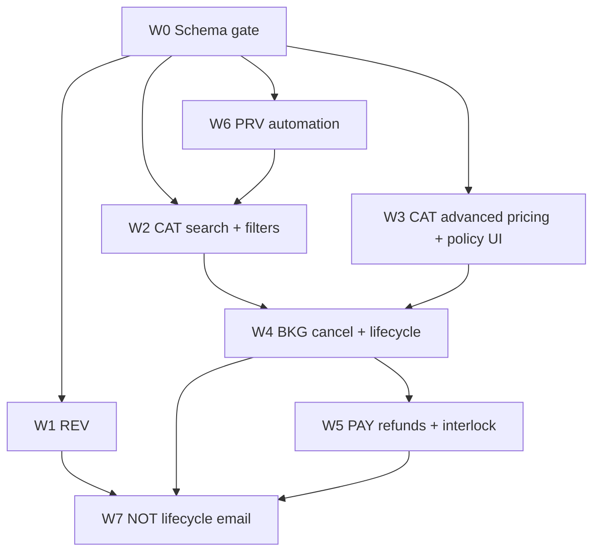

## TL;DR

- **Start here after** [Tourist UI pre–Phase 2](/docs/70-79-business/planning/roadmap/tourist-ui-pre-phase-2) Milestones A–D and [web-68](/docs/60-69-initiatives/implementation-specs/platform/web-68-tourist-phase-2-placeholder-slots) placeholder slots.
- **Wave 0** is a schema gap pass: add `reviews.dbml`, bundle link in `bookings.dbml`, and any remaining Phase 2 columns in `payments.dbml` (refund interlock states per `AMB-005`).
- **Build order:** schema gate → **REV** (parallel-friendly) → **CAT search + advanced pricing config** → **BKG cancel/bundle** with **PAY refunds** → **PRV automation** → **NOT** emails.
- **No GitHub Phase 2 epic exists yet** (2026-10-04). This doc proposes wave names and issue titles; create the epic and children when you open the program.

## About this document

Turns [Phase 2 — Marketplace depth](/docs/70-79-business/planning/roadmap/phase-2-marketplace-depth) into an ordered execution plan. Scope and exit criteria stay in that file.

| Topic | Document |
| --- | --- |
| Phase 2 scope and exit criteria | [phase-2-marketplace-depth](/docs/70-79-business/planning/roadmap/phase-2-marketplace-depth) |
| Roadmap index | [Phasing roadmap](/docs/70-79-business/planning/roadmap) |
| Tourist UI slots to wire | [web-68](/docs/60-69-initiatives/implementation-specs/platform/web-68-tourist-phase-2-placeholder-slots) |
| Auth gate for new `/account` features | [Authentication roadmap Phase 3](/docs/90-99-engineering-meta/authentication/implementation-roadmap#phase-3--auth-core-team-account-login-pages) (shipped) |
| Spec workflow | [Implementation specs](/docs/60-69-initiatives/implementation-specs/) |

---

| [← Phase 2 scope](/docs/70-79-business/planning/roadmap/phase-2-marketplace-depth) | [Phase 3 →](/docs/70-79-business/planning/roadmap/phase-3-corporate-packages) |

---

## Prerequisites (program gates)

| Gate | Status (2026-10-04) | Blocks |
| --- | --- | --- |
| Tourist funnel + public discover | Done | — |
| Phase 2 UI placeholder slots (`#68`) | Done in code | Wiring real APIs before slots exist |
| `tourist-required-policy` on `/account/**` | Shipped (`#86`) | New authenticated tourist Phase 2 pages |
| **Approved implementation spec** per slice | Not started for Phase 2 backend | Codegen on that slice |
| Auth Phase 0 production checklist (`#77`, contract tests) | Partial | **Production** launch only |

**Resolved (2026-10-04, Decision Log):** **AMB-019** (review moderation default and 14-day window) — REV API specs may lock. **AMB-017** (independent cross-leg cancel) — bundle BKG specs may lock. **AMB-034** (Phase 2 email-only) — NOT scope freeze (W7) may proceed without SMS.

---

## Baseline inventory (repos)

Static read at `red-cab-api@e780bc5`, `red-cab-web@b4a539d`. Use this to avoid re-designing what Phase 1 already stored.

| Area | DBML / schema | Application code |
| --- | --- | --- |
| **REV** | No `reviews.dbml` file; `catalog_listings.rating_*` / `reviews_count` are display columns for REV to own | No `Reviews::` domain; seed data only |
| **CAT advanced pricing** | `catalog_pricing_tiers`, `catalog_seasonal_overrides`, `catalog_cancellation_policy_tiers` in `catalog.dbml` | Provider configure + quote path partial; not all FR-CAT-014–018 surfaces |
| **CAT search/filter** | N/A (query module) | `MarketplaceIndexValidator` supports **sort** only (`published_at`, `rating_average`, …); no date/service type/price filters (FR-CAT-023–026) |
| **BKG cancel** | Cancellation snapshots on session + order; state machine notes `:cancelled` / `:refunded` | Tourist cancel command not end-to-end |
| **BKG bundle** | **No** bundle link table in `bookings.dbml` yet | Checkout bundle extension stub on web (`#68`) |
| **PAY refunds** | `payments_refunds` table; payout interlock notes “Phase 2d” | `Payments::Refund` model + webhook handler exists; tourist cancel → refund path incomplete |
| **PRV automation** | Provider license fields in `providers.dbml` | Cron / cascade pause not wired |
| **NOT** | Stub | No cancel/refund/review-link templates |

**Implication:** Wave 0 is not a full re-write of catalog or bookings DBML. It adds **missing** artifacts (`reviews.dbml`, bundle) and closes documented gaps (`payments` interlock states, any migration drift vs `redcab.dbml`).

---

## Epic structure (proposed GitHub)

Create one program epic per repo (or one cross-repo epic in the planning project). Suggested titles:

| Repo | Epic title | Tracks |
| --- | --- | --- |
| `red-cab-api` | **Phase 2 — Marketplace depth (API)** | Waves 0–6 below |
| `red-cab-web` | **Phase 2 — Marketplace depth (Web)** | Wire `#68` slots + provider/team surfaces |
| `redcab-docs` | **Phase 2 — specs and roadmap hygiene** | Approve specs before codegen |

Child issues use the [implementation spec filename pattern](/docs/60-69-initiatives/implementation-specs/): `{context}/{repo}-{issue}-{slug}.md` with `status: approved`.

---

## Waves and dependency graph

Waves are **delivery slices**, not strict serial monoliths. Within a wave, land **API spec → API PR → web spec → web PR** for each vertical slice.

| Wave | Goal | Primary FR / rules | Depends on |
| --- | --- | --- | --- |
| **W0** | Migrations match Phase 2 design | Schema gate in [phase-2-marketplace-depth](/docs/70-79-business/planning/roadmap/phase-2-marketplace-depth) | Phase 1 DBML baseline |
| **W1** | Verified reviews + moderation + rating summary | `FR-REV-*`, `INV-5`, `OPR-6`, `OPR-7` | W0 `reviews.dbml` |
| **W2** | Discovery search, filters, sort (toolbar live) | `FR-CAT-023`–`027`, `PRC-2` | W0; listing sort on web (`#67`) |
| **W3** | Advanced pricing + cancellation policy configuration | `FR-CAT-014`–`018`, `PRC-7` | W0; provider surfaces |
| **W4** | Cancel, no-show, decline, bundle legs | `FR-BKG-010`–`011`, `AMB-013`/`014`, `CON-5`/`CON-6` | W3 snapshotted policies; W0 bundle schema |
| **W5** | Refund engine + payout/refund interlock | `PAY-6`–`8`, `FIN-5`, `AMB-005` | W4 cancel paths |
| **W6** | License expiry → listing pause; ops alerts | `INV-7`, `OPR-3`–`5` | W0; event into CAT |
| **W7** | Transactional notifications | NOT + REV/BKG/PAY events | W1, W4, W5 (slice per template) |

**Parallelism:** After W0, **W1 (REV)** and **W2 (CAT search)** can run in parallel on different engineers. **W3** can overlap W2 if provider UI is separate from tourist discover. **W4 + W5** should ship as paired slices (cancel without refund is incomplete for tourists).

---

## Wave 0 — Schema gate (API + docs)

**Outcome:** `reviews.dbml` exists and is migrated; `bookings.dbml` has bundle link; `payments.dbml` has Phase 2d interlock states; `redcab.dbml` consolidated.

| # | Proposed issue title | Repo | Spec path (create first) |
| --- | --- | --- | --- |
| W0-1 | Design and migrate `reviews.dbml` | api | `rev/api-NNN-reviews-schema-migrate.md` |
| W0-2 | Add bundle booking link to `bookings.dbml` | api | `bkg/api-NNN-bundle-booking-schema.md` |
| W0-3 | Phase 2 payments DBML gap (refund interlock / payout void) | api | `pay/api-NNN-phase-2-refund-interlock-schema.md` |
| W0-4 | Consolidate `redcab.dbml` after Phase 2 migrations | api | `docs/docs-NNN-phase-2-schema-consolidation.md` (optional) |

**Verification:** Migrations apply on empty DB; `bundle exec srb tc` clean; DBML matches `schema.rb` for new tables/columns.

---

## Wave 1 — Reviews and ratings (REV)

**API slices (order inside wave):**

1. Review submit (tourist, completed booking only).
2. Rating summary recalculation → update `catalog_listings.rating_average` / `reviews_count`.
3. Provider review report + Team dispute queue (dismiss report / remove).
4. Provider public response (once per published review).
5. Marketplace read: approved reviews on listing detail (paginated).

**Web slices:**

| web-68 slot | Wave 1 deliverable |
| --- | --- |
| Listing rating block / empty state | Live `rating_average`, `reviews_count`, review list |
| Booking detail “Write a review” stub | Submit flow + eligibility from API |
| Team | Moderation queue UI |
| Provider portal | Response form on published review |

**Proposed issues:**

| # | Title | Repo | Spec context |
| --- | --- | --- | --- |
| W1-1 | Tourist submit review endpoint | api | `rev/` |
| W1-2 | Rating summary recalc on submit/remove | api | `rev/` |
| W1-3 | Team review dispute endpoints (dismiss report / remove) | api | `rev/` |
| W1-3b | Provider review report endpoint | api | `rev/` |
| W1-4 | Provider review response endpoint | api | `rev/` |
| W1-5 | Wire tourist review submit UI (`#68`) | web | `rev/` |
| W1-6 | Team dispute queue pages (dismiss report / remove) | web | `rev/` |
| W1-7 | Provider response UI | web | `rev/` |

**Events for W7:** `ReviewSubmitted`, `ReviewRemoved`, optional `ReviewReportDismissed`, review invitation on `BookingCompleted` (`FR-REV-002`). `ReviewApproved` is retired ([ADR-020](/docs/30-49-domains/architecture-decisions/adr-020-review-post-publication-moderation)).

---

## Wave 2 — Catalog search and filters (CAT)

**API:** Extend marketplace listing index (and related discover endpoints) with FR-CAT-023–026 filters and FR-CAT-027 sort (sort partly exists; align with price filter and `PRC-2`).

**Web:** Replace disabled controls in [`CatalogListingDiscoverToolbar`](https://github.com/markmamba/red-cab-web/blob/main/app/domains/catalog-listing/catalog-listing-discover-toolbar.jsx) — URL-driven `useSearchParams` per [frontend conventions](/docs/50-59-frontend/conventions/frontend).

| # | Title | Repo |
| --- | --- | --- |
| W2-1 | Marketplace listing index filters (date, service type, language, group size, price) | api |
| W2-2 | Filter/query contract tests + `PRC-2` alignment tests | api |
| W2-3 | Wire discover toolbar filters to API (`#68`) | web |

**Note:** Rating sort is useful before REV ships; display `rating_average` from catalog columns (may be zero until W1).

---

## Wave 3 — Catalog advanced pricing and policies (CAT)

**API:** Managers/routes for tiers, seasonal overrides, extra charges, custom cancellation tiers (schema largely present).

**Web:** Provider (and team where needed) configuration UI; ensure checkout still snapshots policy (`FR-BKG-003`).

| # | Title | Repo |
| --- | --- | --- |
| W3-1 | Provider pricing tier CRUD | api |
| W3-2 | Provider seasonal overrides + extra charges | api |
| W3-3 | Provider cancellation policy tiers (`FR-CAT-018`) | api |
| W3-4 | Provider pricing and policy settings UI | web |

---

## Wave 4 — Booking full lifecycle (BKG)

**API slices:**

1. Tourist cancel confirmed booking → seat restore (`ReserveSeatsService` release path).
2. Provider decline / no-show / admin cancel (`AMB-013`, `AMB-014`).
3. Bundle create at checkout (two linked `bookings_orders`); cross-leg rules per resolved `AMB-017`.
4. Expose `allowed_actions` (or equivalent) on tourist booking detail for web to replace `#68` status-only stubs.

**Web slices:**

| web-68 slot | Wave 4 deliverable |
| --- | --- |
| Cancel action + modal stub | Live cancel + confirm; poll booking status |
| Checkout bundle extension | Second leg summary when bundle checkout ships |

| # | Title | Repo |
| --- | --- | --- |
| W4-1 | Tourist cancel booking command | api |
| W4-2 | Provider/admin cancel and no-show paths | api |
| W4-3 | Bundle checkout materialization | api |
| W4-4 | Tourist booking cancel UX (`#68`) | web |
| W4-5 | Bundle checkout UX (`#68`) | web |
| W4-6 | Provider booking cancel/decline UX | web |

---

## Wave 5 — Payments refunds (PAY)

**API:** Refund amount from snapshotted tiers (`PAY-6`); provider/admin 100% (`PAY-7`); mutual exclusion with payout queue (`FIN-5`, `PAY-8`); charge/payout state updates.

**Web:** Refund status panel on tourist booking detail (`bookings-booking-refund-status-panel.jsx`); team payments overview extensions.

| # | Title | Repo |
| --- | --- | --- |
| W5-1 | Refund initiation from cancellation | api |
| W5-2 | Payout/refund interlock + provider webhooks | api |
| W5-3 | Tourist refund status panel (`#68`) | web |
| W5-4 | Team refund / payout oversight UI | web |

Ship **W4-1 + W5-1** in one release when possible so tourists never cancel into a dead-end.

---

## Wave 6 — Provider automation (PRV + CAT)

**API:**

- License expiry job → pause listings (`INV-7`).
- Support trial expiry (`OPR-4`).
- Overdue registration alerts (`OPR-5`).

**Web:** Team alerts surfacing (if in scope for Phase 2 UI).

| # | Title | Repo |
| --- | --- | --- |
| W6-1 | License expiry cron + listing pause cascade | api |
| W6-2 | Support trial expiry enforcement | api |
| W6-3 | Overdue registration alert job | api |
| W6-4 | Team ops alerts UI (optional) | web |

---

## Wave 7 — Notifications (NOT)

Slice by event; no tourist UI.

| Template | Trigger |
| --- | --- |
| Booking cancelled | W4 cancel success |
| Refund processed | W5 refund terminal state |
| Review invitation | Booking completed (`FR-REV-002`) |
| Review moderated / removed | W1 moderation |
| Overdue registration / license | W6 jobs |

| # | Title | Repo |
| --- | --- | --- |
| W7-1 | Cancellation and refund email templates | api |
| W7-2 | Review invitation and moderation emails | api |
| W7-3 | SMS channel — **deferred** (Phase 2 email-only per `AMB-034`, 2026-10-04) | — |

---

## Suggested first sprint (issue open order)

1. **docs:** `write-implementation-spec` for **W0-1** (`reviews.dbml`) — unblocks all REV work.
2. **api:** W0-1 migration + empty `Reviews::` models (or wait for spec approval then codegen).
3. **docs:** W2-1 spec (discover filters) — high visible value; parallel with W1 after W0.
4. **docs:** W4-1 + W5-1 **joint spec** (cancel + refund) — single tourist-facing outcome.

Do **not** open web wiring PRs until the matching API spec is `approved` and the endpoint exists (or is contract-tested via MSW only if spec allows).

---

## Traceability quick reference

| Exit criterion ([phase-2](/docs/70-79-business/planning/roadmap/phase-2-marketplace-depth#exit-criteria)) | Waves |
| --- | --- |
| Schema migrated | W0 |
| Search/filter/sort + `PRC-2` | W2 (+ W3 for policy-consistent quotes) |
| Cancel + refund per policy | W4 + W5 |
| Review after completed booking + moderation | W1 |
| License auto-pause | W6 |
| Bundle linked legs | W0 schema + W4 |
| Payout/refund mutual exclusion | W5 |

---

## Agent session playbook

1. Read [phase-2-marketplace-depth](/docs/70-79-business/planning/roadmap/phase-2-marketplace-depth) for scope boundaries.
2. Pick **one wave slice** from this map.
3. Confirm slice-specific open questions remain (e.g. `AMB-013`/`AMB-014` for full cancel spec lock); `AMB-017`, `AMB-019`, and `AMB-034` Phase 2 scope are resolved (Decision Log 2026-10-04).
4. Write or read an **approved** spec under `docs/60-69-initiatives/61-implementation-specs/{context}/`.
5. For tourist web work, read [web-68](/docs/60-69-initiatives/implementation-specs/platform/web-68-tourist-phase-2-placeholder-slots) and replace stubs — do not add parallel UI patterns.
6. After merge, tick deliverables in [phase-2-marketplace-depth](/docs/70-79-business/planning/roadmap/phase-2-marketplace-depth) and update the baseline table in this doc.

---

## Related documents

- [REV functional requirements](/docs/70-79-business/requirements/functional-requirements/rev)
- [CAT functional requirements](/docs/70-79-business/requirements/functional-requirements/cat)
- [BKG functional requirements](/docs/70-79-business/requirements/functional-requirements/bkg)
- [Reviews bounded context](/docs/30-49-domains/bounded-contexts/reviews)
- [Open questions](/docs/70-79-business/planning/open-questions)
