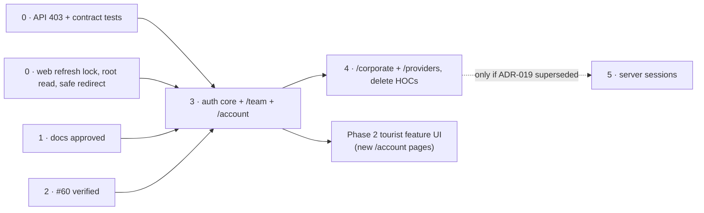

## TL;DR

- **Phase 0** fixes correctness in **both** repos: a cross-user refresh leak in `ky-client`, `403` for portal gates, safe `redirect_to`, and "no cookie, no call". It blocks the production launch of authenticated surfaces. It does not block tourist UI development.
- **Phase 1** approved this series and ADR-018/019 (2026-09-30, [#19](https://github.com/markmamba/redcab-docs/issues/19)). Docs only.
- **Phase 2** is the tourist access work (web-56 / `#60`). **Merged** (`red-cab-web` `e24b55b`); **verification closed** 2026-10-01 ([#82](https://github.com/markmamba/red-cab-web/issues/82), [Review record](#review-record-phase-2)).
- **Phase 3** moves `/team` and `/account` (plus login pages) to policy routes. **Phase 4** moves `/corporate` and `/providers`, then deletes the HOCs.
- **Phase 5** (server-side sessions) runs only if ADR-019 is superseded.

## About this document

| Topic | Document |
| --- | --- |
| Decisions | [ADR-018](/docs/30-49-domains/architecture-decisions/adr-018-web-authentication-enforcement-model), [ADR-019](/docs/30-49-domains/architecture-decisions/adr-019-session-technology-phase-1-and-2) |
| Tourist UI track | [Tourist UI — Pre–Phase 2](/docs/70-79-business/planning/roadmap/tourist-ui-pre-phase-2) |
| API baseline | [IAM audit 2026-08](/docs/60-69-initiatives/implementation-specs/iam/iam-audit-2026-08) |
| Spec workflow | [Implementation specs](/docs/60-69-initiatives/implementation-specs/) |

**Audited:** 2026-09-26 against `red-cab-api@d8ed9b7` and `red-cab-web@c4ce884`, by static reading. No test suite was run for this plan.

---

## Where things stand

**Living baseline (2026-09-30):** `red-cab-web@4980e5c`, `red-cab-api@9329239`. ADR "today" tables dated 2026-09-26 stay **historical**; this table is the current ship state.

| Item | State | Evidence |
| --- | --- | --- |
| Phase 0 web — SSR refresh per request (ADR-019 R2) | Merged | web-78 `dbd036c` — `ky-client.js` per-request `refreshScope` |
| Phase 0 web — root session read contract | Merged | web-79 `a038076` — `public-root.jsx`, `team-root.jsx` |
| Phase 0 web — safe `redirect_to` + public return | Merged | web-80 `c425887` — `app/auth/auth-safe-redirect.js` |
| Phase 0 web — portal `403` consumption | Merged | web #81 `4980e5c` — `portal-gate-utils.js` |
| Phase 0 API — `403` portal gates + lifetimes | Merged | api-145 `2b26aba` (#148) — `ForbiddenError`, seven D4 codes, `jwt_sessions` `3600` / `604800` |
| Phase 0 API — auth contract integration tests | Merged | api-146 `9329239` (#149) — `test/integration/auth_contract/**` |
| Phase 0 API — `provider_role_required` on Providers base | **On branch** until merged | [red-cab-api#81](https://github.com/markmamba/red-cab-api/issues/81) — not on `origin/main` at baseline `9329239`; IAM-Q2 narrative closed on #19 |
| IAM audit PR-01–PR-02, PR-04–PR-07 | In code (§7 partially ticked) | See `iam-audit-2026-08/index.md` §7; PR-03 and PR-08 still open by design |
| PR-05 portal gates | In code, **`403` + codes** | `tourists/base_controller.rb`, `corporate/base_controller.rb`, `providers/base_controller.rb` |
| IAM audit index checkboxes | **Partial** — PR-03, PR-08 open; narrative IAM-Q2 closed on #19 | `iam-audit-2026-08/index.md` §7–§8 |
| Phase 1 — ADR-018/019 + series | **Accepted / normative** | [#19](https://github.com/markmamba/redcab-docs/issues/19); [Review record](#review-record-phase-1) |
| Production cookie topology (OQ1) | **Decided (docs)** — API `domain:` [#77](https://github.com/markmamba/red-cab-web/issues/77) before launch | [ADR-019 § Production cookie topology](/docs/30-49-domains/architecture-decisions/adr-019-session-technology-phase-1-and-2#production-cookie-topology); [#20](https://github.com/markmamba/redcab-docs/issues/20) |
| web-56 / `#60` public routes | Merged | `red-cab-web` `e24b55b` |
| Phase 2 verification (public catalog, guest Book handoff) | **Done** (2026-10-01) | [Review record (Phase 2)](#review-record-phase-2); [red-cab-web#82](https://github.com/markmamba/red-cab-web/issues/82) |
| Tourist shell / funnel `#58`–`#64` | Merged per program strategy | See [web platform program strategy](/docs/70-79-business/planning/web-platform-program-strategy) |

---

## Phases

| Phase | Focus | Repos | Blocks tourist pre–Phase 2? |
| --- | --- | --- | --- |
| 0 | Correctness + contract freeze | API + web | **No** for UI development. **Yes** for production launch of any authenticated surface |
| 1 | Series + ADR-018/019 approved | docs | No |
| 2 | Tourist access (web-56 / `#60`) | web | This **is** pre–Phase 2. Merged; **verified** ([#82](https://github.com/markmamba/red-cab-web/issues/82)) |
| 3 | Policy routes: auth core, `/team`, `/account`, login pages | web | No. Runs in parallel after Phase 1 |
| 4 | Policy routes: `/corporate`, `/providers`; delete HOCs | web | No |
| 5 | Server-side sessions (only if ADR-019 is superseded) | API + web | No |

### Phase 0 — Correctness and contract freeze

**Goal:** the current auth stack is safe to run in production, and its contract is pinned by tests.

**Web work:**

1. Make the Node refresh lock per incoming request (ADR-019 R2). Refresh failures that are not `401` propagate as errors (R3).
2. Root loaders (`public-root.jsx`, `team-root.jsx`): no cookie → no call; only `401` → `null`; otherwise throw.
3. Add `app/auth/auth-safe-redirect.js`. Use it in `team-login-page.jsx` and `with-no-auth.jsx`.
4. After the API `403` change: `ProvidersProfileService` detects "no profile" by `403` + `code`, not `401` + title.

**API work:**

1. Add `Errors::ForbiddenError` (`403`). Use it in the three actor base controllers and `require_approved_provider_profile!`, with stable codes (ADR-018 D4).
2. Set `JWTSessions.access_exp_time` and `refresh_exp_time` explicitly.
3. Add `test/integration/auth_contract/`: one test per [contract sheet](/docs/90-99-engineering-meta/authentication/appendix-web-api-contract) row.
4. Run the full suite. Tick the IAM audit checkboxes that the tests confirm.

**Exit criteria:**

- [ ] A concurrency test proves two SSR requests that both refresh never share cookies or data.
- [ ] An anonymous document request to `/districts` makes zero calls to `identities/accounts/current`.
- [ ] A forced `503` from `accounts/current` renders the root error boundary, not a signed-out header.
- [ ] `redirect_to=//evil.example` on `/team/login` and on every `withNoAuth` page lands on the default path.
- [ ] A tourist cookie on a `providers/**` endpoint gets `403 provider_profile_required`, and the web does not refresh.
- [ ] Token lifetimes are recorded in the contract sheet.
- [x] Production cookie topology decided (open question 1) and recorded in [ADR-019](/docs/30-49-domains/architecture-decisions/adr-019-session-technology-phase-1-and-2#production-cookie-topology) ([#20](https://github.com/markmamba/redcab-docs/issues/20)). API `domain:` wiring remains [#77](https://github.com/markmamba/red-cab-web/issues/77) before launch.

**Dependencies:** none. The API `403` change and web step 4 ship together, or web step 4 accepts both shapes for one release.

**Non-goals:** policy routes, HOC removal, session technology change, UI changes.

### Phase 1 — Docs and ADRs approved

**Goal:** this series, ADR-018, and ADR-019 are reviewed and Accepted.

**Exit criteria:**

- [x] `review-implementation-spec`-style review of ADR-018, ADR-019, and Appendix A against `FR-IAM-004/005/009/012`, `NFR-SEC-004/005`, ADR-010, ADR-017, web-56 — see [Review record](#review-record-phase-1).
- [x] Open questions 2, 4, and 5 **resolved**; OQ3 resolved with PO sign-off in Review record; OQ1 **resolved** in [#20](https://github.com/markmamba/redcab-docs/issues/20) (API implementation [#77](https://github.com/markmamba/red-cab-web/issues/77)).
- [x] ADR statuses set to Accepted; ADR index updated (including Amendments convention).
- [x] Phase 1 link updates and agent spec-path fixes applied ([#19](https://github.com/markmamba/redcab-docs/issues/19)) — `redcab-docs` on #19 PR; `red-cab-api` / `red-cab-web` via chore commits on `chore/docs-19-agent-spec-paths`.

**Dependencies:** none. Can run in parallel with Phase 0.

**Non-goals:** code.

### Review record (Phase 1)

**Date:** 2026-09-30  
**Issue:** [redcab-docs#19](https://github.com/markmamba/redcab-docs/issues/19)  
**Reviewer:** implementation-spec consistency pass (FR/NFR/ADR/web-56 matrix)

| Source | Check | Outcome |
| --- | --- | --- |
| FR-IAM-004 | Email verification reachable while signed in | ADR-018 D10 + Appendix A `/verify-email` open — aligned |
| FR-IAM-005 | Authenticated session for protected acts | ADR-019 Option A + refresh rules — aligned |
| FR-IAM-009 / NFR-SEC-004 | Role gates surfaces; Admin separate | ADR-018 D5/D6, D9, web-56 public browse — aligned |
| FR-IAM-012 | Session lifecycle on API | ADR-010 + ADR-019; contract sheet — aligned |
| NFR-SEC-005 | Auth at booking initiation | Public browse + checkout login (web-56) — aligned |
| ADR-010 | Role vs domain gates | D5 entry rules vs loaders — aligned |
| ADR-017 / web-56 | Public URLs, auth at checkout | D9, Phase 2 merged — aligned |
| Appendix A | Entry rules vs D10 guest/open pages | No gap requiring Appendix edit in #19 |

**Gaps fixed in #19:** living-doc re-baseline (Where things stand, program strategy); IAM-Q2 narrative; seven-code wording; ADR Accepted status with historical audit tables.

**Product Owner (OQ3 / IAM-Q1):** 2026-09-30 — Product Owner confirms **yes**: unverified accounts may sign in; `/verify-email` must work while signed in (ADR-018 D10). Recorded before ADR-018 Accept.

**Open question disposition (Phase 1):**

| OQ | Disposition |
| --- | --- |
| 2 (`IAM-Q2`, seven `403` codes) | **Resolved (shipped)** — ADR-018 D4 Accepted; api-145 + web #81 |
| 3 (`/verify-email` while signed in) | **Resolved** — PO sign-off above |
| 4 (return to public marketplace after sign-in) | **Resolved (implemented)** — web-80 `PUBLIC_RETURN_*` |
| 5 (token lifetimes) | **Resolved** — `3600` / `604800` in initializer + [contract sheet](/docs/90-99-engineering-meta/authentication/appendix-web-api-contract) |
| 1 (cookie topology) | **Resolved (docs)** — [#20](https://github.com/markmamba/redcab-docs/issues/20); [ADR-019 production topology](/docs/30-49-domains/architecture-decisions/adr-019-session-technology-phase-1-and-2#production-cookie-topology). API `domain:` [#77](https://github.com/markmamba/red-cab-web/issues/77) before launch |

### Phase 2 — Tourist access (web-56 / `#60`)

**Goal:** public browse with auth only at checkout (`AMB-022` Option A).

**State:** merged and **verified** (2026-10-01, [red-cab-web#82](https://github.com/markmamba/red-cab-web/issues/82)). Checklist:

- [x] No public catalog module imports an auth HOC (`rg "with(Tourist|Corporate|Provider)Auth" app/routes/marketplace` is empty).
- [x] Every public catalog route uses a server `loader` (including `/districts` index via parent layout) and `index, follow` on indexable pages; redirect/resolver routes use `noindex`.
- [x] A no-JavaScript fetch of each public catalog route in the web-56 matrix returns meaningful SSR HTML or a valid redirect (local `react-router-serve` + API; see [Review record](#review-record-phase-2)).
- [x] Guest Book CTA → `/login?redirect_to=…` with checkout query preserved (`catalog-listing-service.spec.js`, `auth-safe-redirect.spec.js`); full browser sign-in path not re-run in `#82` (no canonical listing fixture in repo).

**Non-goals:** policy routes. `/account/**` keeps `withTouristAuth`.

### Review record (Phase 2)

**Date:** 2026-10-01  
**Issue:** [red-cab-web#82](https://github.com/markmamba/red-cab-web/issues/82)  
**Verified at:** `red-cab-web@29eaeb0` (verification pass); feature merge `e24b55b` (`#60` / web-56)

| Check | Method | Outcome |
| --- | --- | --- |
| Auth HOC scan | `rg 'withTouristAuth\|withCorporateAuth\|withProviderAuth' app/routes/marketplace` | No matches |
| Loader + robots | Static read of marketplace catalog modules + `home-page.jsx` | Indexable routes `index, follow`; resolver/redirect routes `noindex` |
| Guest Book → login URL | Vitest: `catalog-listing-service.spec.js`, `auth-safe-redirect.spec.js` | 30 tests passed |
| Loader redirects (legacy discover, stale slug, resolver) | `npm test -- app/routes/marketplace/catalog-district/ app/routes/tourist/tourist-account-discover-redirect-utils.spec.js` | 24 tests passed |
| No-JS SSR / redirects | `curl -A 'curl'` (no cookies) on `/`, `/districts`; `curl -sI` on `/account/discover`, `/discover`, `/discover/foo` | Meaningful HTML on `/` and `/districts`; **301** → `/districts` for legacy discover and `/discover*` |
| Unknown listing on canonical detail path | `curl` on `/districts/.../listings/{random-uuid}` | HTTP 200 with SSR alert **"We could not find that listing."** (loader soft-404; not an empty shell) |
| Stale slug **301** on nested listing path | Not exercised live (empty local catalog); covered by loader unit tests above | Pass via Vitest |

**Known gap (not tested in `#82`):** Guest slot/quote may go **stale** between Book click and post-login checkout (422 / checkout rejection). Deferred to web-56 Session B; document only — same disposition as Phase 2 review notes in web-56.

**Evidence pointer:** GitHub issue [#82](https://github.com/markmamba/red-cab-web/issues/82) comment (command output); this review record.

### Review record (Phase 3 spike — #83)

**Date:** 2026-10-01  
**Issue:** [red-cab-web#83](https://github.com/markmamba/red-cab-web/issues/83)  
**Harness branch:** `83-choreiam-spike-react-router-80-policy-middleware-behavior-auth-phase-3` @ `ff041f5` (**do not merge**)  
**Go / no-go:** **Go** (middleware `url` page-normalized on 8.0.0; policy `.data` redirect proven; legacy discover outside policy)

| Check | Method | Outcome |
| --- | --- | --- |
| Policy `.data` redirect (signed out) | `curl` on `react-router-serve` build | `SingleFetchRedirect` → `/login?redirect_to=%2Faccount%2Fbookings`, `replace` |
| Middleware `url` | `npm run dev` guard log on same `.data` request | `urlSource: middleware-url`, `pathname: /account/bookings` |
| Legacy discover outside policy | `curl -sI /account/discover` | **301** → `/districts` |
| URL strip / `redirect_to` | Vitest `auth-policy-page-url.spec.js` | E3 matrix rows pass |
| R-4 refresh on thrown `replace()` | — | **Not exercised** in automated evidence; manual before first policy PR |
| Browser rows 3, 5–7 | — | **Not exercised** in #83; note in `policy-middleware.md` |

**Evidence pointer:** [curl transcript](/docs/90-99-engineering-meta/authentication/evidence/issue-83-spike/curl-transcript-2026-10-01), [`run-curl-matrix.sh`](https://github.com/markmamba/redcab-docs/blob/main/docs/90-99-engineering-meta/authentication/evidence/issue-83-spike/run-curl-matrix.sh).

### Phase 3 — Auth core, `/team`, `/account`, login pages

**Goal:** Node enforces access for the Admin Panel and the tourist account area before paint.

**Exit criteria:**

- [x] Spike recorded in [Policy middleware](/docs/90-99-engineering-meta/authentication/policy-middleware): React Router `8.0.0` harness ([#83](https://github.com/markmamba/red-cab-web/issues/83)); middleware `url` is page-normalized; curl + dev guard evidence under `evidence/issue-83-spike/`.
- [ ] `app/auth/*` modules exist with one test per Appendix A row.
- [ ] `/team/**` and `/team/login` use admin policies. `team-layout.jsx` has no redirect `useEffect`.
- [ ] `/account/**` uses `tourist-required-policy`. The six `withTouristAuth` exports are gone.
- [ ] The eight guest pages use `account-guest-policy`. `/verify-email` is open.
- [ ] Legacy `/account/discover*` redirects sit outside the tourist policy and still work for guests.
- [ ] Login and logout are `clientAction`s. The root revalidates after them. `AuthProvider` no longer exposes a setter.
- [ ] The manual in-app click test passes for `/account/bookings` and `/team/providers/profiles`.
- [ ] A lint or unit check forbids `shouldRevalidate` and `clientLoader` in `app/routes/policies/`.

**Dependencies:** Phase 0 web items 1–3; Phase 1 approved.

**Non-goals:** corporate and provider surfaces; server-side sessions; moving account pages from `clientLoader` to `loader`.

**Gate for Phase 2 tourist features:** new authenticated tourist pages (reviews submit, cancel, refund status per the [Phase 2 roadmap](/docs/70-79-business/planning/roadmap/phase-2-marketplace-depth)) are built under `tourist-required-policy`. Placeholder slots from Milestone D may ship earlier on existing pages.

### Phase 4 — `/corporate`, `/providers`, delete HOCs

**Goal:** every protected surface uses a policy. HOCs are gone.

**Exit criteria:**

- [ ] `/corporate/**` and `/providers/**` use their policies.
- [ ] Provider onboarding redirects still work, driven by `403` codes in page loaders.
- [ ] `app/components/hocs/with-*-auth.jsx` deleted. Lint forbids re-adding the folder.
- [ ] Root `ErrorBoundary`s no longer navigate on `401`.
- [ ] [Frontend conventions](/docs/50-59-frontend/conventions/frontend) "Auth HOCs" section replaced by "Auth policies".

**Dependencies:** Phase 3.

**Non-goals:** new portal features.

### Phase 5 — Server-side sessions (conditional)

Runs only if a new ADR supersedes ADR-019 (see its revisit triggers). Scope is in ADR-019 Option B. Needs its own DBML change, a dual-read window, and a web change that deletes refresh from `ky-client`.

---

## Implementation spec backlog

Create each from `60-69-initiatives/61-implementation-specs/_template.md`, `status: draft`, under `60-69-initiatives/61-implementation-specs/iam/auth-platform/`. Replace `NNN` with the GitHub issue number.

| # | Phase | Suggested file | Suggested issue title | Acceptance criteria (summary) |
| --- | --- | --- | --- | --- |
| 1 | 0 | `web-NNN-ssr-refresh-request-scope.md` | Isolate SSR token refresh per request | Per-request lock; non-`401` refresh failure propagates; concurrency test; no module-level refresh state on Node |
| 2 | 0 | `web-NNN-root-session-read-contract.md` | Root session read: no cookie, no call; only 401 is signed out | Both roots; zero calls without cookie; `503` → error boundary; `Cache-Control: private, no-store` with cookie |
| 3 | 0 | `web-NNN-safe-redirect-helper.md` | Validate redirect_to on every login path | `auth-safe-redirect.js` + tests S1–S9, L1–L2; used by team login and `withNoAuth` |
| 4 | 0 | `api-NNN-portal-gate-forbidden.md` (repos: api, web) | Return 403 with a code for portal and approval gates | `Errors::ForbiddenError`; **seven** D4 codes; integration tests; web reads `code` (web #81) |
| 5 | 0 | `api-NNN-auth-contract-tests.md` | Pin the auth contract with integration tests | One test per contract row; explicit token lifetimes; IAM audit checkboxes updated |
| 6 | 3 | `web-NNN-auth-core-modules.md` | Add session middleware, guards, and entry rules | `app/auth/*` + specs for every Appendix A row; RR 8.0 spike recorded; policy export lint |
| 7 | 3 | `web-NNN-team-policy-routes.md` | Guard the Admin Panel with policy routes | Admin policies; `team-layout` guard removed; team logout route; manual click test |
| 8 | 3 | `web-NNN-tourist-account-policy-routes.md` | Guard /account and login pages with policy routes | Tourist + guest policies; HOCs removed from those pages; `/verify-email` open; legacy redirects outside; login/logout `clientAction` |
| 9 | 4 | `web-NNN-corporate-provider-policy-routes.md` | Guard the Client and Provider Portals with policy routes | Two policies; onboarding via `403` codes; manual click test |
| 10 | 4 | `web-NNN-remove-auth-hocs.md` | Remove auth HOCs and boundary login redirects | HOC files deleted; lint rule; error boundaries stop navigating; conventions updated |
| 11 | 5 | `api-NNN-server-side-sessions.md` (conditional) | Replace jwt_sessions with server-side sessions | Only after a superseding ADR |

Specs 1–3 may be one PR if the reviewer prefers. Specs 4 and 5 are separate API PRs.

---

## Migration and risk register

| # | Risk | Likelihood | Impact | Mitigation |
| --- | --- | --- | --- | --- |
| R-1 | Cross-user session leak through the shared Node refresh lock | Medium under load | Critical | Phase 0 spec 1 first; concurrency test; ship before any authenticated surface launches |
| R-2 | Half-migrated surface: HOC and policy both guard one subtree, with different rules | Medium | Loops, blank pages | One surface per PR; "never both in one subtree" (ADR-018 D8); review checklist item |
| R-3 | Policy silently off (loader deleted, `shouldRevalidate` or `clientLoader` added) | Medium | In-app clicks skip the check | Lint check in spec 6; manual click test in every policy PR |
| R-4 | JWT refresh interacts badly with policy middleware (double refresh, lost `Set-Cookie`) | Medium | Random logouts | Refresh only in the session middleware (R4); `getCookieHeader()` for other loaders; test both document and `.data` requests with an expired access token |
| R-5 | Breaking `identities/accounts/current` shape or path | Low | Every surface breaks | Contract sheet + contract tests (spec 5); additive changes only (`CR-6`) |
| R-6 | SEO cost or cache leak on public routes | Medium today | Slower pages; a shared cache storing a personal page | No cookie, no call; `Cache-Control: private, no-store` when a cookie exists ([ADR-019 R5](/docs/30-49-domains/architecture-decisions/adr-019-session-technology-phase-1-and-2#refresh-rules-binding-on-red-cab-web-while-option-a-holds); [production cookie topology](/docs/30-49-domains/architecture-decisions/adr-019-session-technology-phase-1-and-2#production-cookie-topology)) |
| R-7 | Portal `401` → refresh → `401` → login redirect → guest guard → loop | High today for wrong-role API calls | Redirect loop | API `403` (spec 4) before web invariant 2 is relied on |
| R-8 | Provider onboarding breaks when the API moves to `403` | High if uncoordinated | Providers stuck | Spec 4 changes both repos; web accepts old and new shape for one release |
| R-9 | React Router `8.0.0` middleware behaves differently from the `8.3.0` reference | Low | Policy gaps | **#83 spike recorded** — go for G2; complete manual matrix rows + R-4 refresh test before first policy PR |
| R-10 | Production cookie domain prevents Node from seeing API cookies | Mitigated when API ships `domain:` | SSR always signed out | **Decided** ([#20](https://github.com/markmamba/redcab-docs/issues/20)) — parent-domain cookies per [ADR-019](/docs/30-49-domains/architecture-decisions/adr-019-session-technology-phase-1-and-2#production-cookie-topology). **Not resolved** until [#77](https://github.com/markmamba/red-cab-web/issues/77) lands |
| R-11 | Tourist pre–Phase 2 work stalls waiting for policies | Low | Schedule | HOCs stay legal on unmigrated surfaces; Phase 3 runs in parallel |

---

## Link updates

Applied in the auth series bootstrap and Phase 1 ([#19](https://github.com/markmamba/redcab-docs/issues/19)):

| File | Change |
| --- | --- |
| `30-49-domains/34-architecture-decisions/index.md` | ADR-018/019 Accepted; **Amendments** convention |
| `30-49-domains/34-architecture-decisions/adr-018-*.md`, `adr-019-*.md` | Accepted; historical audit tables; prerequisite / leak findings updated |
| `90-99-engineering-meta/93-authentication/index.md` | Normative target + phased applicability |
| `70-79-business/73-planning/web-platform-program-strategy.md` | Phase 0 mostly merged; Phase 1 done |
| `AGENTS.md` (workspace + `redcab-docs`) | Auth series + `docs/60-69-initiatives/61-implementation-specs/{context}/…` spec path |
| `.cursor/rules/00-spec-first.mdc` (workspace, api, web) | Correct implementation spec path |
| `60-69-initiatives/61-implementation-specs/iam/iam-audit-2026-08/index.md` | **IAM-Q2** closed (narrative); IAM-Q1 tied to PO sign-off |

Still to do (content or ticks — not pointer fixes):

| File | Change | When |
| --- | --- | --- |
| `60-69-initiatives/61-implementation-specs/iam/iam-audit-2026-08/index.md` | Tick PR-03 and PR-08 when those PRs land; optional full §7 re-tick | Phase 0 / PR-08 |
| `engineering/conventions/backend.md` | Error table: add `ForbiddenError (403)` and its codes | Phase 0 spec 4 follow-up |
| `30-49-domains/34-architecture-decisions/adr-010-identity-and-authorization-architecture.md` | Remove duplicate TL;DR blocks (formatting defect) | Separate hygiene PR |
| `red-cab-web/.ai/instructions.md`, `red-cab-web/.cursor/rules/10-routes-api-forms.mdc` | HOC → policy wording | Phase 3 spec 8 |
| `red-cab-api/.ai/instructions.md` | IAM section: `403` codes; link to contract sheet | Phase 0 spec 4 follow-up |

---

## Open questions

| # | Question | Status | Notes |
| --- | --- | --- | --- |
| 1 | **Production cookie topology** — how Node on the web host receives API cookies (marketplace + team) | **Resolved (docs)** | [#20](https://github.com/markmamba/redcab-docs/issues/20); [ADR-019 § Production cookie topology](/docs/30-49-domains/architecture-decisions/adr-019-session-technology-phase-1-and-2#production-cookie-topology). API `domain:` [#77](https://github.com/markmamba/red-cab-web/issues/77) before launch |
| 2 | **Portal `403` codes** (`IAM-Q2`) | **Resolved (shipped)** | Seven codes in ADR-018 D4; api-145 (#148); web #81 |
| 3 | **Signed-in unverified account on `/verify-email`** (`IAM-Q1`) | **Resolved** | PO sign-off 2026-09-30 in [Review record](#review-record-phase-1); ADR-018 D10 |
| 4 | **Post-auth return to public marketplace URLs** | **Resolved (implemented)** | web-80 `PUBLIC_RETURN_*`; Appendix A G16–G17 |
| 5 | **Token lifetimes** | **Resolved** | `JWTSessions.access_exp_time = 3600`, `refresh_exp_time = 604_800`; [contract sheet](/docs/90-99-engineering-meta/authentication/appendix-web-api-contract) |

## Related documents

- [Authentication series overview](/docs/90-99-engineering-meta/authentication)
- [Web platform program strategy](/docs/70-79-business/planning/web-platform-program-strategy)
- [Tourist UI — Pre–Phase 2](/docs/70-79-business/planning/roadmap/tourist-ui-pre-phase-2)
- [IAM audit 2026-08](/docs/60-69-initiatives/implementation-specs/iam/iam-audit-2026-08)
