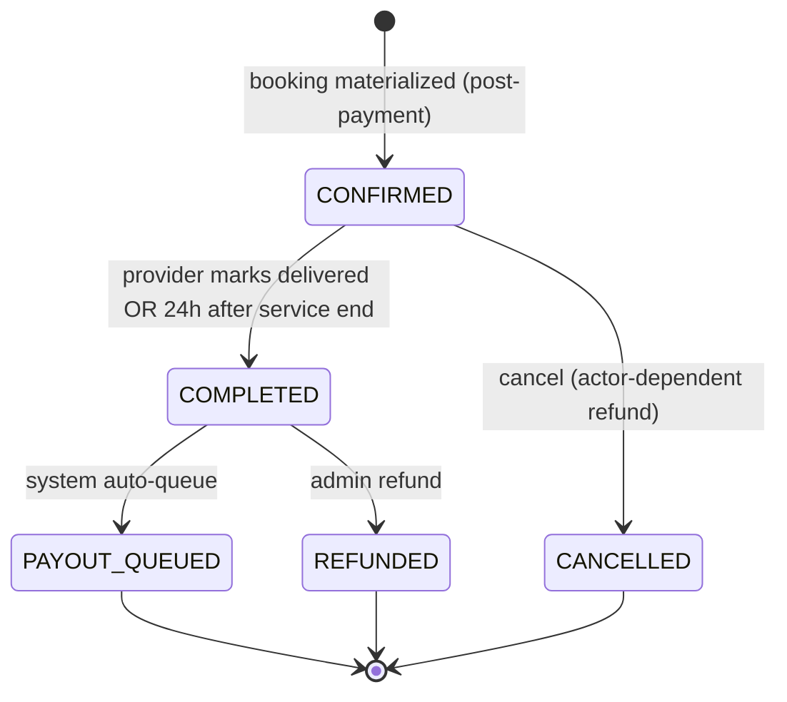

## TL;DR

- B2C card checkout materializes a Booking in **`CONFIRMED`** after payment; **`PENDING`** is for B2B pre-payment only.
- Lifecycle: `CONFIRMED → COMPLETED → PAYOUT_QUEUED` (or cancel/refund paths); terminal states have no exit.
- **CheckoutSession** holds snapshots and seat hold before payment; materialization copies facts onto the Booking.
- Transitions are **sync** (guarded side effects) or **async** (notifications, payout queue, review link).

## About this document

Invariant-driven Booking lifecycle — behavior and guarantees only (no code or enums).

| Topic | Document |
| --- | --- |
| Terminology | [Glossary](/docs/business-rules/glossary) |
| Rules (`LC-`, `INV-`, `CON-`, `PAY-`, `BKG-`, `OPR-`) | [Business Rules](/docs/business-rules/invariants) |

---

## TL;DR

- B2C card checkout materializes a Booking in **`CONFIRMED`** after payment; **`PENDING`** is for B2B pre-payment only.
- Lifecycle: `CONFIRMED → COMPLETED → PAYOUT_QUEUED` (or cancel/refund paths); terminal states have no exit.
- **CheckoutSession** holds snapshots and seat hold before payment; materialization copies facts onto the Booking.
- Transitions are **sync** (guarded side effects) or **async** (notifications, payout queue, review link).

## About this document

Invariant-driven Booking lifecycle — behavior and guarantees only (no code or enums).

| Topic | Document |
| --- | --- |
| Terminology | [Glossary](/docs/business-rules/glossary) |
| Rules (`LC-`, `INV-`, `CON-`, `PAY-`, `BKG-`, `OPR-`) | [Business Rules](/docs/business-rules/invariants) |

---

## TL;DR

- B2C card checkout materializes a Booking in **`CONFIRMED`** after payment; **`PENDING`** is for B2B pre-payment only.
- Lifecycle: `CONFIRMED → COMPLETED → PAYOUT_QUEUED` (or cancel/refund paths); terminal states have no exit.
- **CheckoutSession** holds snapshots and seat hold before payment; materialization copies facts onto the Booking.
- Transitions are **sync** (guarded side effects) or **async** (notifications, payout queue, review link).

## About this document

Invariant-driven Booking lifecycle — behavior and guarantees only (no code or enums).

| Topic | Document |
| --- | --- |
| Terminology | [Glossary](/docs/business-rules/glossary) |
| Rules (`LC-`, `INV-`, `CON-`, `PAY-`, `BKG-`, `OPR-`) | [Business Rules](/docs/business-rules/invariants) |

---

## TL;DR

- B2C card checkout materializes a Booking in **`CONFIRMED`** after payment; **`PENDING`** is for B2B pre-payment only.
- Lifecycle: `CONFIRMED → COMPLETED → PAYOUT_QUEUED` (or cancel/refund paths); terminal states have no exit.
- **CheckoutSession** holds snapshots and seat hold before payment; materialization copies facts onto the Booking.
- Transitions are **sync** (guarded side effects) or **async** (notifications, payout queue, review link).

## About this document

Invariant-driven Booking lifecycle — behavior and guarantees only (no code or enums).

| Topic | Document |
| --- | --- |
| Terminology | [Glossary](/docs/business-rules/glossary) |
| Rules (`LC-`, `INV-`, `CON-`, `PAY-`, `BKG-`, `OPR-`) | [Business Rules](/docs/business-rules/invariants) |

---

## TL;DR

- B2C card checkout materializes a Booking in **`CONFIRMED`** after payment; **`PENDING`** is for B2B pre-payment only.
- Lifecycle: `CONFIRMED → COMPLETED → PAYOUT_QUEUED` (or cancel/refund paths); terminal states have no exit.
- **CheckoutSession** holds snapshots and seat hold before payment; materialization copies facts onto the Booking.
- Transitions are **sync** (guarded side effects) or **async** (notifications, payout queue, review link).

## About this document

Invariant-driven Booking lifecycle — behavior and guarantees only (no code or enums).

| Topic | Document |
| --- | --- |
| Terminology | [Glossary](/docs/business-rules/glossary) |
| Rules (`LC-`, `INV-`, `CON-`, `PAY-`, `BKG-`, `OPR-`) | [Business Rules](/docs/business-rules/invariants) |

---

## TL;DR

- B2C card checkout materializes a Booking in **`CONFIRMED`** after payment; **`PENDING`** is for B2B pre-payment only.
- Lifecycle: `CONFIRMED → COMPLETED → PAYOUT_QUEUED` (or cancel/refund paths); terminal states have no exit.
- **CheckoutSession** holds snapshots and seat hold before payment; materialization copies facts onto the Booking.
- Transitions are **sync** (guarded side effects) or **async** (notifications, payout queue, review link).

## About this document

Invariant-driven Booking lifecycle — behavior and guarantees only (no code or enums).

| Topic | Document |
| --- | --- |
| Terminology | [Glossary](/docs/business-rules/glossary) |
| Rules (`LC-`, `INV-`, `CON-`, `PAY-`, `BKG-`, `OPR-`) | [Business Rules](/docs/business-rules/invariants) |

---

## TL;DR

- B2C card checkout materializes a Booking in **`CONFIRMED`** after payment; **`PENDING`** is for B2B pre-payment only.
- Lifecycle: `CONFIRMED → COMPLETED → PAYOUT_QUEUED` (or cancel/refund paths); terminal states have no exit.
- **CheckoutSession** holds snapshots and seat hold before payment; materialization copies facts onto the Booking.
- Transitions are **sync** (guarded side effects) or **async** (notifications, payout queue, review link).

## About this document

Invariant-driven Booking lifecycle — behavior and guarantees only (no code or enums).

| Topic | Document |
| --- | --- |
| Terminology | [Glossary](/docs/business-rules/glossary) |
| Rules (`LC-`, `INV-`, `CON-`, `PAY-`, `BKG-`, `OPR-`) | [Business Rules](/docs/business-rules/invariants) |

---

## Scope
- Governs a single Booking record. Bundle Bookings (`BKG-3`) are two independent Booking records, each running this machine separately.
- The machine owns only **state and transitions**. Snapshots and Fulfillment Payload are frozen on **CheckoutSession** and copied immutably onto the Booking at materialization (`INV-1`, `BKG-9`).
- **B2C card path** enters directly at `CONFIRMED` after successful payment (`BKG-10`). `PENDING` is retained for B2B / pre-payment flows only.
- Reading conventions: `sync` = effect occurs within the same triggering operation and must succeed for the transition to take effect; `async` = effect occurs as an event-driven reaction after the transition is committed.

## States
Canonical states (`LC-1`):

- **PENDING** — active (B2B / pre-payment only). Booking exists awaiting payment confirmation; not used on the B2C card happy path.
- **CONFIRMED** — active. B2C card checkout enters here immediately after payment success; service is upcoming.
- **COMPLETED** — active. Service delivered per `LC-5` / `OPR-12`.
- **PAYOUT_QUEUED** — settled. A Payout Queue Entry was created carrying the frozen Net Payout Amount (`LC-6`). Disbursement progress is tracked on the Payments-side entry (`LC-13`, `LC-14`).
- **CANCELLED** — terminal (`LC-3`).
- **REFUNDED** — terminal (`LC-3`).

State classification:
- Active: `PENDING` (B2B only), `CONFIRMED`, `COMPLETED`.
- Settled: `PAYOUT_QUEUED` (Booking state; payout entry may still be `QUEUED` / `PROCESSING` / `DISBURSED` / `FAILED`).
- Terminal: `CANCELLED`, `REFUNDED`.

## State diagram (B2C card happy path)

## Pre-entry — CheckoutSession (not a Booking state)

Checkout is modeled outside the Booking state machine as a **CheckoutSession** aggregate (`BKG-9`):

1. **Trigger:** Tourist initiates checkout (`sync`, actor: Tourist).
2. **Guards:** slot has capacity; Fulfillment Payload complete (`BKG-11`); Cancellation Policy agreed (`BKG-1`).
3. **Sync side effects (all-or-nothing):**
   - Compute and freeze Price Snapshot, Commission Snapshot (`PAY-11`), and Cancellation Policy Snapshot on the CheckoutSession (`PRC-8`, `PAY-4`).
   - Capture Fulfillment Payload (`BKG-11`).
   - Reserve seats on the Slot (`CON-1`, `CON-6` for per-vehicle exclusivity).
   - Create Stripe PaymentIntent keyed to `checkout_session_id` (`PAY-13`).
4. **On payment success:** materialize Booking from session snapshots + payload; set state `CONFIRMED` (`BKG-2`, `BKG-10`).
5. **On payment failure or session expiry:** release seat hold; no Booking created (`PAY-5`, `CON-5`).
6. **On payment success but seat hold lost (race):** reverse charge; no Booking created (`CON-2`).

## Entry — Booking materialization (B2C)
Not a transition from `[*]` through `PENDING`; the B2C path enters `CONFIRMED` directly.

- **Trigger:** successful PaymentIntent confirmation (`sync`, actor: Tourist via payment rail).
- **Guards:** CheckoutSession in payable state; seats still held; payment amount equals snapshotted `gross_amount`.
- **Sync side effects (all-or-nothing, `BKG-2`, `BKG-9`):**
  - Copy Price, Commission, Cancellation Policy snapshots and Fulfillment Payload onto the Booking (`INV-1`).
  - Persist Booking in `CONFIRMED` (`BKG-10`).
- **Async reactions (`BookingCreated`):**
  - Tourist booking-confirmation notification within 60s (`OPR-8`, `G-01`).
  - Provider new-booking notification within 60s (`OPR-8`, `G-02`).

## Transitions

### T1: CONFIRMED → COMPLETED
- **Trigger type:** `sync` explicit "Mark Delivered" (actor: Provider) **OR** `timeout` 24 hours after Slot scheduled **end time** (JST) (`OPR-12`).
- **Guards:** current state `CONFIRMED`; service end time has passed (`LC-5`, `OPR-11`).
- **Sync side effects:** set state `COMPLETED`; record `completed_at`.
- **Async reactions (`BookingCompleted`):**
  - Emit Review Link to Tourist within 60s, valid 14 days (`OPR-7`, `F-01`).
  - Trigger payout queue entry creation (T3).

### T2: CONFIRMED → CANCELLED
- **Trigger type:** `sync`, actor: Tourist, Provider, or Admin (initiator recorded per `AMB-014` interim model).
- **Guards:** current state `CONFIRMED`.
- **Sync side effects:** restore reserved seats idempotently (`CON-5`); void any in-flight Payout Queue entry.
- **Async reactions (`BookingCancelled`):**
  - Refund: Provider/Admin-initiated → 100% (`PAY-7`); Tourist-initiated → per snapshotted policy (`PAY-6`). Captured funds refunded via Platform charge reversal (`PAY-13`).
  - Tourist + Provider cancellation notifications (`G-01`, `G-02`).

### T3: COMPLETED → PAYOUT_QUEUED
- **Trigger type:** `async` / system (event-driven from `BookingCompleted`).
- **Guards:** current state `COMPLETED`; Net Payout Amount present from snapshot (`LC-6`, `INV-2`); Provider Connected Account verified at disbursement time.
- **Sync side effects (within the queuing operation):** create Payout Queue Entry in `QUEUED` state with frozen Net Payout Amount (`LC-13`, `PAY-14`); set Booking state `PAYOUT_QUEUED`.
- **Async reactions:** Payments processes entry `QUEUED → PROCESSING → DISBURSED | FAILED` via Stripe Transfer to Provider Connected Account (`PAY-13`, `PAY-14`).

### T4: COMPLETED → REFUNDED
- **Trigger type:** `sync`, actor: Admin.
- **Guards:** current state `COMPLETED`.
- **Sync side effects:** void/reverse any Payout Queue entry not yet `DISBURSED` (`PAY-8`, `LC-14`); set state `REFUNDED`.
- **Async reactions:** refund to original payment method using snapshotted values (`PAY-6`, `INV-1`); Tourist + Provider notifications.

### T5: PENDING → CONFIRMED (B2B / pre-payment only)
- **Trigger type:** `sync`, actor: Admin records bank-transfer receipt (`PAY-9`) or B2B payment confirmation.
- **Guards:** current state `PENDING`.
- **Sync side effects:** set state `CONFIRMED`.
- **Note:** B2B pre-payment Booking creation is scoped under `AMB-027`; this transition applies once that path is defined.

### T6: PENDING → CANCELLED (B2B / pre-payment only)
- **Trigger type:** `sync`, actor: Tourist, Corporate Client, or Admin.
- **Guards:** current state `PENDING`.
- **Sync side effects:** restore seats if held (`CON-5`).

## Invalid transitions (must be blocked)
- Any transition out of `CANCELLED` or `REFUNDED` (`LC-3`).
- Any backward transition, e.g. `COMPLETED → CONFIRMED` (`LC-4`).
- Any transition not listed above (`LC-2`), e.g. `CONFIRMED → PAYOUT_QUEUED` (must pass through `COMPLETED`), `PENDING → COMPLETED` on B2C path.
- Disbursement for a Booking not in `PAYOUT_QUEUED` or with a voided queue entry (`PAY-8`).

## Failure behavior (cross-cutting)
- **Atomicity of guarded transitions:** if a required `sync` side effect fails, the transition does not take effect; the Booking remains in its prior state.
- **Concurrency:** simultaneous transition attempts on the same Booking resolve to a single applied transition (`LC-2`). Last-seat contention is governed at CheckoutSession creation (`CON-2`).
- **Async reaction reliability:** event-driven reactions MUST be idempotent and retriable; a failed reaction MUST NOT roll back an already-committed transition.
- **Refund integrity:** all refund math derives from snapshotted values (`INV-1`, `PAY-6`).

## Timeout behavior
- **Auto-completion timer** (T1): `CONFIRMED → COMPLETED` fires 24 hours after the Slot's scheduled **end time** (JST) if the Provider has not marked delivered (`OPR-12`).
- **Review window:** Review Link expires 14 days after `COMPLETED` (`OPR-7`).
- **B2B payment deadline:** Bank Transfer deadlines raise overdue alerts (`OPR-5`) — see `AMB-027`.

## Synchronous vs async/event-driven — summary
- **Synchronous:** CheckoutSession creation, Booking materialization, T1 (explicit path), T2, T4, T5, T6.
- **Timeout-driven:** T1 (auto-completion path, `OPR-12`).
- **Async / event-driven:** T3 (payout queue creation and transfer processing), notifications, Review Link emission.

## Remaining open items
- **Q5 — B2B "Pending Payment" vs canonical states:** accepted Quotation → Booking awaiting Bank Transfer is not yet mapped to `PENDING` vs a distinct pre-state. Owner: Business Owner/Engineering (`AMB-027`).
- **AMB-013 / AMB-014:** tourist cancel semantics, reschedule, and explicit cancellation initiator modeling — deferred to Phase 2 lifecycle depth.
