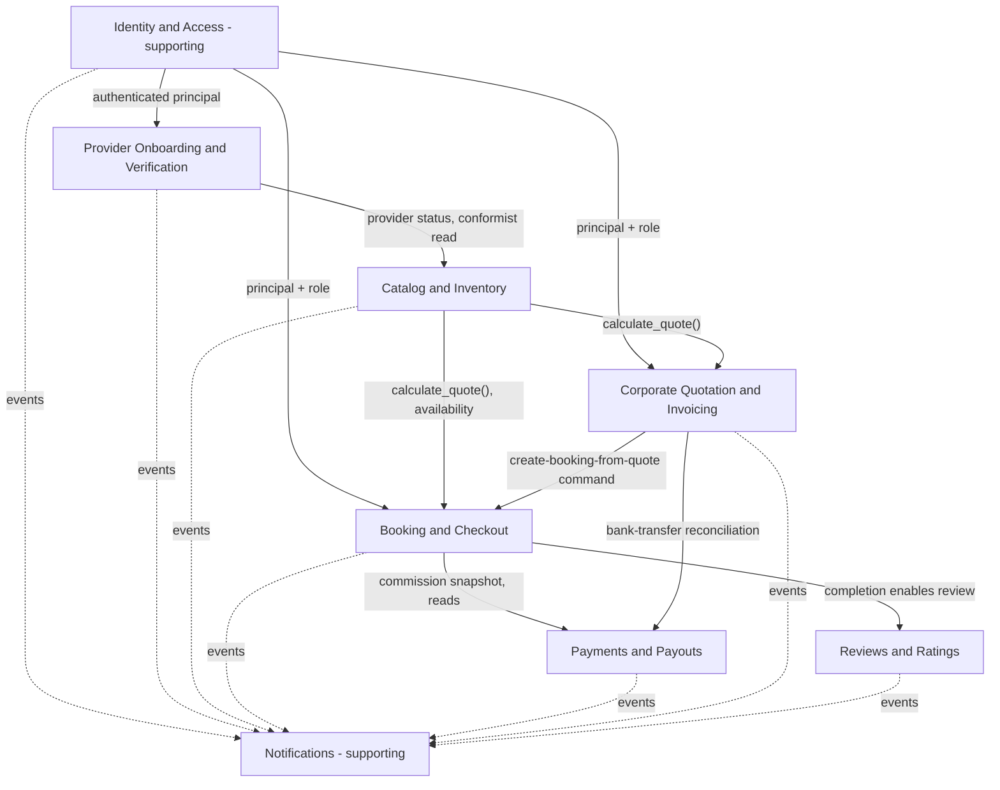
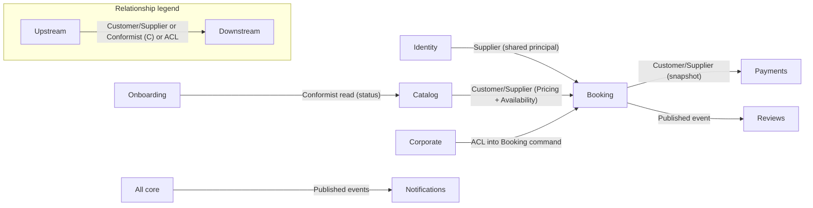

## TL;DR

- Eight bounded contexts: **six core** (Onboarding, Catalog, Booking, Payments, Corporate, Reviews) and **two supporting** (Identity, Notifications).
- Contexts integrate **in-process** — sync commands/queries or async domain events — with no network boundary between them.
- **Catalog** computes price and owns seat inventory; **Booking** runs checkout and owns snapshots; **Payments** moves money against those facts.
- The only shared transaction is checkout + guarded seat reservation (`CR-1`).

## About this document

Strategic DDD design: ownership boundaries, integration contracts, domain events, and coupling risks.

| Topic | Document |
| --- | --- |
| Terminology | [Glossary](/docs/business-rules/glossary) |
| Rules | [Business Rules](/docs/business-rules/invariants) |
| Money flows | [Payments Architecture](/docs/architecture/payments-architecture) |
| Booking lifecycle | [Booking State Machine](/docs/architecture/booking-state-machine) |
| Code mapping | [Domain-to-Code Mapping](/docs/engineering/domain-to-code-mapping) |

---

## TL;DR

- Eight bounded contexts: **six core** (Onboarding, Catalog, Booking, Payments, Corporate, Reviews) and **two supporting** (Identity, Notifications).
- Contexts integrate **in-process** — sync commands/queries or async domain events — with no network boundary between them.
- **Catalog** computes price and owns seat inventory; **Booking** runs checkout and owns snapshots; **Payments** moves money against those facts.
- The only shared transaction is checkout + guarded seat reservation (`CR-1`).

## About this document

Strategic DDD design: ownership boundaries, integration contracts, domain events, and coupling risks.

| Topic | Document |
| --- | --- |
| Terminology | [Glossary](/docs/business-rules/glossary) |
| Rules | [Business Rules](/docs/business-rules/invariants) |
| Money flows | [Payments Architecture](/docs/architecture/payments-architecture) |
| Booking lifecycle | [Booking State Machine](/docs/architecture/booking-state-machine) |
| Code mapping | [Domain-to-Code Mapping](/docs/engineering/domain-to-code-mapping) |

---

## TL;DR

- Eight bounded contexts: **six core** (Onboarding, Catalog, Booking, Payments, Corporate, Reviews) and **two supporting** (Identity, Notifications).
- Contexts integrate **in-process** — sync commands/queries or async domain events — with no network boundary between them.
- **Catalog** computes price and owns seat inventory; **Booking** runs checkout and owns snapshots; **Payments** moves money against those facts.
- The only shared transaction is checkout + guarded seat reservation (`CR-1`).

## About this document

Strategic DDD design: ownership boundaries, integration contracts, domain events, and coupling risks.

| Topic | Document |
| --- | --- |
| Terminology | [Glossary](/docs/business-rules/glossary) |
| Rules | [Business Rules](/docs/business-rules/invariants) |
| Money flows | [Payments Architecture](/docs/architecture/payments-architecture) |
| Booking lifecycle | [Booking State Machine](/docs/architecture/booking-state-machine) |
| Code mapping | [Domain-to-Code Mapping](/docs/engineering/domain-to-code-mapping) |

---

## TL;DR

- Eight bounded contexts: **six core** (Onboarding, Catalog, Booking, Payments, Corporate, Reviews) and **two supporting** (Identity, Notifications).
- Contexts integrate **in-process** — sync commands/queries or async domain events — with no network boundary between them.
- **Catalog** computes price and owns seat inventory; **Booking** runs checkout and owns snapshots; **Payments** moves money against those facts.
- The only shared transaction is checkout + guarded seat reservation (`CR-1`).

## About this document

Strategic DDD design: ownership boundaries, integration contracts, domain events, and coupling risks.

| Topic | Document |
| --- | --- |
| Terminology | [Glossary](/docs/business-rules/glossary) |
| Rules | [Business Rules](/docs/business-rules/invariants) |
| Money flows | [Payments Architecture](/docs/architecture/payments-architecture) |
| Booking lifecycle | [Booking State Machine](/docs/architecture/booking-state-machine) |
| Code mapping | [Domain-to-Code Mapping](/docs/engineering/domain-to-code-mapping) |

---

## TL;DR

- Eight bounded contexts: **six core** (Onboarding, Catalog, Booking, Payments, Corporate, Reviews) and **two supporting** (Identity, Notifications).
- Contexts integrate **in-process** — sync commands/queries or async domain events — with no network boundary between them.
- **Catalog** computes price and owns seat inventory; **Booking** runs checkout and owns snapshots; **Payments** moves money against those facts.
- The only shared transaction is checkout + guarded seat reservation (`CR-1`).

## About this document

Strategic DDD design: ownership boundaries, integration contracts, domain events, and coupling risks.

| Topic | Document |
| --- | --- |
| Terminology | [Glossary](/docs/business-rules/glossary) |
| Rules | [Business Rules](/docs/business-rules/invariants) |
| Money flows | [Payments Architecture](/docs/architecture/payments-architecture) |
| Booking lifecycle | [Booking State Machine](/docs/architecture/booking-state-machine) |
| Code mapping | [Domain-to-Code Mapping](/docs/engineering/domain-to-code-mapping) |

---

## TL;DR

- Eight bounded contexts: **six core** (Onboarding, Catalog, Booking, Payments, Corporate, Reviews) and **two supporting** (Identity, Notifications).
- Contexts integrate **in-process** — sync commands/queries or async domain events — with no network boundary between them.
- **Catalog** computes price and owns seat inventory; **Booking** runs checkout and owns snapshots; **Payments** moves money against those facts.
- The only shared transaction is checkout + guarded seat reservation (`CR-1`).

## About this document

Strategic DDD design: ownership boundaries, integration contracts, domain events, and coupling risks.

| Topic | Document |
| --- | --- |
| Terminology | [Glossary](/docs/business-rules/glossary) |
| Rules | [Business Rules](/docs/business-rules/invariants) |
| Money flows | [Payments Architecture](/docs/architecture/payments-architecture) |
| Booking lifecycle | [Booking State Machine](/docs/architecture/booking-state-machine) |
| Code mapping | [Domain-to-Code Mapping](/docs/engineering/domain-to-code-mapping) |

---

## TL;DR

- Eight bounded contexts: **six core** (Onboarding, Catalog, Booking, Payments, Corporate, Reviews) and **two supporting** (Identity, Notifications).
- Contexts integrate **in-process** — sync commands/queries or async domain events — with no network boundary between them.
- **Catalog** computes price and owns seat inventory; **Booking** runs checkout and owns snapshots; **Payments** moves money against those facts.
- The only shared transaction is checkout + guarded seat reservation (`CR-1`).

## About this document

Strategic DDD design: ownership boundaries, integration contracts, domain events, and coupling risks.

| Topic | Document |
| --- | --- |
| Terminology | [Glossary](/docs/business-rules/glossary) |
| Rules | [Business Rules](/docs/business-rules/invariants) |
| Money flows | [Payments Architecture](/docs/architecture/payments-architecture) |
| Booking lifecycle | [Booking State Machine](/docs/architecture/booking-state-machine) |
| Code mapping | [Domain-to-Code Mapping](/docs/engineering/domain-to-code-mapping) |

---

## Strategic overview
Red Cab is a single modular-monolith application (one deployable, one PostgreSQL database). "Bounded context" here is a **logical ownership boundary**: a module with its own ubiquitous language, its own aggregates, and a guarded public surface. Contexts integrate **in-process** — synchronously via published commands/queries, or asynchronously via in-process domain events. There is no network boundary between contexts; the discipline is enforced by module boundaries and contracts, not by distribution.
Baseline (locked after three review rounds: 10 → 5+1 → 6+2):
- **Core (6):** Provider Onboarding & Verification, Catalog & Inventory, Booking & Checkout, Payments & Payouts, Corporate Quotation & Invoicing, Reviews & Ratings.
- **Supporting (2):** Identity & Access, Notifications.
Design principles applied:
- Fold boundaries with no independent domain logic into the context that owns their data (Geography, Search → Catalog).
- Never split across an invariant/transaction boundary (Checkout snapshot + seat reserve stay in one context).
- Split across subdomain **type** (generic supporting vs core): Identity ≠ Onboarding.
- Split across an independent **evolution axis**: Corporate Quotation ≠ Booking.

## Context map

Relationship types (DDD strategic patterns):

## Interaction styles (sync vs async) — at a glance
- **Synchronous (in-process command/query, caller awaits result):** Identity principal resolution; `Catalog.calculate_quote()`; Catalog availability check + the guarded seat-reserve command invoked by Booking inside one transaction; Corporate → Booking "create booking from accepted quote"; Payments reading a Booking's Commission Snapshot.
- **Asynchronous (in-process domain events, fire-and-react, idempotent):** everything Notifications consumes; cross-context cascades (license expiry → pause listings; district deactivation → unlist; completion → enable review; completion → queue payout).
Rule of thumb: **state-changing invariants that must hold together are synchronous and co-transactional; cross-context reactions and notifications are asynchronous.**

## Core contexts

See individual context pages:

- [Onboarding](/docs/architecture/bounded-contexts/onboarding)
- [Catalog](/docs/architecture/bounded-contexts/catalog)
- [Booking](/docs/architecture/bounded-contexts/booking)
- [Payments](/docs/architecture/bounded-contexts/payments)
- [Corporate](/docs/architecture/bounded-contexts/corporate)
- [Reviews](/docs/architecture/bounded-contexts/reviews)

## Supporting contexts

- [Identity](/docs/architecture/bounded-contexts/identity)
- [Notifications](/docs/architecture/bounded-contexts/notifications)

## Reference

- [Domain Events](/docs/architecture/bounded-contexts/domain-events)
- [Design Rationales](/docs/architecture/bounded-contexts/design-rationales)
- [Coupling Risks](/docs/architecture/bounded-contexts/coupling-risks)
