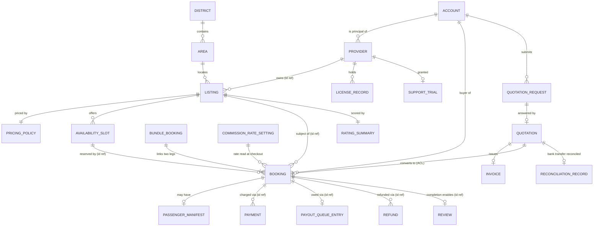
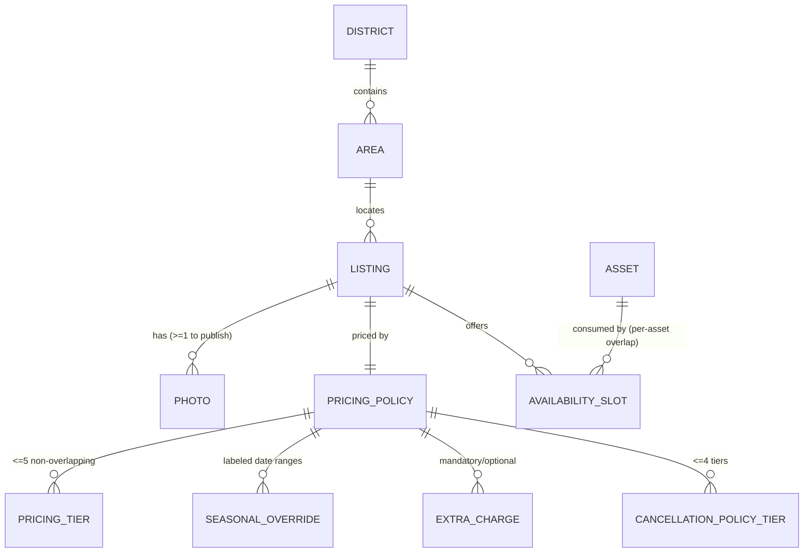
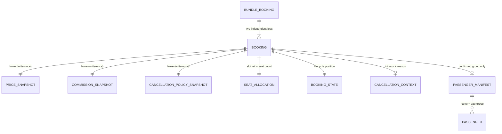
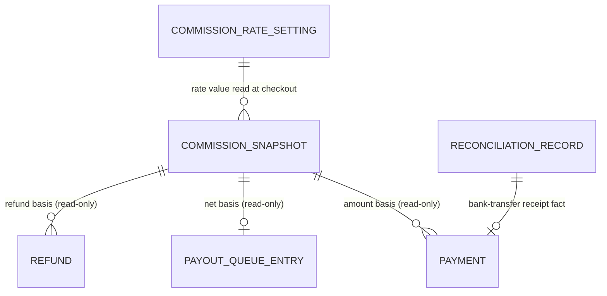
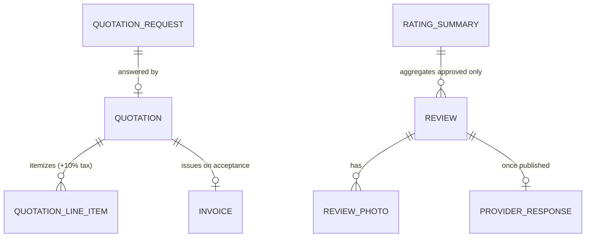

## 11. Conceptual ERD Diagrams

These diagrams are **conceptual**: entities are domain concepts (glossary terms), and associations are domain relationships and identity references — not tables, foreign keys, or storage relationships. Cross-context associations are drawn with the understanding that they are realized by **identity reference, snapshot, or published contract**, never by shared mutable state.

### 11.1 Whole-domain conceptual ERD (cross-context, by identity)

> Reading guide: `||--o{` = one-to-many, `||--o|` = one-to-(zero-or-one), `||--||` = one-to-one, `||--|{` = one-to-(two-or-more) domain associations. "id ref" and "ACL" labels mark associations realized by identity reference or across the anti-corruption boundary, not by ownership.

### 11.2 Catalog & Inventory (intra-context)

### 11.3 Booking & Checkout with its snapshots and links (intra-context)

### 11.4 Payments & Payouts (intra-context, with Booking facts read-only)

### 11.5 Corporate and Reviews (intra-context)

