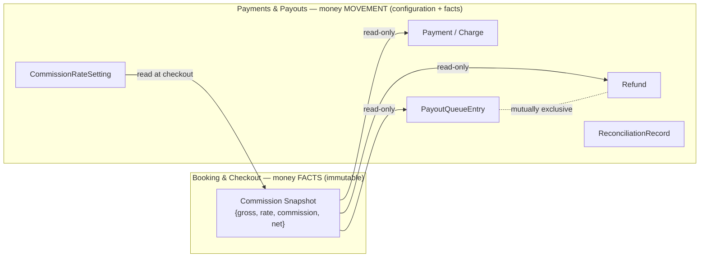

## 9. Financial Ownership Boundaries

Financial data is split along the **money-facts vs money-movement** seam ([./payments-architecture.md](/docs/architecture/payments-architecture); [./overview.md](/docs/architecture/overview) Money Facts vs Money Movement).

- **Booking owns money *facts*.** The immutable Price/Commission/Cancellation snapshots — "what was owed, to whom, at what split" — are Booking-owned and never mutated by anyone, including Payments (`INV-1`, `FIN-2`).
- **Payments owns money *movement* and *configuration*.** The Commission Rate setting, charges, captures, payouts, refunds, and reconciliation are Payments-owned. Payments **reads** the Booking's Commission Snapshot and **never authors or mutates it** (`FIN-3`, `FIN-5`).

Ownership boundary rules the model holds:

- **The Commission Rate is owned by Payments, not by any Booking.** A rate change affects only future Bookings; historical Bookings keep their snapshot (`PAY-2`). A Booking's rate fact lives only in its Commission Snapshot.
- **Every money movement traces to exactly one Booking and its snapshot** (`FIN-3`). There is no money movement without a Booking it belongs to.
- **Payout and refund are mutually exclusive for a Booking's funds** (`FIN-5`, `PAY-8`): the platform never both pays the Provider and refunds the buyer for the same captured amount. A refund voids/reverses any payout-queue entry for that Booking.
- **Amount bounds.** No payout exceeds `net_payout_amount`; no refund exceeds `gross_amount` (`FIN-4`). All amounts are whole JPY (`FIN-8`, `PAY-1`).
- **External-rail truth is authoritative.** Settlement outcomes arrive asynchronously; internal Payments facts converge to them, and divergence surfaces as a reconcilable fact rather than silent loss (`FIN-11`). Corporate bank-transfer funds are collected by the payment provider through a per-transaction virtual account and confirmed by provider event (`PAY-9`).
- **Custody is external.** No Payments record represents funds held by Red Cab (`INV-13`, `PAY-13`); the context holds only instructions issued and outcomes observed. Control of settlement release stays with Red Cab (`PAY-15`, `PAY-16`) — see [ADR-015](/docs/architecture/decisions/adr-015-payment-custody-and-control-separation).
- **Post-settlement liability** sits with the Provider as merchant-of-record; recovery is by clawback and remains unresolved (`FIN-14`, `AMB-038`).

---
