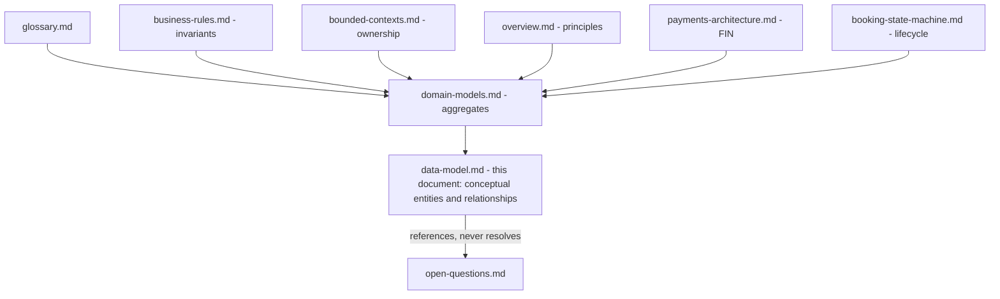
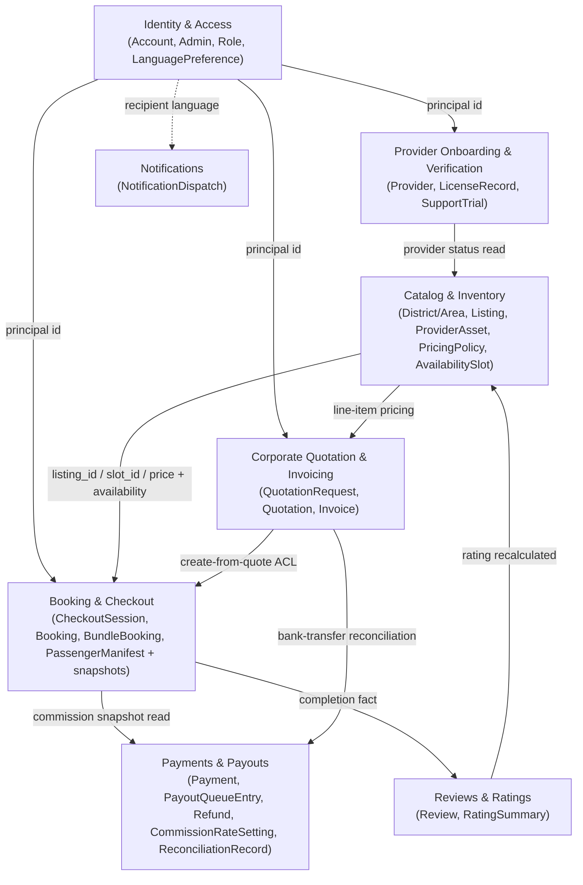

## TL;DR

- Conceptual picture of **what data exists, who owns it, and how it relates** — database-neutral, no tables or SQL.
- One owner per concept; cross-context links are **identity references or snapshots**, never shared mutable state.
- Canonical snapshots (price, commission, cancellation policy) are frozen on CheckoutSession and copied to Booking.
- The only co-transactional cross-context operation is checkout + seat reservation (`CR-1`).

## About this document

Conceptual data model derived from the approved DDD design — semantics only, not implementation.

| Topic | Document |
| --- | --- |
| Terminology | [Glossary](/docs/business-rules/glossary) |
| Rules | [Business Rules](/docs/business-rules/invariants) |
| Financial rules (`FIN-`) | [Payments Architecture](/docs/architecture/payments-architecture) |
| Context ownership | [Bounded Contexts](/docs/architecture/bounded-contexts) |
| Aggregates | [Domain Models](/docs/domain/domain-models) |
| Principles | [Architecture Overview](/docs/architecture/overview) |
| Lifecycle | [Booking State Machine](/docs/architecture/booking-state-machine) |
| Open decisions | [Open Questions](/docs/ambiguities/open-questions) |

---

## TL;DR

- Conceptual picture of **what data exists, who owns it, and how it relates** — database-neutral, no tables or SQL.
- One owner per concept; cross-context links are **identity references or snapshots**, never shared mutable state.
- Canonical snapshots (price, commission, cancellation policy) are frozen on CheckoutSession and copied to Booking.
- The only co-transactional cross-context operation is checkout + seat reservation (`CR-1`).

## About this document

Conceptual data model derived from the approved DDD design — semantics only, not implementation.

| Topic | Document |
| --- | --- |
| Terminology | [Glossary](/docs/business-rules/glossary) |
| Rules | [Business Rules](/docs/business-rules/invariants) |
| Financial rules (`FIN-`) | [Payments Architecture](/docs/architecture/payments-architecture) |
| Context ownership | [Bounded Contexts](/docs/architecture/bounded-contexts) |
| Aggregates | [Domain Models](/docs/domain/domain-models) |
| Principles | [Architecture Overview](/docs/architecture/overview) |
| Lifecycle | [Booking State Machine](/docs/architecture/booking-state-machine) |
| Open decisions | [Open Questions](/docs/ambiguities/open-questions) |

---

## TL;DR

- Conceptual picture of **what data exists, who owns it, and how it relates** — database-neutral, no tables or SQL.
- One owner per concept; cross-context links are **identity references or snapshots**, never shared mutable state.
- Canonical snapshots (price, commission, cancellation policy) are frozen on CheckoutSession and copied to Booking.
- The only co-transactional cross-context operation is checkout + seat reservation (`CR-1`).

## About this document

Conceptual data model derived from the approved DDD design — semantics only, not implementation.

| Topic | Document |
| --- | --- |
| Terminology | [Glossary](/docs/business-rules/glossary) |
| Rules | [Business Rules](/docs/business-rules/invariants) |
| Financial rules (`FIN-`) | [Payments Architecture](/docs/architecture/payments-architecture) |
| Context ownership | [Bounded Contexts](/docs/architecture/bounded-contexts) |
| Aggregates | [Domain Models](/docs/domain/domain-models) |
| Principles | [Architecture Overview](/docs/architecture/overview) |
| Lifecycle | [Booking State Machine](/docs/architecture/booking-state-machine) |
| Open decisions | [Open Questions](/docs/ambiguities/open-questions) |

---

## TL;DR

- Conceptual picture of **what data exists, who owns it, and how it relates** — database-neutral, no tables or SQL.
- One owner per concept; cross-context links are **identity references or snapshots**, never shared mutable state.
- Canonical snapshots (price, commission, cancellation policy) are frozen on CheckoutSession and copied to Booking.
- The only co-transactional cross-context operation is checkout + seat reservation (`CR-1`).

## About this document

Conceptual data model derived from the approved DDD design — semantics only, not implementation.

| Topic | Document |
| --- | --- |
| Terminology | [Glossary](/docs/business-rules/glossary) |
| Rules | [Business Rules](/docs/business-rules/invariants) |
| Financial rules (`FIN-`) | [Payments Architecture](/docs/architecture/payments-architecture) |
| Context ownership | [Bounded Contexts](/docs/architecture/bounded-contexts) |
| Aggregates | [Domain Models](/docs/domain/domain-models) |
| Principles | [Architecture Overview](/docs/architecture/overview) |
| Lifecycle | [Booking State Machine](/docs/architecture/booking-state-machine) |
| Open decisions | [Open Questions](/docs/ambiguities/open-questions) |

---

## TL;DR

- Conceptual picture of **what data exists, who owns it, and how it relates** — database-neutral, no tables or SQL.
- One owner per concept; cross-context links are **identity references or snapshots**, never shared mutable state.
- Canonical snapshots (price, commission, cancellation policy) are frozen on CheckoutSession and copied to Booking.
- The only co-transactional cross-context operation is checkout + seat reservation (`CR-1`).

## About this document

Conceptual data model derived from the approved DDD design — semantics only, not implementation.

| Topic | Document |
| --- | --- |
| Terminology | [Glossary](/docs/business-rules/glossary) |
| Rules | [Business Rules](/docs/business-rules/invariants) |
| Financial rules (`FIN-`) | [Payments Architecture](/docs/architecture/payments-architecture) |
| Context ownership | [Bounded Contexts](/docs/architecture/bounded-contexts) |
| Aggregates | [Domain Models](/docs/domain/domain-models) |
| Principles | [Architecture Overview](/docs/architecture/overview) |
| Lifecycle | [Booking State Machine](/docs/architecture/booking-state-machine) |
| Open decisions | [Open Questions](/docs/ambiguities/open-questions) |

---

## TL;DR

- Conceptual picture of **what data exists, who owns it, and how it relates** — database-neutral, no tables or SQL.
- One owner per concept; cross-context links are **identity references or snapshots**, never shared mutable state.
- Canonical snapshots (price, commission, cancellation policy) are frozen on CheckoutSession and copied to Booking.
- The only co-transactional cross-context operation is checkout + seat reservation (`CR-1`).

## About this document

Conceptual data model derived from the approved DDD design — semantics only, not implementation.

| Topic | Document |
| --- | --- |
| Terminology | [Glossary](/docs/business-rules/glossary) |
| Rules | [Business Rules](/docs/business-rules/invariants) |
| Financial rules (`FIN-`) | [Payments Architecture](/docs/architecture/payments-architecture) |
| Context ownership | [Bounded Contexts](/docs/architecture/bounded-contexts) |
| Aggregates | [Domain Models](/docs/domain/domain-models) |
| Principles | [Architecture Overview](/docs/architecture/overview) |
| Lifecycle | [Booking State Machine](/docs/architecture/booking-state-machine) |
| Open decisions | [Open Questions](/docs/ambiguities/open-questions) |

---

## TL;DR

- Conceptual picture of **what data exists, who owns it, and how it relates** — database-neutral, no tables or SQL.
- One owner per concept; cross-context links are **identity references or snapshots**, never shared mutable state.
- Canonical snapshots (price, commission, cancellation policy) are frozen on CheckoutSession and copied to Booking.
- The only co-transactional cross-context operation is checkout + seat reservation (`CR-1`).

## About this document

Conceptual data model derived from the approved DDD design — semantics only, not implementation.

| Topic | Document |
| --- | --- |
| Terminology | [Glossary](/docs/business-rules/glossary) |
| Rules | [Business Rules](/docs/business-rules/invariants) |
| Financial rules (`FIN-`) | [Payments Architecture](/docs/architecture/payments-architecture) |
| Context ownership | [Bounded Contexts](/docs/architecture/bounded-contexts) |
| Aggregates | [Domain Models](/docs/domain/domain-models) |
| Principles | [Architecture Overview](/docs/architecture/overview) |
| Lifecycle | [Booking State Machine](/docs/architecture/booking-state-machine) |
| Open decisions | [Open Questions](/docs/ambiguities/open-questions) |

---

## 1. Purpose

This document gives a single conceptual picture of **what data the Red Cab domain holds, who owns it, and how its parts relate** — derived entirely from the already-approved DDD design. Its goals are:

- To express the domain's entities and relationships at a **conceptual** level so that the model can be reviewed for correctness against the invariants before any storage design exists.
- To make **ownership boundaries** explicit: which bounded context is the single source of truth for each concept, so that the same concept is never co-owned or duplicated as a writable fact.
- To show how **immutable snapshots**, **financial facts**, and **lifecycle-owned state** are structured and protected, since these are the high-value invariants the whole architecture exists to defend (`INV-1`, `INV-2`, `INV-3`, `INV-5`).
- To document **cross-context references** (by identity only) and the consistency rules that hold the model together without shared mutable state.

What this document is **not**:

- Not a schema. It defines no tables, columns, keys, indexes, or types.
- Not an implementation guide. It contains no SQL, no migrations, no ORM/Rails concepts, and no storage technology choices. For DBML tables, migrations, and `app/domains/` layout, see [../engineering/backend-conventions.md](/docs/engineering/backend-conventions) and [../engineering/domain-to-code-mapping.md](/docs/engineering/domain-to-code-mapping).
- Not a place where invariants, ownership, contexts, or ambiguities are created, changed, or resolved. Those live in the authoritative documents above; this model **conforms** to them.

The model deliberately describes **aggregates as consistency boundaries, not storage units** (per [../domain/domain-models.md](/docs/domain/domain-models) §1). Two concepts that may be "consistent a moment later" belong to different aggregates — and usually different contexts — even if a database could store them together.

---

## 2. Relationship to Other Planning Documents

This conceptual data model is **downstream of, and subordinate to**, the strategic design. Where it overlaps any authoritative document, that document governs and this model conforms (mirroring the precedence rule in [../requirements/README.md](/docs/requirements) §9).

| Authoritative source | What this model takes from it (and never overrides) |
| --- | --- |
| [../business-rules/glossary.md](/docs/business-rules/glossary) | The exact names and meanings of every concept (Booking, Listing, Slot, Snapshot, Provider, etc.). Entity names here are glossary terms. |
| [../business-rules/business-rules.md](/docs/business-rules/invariants) | The invariants (`INV-`), lifecycle constraints (`LC-`), pricing authority (`PRC-`), payment rules (`PAY-`), booking rules (`BKG-`), concurrency guarantees (`CON-`), operational rules (`OPR-`) that the relationships and immutable structures must uphold. |
| [./bounded-contexts.md](/docs/architecture/bounded-contexts) | The 6 core + 2 supporting contexts and their ownership boundaries, integration contracts, and the one shared-transaction exception (CR-1). |
| [./overview.md](/docs/architecture/overview) | The architecture principles — Single Pricing Authority, Snapshot Pattern, Atomic Capacity Reservation, Money Facts vs Money Movement, Modular Monolith First. |
| [../domain/domain-models.md](/docs/domain/domain-models) | The aggregate definitions, roots, entities, value objects, and source-of-truth ownership per context. This model visualizes and relates those aggregates; it does not redefine them. |
| [./payments-architecture.md](/docs/architecture/payments-architecture) | The money-facts vs money-movement seam and the financial invariants (`FIN-`). |
| [./booking-state-machine.md](/docs/architecture/booking-state-machine) | The authoritative Booking lifecycle whose state is a Booking-owned mutable fact here. |
| [../ambiguities/open-questions.md](/docs/ambiguities/open-questions) | The open decisions; this model references `AMB-###` items in §14 and never resolves them. |

Diagrammatically, this model sits beneath strategic design and beside the requirements:

---

## 3. Modeling Principles

These principles are inherited from [../domain/domain-models.md](/docs/domain/domain-models) §1–2 and [./overview.md](/docs/architecture/overview); they govern every relationship and structure shown later.

1. **Aggregates are consistency boundaries.** Everything inside an aggregate is kept consistent within one atomic change; everything outside is reconciled asynchronously and is only eventually consistent. Aggregates are kept small — they contain only what must change together to uphold an invariant.
2. **One owner per concept.** Every concept has exactly one owning context that is its source of truth. No concept is co-owned. Other contexts hold a **reference by identity** or an **immutable snapshot**, never a second writable copy.
3. **Reference foreign aggregates by identity only.** A context names another context's aggregate by its identifier (e.g. a Booking names `listing_id`, `slot_id`, `tourist_id`, `provider_id`). It never embeds, reaches inside, or mutates the foreign aggregate.
4. **Snapshots make meaning immutable.** A snapshot is a write-once copy of an upstream fact, captured at a defined instant and thereafter owned by the capturing aggregate. Later upstream change has no effect on it (`INV-1`, `BKG-8`).
5. **Immutable facts vs mutable state.** Snapshots, completed financial movements, terminal lifecycle outcomes, and a submitted review's original content are write-once; corrections are *new* facts, never edits. Lifecycle position (Booking state, Provider Status, Listing Status) changes only through guarded transitions owned by the aggregate.
6. **Money is a whole-JPY value paired with its role.** Every monetary value is an integer-yen amount carrying a semantic role (gross, commission, net, refund, payout) — never a bare number and never fractional (`PAY-1`, `FIN-8`).
7. **Price is computed in exactly one place.** No entity stores a derived price as an authoritative cross-context fact except as a Booking-owned snapshot; live price is always computed by the single Pricing authority (`PRC-1`).
8. **The model is database-neutral.** Relationships are conceptual associations and identity references, not foreign keys; "owned by" means *consistency and authority*, not table placement.

---
## 4. Context Ownership Boundaries

The domain data is partitioned across the locked **6 core + 2 supporting** bounded contexts ([./bounded-contexts.md](/docs/architecture/bounded-contexts)). Each context is the **single source of truth** for its own concepts; every other context that needs those facts holds them by **identity reference** or **snapshot**. The table states the authoritative owner of each concept exactly as fixed in [../domain/domain-models.md](/docs/domain/domain-models) §3.

| Context (code) | Type | Source of truth for (owned concepts) |
| --- | --- | --- |
| Identity & Access (`IAM`) | supporting | Account identity, credentials/OAuth identities, Role assignment, Language Preference; **Admin** principal (separate from Account) |
| Provider Onboarding & Verification (`PRV`) | core | Provider Status, Provider Type, license validity window, support-trial window, uploaded verification Documents |
| Catalog & Inventory (`CAT`) | core | District/Area, Listing content & status, PricingPolicy configuration, AvailabilitySlot and its seat counter; Rating Score *display* (the score itself is owned by Reviews) |
| Booking & Checkout (`BKG`) | core | Booking existence and lifecycle state, Price/Commission/Cancellation snapshots, Passenger Manifest, the Bundle link |
| Payments & Payouts (`PAY`) | core | Commission Rate setting, Provider Connected Account state, payment/charge movements, payout-queue entries and disbursement outcomes, refund movements, bank-transfer reconciliation facts |
| Corporate Quotation & Invoicing (`COR`) | core | Quotation Request, Quotation (line items, tax, validity, status), Invoice |
| Reviews & Ratings (`REV`) | core | Review content & moderation state, RatingSummary (the authoritative score) |
| Notifications (`NOT`) | supporting | Notification dispatch records and templates only |

Boundary rules that the model holds to (from [./bounded-contexts.md](/docs/architecture/bounded-contexts) "Boundary enforcement summary"):

- A context's data is reachable from outside **only** through its published commands, queries, and events — never by another context reading or writing its internals.
- The **only** place two contexts participate in one transaction is **CheckoutSession ↔ Catalog seat reservation** (CR-1): CheckoutSession creation invokes Catalog's guarded reserve to decrement `available_seats` co-transactionally. Booking materialization follows payment success and copies the session's hold. This is the single documented exception; everywhere else integration is by event or identity reference.
- Cross-context value contracts are: `PriceBreakdown`, `AvailabilitySnapshot`, the Provider Status read `{ provider_id, status, license_valid_until }`, the payout capability read `{ provider_id, status, payouts_enabled, verified_at }`, the **Commission Snapshot**, the completion fact `{ booking_id, tourist_id, listing_id, completed_at }`, and recipient language.

### Context ownership map

---

## 2. Relationship to Other Planning Documents

This conceptual data model is **downstream of, and subordinate to**, the strategic design. Where it overlaps any authoritative document, that document governs and this model conforms (mirroring the precedence rule in [../requirements/README.md](/docs/requirements) §9).

| Authoritative source | What this model takes from it (and never overrides) |
| --- | --- |
| [../business-rules/glossary.md](/docs/business-rules/glossary) | The exact names and meanings of every concept (Booking, Listing, Slot, Snapshot, Provider, etc.). Entity names here are glossary terms. |
| [../business-rules/business-rules.md](/docs/business-rules/invariants) | The invariants (`INV-`), lifecycle constraints (`LC-`), pricing authority (`PRC-`), payment rules (`PAY-`), booking rules (`BKG-`), concurrency guarantees (`CON-`), operational rules (`OPR-`) that the relationships and immutable structures must uphold. |
| [./bounded-contexts.md](/docs/architecture/bounded-contexts) | The 6 core + 2 supporting contexts and their ownership boundaries, integration contracts, and the one shared-transaction exception (CR-1). |
| [./overview.md](/docs/architecture/overview) | The architecture principles — Single Pricing Authority, Snapshot Pattern, Atomic Capacity Reservation, Money Facts vs Money Movement, Modular Monolith First. |
| [../domain/domain-models.md](/docs/domain/domain-models) | The aggregate definitions, roots, entities, value objects, and source-of-truth ownership per context. This model visualizes and relates those aggregates; it does not redefine them. |
| [./payments-architecture.md](/docs/architecture/payments-architecture) | The money-facts vs money-movement seam and the financial invariants (`FIN-`). |
| [./booking-state-machine.md](/docs/architecture/booking-state-machine) | The authoritative Booking lifecycle whose state is a Booking-owned mutable fact here. |
| [../ambiguities/open-questions.md](/docs/ambiguities/open-questions) | The open decisions; this model references `AMB-###` items in §14 and never resolves them. |

Diagrammatically, this model sits beneath strategic design and beside the requirements:

---

## 3. Modeling Principles

These principles are inherited from [../domain/domain-models.md](/docs/domain/domain-models) §1–2 and [./overview.md](/docs/architecture/overview); they govern every relationship and structure shown later.

1. **Aggregates are consistency boundaries.** Everything inside an aggregate is kept consistent within one atomic change; everything outside is reconciled asynchronously and is only eventually consistent. Aggregates are kept small — they contain only what must change together to uphold an invariant.
2. **One owner per concept.** Every concept has exactly one owning context that is its source of truth. No concept is co-owned. Other contexts hold a **reference by identity** or an **immutable snapshot**, never a second writable copy.
3. **Reference foreign aggregates by identity only.** A context names another context's aggregate by its identifier (e.g. a Booking names `listing_id`, `slot_id`, `tourist_id`, `provider_id`). It never embeds, reaches inside, or mutates the foreign aggregate.
4. **Snapshots make meaning immutable.** A snapshot is a write-once copy of an upstream fact, captured at a defined instant and thereafter owned by the capturing aggregate. Later upstream change has no effect on it (`INV-1`, `BKG-8`).
5. **Immutable facts vs mutable state.** Snapshots, completed financial movements, terminal lifecycle outcomes, and a submitted review's original content are write-once; corrections are *new* facts, never edits. Lifecycle position (Booking state, Provider Status, Listing Status) changes only through guarded transitions owned by the aggregate.
6. **Money is a whole-JPY value paired with its role.** Every monetary value is an integer-yen amount carrying a semantic role (gross, commission, net, refund, payout) — never a bare number and never fractional (`PAY-1`, `FIN-8`).
7. **Price is computed in exactly one place.** No entity stores a derived price as an authoritative cross-context fact except as a Booking-owned snapshot; live price is always computed by the single Pricing authority (`PRC-1`).
8. **The model is database-neutral.** Relationships are conceptual associations and identity references, not foreign keys; "owned by" means *consistency and authority*, not table placement.

---

## 4. Context Ownership Boundaries

The domain data is partitioned across the locked **6 core + 2 supporting** bounded contexts ([./bounded-contexts.md](/docs/architecture/bounded-contexts)). Each context is the **single source of truth** for its own concepts; every other context that needs those facts holds them by **identity reference** or **snapshot**. The table states the authoritative owner of each concept exactly as fixed in [../domain/domain-models.md](/docs/domain/domain-models) §3.

| Context (code) | Type | Source of truth for (owned concepts) |
| --- | --- | --- |
| Identity & Access (`IAM`) | supporting | Account identity, credentials/OAuth identities, Role assignment, Language Preference; **Admin** principal (separate from Account) |
| Provider Onboarding & Verification (`PRV`) | core | Provider Status, Provider Type, license validity window, support-trial window, uploaded verification Documents |
| Catalog & Inventory (`CAT`) | core | District/Area, Listing content & status, PricingPolicy configuration, AvailabilitySlot and its seat counter; Rating Score *display* (the score itself is owned by Reviews) |
| Booking & Checkout (`BKG`) | core | Booking existence and lifecycle state, Price/Commission/Cancellation snapshots, Passenger Manifest, the Bundle link |
| Payments & Payouts (`PAY`) | core | Commission Rate setting, Provider Connected Account state, payment/charge movements, payout-queue entries and disbursement outcomes, refund movements, bank-transfer reconciliation facts |
| Corporate Quotation & Invoicing (`COR`) | core | Quotation Request, Quotation (line items, tax, validity, status), Invoice |
| Reviews & Ratings (`REV`) | core | Review content & moderation state, RatingSummary (the authoritative score) |
| Notifications (`NOT`) | supporting | Notification dispatch records and templates only |

Boundary rules that the model holds to (from [./bounded-contexts.md](/docs/architecture/bounded-contexts) "Boundary enforcement summary"):

- A context's data is reachable from outside **only** through its published commands, queries, and events — never by another context reading or writing its internals.
- The **only** place two contexts participate in one transaction is **CheckoutSession ↔ Catalog seat reservation** (CR-1): CheckoutSession creation invokes Catalog's guarded reserve to decrement `available_seats` co-transactionally. Booking materialization follows payment success and copies the session's hold. This is the single documented exception; everywhere else integration is by event or identity reference.
- Cross-context value contracts are: `PriceBreakdown`, `AvailabilitySnapshot`, the Provider Status read `{ provider_id, status, license_valid_until }`, the payout capability read `{ provider_id, status, payouts_enabled, verified_at }`, the **Commission Snapshot**, the completion fact `{ booking_id, tourist_id, listing_id, completed_at }`, and recipient language.

### Context ownership map

---

## Next sections

- [Aggregates](/docs/architecture/data-model/aggregates)
- [Entity Relationships](/docs/architecture/data-model/entity-relationships)
- [Snapshots](/docs/architecture/data-model/snapshots)
- [Financial Boundaries](/docs/architecture/data-model/financial-boundaries)
- [Lifecycle Data](/docs/architecture/data-model/lifecycle-data)
- [ERD Diagrams](/docs/architecture/data-model/erd-diagrams)
- [Consistency & Integration](/docs/architecture/data-model/consistency-and-integration)
- [Open Items](/docs/architecture/data-model/open-items)
