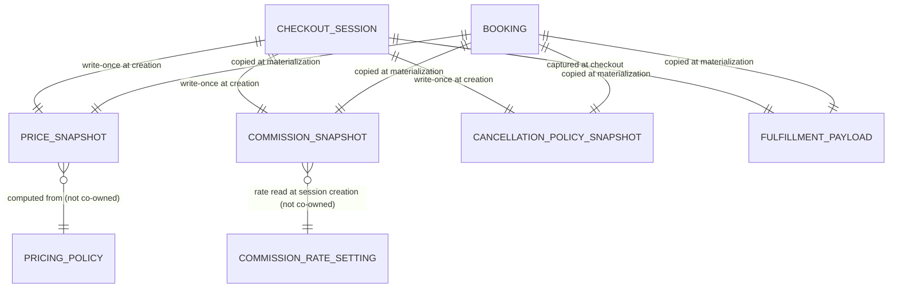

## 8. Immutable Snapshot Structures

Snapshots are the model's central protection device: they make a record's commercial meaning permanent regardless of later upstream change ([./overview.md](/docs/architecture/overview) Snapshot Pattern; `INV-1`, `PAY-2`, `BKG-8`). A snapshot is **write-once**, **owned by the capturing aggregate**, and **read-only to everyone else**.

The canonical snapshots are captured by **CheckoutSession at session creation** and copied to **Booking** at materialization; thereafter owned as Booking facts:

| Snapshot | Conceptual contents | Captured from | Frozen at | Governing rules |
| --- | --- | --- | --- | --- |
| **Price Snapshot** | the computed `PriceBreakdown` (base, tier/duration/seasonal adjustments, extra charges, total) | Catalog `calculate_quote` (`PRC-1`) | CheckoutSession creation (`BKG-9`, Decision Log `AMB-007`) | `INV-1`, `PRC-8` |
| **Commission Snapshot** | `{ gross_amount, commission_rate_snapshot, commission_amount, net_payout_amount }` | gross from Price Snapshot; rate from CommissionRateSetting (PAY) | CheckoutSession creation | `INV-1`, `INV-2`, `PAY-2`, `PAY-4`, `PAY-11`, `FIN-1..2` |
| **Cancellation Policy Snapshot** | the captured cancellation tiers `(hours-before, refund %)` in effect | Listing's PricingPolicy (`PRC-7`) | CheckoutSession creation | `INV-1`, `BKG-8`, `PAY-6` |

Structural rules these snapshots obey:

- **Immutability for the life of the Booking.** Once frozen, no operation edits them. Later changes to listing price, Cancellation Policy, or Commission Rate do not alter them (`INV-1`, `BKG-8`, `INV-11`).
- **Internal financial consistency.** Within the Commission Snapshot, `gross_amount = net_payout_amount + commission_amount` always holds on the snapshot values (`INV-2`, `FIN-1`). Commission is computed as `FLOOR(gross_amount × commission_rate)`; net is `gross_amount − commission_amount` (`PAY-11`). Commission base includes mandatory Extra Charges (`PAY-3`, `FIN-7`, subject to `AMB-009`).
- **Single financial reference.** All later money movement (payout, refund) derives from these snapshots, never a live rate or edited policy (`PAY-6`, `FIN-6`).
- **Corrections are new facts.** A refund or adjustment is a *new* movement in Payments, never an edit of a snapshot (`§ Money Facts vs Money Movement`).
- **Other snapshots in the model.** Notifications captures a **language snapshot** of the recipient at send time; a Review's submitted original content is immutable once submitted. These follow the same write-once principle within their owning aggregates.

> The dashed semantics matter: after capture, the snapshot is **decoupled** from its source. The association above records *provenance at capture time*, not a live dependency.

---
