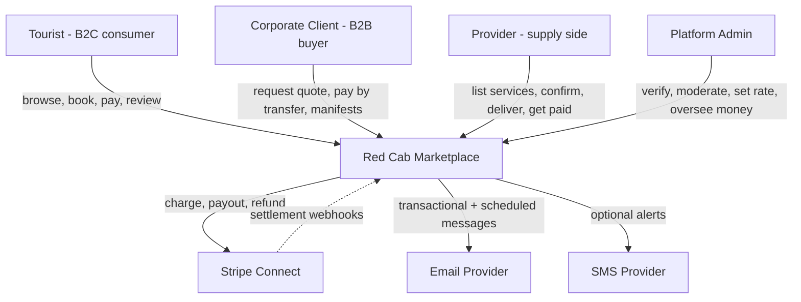
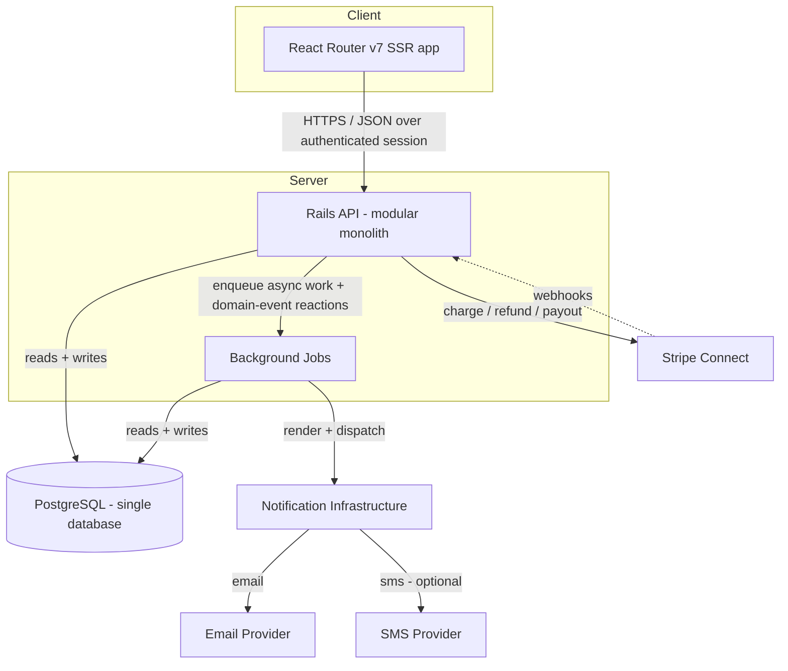
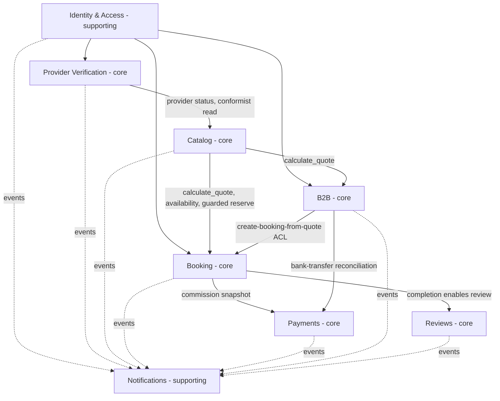

## TL;DR

- Red Cab is a **modular monolith**: one Rails API deployable and one PostgreSQL database, partitioned into **6 core + 2 supporting** bounded contexts.
- **Booking** owns money facts (immutable snapshots); **Payments** owns money movement and the commission rate.
- **Catalog** is the single pricing authority; checkout + seat reservation is the one deliberate shared transaction.
- Cross-context work is **sync where invariants must hold together**, **async via domain events** for reactions and notifications.
- Open decisions cite `AMB-###` in the ambiguity register — this overview does not assume them.

## About this document

Top-level architecture guide: context, container, module, and principles — **not** implementation (no code, Rails layout, or schemas).

| Topic | Document |
| --- | --- |
| Terminology | [Glossary](/docs/business-rules/glossary) |
| Rules (`INV-`, `LC-`, `PRC-`, `PAY-`, `BKG-`, `CON-`, `OPR-`) | [Business Rules](/docs/business-rules/invariants) |
| Financial rules (`FIN-`) | [Payments Architecture](/docs/architecture/payments-architecture) |
| Context map (authoritative) | [Bounded Contexts](/docs/architecture/bounded-contexts) |
| Booking lifecycle | [Booking State Machine](/docs/architecture/booking-state-machine) |
| Aggregates & ownership | [Domain Models](/docs/domain/domain-models) |
| Observable behavior | [Requirements](/docs/requirements) |
| Open decisions | [Open Questions](/docs/ambiguities/open-questions) |

---

## TL;DR

- Red Cab is a **modular monolith**: one Rails API deployable and one PostgreSQL database, partitioned into **6 core + 2 supporting** bounded contexts.
- **Booking** owns money facts (immutable snapshots); **Payments** owns money movement and the commission rate.
- **Catalog** is the single pricing authority; checkout + seat reservation is the one deliberate shared transaction.
- Cross-context work is **sync where invariants must hold together**, **async via domain events** for reactions and notifications.
- Open decisions cite `AMB-###` in the ambiguity register — this overview does not assume them.

## About this document

Top-level architecture guide: context, container, module, and principles — **not** implementation (no code, Rails layout, or schemas).

| Topic | Document |
| --- | --- |
| Terminology | [Glossary](/docs/business-rules/glossary) |
| Rules (`INV-`, `LC-`, `PRC-`, `PAY-`, `BKG-`, `CON-`, `OPR-`) | [Business Rules](/docs/business-rules/invariants) |
| Financial rules (`FIN-`) | [Payments Architecture](/docs/architecture/payments-architecture) |
| Context map (authoritative) | [Bounded Contexts](/docs/architecture/bounded-contexts) |
| Booking lifecycle | [Booking State Machine](/docs/architecture/booking-state-machine) |
| Aggregates & ownership | [Domain Models](/docs/domain/domain-models) |
| Observable behavior | [Requirements](/docs/requirements) |
| Open decisions | [Open Questions](/docs/ambiguities/open-questions) |

---

## TL;DR

- Red Cab is a **modular monolith**: one Rails API deployable and one PostgreSQL database, partitioned into **6 core + 2 supporting** bounded contexts.
- **Booking** owns money facts (immutable snapshots); **Payments** owns money movement and the commission rate.
- **Catalog** is the single pricing authority; checkout + seat reservation is the one deliberate shared transaction.
- Cross-context work is **sync where invariants must hold together**, **async via domain events** for reactions and notifications.
- Open decisions cite `AMB-###` in the ambiguity register — this overview does not assume them.

## About this document

Top-level architecture guide: context, container, module, and principles — **not** implementation (no code, Rails layout, or schemas).

| Topic | Document |
| --- | --- |
| Terminology | [Glossary](/docs/business-rules/glossary) |
| Rules (`INV-`, `LC-`, `PRC-`, `PAY-`, `BKG-`, `CON-`, `OPR-`) | [Business Rules](/docs/business-rules/invariants) |
| Financial rules (`FIN-`) | [Payments Architecture](/docs/architecture/payments-architecture) |
| Context map (authoritative) | [Bounded Contexts](/docs/architecture/bounded-contexts) |
| Booking lifecycle | [Booking State Machine](/docs/architecture/booking-state-machine) |
| Aggregates & ownership | [Domain Models](/docs/domain/domain-models) |
| Observable behavior | [Requirements](/docs/requirements) |
| Open decisions | [Open Questions](/docs/ambiguities/open-questions) |

---

## TL;DR

- Red Cab is a **modular monolith**: one Rails API deployable and one PostgreSQL database, partitioned into **6 core + 2 supporting** bounded contexts.
- **Booking** owns money facts (immutable snapshots); **Payments** owns money movement and the commission rate.
- **Catalog** is the single pricing authority; checkout + seat reservation is the one deliberate shared transaction.
- Cross-context work is **sync where invariants must hold together**, **async via domain events** for reactions and notifications.
- Open decisions cite `AMB-###` in the ambiguity register — this overview does not assume them.

## About this document

Top-level architecture guide: context, container, module, and principles — **not** implementation (no code, Rails layout, or schemas).

| Topic | Document |
| --- | --- |
| Terminology | [Glossary](/docs/business-rules/glossary) |
| Rules (`INV-`, `LC-`, `PRC-`, `PAY-`, `BKG-`, `CON-`, `OPR-`) | [Business Rules](/docs/business-rules/invariants) |
| Financial rules (`FIN-`) | [Payments Architecture](/docs/architecture/payments-architecture) |
| Context map (authoritative) | [Bounded Contexts](/docs/architecture/bounded-contexts) |
| Booking lifecycle | [Booking State Machine](/docs/architecture/booking-state-machine) |
| Aggregates & ownership | [Domain Models](/docs/domain/domain-models) |
| Observable behavior | [Requirements](/docs/requirements) |
| Open decisions | [Open Questions](/docs/ambiguities/open-questions) |

---

## TL;DR

- Red Cab is a **modular monolith**: one Rails API deployable and one PostgreSQL database, partitioned into **6 core + 2 supporting** bounded contexts.
- **Booking** owns money facts (immutable snapshots); **Payments** owns money movement and the commission rate.
- **Catalog** is the single pricing authority; checkout + seat reservation is the one deliberate shared transaction.
- Cross-context work is **sync where invariants must hold together**, **async via domain events** for reactions and notifications.
- Open decisions cite `AMB-###` in the ambiguity register — this overview does not assume them.

## About this document

Top-level architecture guide: context, container, module, and principles — **not** implementation (no code, Rails layout, or schemas).

| Topic | Document |
| --- | --- |
| Terminology | [Glossary](/docs/business-rules/glossary) |
| Rules (`INV-`, `LC-`, `PRC-`, `PAY-`, `BKG-`, `CON-`, `OPR-`) | [Business Rules](/docs/business-rules/invariants) |
| Financial rules (`FIN-`) | [Payments Architecture](/docs/architecture/payments-architecture) |
| Context map (authoritative) | [Bounded Contexts](/docs/architecture/bounded-contexts) |
| Booking lifecycle | [Booking State Machine](/docs/architecture/booking-state-machine) |
| Aggregates & ownership | [Domain Models](/docs/domain/domain-models) |
| Observable behavior | [Requirements](/docs/requirements) |
| Open decisions | [Open Questions](/docs/ambiguities/open-questions) |

---

## TL;DR

- Red Cab is a **modular monolith**: one Rails API deployable and one PostgreSQL database, partitioned into **6 core + 2 supporting** bounded contexts.
- **Booking** owns money facts (immutable snapshots); **Payments** owns money movement and the commission rate.
- **Catalog** is the single pricing authority; checkout + seat reservation is the one deliberate shared transaction.
- Cross-context work is **sync where invariants must hold together**, **async via domain events** for reactions and notifications.
- Open decisions cite `AMB-###` in the ambiguity register — this overview does not assume them.

## About this document

Top-level architecture guide: context, container, module, and principles — **not** implementation (no code, Rails layout, or schemas).

| Topic | Document |
| --- | --- |
| Terminology | [Glossary](/docs/business-rules/glossary) |
| Rules (`INV-`, `LC-`, `PRC-`, `PAY-`, `BKG-`, `CON-`, `OPR-`) | [Business Rules](/docs/business-rules/invariants) |
| Financial rules (`FIN-`) | [Payments Architecture](/docs/architecture/payments-architecture) |
| Context map (authoritative) | [Bounded Contexts](/docs/architecture/bounded-contexts) |
| Booking lifecycle | [Booking State Machine](/docs/architecture/booking-state-machine) |
| Aggregates & ownership | [Domain Models](/docs/domain/domain-models) |
| Observable behavior | [Requirements](/docs/requirements) |
| Open decisions | [Open Questions](/docs/ambiguities/open-questions) |

---

## TL;DR

- Red Cab is a **modular monolith**: one Rails API deployable and one PostgreSQL database, partitioned into **6 core + 2 supporting** bounded contexts.
- **Booking** owns money facts (immutable snapshots); **Payments** owns money movement and the commission rate.
- **Catalog** is the single pricing authority; checkout + seat reservation is the one deliberate shared transaction.
- Cross-context work is **sync where invariants must hold together**, **async via domain events** for reactions and notifications.
- Open decisions cite `AMB-###` in the ambiguity register — this overview does not assume them.

## About this document

Top-level architecture guide: context, container, module, and principles — **not** implementation (no code, Rails layout, or schemas).

| Topic | Document |
| --- | --- |
| Terminology | [Glossary](/docs/business-rules/glossary) |
| Rules (`INV-`, `LC-`, `PRC-`, `PAY-`, `BKG-`, `CON-`, `OPR-`) | [Business Rules](/docs/business-rules/invariants) |
| Financial rules (`FIN-`) | [Payments Architecture](/docs/architecture/payments-architecture) |
| Context map (authoritative) | [Bounded Contexts](/docs/architecture/bounded-contexts) |
| Booking lifecycle | [Booking State Machine](/docs/architecture/booking-state-machine) |
| Aggregates & ownership | [Domain Models](/docs/domain/domain-models) |
| Observable behavior | [Requirements](/docs/requirements) |
| Open decisions | [Open Questions](/docs/ambiguities/open-questions) |

---

## Purpose

Red Cab is a two-sided marketplace that connects inbound travelers (Tourists) and corporate groups (Corporate Clients) with verified Japanese transport and tour Providers, earning a commission on each booking. This document is the single entry point for understanding **how the system is shaped to deliver that behavior while protecting a small set of high-value invariants** — frozen revenue splits, never-overbooked inventory, verified-only reviews, and a strict booking lifecycle.

This overview is the reconciliation point across the planning set:
- It sits **above** the requirements ([../requirements/functional-requirements.md](/docs/requirements/functional-requirements), [../requirements/non-functional-requirements.md](/docs/requirements/non-functional-requirements)) — it explains the structure that those observable behaviors run on.
- It sits **alongside** the strategic design docs ([./bounded-contexts.md](/docs/architecture/bounded-contexts), [../domain/domain-models.md](/docs/domain/domain-models)) — it summarizes and assembles them into one picture without redefining them.
- It is **subordinate** to the business rules and lifecycle/payments docs — where they overlap, those documents govern and this overview conforms (mirroring the precedence rule in [../requirements/README.md](/docs/requirements) §9).

It deliberately contains no decisions of its own. Where the architecture admits more than one shape, the choice is deferred to the relevant `AMB-###` item (see [Open Architectural Decisions](#open-architectural-decisions)).

---

## Architectural Drivers

The forces that shaped the architecture, grouped as business drivers, technical drivers, and constraints.

## Business drivers
- **Commission integrity is the business model.** The Platform earns a commission per booking; the revenue split between Platform and Provider must be frozen, auditable, and never retroactively altered (`INV-1`, `INV-2`, `PAY-2`). This single requirement is the strongest force on the design (see the [Snapshot Pattern](#snapshot-pattern) and the money-facts/money-movement seam).
- **Trust on both sides of the market.** Providers must be verified before they are visible (`INV-6`, `INV-7`, `LC-7..9`); reviews must come only from real, completed bookings (`INV-5`, `BKG-7`). Trust mechanics are first-class, not afterthoughts.
- **Two distinct demand channels.** Instant B2C checkout (Tourist) and negotiated B2B quotation/invoicing (Corporate Client) have different intake, artifacts, payment paths, and evolution speeds — which is why they are separated at the context level (B2B ≠ Booking).
- **Inbound, bilingual audience.** The platform serves EN-primary inbound travelers and JA-primary corporate/provider operations; language is a cross-cutting concern (`OPR-9`) rather than a feature of one screen.
- **Operational leverage for a small team.** Time-based alerts (license/trial expiry, overdue registrations, overdue quotations/payments) and Admin oversight let a small operator run a verified marketplace (`OPR-3..5`, `OPR-10`).

## Technical drivers
- **Atomic correctness at checkout.** Booking creation, snapshot freezing, and seat reservation must commit as one indivisible unit (`BKG-2`, `CON-1`); overbooking must be impossible even under concurrent contention for the last seat (`CON-2`, `CON-3`). This drives both the [Atomic Capacity Reservation](#atomic-capacity-reservation) principle and the single-database container choice.
- **A single source of truth for price.** Display, search filtering, and checkout must all show the same price for the same inputs (`PRC-1`, `PRC-2`); divergence is a defect. This drives the [Single Pricing Authority](#single-pricing-authority).
- **Convergence to external financial truth.** Money movement runs against external rails (Stripe Connect, bank transfer) whose settlement outcomes are authoritative and asynchronous; internal state must converge to them and surface divergence rather than lose it (`FIN-10`, `FIN-11`).
- **Decoupling across the seams that change at different rates.** Notifications, payouts, reviews, and cross-context cascades react after the fact and must tolerate delay, reordering, and redelivery — driving the [Event-Driven](#event-driven-notifications) integration style and idempotent consumers.
- **Low coordination cost for the current team and scale.** A single deployable with one database minimizes operational and consistency overhead at expected volume — driving the [Modular Monolith First](#modular-monolith-first) stance.

## Constraints
- **Whole-yen money only.** All monetary amounts are integer JPY; no fractional yen exists anywhere (`PAY-1`, `FIN-8`). Single-currency (JPY) is the working baseline (`AMB-025`).
- **One deployable, one PostgreSQL database.** Contexts are logical modules in a single modular monolith with no network boundary between them (per [./bounded-contexts.md](/docs/architecture/bounded-contexts)). The one place two contexts share a transaction (CheckoutSession↔Catalog seat reservation, CR-1) depends on this.
- **Japanese regulatory and document constraints.** B2B formal documents (Omitsumorisho/Seikyusho) must itemize 10% consumption tax (`PAY-10`) and render kanji/kana correctly (`AMB-031`); merchant/seller-of-record posture has tax consequences (`AMB-032`).
- **Snapshots are immutable; requirements cannot override invariants.** No part of the system may edit a frozen snapshot, introduce a new lifecycle transition, or relax a concurrency guarantee except by amending the authoritative document (often via an `AMB-###` resolution).
- **Verification gates participation.** Nothing tourist-visible or bookable exists for a non-Approved or expired-license Provider (`INV-6`, `INV-7`).

---

## System Context

Red Cab as a black box: who and what interacts with it across the system boundary. Actors are defined in [../business-rules/glossary.md](/docs/business-rules/glossary) (cross-cutting terms).

## Tourist
The authenticated individual traveler and primary B2C demand actor. Discovers services through the location hierarchy, sees a single consistent price, checks out and pays by card, manages bookings, and reviews completed services. The Tourist app defaults to English (`OPR-9`). The Tourist observably interacts with Catalog (discovery/pricing), Booking (checkout/lifecycle), Payments (charge/refund), and Reviews. Booking initiation requires an authenticated Tourist or Corporate account, regardless of guest-browsing scope (`AMB-022`).

## Corporate Client
The B2B buyer (school/company/group coordinator, `account_type = Corporate`). Submits Quotation Requests, receives formal Japanese quotation/invoice documents, pays by **bank transfer (furikomi)** rather than card, submits passenger manifests for group bookings, and views history organized by trip/event. The Client Portal defaults to Japanese (`OPR-9`). The corporate path enters Booking only through an accepted Quotation, across an anti-corruption boundary (B2B → Booking).

## Provider
The verified supply-side operator (Private Car / Luxury Transfer, Charter Bus Operator, Tour Guide, Tour Guide + Driver). Registers by type, uploads license documents, is verified by Admin, publishes listings, configures pricing and availability, confirms and delivers bookings, responds to reviews, and receives net payouts. A Provider's right to operate is gated by Provider Status and license validity (`INV-6`, `INV-7`, `LC-7..9`); the right to be paid requires a valid connected payout account (`AMB-002`).

## Admin
Internal Red Cab staff with full override access. Runs provider verification (`LC-9`), moderates reviews (`OPR-6`), sets the platform-wide Commission Rate (`PAY-2`), issues B2B quotations/invoices and records bank-transfer receipt (`PAY-9`), manages geography (`OPR-10`), and oversees all money through the Payments Overview (`FIN-3`). Admin is an internal actor but interacts across the same system boundary as external actors.

## Stripe
**Stripe Connect** is the external card-payment and marketplace-payout rail. It is responsible for card authorization/capture, holding funds, PCI scope, transferring the Provider's net share to their connected account, executing refunds, connected-account KYC, and emitting **settlement truth via webhooks** (charge, transfer, payout, refund, dispute). Webhooks are authoritative for settlement outcomes; Red Cab converges to them (`FIN-11`). The charge topology and capture model are unresolved (`AMB-001`, `AMB-002`); see [External Integrations](#external-integrations).

## Email Provider
The external transactional email rail. Carries verification emails, booking-confirmation and lifecycle notifications, review links, and all scheduled alerts, rendered in the recipient's stored Language Preference (`OPR-9`) and dispatched within the 60-second SLA for confirmations (`OPR-8`). Email is the MVP notification channel (`AMB-034`).

## SMS Provider
The optional external SMS rail. May additionally carry notifications when the recipient has a verified phone and SMS is enabled (`FR-NOT-004`). SMS is **out of MVP scope** under the working baseline; provider choice and phone-verification requirements are unresolved (`AMB-034`).

---

## Container View

Red Cab is a small number of deployable/runtime units. "Container" here means an independently runnable process or store, not a Docker artifact specifically.

## React Router Web Application

The single front-end application (React Router v7, framework mode with SSR), presenting marketplace role-confined surfaces — the **Tourist App**, the **Client Portal** (Corporate + Provider), and the **Admin Panel** (`/team`, Admin principal) — so each Actor reaches only permitted surfaces (`FR-IAM-009`, `NFR-SEC-004`). It renders in the Actor's Language Preference (EN/JA, `OPR-9`) and **never computes price**; it displays the Price Breakdown returned by the single pricing authority (`PRC-1`). It holds no financial truth. Implementation conventions: JavaScript (not TypeScript), `app/routes/`, `app/api/`, `app/domains/` ([../engineering/frontend-conventions.md](/docs/engineering/frontend-conventions)).

## Rails API Modular Monolith
The single server-side deployable that owns all domain logic. Internally it is partitioned into the eight bounded contexts (next section), which integrate **in-process** — synchronously via commands/queries, asynchronously via in-process domain events — with no network boundary between them. It exposes the API the web app consumes, receives Stripe webhooks, and enqueues asynchronous work. Module boundaries and contracts (not distribution) enforce the discipline. Implementation conventions: Request → Manager → Validator, `app/domains/`, explicit routes ([../engineering/backend-conventions.md](/docs/engineering/backend-conventions)).

## PostgreSQL
The single relational database shared by all contexts. Each context owns its own tables and exposes them only through commands, queries, and events — never direct cross-context table access. The single shared database is what makes the one deliberate cross-context shared transaction possible (seat reservation, CR-1) and keeps the hottest read paths (discovery, pricing) free of cross-context chatter. It is the system of record for all domain facts, including the immutable Booking snapshots.

## Background Jobs
The asynchronous worker runtime that executes event-driven reactions and scheduled work after a committing transition: notification dispatch, payout queuing, rating recalculation, listing pause/restore cascades, and time-based alerts (license/trial expiry, overdue registrations/quotations/payments). Every job is **idempotent and retriable** so redelivery or retry cannot double-act (`FIN-10`); a failed reaction never rolls back an already-committed transition — it is retried independently and, for money, surfaces as a reconcilable fact (`FIN-11`).

## Notification Infrastructure
The outbound adapter that renders message templates in the recipient's language and dispatches them to the Email (and optional SMS) providers. It is driven by domain events and scheduled alerts, makes no domain decisions, and is the realization of the Notifications supporting context. It upholds the 60-second confirmation SLA (`OPR-8`) without coupling request latency to external delivery.

---

## Modular Monolith Structure

The Rails API is partitioned into the locked **6 core + 2 supporting** bounded contexts (authoritative in [./bounded-contexts.md](/docs/architecture/bounded-contexts)). Each is a logical ownership boundary with its own ubiquitous language, aggregates, and a guarded public surface of commands, queries, and events. Context codes follow [../requirements/README.md](/docs/requirements) §6.

## IAM — Identity & Access *(supporting, generic)*
Authentication, accounts, coarse roles, sessions, and Language Preference. The **dependency root** — every context consumes its authenticated principal and role — but supporting rather than core because it encodes no Red-Cab-specific competitive logic. Owns `Account`, Role assignment, and Language Preference. Exposes a deliberately minimal, stable contract (`principal`, `role`, `language`) to limit ripple (CR-6). Anchors `OPR-1`. Open: auth methods (`AMB-021`), guest scope (`AMB-022`).

## Provider Verification — Provider Onboarding & Verification *(core)*
Takes a Provider from registration to Approved/Active and keeps their right to operate valid. Owns `ProviderApplication`, `LicenseRecord`, `SupportTrial`. Approval (checklist complete → Approved + trial start) is one transaction. Exposes a `provider_status` read contract `{ provider_id, status, license_valid_until }`; Catalog conforms to it (conformist read) and never replicates verification logic. Publishes status/license/trial events that drive Catalog cascades and Notifications. Anchors `LC-7..9`, `INV-6`, `INV-7`, `OPR-2..4`.

## Catalog — Catalog & Inventory *(core)*
Everything a Provider publishes and a Tourist discovers and prices. Internal modules: **Geography**, **Listings**, **Pricing**, **Availability**, **Search** (Geography and Search are modules, not contexts, because they own no independent domain logic / no data). Owns `District`/`Area`, `Listing`, `PricingPolicy`, and `AvailabilitySlot` — including `available_seats`. Hosts the **single pricing authority** `calculate_quote(...)` (`PRC-1`) and the **guarded seat-reservation command** that Booking invokes co-transactionally (CR-1). Anchors `INV-3`, `INV-8`, `INV-10`, `PRC-1..8`, `CON-3`, `CON-4`.

## Booking — Booking & Checkout *(core)*
Turns a selected Slot into a Booking and runs its lifecycle; **owns money facts** (the frozen snapshots). Internal modules: **Checkout** and **Order Lifecycle**. Owns `Booking` (Price/Commission/Cancellation snapshots + state), `PassengerManifest`, `BundleBooking`. Its critical transaction — snapshot freeze + seat reservation + booking creation — commits atomically or not at all (`BKG-2`, `CON-1`). Publishes the immutable Commission Snapshot that Payments consumes and the completion fact that Reviews consumes. Lifecycle is authoritative in [./booking-state-machine.md](/docs/architecture/booking-state-machine). Anchors `INV-1..5`, `INV-11`, `LC-1..6`, `BKG-1..8`, `CON-1`, `CON-2`, `CON-5`.

## Payments — Payments & Payouts *(core)*
**Owns money movement** and the Commission Rate setting: charges, captures, payouts, refunds, reconciliation. Owns `Payment`/`Charge`, `PayoutQueueEntry`, `Refund`, `CommissionRateSetting`, `ReconciliationRecord`. Reads the Booking Commission Snapshot read-only and **never authors or mutates it**. Each money operation is individually transactional and idempotent (`FIN-10`); state converges to external-rail truth via webhooks (`FIN-11`). Anchors `PAY-1..10`, `FIN-1..11`, `LC-6`. Heavily shaped by open decisions `AMB-001..008`.

## B2B — B2B Quotation & Invoicing *(core)*
Corporate intake (Quotation Request), Admin-issued formal documents (Omitsumorisho/Seikyusho), and conversion of an accepted Quotation into a Booking; bank-transfer instruction. Owns `QuotationRequest`, `Quotation`, `Invoice`. Calls Booking's `create_booking_from_quote` through an **anti-corruption boundary** so evolving B2B concepts (PO numbers, credit terms, consolidated invoicing) never leak into Booking. Separated from Booking because of different actors, intake, artifacts, payment path, and evolution axis. Anchors `LC-11`, `PAY-9`, `PAY-10`. Open: `AMB-027..033`.

## Reviews — Reviews & Ratings *(core)*
Verified-booking reviews, moderation, provider responses, and the listing Rating Score. Owns `Review` and `RatingSummary`. Consumes only the minimal completion fact `{ booking_id, tourist_id, listing_id, completed_at }`; it never reads Booking internals or mutates a Booking. Publishes `RatingRecalculated`, which Catalog displays while Reviews remains the source of truth for the score. Anchors `INV-5`, `BKG-7`, `OPR-6`, `OPR-7`.

## Notifications — Notifications *(supporting, generic, event-driven)*
Renders and dispatches email/SMS in the recipient's language, reacting to domain events and scheduled alerts. Owns dispatch records and templates only. Supporting because it is an outbound adapter where no domain decision is made — keeping it supporting preserves star-shaped *event* flow without star-shaped *synchronous* coupling, and protects the 60-second SLA. Anchors `OPR-8`, `OPR-9`.

---

## Cross-Context Integration

How the eight contexts cooperate without sharing mutable state. The governing rule of thumb (from [./bounded-contexts.md](/docs/architecture/bounded-contexts)): **state-changing invariants that must hold together are synchronous and co-transactional; cross-context reactions and notifications are asynchronous.**

## Domain Events
Contexts integrate primarily through **past-tense, in-process domain events** that carry identities and immutable facts — never references to another context's live aggregate. Events are the asynchronous spine: Notifications consumes the full catalog; cross-context cascades (license expiry → pause listings; district deactivation → unlist; completion → enable review; completion → queue payout) all flow as events. Because events can be redelivered or arrive out of order, **every consumer must be idempotent** (`FIN-10`); a failed reaction is retried independently and never rolls back the committed transition that emitted it. The full catalog and producer/consumer mapping live in [./bounded-contexts.md](/docs/architecture/bounded-contexts).

## Pricing Authority
Price crosses context boundaries only as a **computed value contract** (`PriceBreakdown`), never as a recomputation. Three callers — listing display, search filtering, and checkout snapshotting — could each independently derive price and drift (coupling risk CR-2). The integration rule is that **only `Catalog.calculate_quote(...)` computes price** (`PRC-1`); every other context and the SPA consume the breakdown. This guarantees that display, filter, and checkout prices for the same inputs are identical (`PRC-2`, `NFR-PERF-002`). See the [Single Pricing Authority](#single-pricing-authority) principle.

## Booking Snapshots
At checkout, Booking captures **immutable snapshots** of the facts it needs from upstream — the Price Snapshot, the Commission Snapshot, and the Cancellation Policy Snapshot — and thereafter owns them as Booking facts (`INV-1`, `PAY-2`, `PAY-4`). This is the integration mechanism that decouples a Booking's commercial terms from later upstream edits: Catalog may change a listing's price or policy and Payments may change the Commission Rate, but a created Booking is unaffected (`BKG-8`, `INV-11`). Downstream contexts (Payments, refunds) **read** the snapshot and never mutate it. See the [Snapshot Pattern](#snapshot-pattern) principle.

## Payment Flows
Booking and Payments are joined along the **money-facts vs money-movement** seam ([./payments-architecture.md](/docs/architecture/payments-architecture)). Booking authors the immutable financial fact (the Commission Snapshot, in the same atomic transaction as creation and seat reservation); Payments reads that fact and moves the money against external rails. Charges, payouts, and refunds are computed from the snapshot, never a live rate (`PAY-6`, `FIN-6`). Settlement outcomes arrive asynchronously as webhooks and are authoritative (`FIN-11`); the payout/refund interlock (`FIN-5`, `PAY-8`) must hold across the async gap so the same funds are never both paid out and refunded (coupling risk CR-3). B2B funds arrive off-Stripe by bank transfer and are reconciled manually by Admin (`PAY-9`). The capture model, charge topology, and payout-queue semantics that shape these flows are unresolved — see [Open Architectural Decisions](#open-architectural-decisions).

## The one shared transaction
The single place two contexts share a transaction is **CheckoutSession↔Catalog seat reservation** (CR-1): CheckoutSession creation decrements Catalog's `available_seats` through a *guarded reserve command* within the same transaction, because both run in the same database. Booking materialization on payment success copies the session's hold. This is the deliberate, documented exception to "no shared transactions," and it exists solely to uphold the atomic-overbooking invariant (`CON-1`, `CON-2`, `BKG-9`). It must never become a network call without a redesign (a saga). Everywhere else, contexts integrate by event or by id-reference only.

---

## External Integrations

The third-party rails Red Cab depends on, and the responsibility split with each.

## Stripe Connect
The card-payment and marketplace-payout rail for the B2C path. **Stripe is responsible for** card authorization/capture, holding funds, PCI scope, transferring the Provider's net share to their connected account, executing refunds, connected-account KYC, and emitting settlement truth via webhooks. **Payments (platform) is responsible for** initiating charge intents for the snapshotted gross, encoding commission as the application fee equal to the snapshotted `commission_amount` (so Stripe's split matches the snapshot, `INV-2`), initiating payouts/refunds against the correct Booking, and reconciling webhooks back to internal state (`FIN-11`). A Provider must have a valid connected account before any payout; an invalid/restricted account is a payout-failure condition. The capture model (`AMB-001`), charge topology and merchant-of-record (`AMB-002`/`AMB-032`), auto-transfer-vs-queue (`AMB-003`), clearing period (`AMB-004`), and disbursement/failure states (`AMB-005`) are all open.

## Email
The transactional and scheduled email rail, and the MVP notification channel. Carries account verification, booking-confirmation and lifecycle notifications (confirmation, cancellation, refund), completion review links, and time-based alerts. All messages render in the recipient's stored Language Preference (`OPR-9`) and confirmation notifications meet the 60-second SLA (`OPR-8`). Dispatch is asynchronous, idempotent per (event, recipient, channel), and decoupled from request latency.

## SMS
The optional secondary notification rail. May additionally send notifications when the recipient has a verified phone and SMS is enabled (`FR-NOT-004`). Under the working baseline SMS is **out of MVP scope** (email-only); the provider, MVP inclusion, and phone-verification requirement are unresolved (`AMB-034`).

---

## Architecture Principles

The load-bearing principles every context and contributor must uphold. Each is enforced by a named rule and, in several cases, will be reinforced by a Cursor rule during build.

## Single Pricing Authority
Price is computed in exactly one place — `Catalog.calculate_quote(...)` — and consumed everywhere else as a value contract (`PRC-1`, `PRC-2`). No other context and no client recomputes or re-derives price. This guarantees consistency across display, filtering, and checkout (`NFR-PERF-002`) and closes the pricing-leakage coupling risk (CR-2).

## Snapshot Pattern
Facts whose meaning must not change after a defining moment are captured as **immutable, write-once snapshots** owned by the capturing aggregate. The canonical snapshots — Price, Commission, and Cancellation Policy — are frozen on the Booking at checkout and are immune to later upstream change (`INV-1`, `PAY-2`, `BKG-8`). Corrections are *new* facts (a refund is a new movement, not an edit of a charge), never edits.

## Atomic Capacity Reservation
Booking creation, snapshot freezing, and seat decrement either all take effect or none do (`BKG-2`, `CON-1`). `available_seats` is owned by a single AvailabilitySlot and never goes negative or exceeds capacity (`INV-3`); under concurrent contention for the last seats, at most enough succeed to reach zero and the rest are rejected as fully booked (`CON-2`, `CON-3`). This is upheld through Catalog's guarded reserve running co-transactionally inside Booking's checkout (CR-1).

## Event Driven Notifications
Cross-context reactions — notifications, payout queuing, rating recalculation, listing pause/restore cascades — are driven by past-tense domain events consumed asynchronously, never by direct cross-context writes (CR-4). Consumers are idempotent and retriable; a committed transition is never rolled back by a failed reaction (`FIN-10`, `FIN-11`). This keeps request latency decoupled from external delivery and preserves the 60-second confirmation SLA (`OPR-8`).

## Money Facts vs Money Movement
Financial responsibility is split along a single seam: **Booking owns money facts** (the immutable snapshots — what was owed, to whom, at what split) and **Payments owns money movement and configuration** (the Commission Rate, charges, payouts, refunds, reconciliation). Payments reads facts and moves money; it never authors or mutates a Booking's facts (`FIN-3`, `FIN-5`, [./payments-architecture.md](/docs/architecture/payments-architecture)). This isolates external-rail volatility from the order aggregate while keeping the snapshot transaction intact.

## Modular Monolith First
The system is one deployable over one database, partitioned into logical contexts that integrate in-process and are enforced by module boundaries and contracts — not by distribution. Contexts expose commands, queries, and events, never their tables. This minimizes coordination and consistency cost at the current scale; a context (e.g. Search) graduates to its own service only against a documented fitness function, never speculatively.

---

## Open Architectural Decisions

The architecture is built to accommodate either resolution of each open decision and **never silently assumes one**. Each item is tracked in [../ambiguities/open-questions.md](/docs/ambiguities/open-questions); resolutions flow back through that register's Decision Log and then into the affected docs.

## Resolved (Decision Log 2026-07-29)
Capture at checkout on Platform account (`AMB-001`); Separate Charges & Transfers (`AMB-002`); platform-controlled payout queue with entry states `QUEUED/PROCESSING/DISBURSED/FAILED` (`AMB-003`, `AMB-004`, `AMB-005`); CheckoutSession snapshot timing (`AMB-007`); B2C enters `CONFIRMED` on payment success (`AMB-011`); seat restoration idempotency (`AMB-012`); District→Area discovery (`AMB-020`); PRD vehicle taxonomy on `provider_assets` (`AMB-023`); Platform MoR / Provider seller-of-record (`AMB-032`); B2C tax-inclusive pricing (`AMB-033`).

Listed below: **remaining open items** by the architectural seam they most affect.

## Payments & financial core
- **`AMB-006` — refund-failure handling (P1)** and **`AMB-008` — post-payout dispute/chargeback (P1).** Shape refund-failure facts and post-payout loss exposure across the async gap (CR-3).
- **`AMB-009` — commission base (P1)** and **`AMB-010` — snapshot scope (P1).** Confirm commission on gross incl. mandatory charges and full snapshot scope at CheckoutSession creation.

## Booking lifecycle
- **`AMB-013` — missing operational lifecycle paths (P1)** and **`AMB-014` — terminal-state overloading & initiator attribute (P1).** Complete cancellation/refund paths; ensure the refund rule stays derivable.
- **`AMB-017` — bundle cancellation semantics (P1/P2)** and **`AMB-026` — provider suspension/expiry mid-flight (P1).** Cross-leg effects and in-flight booking treatment — in no case mutating historical facts.

## Catalog, discovery & identity
- **`AMB-021` — authentication methods (P0)** and **`AMB-022` — guest access scope (P1).** Affect the dependency-root contract and discovery/booking gating.
- **`AMB-024` — language defaults / supported languages (P1)**, **`AMB-025` — currency (P1).** Refine value objects and contracts within their owning contexts without moving boundaries.

## B2B
- **`AMB-027` — B2B pre-payment state (P1)** and **`AMB-028` — B2B seat-hold timing (P1).** The accepted-quotation-awaiting-transfer state conflicts with `BKG-2`; until resolved the B2B→Booking contract is provisional (coupling risk CR-7). The ACL boundary keeps any resolution from rippling into Booking.
- **`AMB-029` — off-Stripe provider settlement (P1)**, **`AMB-031` — formal-document character rendering (P1)**, **`AMB-030` — manual bank-transfer reconciliation (P2).**

## Notifications & operations
- **`AMB-034` — SMS provider & phone-verification scope (P1).** Whether SMS is in MVP and how it is gated.
- **`AMB-016` — login lockout parameters (P2)**, **`AMB-019` — review moderation default & window (P2)**, **`AMB-035` — support monetization after trial (P2)**, **`AMB-015` — holiday-calendar presets (P2)**, **`AMB-018` — multi-day single-provider scope (P2).**

> Note on scope: no open decision above changes the aggregate or context **boundaries** defined in [./bounded-contexts.md](/docs/architecture/bounded-contexts) and [../domain/domain-models.md](/docs/domain/domain-models). Each affects value objects, lifecycle detail, external-rail topology, or a cross-context contract within a single owning context — which is the purpose of drawing the boundaries where they are.
