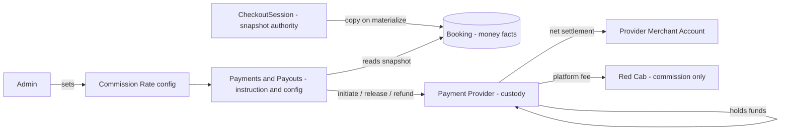
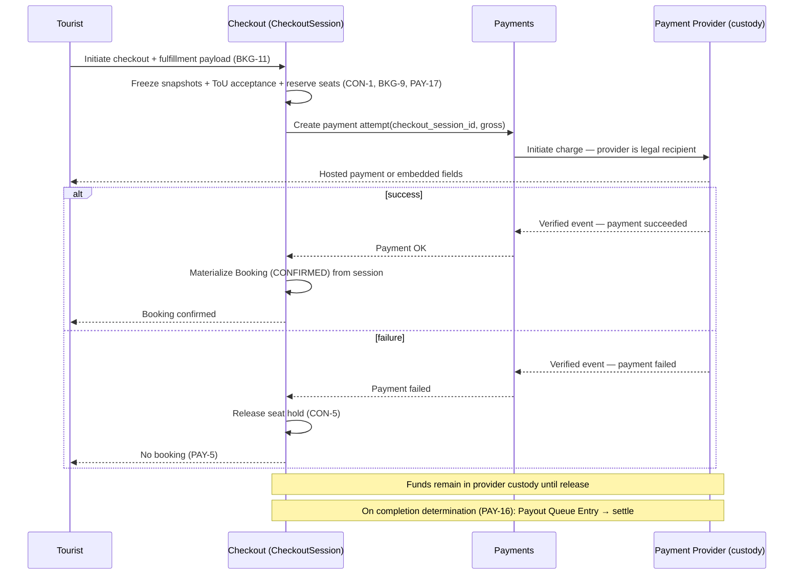
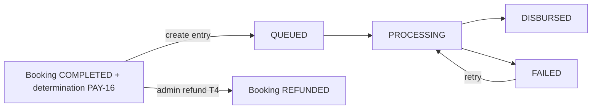

## TL;DR

- **Booking** owns money *facts* (frozen snapshots); **Payments** owns money *movement* and the platform commission rate.
- **Custody and control are separate axes.** Red Cab holds no customer funds (`INV-13`, `PAY-13`); Red Cab alone determines when a transaction completes and settlement releases (`PAY-15`).
- The licensed **payment provider** receives and holds funds; the **Provider is merchant-of-record**; commission arrives as a provider-routed **platform fee**.
- Commission snapshot is frozen at CheckoutSession creation; all charges, settlements, and refunds derive from it.
- Payout queue: `QUEUED → PROCESSING → DISBURSED | FAILED`; settlement and refund are mutually exclusive per booking.
- The provider is engaged only through a **capability-declaring adapter**; the no-custody posture is asserted at startup.

## About this document

How money moves, where financial truth lives, and where custody sits — responsibilities, flows, and invariants (not implementation).

| Topic | Document |
| --- | --- |
| Terminology | [Glossary](/docs/product/business-rules/glossary) |
| Rules | [Business Rules](/docs/product/business-rules/invariants) |
| Custody / control decision | [ADR-015](/docs/architecture/decisions/adr-015-payment-custody-and-control-separation) |
| Financial authority | [ADR-011](/docs/architecture/decisions/adr-011-financial-authority-model) |
| Booking lifecycle | [Booking State Machine](/docs/architecture/patterns/booking-state-machine) |
| Resolved decisions | [Open Questions](/docs/product/planning/open-questions) (Decision Log) |

---

## Regulatory basis

The payment architecture is shaped by a regulatory constraint, not only by engineering preference. Red Cab collecting Tourist funds and remitting them onward to suppliers can trigger **Funds Transfer Business (資金移動業)** registration under Japan's Payment Services Act — one to two years and a ¥10 million minimum reserve deposit. The **transaction-platform exemption** avoids this, but only for a platform that genuinely runs the marketplace rather than acting as a payment pass-through.

That yields a **two-sided test**, and both sides are load-bearing:

| Condition | Rule | What it forbids |
| --- | --- | --- |
| **No custody** | `INV-13`, `PAY-13` | Red Cab being the legal recipient or holder of customer funds, on any rail |
| **Genuine control** | `PAY-15`, `PAY-16`, `PAY-17` | Red Cab ceding control of when a transaction completes and settlement releases |

The two conditions pull in opposite directions if custody and control are conflated. Holding funds is the most direct way to control their release, which is how the previously resolved model (Decision Log `AMB-001`..`AMB-003`, 2026-07-29) arrived at platform custody. Correcting that by releasing funds immediately at capture would satisfy the custody condition while forfeiting the control condition. **The architecture therefore separates the two axes deliberately and holds them apart by rule** — see [ADR-015](/docs/architecture/decisions/adr-015-payment-custody-and-control-separation).

## Scope and ownership boundary

Financial responsibility is split along a **money-facts vs money-movement** seam, with custody sitting outside the platform entirely:

- **Booking & Checkout** owns money *facts*: snapshots are frozen on **CheckoutSession** and copied immutably onto the **Booking** at materialization (`INV-1`, `BKG-9`). Booking is the system of record for "what was owed, to whom, at what split."
- **Payments & Payouts** owns money *movement instruction and configuration*: the platform **Commission Rate** setting (`PAY-2`), payment initiation, settlement release instructions, refunds, Payout Queue Entries, and reconciliation. Payments reads Booking/CheckoutSession snapshots; it does not author them.
- **The payment provider** owns *custody*: it receives, holds, splits, and releases funds as the licensed party. It executes amounts the domain fixed; it never defines them (`ADR-009`, `ADR-011`).

Red Cab appears in the money flow exactly once, and only as the recipient of a platform fee.

## Commission snapshot ownership

- The **Commission Snapshot** = `{ gross_amount, commission_rate_snapshot, commission_amount, net_payout_amount }`, frozen on **CheckoutSession creation** and copied to the Booking at materialization (`PAY-4`, `BKG-9`).
- **Rounding (`PAY-11`):** `commission_amount = FLOOR(gross_amount × commission_rate_snapshot)`; `net_payout_amount = gross_amount − commission_amount`. Guarantees `INV-2` / `FIN-1` identically in whole JPY.
- The platform **Commission Rate** is a Payments-owned setting; changing it affects only future CheckoutSessions — historical Bookings retain their snapshot (`PAY-2`).
- Commission is computed on **gross including mandatory Extra Charges** (`PAY-3`, `FIN-7`).
- All later money movement derives from the snapshot, never the live rate (`PAY-6`, `FIN-6`).
- The **platform fee** the provider routes to Red Cab MUST equal the snapshotted `commission_amount` (`PAY-13`, `FIN-12`). The provider applies the split; it never computes it.

## Custody and settlement model

**Sub-merchant settlement with deferred, platform-triggered release** (`PAY-13`, `PAY-15`; [ADR-015](/docs/architecture/decisions/adr-015-payment-custody-and-control-separation)):

1. Tourist is charged by the **payment provider**, which is the legal recipient of the funds. No Red Cab account or Red Cab provider balance is involved.
2. The provider **holds** the funds as the licensed party until instructed to release.
3. Red Cab records a **completion determination** for the Booking (`PAY-16`). This is the control point on which the transaction-platform exemption rests.
4. A **Payout Queue Entry** is created in `QUEUED` carrying the frozen Net Payout Amount — the evidentiary record of Red Cab's release instruction (`PAY-14`, `LC-6`).
5. On processing, Payments instructs the provider to settle the Provider's net to the **Provider Merchant Account** and route Red Cab's **platform fee** (`QUEUED → PROCESSING → DISBURSED | FAILED`).

**Merchant-of-record posture (`PAY-13`, reverses `AMB-032`):** the **Provider** is merchant-of-record for the underlying service and seller-of-record. Red Cab is merchant-of-record for nothing. B2C displayed prices remain tax-inclusive (`PAY-12`).

**Capture timing is a separate axis** from settlement timing (`AMB-039`). Whether the Tourist's instrument is captured at checkout or nearer to service delivery does not affect custody or control, and delayed capture is not foreclosed.

## Provider-agnostic integration

The payment provider is **not selected** (`AMB-040`). Stripe Connect, Komoju, and PAY.JP differ materially in whose balance holds funds while held and who controls the release trigger — the exact dimension that carries regulatory weight here. The domain therefore does not encode any provider's topology.

Integration is through a **capability-declaring adapter**. Each adapter declares, as machine-readable configuration:

| Declared capability | Values / meaning |
| --- | --- |
| `custody_location` | Where held funds legally sit — must never be the platform |
| `merchant_of_record` | `sub_merchant` (required) or `platform` (forbidden) |
| `settlement_model` | `deferred_release` (required) or `split_at_capture` (disfavored, `ADR-015` C7) |
| `capture_timing` | `at_checkout` or `deferred` |
| `clawback` | Mechanism available for recovering funds from a settled sub-merchant |
| `supported_rails` | Card, wallet, virtual-account bank transfer |
| `max_hold_duration` | Provider cap on how long funds may be held |

Rules that follow:

- **The domain branches on declared capability, never on provider identity.** No conditional keyed to a provider name may appear in domain code (`ADR-015` C6).
- **A startup assertion rejects a non-compliant adapter** — any adapter declaring platform custody or platform merchant-of-record, or unable to support deferred platform-triggered release. The no-custody posture is an executable check, not a documented intention.
- **Inbound provider events are normalized** into a canonical vocabulary before reaching the domain; no provider payload shape crosses the boundary.
- **Persisted external references are provider-neutral** — a provider discriminator plus an opaque reference, never provider-named columns.

## Payment lifecycle (B2C / card)

Guarantees:

- A Booking exists only after successful payment; CheckoutSession holds snapshots and seat hold until then (`BKG-9`, `PAY-5`).
- Charge amount MUST equal the CheckoutSession snapshotted `gross_amount` (`PRC-8`, `AMB-007`).
- If charge succeeds but seat reservation cannot be honored (concurrency), the charge MUST be reversed and no Booking materialized (`CON-2`).
- **Booking materialization is driven by a verified provider event, never by a browser redirect.** A return redirect is a presentation hint only (`FIN-11`, `FIN-13`).

## Provider and platform responsibilities

- **Payment provider (external, licensed):** legal receipt and custody of funds, PCI scope, sub-merchant onboarding and KYC, splitting and releasing funds on instruction, refunds, and event emission (payment, settlement, refund, dispute).
- **Platform (Payments):** payment initiation keyed to the CheckoutSession, the completion determination, release instruction and Payout Queue processing, refund initiation, and event reconciliation (`FIN-11`). Payments instructs; it never holds.
- **Provider Merchant Account:** MUST be active and verified before Listing publish (`LC-12`, `INV-12`). Invalid or restricted accounts cause Payout Queue Entry `FAILED` (`LC-14`, `PAY-14`).

## Settlement flow and payout queue semantics

- Booking state **`PAYOUT_QUEUED`** is set when a Payout Queue Entry is created following the completion determination (`LC-6`, state-machine T3).
- **Payout Queue Entry lifecycle (`LC-13`, `PAY-14`):**

| State | Meaning |
| --- | --- |
| `QUEUED` | Entry created; release instruction recorded, awaiting processing |
| `PROCESSING` | Settlement instructed to the provider |
| `DISBURSED` | Settlement confirmed by provider event |
| `FAILED` | Settlement failed (retryable; Admin alerted) |

- Funds remain in **provider custody** from charge until settlement `DISBURSED`. There is no automatic Provider settlement at charge time (`PAY-15`).
- Refund before `DISBURSED` voids or reverses the queue entry (`PAY-8`, `FIN-5`).
- The queue entry is the **evidentiary artifact** of Red Cab's control over transaction completion. It is not an internal convenience and MUST NOT be bypassed.

## Refund flow

- **Computation** from snapshotted Cancellation Policy: `refund = gross_amount × (matched_tier_refund_pct / 100)` (`PAY-6`).
- **Initiator-driven rule:** tourist-initiated → policy-based; Provider/Admin-initiated → 100% (`PAY-7`). Initiator MUST be recorded (`AMB-014`, interim).
- **Payout interlock:** refund voids/reverses non-`DISBURSED` queue entries (`PAY-8`, `FIN-5`). Because funds are in provider custody until release, a pre-settlement refund requires no recovery from the Provider.
- **Post-settlement liability sits with the Provider** (`FIN-14`). Once settled, honoring a refund depends on a working **clawback** against the sub-merchant — reversal against provider balance, deduction from future settlement, or invoice. This is an unresolved dependency of `PAY-7` (`AMB-038`).
- **Execution** is asynchronous; financial finality only on provider confirmation (`FIN-11`). Refund-failure handling remains open (`AMB-006`).

## Corporate bank transfer (furikomi)

- Corporate Bookings originate from an accepted **Quotation**; payment is by Bank Transfer.
- Transfer funds MUST be collected by the payment provider via a **per-transaction virtual account**, and MUST NOT be received into a Red Cab bank account (`PAY-9`, `INV-13`). Furikomi is a provider-collected payment method, not a Red Cab banking activity.
- Booking becomes `CONFIRMED` on provider-confirmed receipt (`PAY-9`), converging to provider truth like any other rail (`FIN-11`) rather than on a manual Admin entry.
- Provider settlement follows the same deferred-release path as card (`PAY-15`), resolving the former off-rail settlement gap.
- Corporate pre-payment state mapping remains open (`AMB-027`).

## Financial invariants

- **FIN-1** `gross_amount = net_payout_amount + commission_amount` on snapshot values (`INV-2`, `PAY-11`).
- **FIN-2** Snapshot values are immutable for the Booking's lifetime (`INV-1`).
- **FIN-3** Every money movement traces to exactly one Booking (or CheckoutSession pre-materialization) and its snapshot.
- **FIN-4** No settlement may exceed `net_payout_amount`; no refund may exceed `gross_amount`.
- **FIN-5** Settlement and refund are mutually exclusive for the same funds (`PAY-8`).
- **FIN-6** Amounts derive from snapshot, never live rate (`PAY-2`, `PAY-6`).
- **FIN-7** Commission on gross incl. mandatory Extra Charges (`PAY-3`).
- **FIN-8** Whole JPY only (`PAY-1`).
- **FIN-9** Failed payment → no Booking (`PAY-5`).
- **FIN-10** Idempotent, uniquely keyed external operations.
- **FIN-11** Internal state converges to verified provider event truth.
- **FIN-12** Red Cab receives value only as a platform fee equal to the snapshotted `commission_amount`; never as a residual of held funds (`PAY-13`, `INV-13`).
- **FIN-13** No money-moving state transition may be driven by a client-supplied signal, including a return redirect; only verified provider events and internal determinations may drive them.
- **FIN-14** Post-settlement refund and dispute liability sits with the Provider as merchant-of-record; recovery is by clawback (`AMB-038`).

## Async boundaries

- **Synchronous:** CheckoutSession creation (snapshots, ToU acceptance, seat hold), payment initiation, Booking materialization on verified success.
- **Asynchronous:** Payout Queue processing (`QUEUED → DISBURSED`), refund execution, provider event reconciliation.
- **Ordering:** the settlement/refund interlock (`FIN-5`) MUST hold across async gaps despite out-of-order provider events.

## Remaining open items

- **AMB-037** — Cross-border carve-back: whether the transaction-platform exemption survives Tourists paying from overseas under the 2025 amendments. **Highest severity** — a negative answer invalidates the exemption strategy regardless of implementation.
- **AMB-038** — Clawback mechanism for post-settlement refunds and disputes; a dependency of `PAY-7`.
- **AMB-039** — Capture timing (at checkout vs deferred), pending booking-to-service lead-time data.
- **AMB-040** — Custody location and release control per candidate provider; gates provider selection.
- **AMB-006** — Refund-failure representation.
- **AMB-008** — Chargeback/dispute after settlement.
- **AMB-009** — Commission base confirmation (working baseline: gross incl. mandatory charges).
- **AMB-010** — Snapshot scope confirmation (working baseline: price + commission + cancellation policy + fulfillment payload on session).
- **AMB-027** — Corporate pre-payment state mapping.
