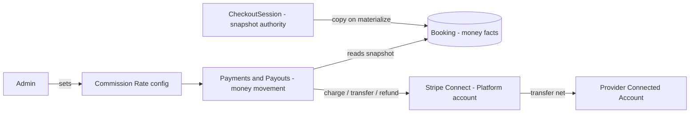
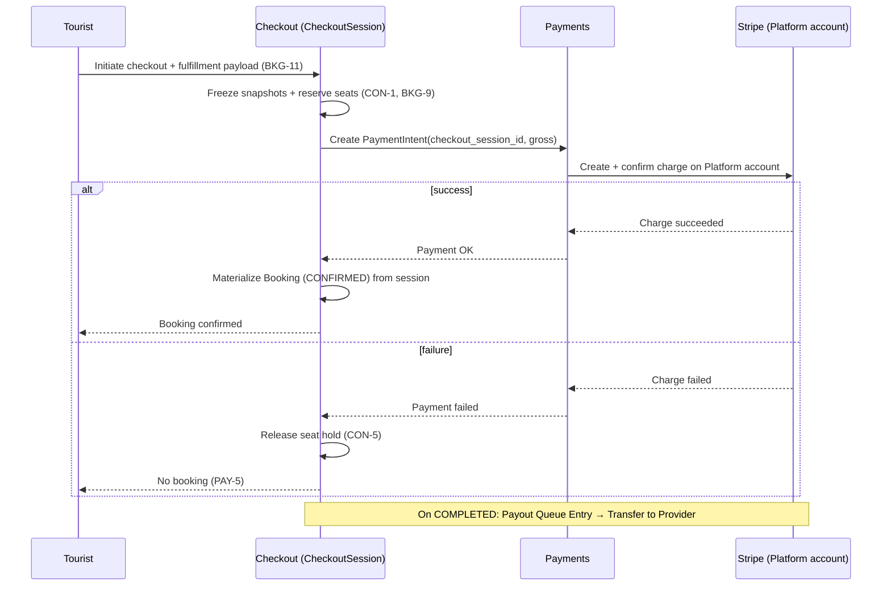
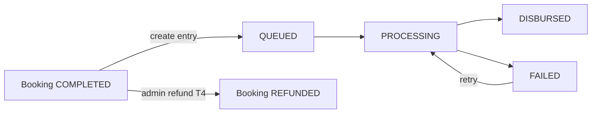

## TL;DR

- **Booking** owns money *facts* (frozen snapshots); **Payments** owns money *movement* and the platform commission rate.
- B2C uses **Separate Charges & Transfers** on the Platform Stripe account; net payout transfers after `COMPLETED`.
- Commission snapshot is frozen at CheckoutSession creation; all charges, payouts, and refunds derive from it.
- Payout queue: `QUEUED → PROCESSING → DISBURSED | FAILED`; payout and refund are mutually exclusive per booking.

## About this document

How money moves and where financial truth lives — responsibilities, flows, and invariants (not implementation).

| Topic | Document |
| --- | --- |
| Terminology | [Glossary](/docs/business-rules/glossary) |
| Rules | [Business Rules](/docs/business-rules/invariants) |
| Booking lifecycle | [Booking State Machine](/docs/architecture/booking-state-machine) |
| Resolved decisions | [Open Questions](/docs/ambiguities/open-questions) (Decision Log) |

---

## TL;DR

- **Booking** owns money *facts* (frozen snapshots); **Payments** owns money *movement* and the platform commission rate.
- B2C uses **Separate Charges & Transfers** on the Platform Stripe account; net payout transfers after `COMPLETED`.
- Commission snapshot is frozen at CheckoutSession creation; all charges, payouts, and refunds derive from it.
- Payout queue: `QUEUED → PROCESSING → DISBURSED | FAILED`; payout and refund are mutually exclusive per booking.

## About this document

How money moves and where financial truth lives — responsibilities, flows, and invariants (not implementation).

| Topic | Document |
| --- | --- |
| Terminology | [Glossary](/docs/business-rules/glossary) |
| Rules | [Business Rules](/docs/business-rules/invariants) |
| Booking lifecycle | [Booking State Machine](/docs/architecture/booking-state-machine) |
| Resolved decisions | [Open Questions](/docs/ambiguities/open-questions) (Decision Log) |

---

## TL;DR

- **Booking** owns money *facts* (frozen snapshots); **Payments** owns money *movement* and the platform commission rate.
- B2C uses **Separate Charges & Transfers** on the Platform Stripe account; net payout transfers after `COMPLETED`.
- Commission snapshot is frozen at CheckoutSession creation; all charges, payouts, and refunds derive from it.
- Payout queue: `QUEUED → PROCESSING → DISBURSED | FAILED`; payout and refund are mutually exclusive per booking.

## About this document

How money moves and where financial truth lives — responsibilities, flows, and invariants (not implementation).

| Topic | Document |
| --- | --- |
| Terminology | [Glossary](/docs/business-rules/glossary) |
| Rules | [Business Rules](/docs/business-rules/invariants) |
| Booking lifecycle | [Booking State Machine](/docs/architecture/booking-state-machine) |
| Resolved decisions | [Open Questions](/docs/ambiguities/open-questions) (Decision Log) |

---

## TL;DR

- **Booking** owns money *facts* (frozen snapshots); **Payments** owns money *movement* and the platform commission rate.
- B2C uses **Separate Charges & Transfers** on the Platform Stripe account; net payout transfers after `COMPLETED`.
- Commission snapshot is frozen at CheckoutSession creation; all charges, payouts, and refunds derive from it.
- Payout queue: `QUEUED → PROCESSING → DISBURSED | FAILED`; payout and refund are mutually exclusive per booking.

## About this document

How money moves and where financial truth lives — responsibilities, flows, and invariants (not implementation).

| Topic | Document |
| --- | --- |
| Terminology | [Glossary](/docs/business-rules/glossary) |
| Rules | [Business Rules](/docs/business-rules/invariants) |
| Booking lifecycle | [Booking State Machine](/docs/architecture/booking-state-machine) |
| Resolved decisions | [Open Questions](/docs/ambiguities/open-questions) (Decision Log) |

---

## TL;DR

- **Booking** owns money *facts* (frozen snapshots); **Payments** owns money *movement* and the platform commission rate.
- B2C uses **Separate Charges & Transfers** on the Platform Stripe account; net payout transfers after `COMPLETED`.
- Commission snapshot is frozen at CheckoutSession creation; all charges, payouts, and refunds derive from it.
- Payout queue: `QUEUED → PROCESSING → DISBURSED | FAILED`; payout and refund are mutually exclusive per booking.

## About this document

How money moves and where financial truth lives — responsibilities, flows, and invariants (not implementation).

| Topic | Document |
| --- | --- |
| Terminology | [Glossary](/docs/business-rules/glossary) |
| Rules | [Business Rules](/docs/business-rules/invariants) |
| Booking lifecycle | [Booking State Machine](/docs/architecture/booking-state-machine) |
| Resolved decisions | [Open Questions](/docs/ambiguities/open-questions) (Decision Log) |

---

## TL;DR

- **Booking** owns money *facts* (frozen snapshots); **Payments** owns money *movement* and the platform commission rate.
- B2C uses **Separate Charges & Transfers** on the Platform Stripe account; net payout transfers after `COMPLETED`.
- Commission snapshot is frozen at CheckoutSession creation; all charges, payouts, and refunds derive from it.
- Payout queue: `QUEUED → PROCESSING → DISBURSED | FAILED`; payout and refund are mutually exclusive per booking.

## About this document

How money moves and where financial truth lives — responsibilities, flows, and invariants (not implementation).

| Topic | Document |
| --- | --- |
| Terminology | [Glossary](/docs/business-rules/glossary) |
| Rules | [Business Rules](/docs/business-rules/invariants) |
| Booking lifecycle | [Booking State Machine](/docs/architecture/booking-state-machine) |
| Resolved decisions | [Open Questions](/docs/ambiguities/open-questions) (Decision Log) |

---

## TL;DR

- **Booking** owns money *facts* (frozen snapshots); **Payments** owns money *movement* and the platform commission rate.
- B2C uses **Separate Charges & Transfers** on the Platform Stripe account; net payout transfers after `COMPLETED`.
- Commission snapshot is frozen at CheckoutSession creation; all charges, payouts, and refunds derive from it.
- Payout queue: `QUEUED → PROCESSING → DISBURSED | FAILED`; payout and refund are mutually exclusive per booking.

## About this document

How money moves and where financial truth lives — responsibilities, flows, and invariants (not implementation).

| Topic | Document |
| --- | --- |
| Terminology | [Glossary](/docs/business-rules/glossary) |
| Rules | [Business Rules](/docs/business-rules/invariants) |
| Booking lifecycle | [Booking State Machine](/docs/architecture/booking-state-machine) |
| Resolved decisions | [Open Questions](/docs/ambiguities/open-questions) (Decision Log) |

---

## Scope and ownership boundary
The financial responsibility is split along a **money-facts vs money-movement** seam:

- **Booking & Checkout** owns money *facts*: snapshots are frozen on **CheckoutSession** and copied immutably onto the **Booking** at materialization (`INV-1`, `BKG-9`). Booking is the system of record for "what was owed, to whom, at what split."
- **Payments & Payouts** owns money *movement and configuration*: the platform **Commission Rate** setting (`PAY-2`), Stripe charges, transfers, refunds, Payout Queue Entries, and reconciliation. Payments reads Booking/CheckoutSession snapshots; it does not author them.

## Commission snapshot ownership
- The **Commission Snapshot** = `{ gross_amount, commission_rate_snapshot, commission_amount, net_payout_amount }`, frozen on **CheckoutSession creation** and copied to the Booking at materialization (`PAY-4`, `BKG-9`).
- **Rounding (`PAY-11`):** `commission_amount = FLOOR(gross_amount × commission_rate_snapshot)`; `net_payout_amount = gross_amount − commission_amount`. Guarantees `INV-2` / `FIN-1` identically in whole JPY.
- The platform **Commission Rate** is a Payments-owned setting; changing it affects only future CheckoutSessions — historical Bookings retain their snapshot (`PAY-2`).
- Commission is computed on **gross including mandatory Extra Charges** (`PAY-3`, `FIN-7`).
- All later money movement derives from the snapshot, never the live rate (`PAY-6`, `FIN-6`).

## B2C payment model (resolved)
**Separate Charges & Transfers** on the **Platform Stripe account** (`PAY-13`; Decision Log `AMB-002`, `AMB-003`):

1. Tourist is **captured** on the Platform account at checkout (not on the Provider account).
2. Platform retains funds until the Booking reaches `COMPLETED`.
3. On `COMPLETED`, a **Payout Queue Entry** is created in `QUEUED` state with the frozen Net Payout Amount.
4. Payments initiates a **Stripe Transfer** to the Provider's Connected Account when processing the entry (`QUEUED → PROCESSING → DISBURSED | FAILED`).
5. Platform commission remains on the Platform account (already separated arithmetically via `PAY-11`; no `application_fee` on destination charges).

**Merchant-of-record posture (`AMB-032`):** Red Cab Platform is merchant-of-record for the card charge; Provider is seller-of-record for the underlying service. B2C displayed prices are tax-inclusive (`PAY-12`).

## Payment lifecycle (B2C / card)

Guarantees:
- A Booking exists only after successful payment; CheckoutSession holds snapshots and seat hold until then (`BKG-9`, `PAY-5`).
- Charge amount MUST equal the CheckoutSession snapshotted `gross_amount` (`PRC-8`, `AMB-007`).
- If charge succeeds but seat reservation cannot be honored (concurrency), charge MUST be reversed and no Booking materialized (`CON-2`).

## Stripe Connect responsibilities
- **Stripe Connect (external):** PCI scope, Platform-account card capture, Connected Account onboarding/KYC, Transfers to connected accounts, Refunds, webhooks (charge, transfer, refund, dispute).
- **Platform (Payments):** PaymentIntent creation keyed to CheckoutSession, charge on Platform account, Payout Queue processing, Transfer initiation, webhook reconciliation (`FIN-11`).
- **Provider Connected Account:** MUST be active and verified before Listing publish (`LC-12`, `INV-12`). Invalid/restricted accounts cause Payout Queue Entry `FAILED` (`LC-14`, `PAY-14`).

## Payout flow and payout queue semantics
- Booking state **`PAYOUT_QUEUED`** is set when a Payout Queue Entry is created on `COMPLETED` (`LC-6`, state-machine T3).
- **Payout Queue Entry lifecycle (`LC-13`, `PAY-14`):**

| State | Meaning |
| --- | --- |
| `QUEUED` | Entry created; awaiting processing |
| `PROCESSING` | Stripe Transfer initiated |
| `DISBURSED` | Transfer confirmed by webhook |
| `FAILED` | Transfer failed (retryable; Admin alerted) |

- Funds remain on the Platform account from checkout capture until Transfer `DISBURSED` — no automatic Provider transfer at charge time (`PAY-13`).
- Refund before `DISBURSED` voids or reverses the queue entry (`PAY-8`, `FIN-5`).

## Refund flow
- **Computation** from snapshotted Cancellation Policy: `refund = gross_amount × (matched_tier_refund_pct / 100)` (`PAY-6`).
- **Initiator-driven rule:** tourist-initiated → policy-based; Provider/Admin-initiated → 100% (`PAY-7`). Initiator MUST be recorded (`AMB-014`, interim).
- **Payout interlock:** refund voids/reverses non-`DISBURSED` queue entries (`PAY-8`, `FIN-5`).
- **Execution** is asynchronous; financial finality only on rail confirmation (`FIN-11`). Refund-failure handling remains open (`AMB-006`).

## Manual bank transfer reconciliation (Corporate / furikomi)
- Corporate Bookings originate from accepted **Quotation**; payment is by Bank Transfer outside Stripe.
- Booking becomes `CONFIRMED` when Admin records receipt (`PAY-9`).
- corporate pre-payment state mapping remains open (`AMB-027`); off-Stripe provider settlement (`AMB-029`).

## Financial invariants
- **FIN-1** `gross_amount = net_payout_amount + commission_amount` on snapshot values (`INV-2`, `PAY-11`).
- **FIN-2** Snapshot values are immutable for the Booking's lifetime (`INV-1`).
- **FIN-3** Every money movement traces to exactly one Booking (or CheckoutSession pre-materialization) and its snapshot.
- **FIN-4** No payout may exceed `net_payout_amount`; no refund may exceed `gross_amount`.
- **FIN-5** Payout and refund are mutually exclusive for the same captured funds (`PAY-8`).
- **FIN-6** Amounts derive from snapshot, never live rate (`PAY-2`, `PAY-6`).
- **FIN-7** Commission on gross incl. mandatory Extra Charges (`PAY-3`).
- **FIN-8** Whole JPY only (`PAY-1`).
- **FIN-9** Failed payment → no Booking (`PAY-5`).
- **FIN-10** Idempotent, uniquely keyed external operations.
- **FIN-11** Internal state converges to webhook truth.

## Async boundaries
- **Synchronous:** CheckoutSession creation (snapshots + seat hold), PaymentIntent confirmation, Booking materialization.
- **Asynchronous:** Payout Queue processing (`QUEUED → DISBURSED`), refund execution, webhook reconciliation.
- **Ordering:** payout/refund interlock (`FIN-5`) MUST hold across async gaps despite out-of-order webhooks.

## Remaining open items
- **AMB-006** — Refund-failure representation.
- **AMB-008** — Chargeback/dispute after payout.
- **AMB-009** — Commission base confirmation (working baseline: gross incl. mandatory charges).
- **AMB-010** — Snapshot scope confirmation (working baseline: price + commission + cancellation policy + fulfillment payload on session).
- **AMB-027..029** — Corporate payment paths.
