## TL;DR

- Strategic DDD document: **aggregates, ownership, invariants, lifecycle meaning**, and cross-context relationships.
- Six core + two supporting contexts; one owner per concept; cross-context links by id or snapshot only.
- No schemas, code, APIs, or infrastructure — semantics only.

## About this document

Domain model derived from approved DDD design.

| Topic | Document |
| --- | --- |
| Terminology | [Glossary](/docs/business-rules/glossary) |
| Rules | [Business Rules](/docs/business-rules/invariants) |
| Context map | [Bounded Contexts](/docs/architecture/bounded-contexts) |
| Data model | [Conceptual Data Model](/docs/architecture/data-model) |
| Requirements | [Requirements](/docs/requirements) |
| Open decisions | [Open Questions](/docs/ambiguities/open-questions) |

---

## 1. Purpose and Modeling Principles

## Strategic intent
The model exists to protect a small number of high-value invariants — frozen revenue splits, never-overbooked inventory, verified-only reviews, and a strict booking lifecycle — while letting each bounded context evolve on its own axis. We model the domain, not the database: aggregates are **consistency boundaries**, not storage units.

## Aggregate consistency boundaries
- An **aggregate** is the unit of transactional consistency. Everything inside an aggregate is kept consistent within a single atomic change; everything outside is reconciled asynchronously and is only *eventually* consistent.
- An aggregate is addressed through its **aggregate root**; external contexts never reach inside an aggregate to read or change its internals.
- Aggregates are kept **small**: an aggregate contains only what must change together to uphold an invariant. If two things can be consistent "a moment later," they belong to different aggregates (and usually different contexts).

## Reference-by-id across contexts
- Contexts refer to each other's aggregates **by identity only** (e.g. a Booking references a `listing_id`, a `slot_id`, a `tourist_id`). They never embed or co-own another context's aggregate.
- When a downstream context needs upstream data to make a decision, it either (a) queries the owner synchronously through its published contract, or (b) holds a **snapshot** of the facts it needs (see below). It never mutates the upstream aggregate.

## Snapshot philosophy
- A **snapshot** is an immutable copy of an upstream fact, captured at a defined moment and thereafter owned by the capturing aggregate. Snapshots exist so a record's meaning cannot be retroactively altered by later upstream changes.
- The canonical snapshots are the **Price Snapshot** and **Commission Snapshot** captured by Booking at checkout, and the **Cancellation Policy Snapshot** captured alongside them (`INV-1`, `PAY-2`, `C1`). Once captured, they are facts of the Booking, not of Catalog or Payments.

## Immutable vs mutable domain facts
- **Immutable facts** (write-once): snapshots, completed financial movements, terminal lifecycle outcomes, a submitted review's original content. These are never edited; corrections are *new* facts (e.g. a refund is a new movement, not an edit of a charge).
- **Mutable state**: an aggregate's current lifecycle position (e.g. Booking state, Provider Status, Listing Status) changes only through explicit, guarded transitions defined by its state model.

---

## 2. Shared Modeling Rules
These apply across every context and are not repeated per-context.

- **Money** is modeled as a whole-JPY **Money** value object; no fractional yen exists in any amount (`PAY-1`, glossary). Money is always paired with its semantic role (gross, commission, net) — never a bare number.
- **Snapshot immutability**: any value labeled a snapshot is write-once and owned by the aggregate that captured it (`INV-1`). Upstream changes after capture have no effect on it (`BKG-8`).
- **Time ownership**: each lifecycle fact records the instant it occurred (e.g. `completed_at`); the context that owns the transition owns its timestamp. Wall-clock-driven transitions (auto-confirmation, expiry) are owned by the aggregate whose invariant they serve. The auto-confirmation duration itself is unresolved (`AMB-011`).
- **Domain events as integration boundaries**: contexts integrate through past-tense domain events and explicit commands/queries, never through shared mutable state. An event carries identities and immutable facts, not references to another context's live aggregate.
- **Idempotency**: every event consumer and every externally-triggered command must be idempotent; redelivery or retry must not double-apply (seat restoration `AMB-012`, payout queuing, rating recalculation, notifications) (`FIN-10`).
- **State-machine authority**: a lifecycle transition is valid only if its owning state model permits it; no external context may force a transition it does not own (`LC-1..6`).
- **Cross-context reference rule**: reference foreign aggregates by id; depend on their published contract or a snapshot; never read their internals or mutate them.

---

## 3. Per Bounded Context Models
Contexts follow the locked 6 core + 2 supporting baseline. Source-of-truth concepts are stated so there is exactly one owner per concept.

## 3.1 Identity & Access (supporting)

### Context overview
- **Responsibility:** authentication, accounts, coarse roles, language preference. Generic capability; dependency root.
- **Source of truth for:** Account identity, credentials/OAuth identities, Role assignment, Language Preference.
- **Dependencies:** upstream of all; depends on nothing.

### Aggregates
- **Account** (root: `Account`)
  - *Purpose:* the authenticatable marketplace identity behind Tourist, Corporate, and Provider Actors.
  - *Invariants:* unique identifying email; lockout after 5 consecutive failures for 15 minutes (`OPR-1`, subject to `AMB-016`); credentials never stored in plaintext (semantic requirement, not mechanism).
  - *Lifecycle:* registered → active → (locked ↔ active). No terminal deletion modeled here.
  - *Transactionally consistent:* credentials, role assignment, lockout counter, language preference.
- **Admin** (root: `Admin` — separate principal, not an Account aggregate)
  - *Purpose:* Platform Admin authentication for `/team`; distinct from marketplace `Account.role`.
  - *Invariants:* Admin MUST NOT appear as a value on `Account.role`; Admin sessions are isolated from marketplace sessions.

### Entities
- OAuth identity (an external credential linked to the Account). Identity-bearing within the Account boundary.

### Value objects
- **EmailAddress**, **Role** (`Tourist | Corporate | Provider` — Admin excluded), **LanguagePreference** (`EN | JA`), **LockoutWindow** (count + until-instant).

### Domain events
- `AccountRegistered`, `AccountLocked`, `LanguagePreferenceChanged`.

### Cross-context references
- Referenced **by id** (the principal) by every other context. Role and language are read via contract or snapshotted at the moment they matter (e.g. notification language). Account internals are never mutated externally.
- Open: auth methods and guest scope (`AMB-021`, `AMB-022`).

## 3.2 Provider Onboarding & Verification (core)

### Context overview
- **Responsibility:** registration-by-type, document verification, approval, license validity, support trial.
- **Source of truth for:** Provider Status, Provider Type, license validity window, support-trial window.
- **Dependencies:** upstream Identity (the Account behind a Provider); downstream Catalog (status gate), Notifications.

### Aggregates
- **ProviderApplication** (root: `Provider`)
  - *Purpose:* the operator's identity, type, verification state, and right to operate.
  - *Invariants:* Provider Type is immutable post-registration except by Admin action (`INV-9`); approval requires every Verification Checklist item satisfied (`LC-9`); a non-`Approved` Provider has zero tourist-visible listings (`INV-6`, upheld jointly with Catalog).
  - *Lifecycle:* `Pending → Approved | Rejected`; `Approved → Suspended ↔ Approved` (`LC-7`). Status is the mutable fact other contexts observe.
  - *Transactionally consistent:* status transition + checklist outcome + (on approval) support-trial start.
- **LicenseRecord** (root: `LicenseRecord`)
  - *Purpose:* track a license number and expiry that gates the right to be Published.
  - *Invariants:* an expired license implies no `Published` listing for that Provider (`INV-7`, upheld via event to Catalog); expiry dates are Admin-entered (OCR is v2, `G1`).
  - *Lifecycle:* valid → expiring-soon (≤30d) → expired → renewed (`OPR-3`).
- **SupportTrial** (root: `SupportTrial`)
  - *Purpose:* the 3-month free-support window.
  - *Invariants:* starts at Admin approval date (`OPR-2`, `A1`).
  - *Lifecycle:* active → expiring → expired.

### Entities
- Uploaded **Document** (license/registration/insurance/ID), identity-bearing within the application.

### Value objects
- **ProviderType**, **VerificationChecklist** (item → satisfied), **LicenseValidity** (number + valid-until **DateRange** semantics), **TrialWindow**.

### Domain events
- `ProviderApproved`, `ProviderRejected`, `ProviderSuspended`, `LicenseExpiringSoon`, `LicenseExpired`, `LicenseRenewed`, `SupportTrialExpiring`, `SupportTrialExpired`.

### Cross-context references
- Exposes a minimal **Provider Status read contract** `{ provider_id, status, license_valid_until }`. Catalog conforms to this (conformist read) and never replicates verification logic.
- Suspension/expiry affect **future** listing visibility only; they never mutate historical Bookings (`INV-11`; see §4). Mid-flight effect on confirmed bookings is unresolved (`AMB-026`).

## 3.3 Catalog & Inventory (core)

### Context overview
- **Responsibility:** geography taxonomy, listings, pricing configuration + the sole price-calculation authority, and availability/seat inventory. Internal modules: Geography, Listings, Pricing, Availability, Search.
- **Source of truth for:** District/Area, Listing content & status, PricingPolicy configuration, **ProviderAsset** registry, AvailabilitySlot and its seat counter, Rating Score *display* (the score itself is owned by Reviews).
- **Dependencies:** upstream Onboarding (status), Identity; downstream Booking and Corporate (pricing + availability), Notifications.

### Aggregates
- **ProviderAsset** (root: `ProviderAsset` / `provider_assets`)
  - *Purpose:* a Provider-owned physical resource (vehicle or guide) that Slots consume; enforces per-asset overlap (`CON-4`).
  - *Invariants:* belongs to exactly one Provider; carries `capacity` and `vehicle_category` (PRD taxonomy per Decision Log `AMB-023`); Slots on the same Asset MUST NOT overlap in time.
  - *Lifecycle:* active → retired (soft); historical Slots/Bookings preserved.
- **Listing** (root: `Listing`)
  - *Purpose:* a bookable service with type-specific attributes, photos, location, and a reference to its pricing policy.
  - *Invariants:* cannot be `Published` with zero photos (`INV-10`); cannot be `Published` without Provider Stripe Connected Account verified (`INV-12`, `LC-12`); a District/Area with zero published listings is not shown (`INV-8`); listing edits must not retroactively affect confirmed Bookings (`BKG-8`, enforced because Booking holds snapshots).
  - *Lifecycle:* `Draft → Published → Paused/Unpublished → Unlisted`; only `Published` is tourist-visible (`LC-10`). Paused/Unlisted preserve history (`INV-11`).
- **PricingPolicy** (root: `PricingPolicy`)
  - *Purpose:* hold the pricing configuration (mode, group tiers, duration, seasonal overrides, extra charges) and the Cancellation Policy, and to be the basis for the single calculation authority.
  - *Invariants:* group tiers non-overlapping (`PRC-4`); pricing mode exclusivity (`PRC-3`); a Cancellation Policy always resolvable (explicit or Platform Default, `PRC-7`); price is computed **only** here (`PRC-1`).
  - *Lifecycle:* editable while not constraining confirmed Bookings; changes apply to future bookings only.
- **AvailabilitySlot** (root: `AvailabilitySlot`)
  - *Purpose:* a bookable window on a specific Asset and the **owner of `available_seats`**.
  - *Invariants:* `0 ≤ available_seats ≤ capacity` (`INV-3`); no two slots overlap on the same Asset, boundary-touching allowed (`CON-4`); a 0-seat slot is Fully Booked and unbookable (`CON-3`).
  - *Lifecycle:* open → (partially reserved) → fully booked → past.
  - *Transactionally consistent:* the seat counter and its decrement/restoration (decrement on CheckoutSession creation; per-vehicle bookings set `available_seats = 0` per `CON-6` — see §5 and CR-1).

### Entities
- **District**, **Area** (Geography — identity-bearing reference data seeded from Japanese administrative codes), **Photo**, **PricingTier**, **SeasonalOverride**, **ExtraCharge**, **CancellationPolicyTier**.
  - *District kinds:* `prefecture | designated_city` (`AMB-036`). Designated cities (Yokohama, Osaka, …) are Districts; their wards are Areas.
  - *Attributes:* `slug`, `name_en` (bare romanized), `name_ja` (official with suffix), `name_kana` (Areas), `prefecture_code`, `municipality_code` (Areas; District when `designated_city`), `latitude`/`longitude` (city-hall centroid), `display_order`, `status`.
  - *Label rule:* `name_en` bare ("Shinjuku"); `name_ja` with suffix ("新宿区"); ambiguity resolved by parent District at render.
  - *Not stored:* boundary polygons, PostGIS geometry, GeoJSON.

### Value objects
- **GeoArea** (district/area labels EN/JA/kana + slug), **Capacity**, **DateRange**, **TimeWindow**, **Money** (configured prices), **PriceBreakdown** (the computed result of `calculate_quote`), **AvailabilitySnapshot** (point-in-time view for consumers).

### Domain events
- `ListingPublished`, `ListingPaused`, `ListingUnlisted`, `SlotCapacityChanged`. Consumes `LicenseExpired/Renewed` (pause/restore), district-deactivation cascade (`OPR-10`), `RatingRecalculated` (display).

### Cross-context references
- Publishes **PriceBreakdown** and **AvailabilitySnapshot** as value contracts; consumers must never recompute price (`PRC-1`, CR-2).
- The seat counter is **owned here** and only ever changed through Catalog's guarded reserve/restore operations, even though the reserve runs inside Booking's checkout transaction.

## 3.4 Booking & Checkout (core)

### Context overview
- **Responsibility:** turn a selected Slot into a Booking via CheckoutSession and govern its lifecycle; **own money facts** (the frozen snapshots copied from session). Internal modules: Checkout (CheckoutSession), Order Lifecycle.
- **Source of truth for:** CheckoutSession (pre-booking), Booking existence and state, Price/Commission/Cancellation snapshots, Fulfillment Payload, Passenger Manifest, the Bundle link.
- **Dependencies:** upstream Identity (buyer), Catalog (pricing + availability + guarded reserve), Payments (charge result), COR (create-from-quote); downstream Payments (reads snapshots), Reviews (completion), Notifications.

### Aggregates
- **CheckoutSession** (root: `CheckoutSession`)
  - *Purpose:* pre-booking checkout unit holding frozen snapshots, Fulfillment Payload, seat hold, and PaymentIntent reference until payment succeeds or session expires.
  - *Invariants:* snapshots frozen at session creation (`PRC-8`, `PAY-4`, `PAY-11`); seat hold atomic with session creation (`CON-1`, `BKG-9`); per-vehicle listings consume full slot capacity (`CON-6`); payment amount MUST equal snapshotted gross.
  - *Lifecycle:* initiated → awaiting_payment → materialized | expired | abandoned.
  - *Transactionally consistent:* snapshot freeze + seat decrement + session record (`BKG-9`).
- **Booking** (root: `Booking`) — the central order aggregate.
  - *Purpose:* represent a single buyer's paid reservation of a Slot, carrying immutable financial facts, Fulfillment Payload, and lifecycle state.
  - *Invariants:* references exactly one Slot and seats ≥ 1 not exceeding availability at reservation (`INV-4`); `gross = net + commission` on snapshot values (`INV-2`, `PAY-11`); snapshots and Fulfillment Payload immutable for life (`INV-1`); only permitted transitions (`LC-1..6`); historical data preserved (`INV-11`, `BKG-8`).
  - *Lifecycle (authoritative — booking-state-machine.md):* B2C card path enters `CONFIRMED` on materialization (`BKG-10`); then `CONFIRMED → COMPLETED → PAYOUT_QUEUED`; cancellations to `CANCELLED`; `COMPLETED → REFUNDED`; `PENDING` reserved for Corporate. Completion via Provider "Mark Delivered" or 24h after service end (`OPR-12`). Residual paths: `AMB-013`, `AMB-014`.
  - *Transactionally consistent:* Booking materialization from CheckoutSession copies snapshots + payload atomically (`BKG-2`, `BKG-9`).
- **BundleBooking** (root: `BundleBooking`)
  - *Purpose:* link two independent Bookings (car + guide) as one purchase.
  - *Invariants:* two separate Booking records share one `bundle_booking_id`; commission computed per sub-booking independently (`BKG-3`, `E1`). Cross-leg cancellation semantics unresolved (`AMB-017`).
- **PassengerManifest** (root within Booking boundary or its own aggregate referencing `booking_id`)
  - *Purpose:* group passenger roster for a confirmed group Booking.
  - *Invariants:* permitted only on a confirmed group Booking; visible to the assigned Provider (`BKG-6`).

### Entities
- Manifest **Passenger** (name + age group), identity-bearing within the manifest.

### Value objects
- **Money** (gross/net/commission roles), **CommissionSnapshot** `{ gross_amount, commission_rate_snapshot, commission_amount, net_payout_amount }` (`PAY-4`, `PAY-11`), **PriceSnapshot** (the captured PriceBreakdown), **CancellationPolicySnapshot** (captured policy tiers), **FulfillmentPayload** (pickup/dropoff/flight/passenger contact/luggage/notes — `BKG-11`), **SeatAllocation** (slot reference + seat count), **BookingState**, **CancellationContext** (initiator + reason — `AMB-014`).

### Domain events
- `BookingCreated`, `BookingConfirmed`, `BookingCancelled`, `BookingCompleted`, `BookingRefunded`. Consumes payment settlement facts where modeled async.

### Cross-context references
- References `tourist_id`, `listing_id`, `slot_id`, `provider_id` **by id**. Captures **snapshots** of price, commission, and cancellation policy at checkout; these become Booking-owned facts that Payments and refunds read but never mutate (`INV-1`).
- Emits a minimal **completion fact** `{ booking_id, tourist_id, listing_id, completed_at }` that Reviews consumes for eligibility.

## 3.5 Payments & Payouts (core)

### Context overview
- **Responsibility:** **money movement** and the Commission Rate setting — charges, captures, payouts, refunds, reconciliation. Converges to external-rail truth.
- **Source of truth for:** the platform Commission Rate setting, Provider Connected Account state, payment/charge movements, payout-queue entries and disbursement outcomes, refund movements, bank-transfer reconciliation facts.
- **Dependencies:** upstream Booking (snapshots), COR (reconciliation), external rails; downstream Notifications, Admin oversight.

### Aggregates
- **Payment** (root: `Payment` / charge record)
  - *Purpose:* represent the buyer-side capture on the Platform Stripe account, keyed to CheckoutSession then Booking.
  - *Invariants:* failed payment yields no Booking (`PAY-5`, `FIN-9`); amount equals CheckoutSession snapshotted gross; every movement traceable (`FIN-3`); idempotent (`FIN-10`). Separate Charges & Transfers on Platform account (`PAY-13`).
  - *Lifecycle:* initiated → captured → (refunded).
- **ProviderConnectedAccount** (root: `ProviderConnectedAccount`)
  - *Purpose:* the Provider's Stripe Connect destination for receiving net payouts; gates listing publish and transfer initiation.
  - *Invariants:* one account per Provider; publish requires `status = verified` with `payouts_enabled` and `transfers_capability = active` (`INV-12`, `LC-12`); restricted accounts cause payout failure (`LC-14`, `PAY-14`). State converges to Stripe webhooks (`FIN-11`).
  - *Lifecycle:* `onboarding → verified | restricted | disabled`.
- **PayoutQueueEntry** (root: `PayoutQueueEntry`)
  - *Purpose:* record the Net Payout owed to a Provider after Booking `COMPLETED`; drives Stripe Transfer to Connected Account.
  - *Invariants:* carries frozen Net Payout Amount (`LC-6`); payout never exceeds net (`FIN-4`); payout/refund mutually exclusive (`FIN-5`, `PAY-8`).
  - *Lifecycle:* `QUEUED → PROCESSING → DISBURSED | FAILED` (`LC-13`, `LC-14`, `PAY-14`).
- **Refund** (root: `Refund`)
  - *Purpose:* a return of funds computed from snapshot + snapshotted policy.
  - *Invariants:* `refund = gross × matched_tier_pct/100` from the snapshot, never live rate (`PAY-6`, `FIN-6`); Provider/Admin-initiated → 100% (`PAY-7`); never exceeds gross (`FIN-4`). Refund-failure representation `AMB-006`.
- **CommissionRateSetting** (root: `CommissionRateSetting`)
  - *Purpose:* the platform-wide rate.
  - *Invariants:* changes apply only to future Bookings; historical Bookings keep their snapshot (`PAY-2`). The rate is *read* at checkout by Booking to populate its snapshot; thereafter Payments does not own that Booking's rate fact.
- **ReconciliationRecord** (root: `ReconciliationRecord`) — bank-transfer receipt facts (manual, `PAY-9`).

### Entities
- Webhook-derived settlement fact records (identity-bearing movement confirmations).

### Value objects
- **Money**, **CommissionRate** (percentage), **PayoutAmount**, **RefundAmount**, **PaymentOutcome**.

### Domain events
- `PaymentSucceeded`, `PaymentFailed`, `RefundCompleted`, `PayoutQueued`, `PayoutDisbursed`, `PayoutFailed`, `BankTransferConfirmed`.

### Cross-context references
- Reads the Booking **CommissionSnapshot** read-only; **never authors or mutates** it (§4). References `booking_id`, `provider_id` by id. External-rail truth (webhooks) is authoritative for settlement outcomes (`FIN-11`).
- Disputes/chargebacks after payout are not yet modeled (`AMB-008`); Corporate off-Stripe settlement `AMB-029`.

## 3.6 Corporate Quotation & Invoicing (core)

### Context overview
- **Responsibility:** corporate intake, formal documents (Omitsumorisho/Seikyusho), conversion of accepted Quotation into a Booking, bank-transfer instruction.
- **Source of truth for:** Quotation Request, Quotation (line items, tax, validity, status), Invoice.
- **Dependencies:** upstream Identity (Corporate Client), Catalog (`calculate_quote` for line items); downstream Booking (create-from-quote), Payments (reconciliation), Notifications.

### Aggregates
- **QuotationRequest** (root: `QuotationRequest`)
  - *Purpose:* a Corporate Client's custom-price request.
  - *Lifecycle:* pending → (answered) → overdue alert if unanswered > 3 business days (`OPR-5`).
- **Quotation** (root: `Quotation`)
  - *Purpose:* the Admin-issued formal quote and its acceptance.
  - *Invariants:* itemizes line items + 10% consumption tax (`PAY-10`, `AMB-033`); converts to a Booking only from `Accepted` (`LC-11`).
  - *Lifecycle:* `Pending → Sent → Accepted | Rejected | Expired`.
- **Invoice** (root: `Invoice`) — formal Seikyusho issued on acceptance.

### Entities
- **QuotationLineItem** (service/date/pax/unit price/total), identity-bearing within the quotation.

### Value objects
- **Money**, **ConsumptionTax** (10%), **ValidityWindow** (**DateRange**), **BankTransferInstruction**.

### Domain events
- `QuotationRequested`, `QuotationSent`, `QuotationAccepted`, `QuotationRejected`, `QuotationExpired`, `InvoiceIssued`.

### Cross-context references
- Calls Booking's create-from-quote through an **anti-corruption boundary**, translating corporate vocabulary into Booking's command language; corporate concepts (PO numbers, credit terms) never leak into Booking.
- The corporate pre-payment lifecycle conflicts with "booking only after payment" and is unresolved (`AMB-027`); Corporate seat-hold timing `AMB-028`; PDF character rendering `AMB-031`; provider settlement `AMB-029`.

## 3.7 Reviews & Ratings (core)

### Context overview
- **Responsibility:** verified-booking reviews, moderation, provider responses, and the Rating Score.
- **Source of truth for:** Review content & moderation state, RatingSummary (the authoritative score Catalog displays).
- **Dependencies:** upstream Booking (completion fact); downstream Catalog (score display), Notifications.

### Aggregates
- **Review** (root: `Review`)
  - *Purpose:* one verified tourist's rating/text/photos for a completed Booking, plus the provider response.
  - *Invariants:* exists only for a `COMPLETED` Booking; at most one per Booking (`INV-5`, `BKG-7`); enters Pending Moderation and is not public until approved (`OPR-6`); review link valid 14 days from completion (`OPR-7`, `F2`). Moderation default & window confirmation `AMB-019`.
  - *Lifecycle:* `PendingModeration → Approved | Removed`; provider response addable once published.
- **RatingSummary** (root: `RatingSummary`)
  - *Purpose:* per-listing aggregate of approved reviews.
  - *Invariants:* recalculated only from approved reviews (`OPR-6`, `F-04`).

### Entities
- **ProviderResponse**, review **Photo**.

### Value objects
- **ReviewRating** (1–5), **ModerationStatus**, **RatingScore** (average + count).

### Domain events
- `ReviewSubmitted`, `ReviewApproved`, `ReviewRemoved`, `RatingRecalculated`. Consumes `BookingCompleted`.

### Cross-context references
- Consumes only the minimal **completion fact**; references `booking_id`, `listing_id`, `tourist_id` by id. **Never mutates a Booking** (§4). Publishes `RatingRecalculated`; Catalog displays it but Reviews remains the source of truth for the score.

## 3.8 Notifications (supporting)

### Context overview
- **Responsibility:** render and dispatch email/SMS in the recipient's language, reacting to events and scheduled alerts. Outbound adapter; makes no domain decisions.
- **Source of truth for:** dispatch records only.
- **Dependencies:** consumes every core context's events + Identity (recipient language); no domain context depends on it synchronously.

### Aggregates
- **NotificationDispatch** (root: `NotificationDispatch`)
  - *Purpose:* a single rendered, addressed, dispatched message.
  - *Invariants:* rendered in the recipient's stored Language Preference (`OPR-9`); confirmation notifications dispatched within 60s of their triggering event (`OPR-8`); idempotent per (event, recipient, channel) so redelivery does not double-send.
  - *Lifecycle:* requested → dispatched | failed.

### Value objects
- **Channel** (`Email | SMS`), **LanguagePreference** (snapshotted from Identity at send time), **MessageTemplateRef**.

### Domain events
- Publishes `NotificationDispatched`, `NotificationFailed` (observability). Consumes the full event catalog.

### Cross-context references
- Holds a **snapshot** of recipient language at send time; references entities by id. SMS scope/provider/phone verification unresolved (`AMB-034`).

---

## 4. Aggregate Boundary Rules

- **Why Booking is an aggregate root.** A Booking is the consistency boundary around the facts that must hold together at purchase: the slot/seat reference, the frozen price/commission/policy, and the lifecycle state. These cannot be *eventually* consistent — they are true at the instant of creation or the purchase is invalid (`BKG-2`, `INV-1..4`). Therefore they live in one aggregate with one root that guards every transition.
- **Why snapshots belong to Booking.** The invariant is that a Booking's commercial terms never change after checkout (`INV-1`, `BKG-8`). If the price/commission/policy were referenced live from Catalog/Payments, later edits would silently alter historical meaning. By capturing them as Booking-owned immutable value objects, the Booking is self-contained and auditable for life, independent of upstream change.
- **Why payouts cannot mutate Bookings.** Payments reads the Commission Snapshot to move money; it has no authority over the Booking's state or facts. Payout/refund are *new movement facts* in Payments, not edits to the Booking. This preserves the facts-vs-movement seam and prevents financial operations from rewriting order history (`FIN-3`, `FIN-5`).
- **Why inventory consistency stays local.** `available_seats` is an invariant of a single AvailabilitySlot (`INV-3`, `CON-3`). Keeping it inside Catalog's Availability aggregate means overbooking is prevented by a local consistency rule rather than a distributed agreement. Booking participates only through a guarded reserve that executes co-transactionally (the one documented shared-transaction exception, CR-1).
- **Why Reviews cannot directly mutate Bookings.** Review eligibility *depends on* a Booking having completed, but a Review is its own aggregate keyed by `booking_id`. Reviews consume a completion fact and never reach into the Booking. This keeps moderation lifecycles independent and prevents review activity from perturbing financial/lifecycle state (`INV-5`, `BKG-7`).
- **Why Provider suspension affects listings but not historical bookings.** Suspension/expiry change the Provider's *future* right to be visible and bookable (`INV-6`, `INV-7`) via events that pause listings. Existing Bookings already hold their own snapshots and lifecycle; mutating them would violate `INV-11`/`BKG-8`. So the cascade reaches Catalog (listings) but stops at the Booking boundary. The treatment of already-confirmed bookings on a suspended provider is an open operational decision (`AMB-026`), but in no case are historical facts edited.

---

## 5. Consistency and Concurrency Rules

- **Seat reservation atomicity.** CheckoutSession creation + snapshot freeze + seat decrement are one atomic unit; if any part cannot complete, none does (`BKG-9`, `CON-1`). The decrement targets Catalog's slot counter through a guarded operation within the same transaction (CR-1). Booking materialization on payment success copies the session's hold and snapshots.
- **Charge succeeds but seat lost.** If payment succeeds after the seat hold expired or was lost, the system MUST reverse the charge and MUST NOT materialize a Booking (`CON-2`, `PAY-5`).
- **Last-seat contention.** Under concurrent attempts on the final seat(s), at most enough succeed to reach `available_seats = 0`; all others receive a "now fully booked" outcome (`CON-2`). The slot then presents as Fully Booked (`CON-3`).
- **Idempotent payment/refund handling.** Every money operation is uniquely keyed and idempotent so duplicate webhooks/retries cannot double-charge, double-refund, or double-pay (`FIN-10`). Settlement converges to external-rail truth (`FIN-11`).
- **Eventual consistency boundaries.** Everything *across* aggregates/contexts is eventually consistent and reconciled by events: rating recalculation after approval, listing pause after license expiry, payout queuing after completion, notification dispatch. These must tolerate delay and reordering.
- **Async reconciliation.** Payments reconciles internal movement facts against asynchronous external settlement events; divergence is a reconcilable defect surfaced for operator action, never a silent loss (`FIN-11`). Bank-transfer reconciliation is manual (`PAY-9`).
- **Retry safety.** A committed lifecycle transition is never rolled back by a failed downstream reaction; the reaction is retried independently and idempotently. Seat restoration on cancellation/session expiry must be idempotent (`CON-5`, Decision Log `AMB-012`).
- **The one shared transaction.** The only place two contexts share a transaction is CheckoutSession↔Catalog seat reservation (CR-1). Everywhere else, contexts integrate by event or by id-reference. This exception exists solely to uphold the atomic overbooking invariant and must not be turned into a remote call without a redesign (a saga).

---

## 6. Domain Event Flow Overview (choreography, not implementation)

```mermaid
graph TD
  Reg[AccountRegistered] --> NotifA[Notifications]
  Appr[ProviderApproved] --> Cat[Catalog enables listing creation]
  Appr --> NotifB[Notifications]
  LicExp[LicenseExpired] --> Pause[Catalog pauses listings]
  Pub[ListingPublished] --> Discover[Catalog discovery + Search index]
  Created[CheckoutSessionCreated] --> Pay[Payments charge via PaymentIntent]
  Materialized[BookingMaterialized CONFIRMED] --> NotifC[Notifications confirm to tourist + provider]
  Confirmed[BookingConfirmed] --> NotifD[Notifications]
  Completed[BookingCompleted] --> Queue[Payments queues payout]
  Completed --> RevElig[Reviews eligibility + review link]
  Refund[RefundCompleted] --> VoidPayout[Payments voids payout entry]
  QAccept[QuotationAccepted] --> CreateFromQuote[Booking create-from-quote]
  BankOK[BankTransferConfirmed] --> ConfirmCorp[Booking corporate confirmation]
  RevApproved[ReviewApproved] --> Recalc[RatingRecalculated]
  Recalc --> CatScore[Catalog displays score]
```

High-level reading: identity and onboarding gate participation; publishing feeds discovery; a Booking emits the financial and review choreography; Corporate enters Booking through an accepted quotation and (separately) a confirmed bank transfer; reviews feed back a rating the catalog displays. Every arrow is an idempotent reaction across an eventual-consistency boundary, except the intra-checkout atomic unit which is not an event at all.

Sequencing hazards to respect (not resolve here): payout-queue vs refund ordering across the async gap (`FIN-5`); completion-driven review link vs a later refund (`AMB-008`); corporate confirmation path vs canonical states (`AMB-027`).

---

## 7. Modeling Risks and Deferred Decisions

These are tracked in [../ambiguities/open-questions.md](/docs/ambiguities/open-questions); the model is built to accommodate either resolution and never silently assumes one.

- **Booking lifecycle completeness (`AMB-013/014`).** Missing transitions (tourist-cancel-confirmed, provider decline, no-show, reschedule) and terminal-state overloading; `CancellationContext` (initiator) is modeled now so the refund rule stays derivable.
- **Bundle cancellation semantics (`AMB-017`).** Cross-leg effect undefined; BundleBooking link is modeled but the cascade is not.
- **corporate lifecycle (`AMB-027/028/029/031`).** Pre-payment state vs canonical states, seat-hold timing, off-Stripe settlement, and PDF rendering. The Corporate→Booking conversion is modeled through an ACL so a resolution does not ripple into Booking.
- **Provider mid-flight status change (`AMB-026`).** Effect of suspension/expiry on confirmed Bookings; the boundary rule (no historical mutation) holds regardless.
- **Identity scope (`AMB-021/022`), SMS scope (`AMB-034`).** None alter aggregate boundaries; they refine value objects and contracts within the owning context.

**Resolved (Decision Log 2026-07-29):** capture at checkout (`AMB-001`); Separate Charges & Transfers (`AMB-002`); platform payout queue (`AMB-003/004/005`); CheckoutSession snapshot timing (`AMB-007`); B2C enters `CONFIRMED` (`AMB-011`); seat restoration idempotency (`AMB-012`); District→Area discovery (`AMB-020`); PRD vehicle taxonomy (`AMB-023`); MoR/seller-of-record (`AMB-032`); B2C tax-inclusive / Corporate itemized tax (`AMB-033`).

No deferred decision changes the aggregate boundaries defined above; each affects value objects, lifecycle detail, or cross-context contracts within a single owning context — which is the point of drawing the boundaries where we did.

