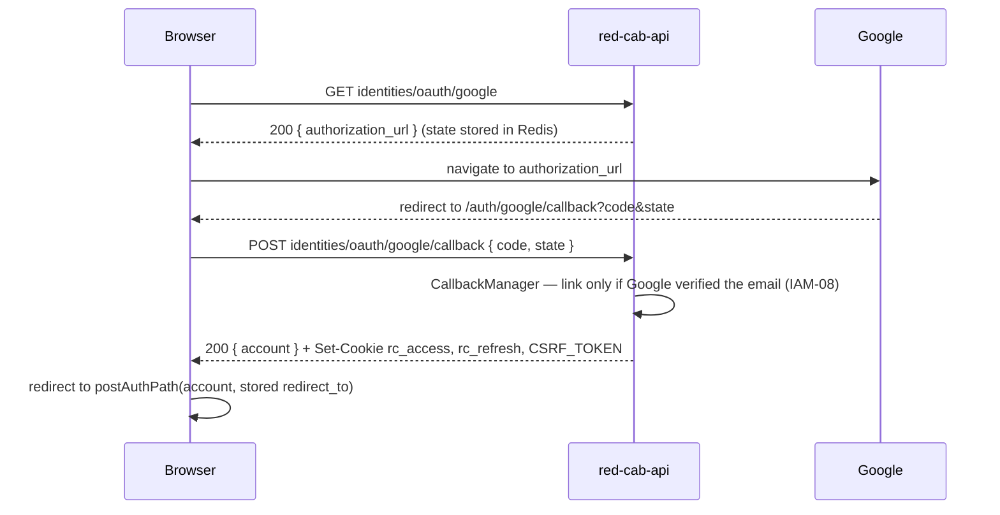
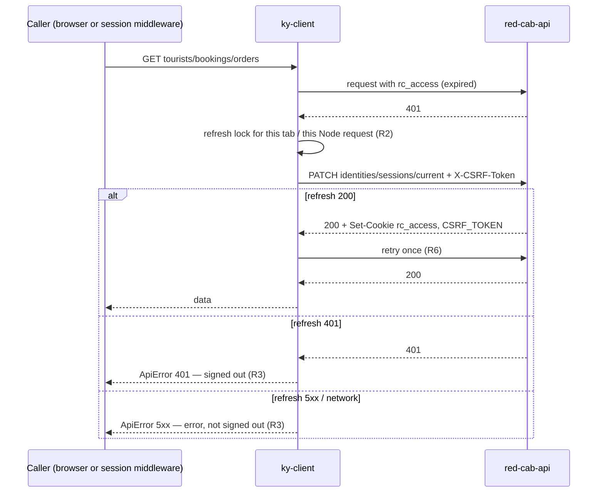

## TL;DR

- Every session change goes **browser → Rails**. Rails sets or clears the cookies. The web then **revalidates** so every reader sees the change.
- Target: login and logout are `clientAction` exports on their routes. The action returns a `redirect`, and React Router revalidates the roots.
- Refresh stays while [ADR-019](/docs/architecture/decisions/adr-019-session-technology-phase-1-and-2) Option A holds. It follows rules R1–R8.
- Signup never creates a session. Only login and the OAuth callback do.

:::info Three rules

1. **No cookie, no call.** After logout the cookies are gone, so the next Node request makes no session call.
2. **Only `401` means signed out.** A logout that fails with `5xx` has not signed anyone out. A `403` or `5xx` from any other call does not end a session either.
3. **Node reads, the browser writes.** Login, logout, and OAuth callback run in the browser only.

:::

## Words this page uses

| Word | Meaning |
| --- | --- |
| `clientAction` | A route export that runs in the browser when a `<Form>` or `useSubmit` posts to the route |
| CSRF header | `X-CSRF-Token`. `ky-client` copies the value of `CSRF_TOKEN` (or `TEAM_CSRF_TOKEN`) into it on every non-`GET` request |
| Refresh by access | jwt_sessions refresh that accepts an **expired** access cookie plus CSRF, and issues a new access token (`refresh_by_access_allowed: true`) |
| Revoke all | `Identities::Sessions::RevokeAllService` flushes the account's Redis namespace. Every session on every device ends |

## Session changes at a glance

| Change | Runtime | Endpoint | CSRF | Cookies after success | Web then |
| --- | --- | --- | --- | --- | --- |
| Account login | Browser | `POST identities/sessions` | No (no session yet) | `rc_access`, `rc_refresh`, `CSRF_TOKEN` set | Redirect to post-auth path; roots revalidate |
| Portal login (`/providers/login`, `/corporate/login`) | Browser | Same endpoint | No | Same | Same. Role decides the home |
| Google OAuth start | Browser | `GET identities/oauth/google` | No | None. Redirect to Google | Browser leaves the site |
| Google OAuth callback | Browser | `POST identities/oauth/google/callback` | No | Account cookies set | Redirect to post-auth path |
| Account logout | Browser | `DELETE identities/sessions/current` | **Yes** | All three cleared, Redis flushed | Redirect to `/`; roots revalidate |
| Admin login | Browser | `POST team/identities/admins/sessions` | No | `rc_team_access`, `rc_team_refresh`, `TEAM_CSRF_TOKEN` set | Redirect to safe `redirect_to` or `/team` |
| Admin logout | Browser | `DELETE team/identities/admins/sessions/current` | **Yes** | Team cookies cleared | Redirect to `/team/login` |
| Refresh (account) | Browser, or Node inside the session middleware | `PATCH identities/sessions/current` | **Yes** | New `rc_access`, new `CSRF_TOKEN` | Retry once (R6) |
| Refresh (admin) | Same | `PATCH team/identities/admins/sessions/current` | **Yes** | New team access + CSRF | Retry once |
| Signup (any actor) | Browser | `POST {tourists,corporate,providers}/identities/accounts` | No | **None** | Show "check your email" |
| Email verification | Browser | `POST identities/email_verifications/confirm` | No | None | Show result |
| Password reset confirm | Browser | `PATCH identities/password_resets/confirm` | No | None. **All sessions revoked** | Send to `/login` |
| Account update | Browser | `PATCH identities/accounts/current` | **Yes** | None | Root revalidates (non-`GET`) |

## Login (target)

```js
// app/routes/identities-account/login-page.jsx
export async function clientAction({ request }) {
  const formData = await request.formData()

  try {
    const identitiesAccount = await identitiesSessionsApi.create({
      email    : formData.get('email'),
      password : formData.get('password')
    })

    const redirectTo = authSafeRedirect.redirectTarget(new URL(request.url))

    return redirect(authSafeRedirect.postAuthPath(identitiesAccount, redirectTo))
  } catch (error) {
    return data({ error: error.toJSON() }, { status: error.status })
  }
}
```

- Invalid credentials answer `422` with one generic message (`FR-IAM-006`, `NFR-SEC-001`). Lockout answers the same `422` (`FR-IAM-007`, `AMB-016`). Neither is a `401`, so `ky-client` never tries to refresh on a failed login.
- `postAuthPath` is defined in [Entry rules](/docs/engineering/authentication/entry-rules#post-auth-redirect).
- The redirect makes React Router revalidate the root (non-`GET` action). The header reads the new account from root loader data. No `onIdentitiesAccountUpdate` call is needed.

**Today:** the login pages call `identitiesSessionsApi.create` from a submit handler, then `onIdentitiesAccountUpdate(sessionResponse)` and `navigate(resolveIdentitiesPostAuthPath(...))`. This works, and it stays until the Phase 3 tourist PR.

## Logout (target)

A dedicated action route, so no page needs to own logout:

```js
// app/routes/identities-account/logout.js   (route: 'logout', POST only)
export async function clientAction() {
  try {
    await identitiesSessionsApi.destroy()
  } catch (error) {
    // The cookies are httponly, so only Rails can clear them. A 401 means they are already gone.
    // Any other failure leaves the person signed in, and the page must say so.
    if (error.status !== 401) return data({ error: error.toJSON() }, { status: error.status })
  }

  return redirect('/')
}
```

**Today:** `useIdentitiesLogout` calls `destroy`, then `onIdentitiesAccountUpdate(null)` and `navigate('/')` in `finally`, even when the call failed. The header then shows "signed out" while the cookies still exist, and the next document request shows the person signed in again. The target fixes this.

The team side mirrors this with `team/logout` and `teamSessionsApi.destroy`.

## Google OAuth



- `/auth/google/callback` sits outside every policy. It creates the session, so it must run for a signed-out person.
- `redirect_to` survives the Google round trip in `sessionStorage` (`storeIdentitiesPostAuthRedirect`, `consumeIdentitiesPostAuthRedirect`). It is checked by `postAuthPath` when read, not when stored.
- New federated accounts are tourists (`IAM-Q5` working assumption; `ProvisionService` with `CREDENTIAL_KIND_OAUTH`).

## Refresh (ADR-019 Option A)



## What each refused response means

| Status | Meaning | In a `clientAction` | In a direct call from a component |
| --- | --- | --- | --- |
| `401` | Session is gone (after one refresh attempt) | Return the error with its status. The root revalidates, the policy redirects | Call `revalidate()`. Do not navigate |
| `403` | Signed in, but not allowed here. Read `code` (ADR-018 D4) | Return the error. The root revalidates, the policy reads the new state | Show the error, or `revalidate()` |
| `422` | Validation or business rule failed | `setApiErrorsToFormFields` + toast | Toast |
| `5xx`, network | Outage | Toast. Session unchanged | Toast. Session unchanged |

Only a policy navigates to a login page (ADR-018 D7). **Today** the root `ErrorBoundary` also navigates on `401`. That stays until every surface under the root has a policy (end of Phase 4).

## CSRF

- jwt_sessions checks CSRF on every non-`GET` request that uses a session cookie. Missing or wrong header → `401`.
- The masked CSRF value changes when the access token changes. After a browser refresh, `handleClientSideRetry` re-reads `document.cookie`. Keep that behaviour.
- Node never sends a non-`GET` auth request except the refresh (R7), so the server path never needs a refreshed CSRF value.
- Login and signup carry no CSRF (no session yet). Cookies are `same_site: :lax`, which blocks cross-site `POST` from carrying cookies.

## What revalidates after a change

| Change | Root revalidates because… |
| --- | --- |
| Login / logout via `clientAction` | Non-`GET` action, then a redirect |
| Account update (`PATCH …/accounts/current`) from a `clientAction` | Non-`GET` action |
| Logout in another tab | It does not, until the next Node request. That request finds no cookie and the policy redirects |
| Password reset on another device | Same. The next API call gets `401`, the caller revalidates |

## Related documents

- Previous: [Reading the session](/docs/engineering/authentication/reading-the-session)
- Next: [Policy routes and surfaces](/docs/engineering/authentication/policy-routes-and-surfaces)
- [Contract sheet](/docs/engineering/authentication/appendix-web-api-contract)
