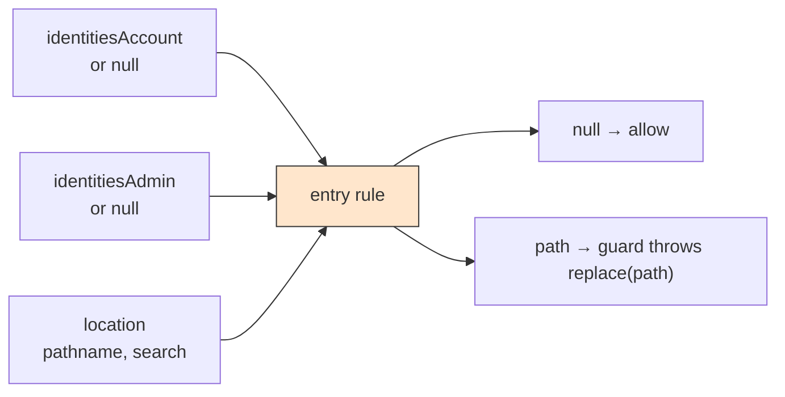

## TL;DR

- An entry rule takes `(identitiesAccount, identitiesAdmin, location)` and returns `null` (allow) or a redirect path.
- It calls nothing, reads no cookie, imports no React, and changes nothing.
- A signed-in person on the wrong surface goes to **their own home**, never to a login page.
- An unknown Role never opens a private page. It goes to `/`.
- `redirect_to` is checked by one helper before any rule uses it.

The machine-readable version, with every test row, is [Appendix A](/docs/engineering/authentication/appendix-entry-rules-spec). The tables on this page and in Appendix A must match the code. Every row is a test.

:::info Three rules

1. **No cookie, no call.** A rule receives the session. It never fetches it.
2. **Only `401` means signed out.** A rule sees `null` only when there is no cookie or Rails answered `401`.
3. **Node reads, the browser writes.** A rule returns a path. The guard redirects. Nobody logs anyone in or out here.

:::

## Words this page uses

| Word | Meaning |
| --- | --- |
| `identitiesAccount` | Account JSON or `null`. Account rules read only this |
| `identitiesAdmin` | Admin JSON or `null`. Admin rules read only this |
| `location` | `{ pathname, search }` of the page being opened |
| Role home | `/account` (tourist), `/corporate`, `/providers`, or `/` for an unknown Role |
| Guest paths | The eight pages under the account guest rule: six login and sign-up pages, plus `/forgot-password` and `/reset-password` |
| `redirect_to` | A query value on a login URL. A stranger can write it into a link, so it is untrusted |
| With `redirect_to` | The rule returns `loginPath?redirect_to=<encoded pathname + search>` |

## The shape of a rule



```js
// app/auth/auth-entry-rules.js
const touristRequired = (identitiesAccount, _identitiesAdmin, location) => {
  if (!identitiesAccount) return authSafeRedirect.loginRedirectPath('/login', location)

  if (identitiesAccount.role === ACCOUNT_ROLE.TOURIST) return null

  return getIdentitiesHomePath(identitiesAccount.role)
}
```

Test for the value that **allows**, and let everything else fall through to a redirect. Then a Role the code does not know can never open a private page.

## The account guest rule

Guards all eight guest paths: `/login`, `/sign-up`, `/forgot-password`, `/reset-password`, `/providers/login`, `/providers/sign-up`, `/corporate/login`, `/corporate/sign-up`.

| Session | Result |
| --- | --- |
| Signed out | Allow |
| Signed in, any Role | `postAuthPath(identitiesAccount, redirect_to)` |

One rule serves every portal's login page. After sign-in, the **Role** decides the destination, not the page the person used (`IAM-Q3`: one Role per account).

## The tourist rule — `/account/**`

| Session | Role | Result |
| --- | --- | --- |
| Signed out | — | `/login` with `redirect_to` |
| Signed in | `tourist` | Allow |
| Signed in | `corporate` | `/corporate` |
| Signed in | `provider` | `/providers` |
| Signed in | any other value | `/` |

The Book CTA flow depends on row 1. A guest on a public listing clicks Book, goes to `/login?redirect_to=/account/checkout?...` (web-56 design decision #5), signs in, and lands on checkout. The checkout **route** stays the single booking gate (`NFR-SEC-005`).

## The corporate rule — `/corporate/**`

| Session | Role | Result |
| --- | --- | --- |
| Signed out | — | `/corporate/login` with `redirect_to` |
| Signed in | `corporate` | Allow |
| Signed in | `tourist` | `/account` |
| Signed in | `provider` | `/providers` |
| Signed in | any other value | `/` |

Corporate has no approval state today. `Corporate::BaseController` gates on profile presence only. If Corporate gains an approval state, it is a domain gate in page loaders, like provider onboarding (ADR-018 D5).

## The provider rule — `/providers/**`

| Session | Role | Result |
| --- | --- | --- |
| Signed out | — | `/providers/login` with `redirect_to` |
| Signed in | `provider` | Allow |
| Signed in | `tourist` | `/account` |
| Signed in | `corporate` | `/corporate` |
| Signed in | any other value | `/` |

What happens **after** Allow is the provider pages' job, not the rule's:

| Provider state (from `GET providers/profile`) | Page behaviour | Owner |
| --- | --- | --- |
| No profile (`403 provider_profile_required`, today `401` + title) | `/providers/registration/create` | Onboarding (`INV-6`) |
| Profile, not `approved` | Dashboard shows status; catalog actions disabled (`canCreateListings`) | Onboarding (`INV-6`, `INV-7`, `LC-8`) |
| `approved` | Full portal | Onboarding |

## The admin rules — `/team/**`

| Policy | Admin session | Result |
| --- | --- | --- |
| Admin guest (`/team/login`) | Signed out | Allow |
| Admin guest | Signed in | Safe `redirect_to` under `/team`, or `/team` |
| Admin required (`/team/**`) | Signed out | `/team/login` with `redirect_to` |
| Admin required | Signed in | Allow |

An account session never satisfies an admin rule. An admin session never satisfies an account rule. A person may hold both at once. They are two independent cookies.

## Pages with no rule

| Path | Why it is open |
| --- | --- |
| `/`, `/districts/**`, `/listings/:listingUuid` | Public browse (`FR-IAM-012`, `AMB-022`) |
| `/verify-email` | Must work while signed in (`FR-IAM-004`; ADR-018 D10) |
| `/auth/google/callback` | Creates the session |
| `/discover`, `/discover/*`, `/account/discover*` | Legacy redirects (web-56 redirect matrix) |
| `/tourists/sign-up` | Loader-only redirect to `/sign-up` |

## Post-auth redirect

`authSafeRedirect.postAuthPath(identitiesAccount, redirectTo)` decides where a person lands after login, after OAuth, and when a guest rule sees a signed-in person.

| `redirect_to` | Role | Result |
| --- | --- | --- |
| Missing or unsafe | any | Role home |
| A guest path (for example `/login`) | any | Role home (loop guard) |
| Under the Role's prefix (`/account/checkout?...` for a tourist) | matching | `redirect_to` |
| Under another Role's prefix (`/providers` for a tourist) | not matching | Role home |
| A public marketplace path (`/`, `/districts/...`, `/listings/...`) | any | `redirect_to` — **change from today**, pending [open question 4](/docs/engineering/authentication/implementation-roadmap#open-questions) |
| Anything else | any | Role home |

**Today** `resolveIdentitiesPostAuthPath` in `identities-auth-utils.js` implements rows 1–4 and 6. A tourist who signs in from the header on a listing page lands on `/account`, not back on the listing.

## `redirect_to` is checked before use

```js
// app/auth/auth-safe-redirect.js
// One leading slash, then no second slash, no backslash, no whitespace.
const INTERNAL_PATH_PATTERN = /^\/(?!\/|\\)[^\s]*$/
```

| Value | Result | Why |
| --- | --- | --- |
| `/account/bookings` | Allow | Internal path |
| `/account/checkout?listing_id=…&availability_slot_id=…&passenger_count=2` | Allow | A query string is fine |
| `//evil.example` | Reject | Browsers read `//` as another host |
| `/\evil.example` | Reject | Some browsers treat `/\` like `//` |
| `https://evil.example` | Reject | Not a path |
| `javascript:alert(1)` | Reject | Not a path |
| `/login?redirect_to=/login` | Reject | Guest path, would loop |
| `/login-help` | Allow | `/login` blocks only `/login` and `/login/...` |
| Missing, empty | Default | Nothing to check |

**Today** the team login page (`team-login-page.jsx:25`) and `withNoAuth` (`with-no-auth.jsx:16`) navigate to `redirect_to` without this check. Phase 0 fixes both.

## How to write a new rule

| Rule | Why |
| --- | --- |
| Take the three arguments, read only your side | Keeps the two identity systems apart (ADR-018 D6) |
| Return a path or `null`, never an object | The guard needs nothing else |
| Test for the allowing value; fall through to a redirect | Unknown values never open a private page |
| Wrong Role → Role home, never login | Login would bounce back through the guest rule |
| No network, no cookies, no React, no navigation | Those belong to the middleware and the guard |
| Write the table on this page first, then the function, then one test per row | The table is the contract |

## Related documents

- Previous: [Policy middleware](/docs/engineering/authentication/policy-middleware)
- Next: [Rails is the boundary](/docs/engineering/authentication/rails-is-the-boundary)
- [Appendix A — entry rules specification](/docs/engineering/authentication/appendix-entry-rules-spec)
