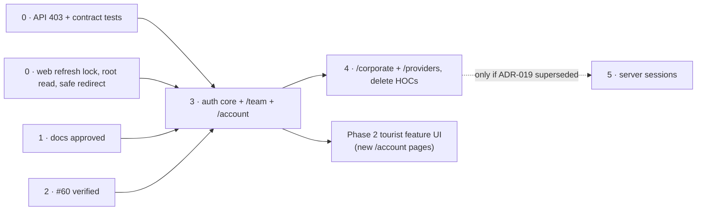

## TL;DR

- **Phase 0** fixes correctness in **both** repos: a cross-user refresh leak in `ky-client`, `403` for portal gates, safe `redirect_to`, and "no cookie, no call". It blocks the production launch of authenticated surfaces. It does not block tourist UI development.
- **Phase 1** approves this series and ADR-018/019. Docs only.
- **Phase 2** is the tourist access work (web-56 / `#60`). **It has already merged** (`red-cab-web` `e24b55b`). What remains is a verification checklist.
- **Phase 3** moves `/team` and `/account` (plus login pages) to policy routes. **Phase 4** moves `/corporate` and `/providers`, then deletes the HOCs.
- **Phase 5** (server-side sessions) runs only if ADR-019 is superseded.

## About this document

| Topic | Document |
| --- | --- |
| Decisions | [ADR-018](/docs/architecture/decisions/adr-018-web-authentication-enforcement-model), [ADR-019](/docs/architecture/decisions/adr-019-session-technology-phase-1-and-2) |
| Tourist UI track | [Tourist UI — Pre–Phase 2](/docs/product/planning/roadmap/tourist-ui-pre-phase-2) |
| API baseline | [IAM audit 2026-08](/docs/engineering/specs/iam/iam-audit-2026-08) |
| Spec workflow | [Implementation specs](/docs/engineering/specs/) |

**Audited:** 2026-09-26 against `red-cab-api@d8ed9b7` and `red-cab-web@c4ce884`, by static reading. No test suite was run for this plan.

---

## Where things stand

| Item | State | Evidence |
| --- | --- | --- |
| IAM audit PR-01 (`GET accounts/current` restored) | In code | `config/routes/identities_routes.rb` |
| PR-02 (token inversions, archived login, lockout reset, revoke on reset, OAuth verified-email gate, per-request active check) | In code | `sessions/create_manager.rb`, `password_resets/confirm_manager.rb`, `callback_manager.rb:203`, `authenticated_controller.rb` |
| PR-03 (no global `JWTSessions.access_cookie` mutation) | In code | `session_cookie_manager.rb#request_cookies`, `session_principal.rb` |
| PR-04 (`PATCH accounts/current`) | In code | `accounts_controller.rb#update` |
| PR-05 (tourist and corporate base controllers, `CurrentRequest` profiles) | In code, **but failures answer `401`** | `tourists/base_controller.rb`, `corporate/base_controller.rb` |
| PR-06 (`GET team/identities/admins/current`) | In code | `team_routes.rb`, `team/identities/admins_controller.rb` |
| PR-07 (`ProvisionService`) | In code | `accounts/provision_service.rb`, `callback_manager.rb:146` |
| PR-08 (route removals, serializer renames) | In code | `UsersAccountBaseSerializer`, `TeamAdminBaseSerializer`; no bare `DELETE identities/sessions` |
| IAM audit index checkboxes | **Stale** (Phase 0 and PR-05 to PR-08 unticked) | `iam-audit-2026-08/index.md` §7 |
| web-56 / `#60` public routes | Merged | `red-cab-web` `e24b55b` |
| `#58`, `#59`, `#62`, `#63` | Merged | `f93a875`, `e9288f9`, `b8787ef`, `c4ce884` |

---

## Phases

| Phase | Focus | Repos | Blocks tourist pre–Phase 2? |
| --- | --- | --- | --- |
| 0 | Correctness + contract freeze | API + web | **No** for UI development. **Yes** for production launch of any authenticated surface |
| 1 | Series + ADR-018/019 approved | docs | No |
| 2 | Tourist access (web-56 / `#60`) | web | This **is** pre–Phase 2. Merged; verify only |
| 3 | Policy routes: auth core, `/team`, `/account`, login pages | web | No. Runs in parallel after Phase 1 |
| 4 | Policy routes: `/corporate`, `/providers`; delete HOCs | web | No |
| 5 | Server-side sessions (only if ADR-019 is superseded) | API + web | No |

### Phase 0 — Correctness and contract freeze

**Goal:** the current auth stack is safe to run in production, and its contract is pinned by tests.

**Web work:**

1. Make the Node refresh lock per incoming request (ADR-019 R2). Refresh failures that are not `401` propagate as errors (R3).
2. Root loaders (`public-root.jsx`, `team-root.jsx`): no cookie → no call; only `401` → `null`; otherwise throw.
3. Add `app/auth/auth-safe-redirect.js`. Use it in `team-login-page.jsx` and `with-no-auth.jsx`.
4. After the API `403` change: `ProvidersProfileService` detects "no profile" by `403` + `code`, not `401` + title.

**API work:**

1. Add `Errors::ForbiddenError` (`403`). Use it in the three actor base controllers and `require_approved_provider_profile!`, with stable codes (ADR-018 D4).
2. Set `JWTSessions.access_exp_time` and `refresh_exp_time` explicitly.
3. Add `test/integration/auth_contract/`: one test per [contract sheet](/docs/engineering/authentication/appendix-web-api-contract) row.
4. Run the full suite. Tick the IAM audit checkboxes that the tests confirm.

**Exit criteria:**

- [ ] A concurrency test proves two SSR requests that both refresh never share cookies or data.
- [ ] An anonymous document request to `/districts` makes zero calls to `identities/accounts/current`.
- [ ] A forced `503` from `accounts/current` renders the root error boundary, not a signed-out header.
- [ ] `redirect_to=//evil.example` on `/team/login` and on every `withNoAuth` page lands on the default path.
- [ ] A tourist cookie on a `providers/**` endpoint gets `403 provider_profile_required`, and the web does not refresh.
- [ ] Token lifetimes are recorded in the contract sheet.
- [ ] Production cookie domain decided (open question 1) and recorded in ADR-019.

**Dependencies:** none. The API `403` change and web step 4 ship together, or web step 4 accepts both shapes for one release.

**Non-goals:** policy routes, HOC removal, session technology change, UI changes.

### Phase 1 — Docs and ADRs approved

**Goal:** this series, ADR-018, and ADR-019 are reviewed and Accepted.

**Exit criteria:**

- [ ] `review-implementation-spec`-style review of ADR-018, ADR-019, and Appendix A against `FR-IAM-004/005/009/012`, `NFR-SEC-004/005`, ADR-010, ADR-017, web-56.
- [ ] Open questions 2–4 answered or explicitly deferred with the working assumption kept.
- [ ] ADR statuses set to Accepted; ADR index updated.
- [ ] Link updates below applied.

**Dependencies:** none. Can run in parallel with Phase 0.

**Non-goals:** code.

### Phase 2 — Tourist access (web-56 / `#60`)

**Goal:** public browse with auth only at checkout (`AMB-022` Option A).

**State:** merged. Remaining work is verification, recorded in the tourist pre–Phase 2 snapshot:

- [ ] No public catalog module imports an auth HOC (`rg "with(Tourist|Corporate|Provider)Auth" app/routes/marketplace` is empty).
- [ ] Every public catalog module uses server `loader` and `index, follow`.
- [ ] A no-JavaScript fetch of each public route returns content.
- [ ] Guest Book CTA goes to `/login?redirect_to=/account/checkout?…`, and sign-in lands on checkout.

**Non-goals:** policy routes. `/account/**` keeps `withTouristAuth`.

### Phase 3 — Auth core, `/team`, `/account`, login pages

**Goal:** Node enforces access for the Admin Panel and the tourist account area before paint.

**Exit criteria:**

- [ ] Spike recorded in [Policy middleware](/docs/engineering/authentication/policy-middleware): the "when the policy runs" table holds on React Router `8.0.0`, and the middleware `url` argument is the page URL.
- [ ] `app/auth/*` modules exist with one test per Appendix A row.
- [ ] `/team/**` and `/team/login` use admin policies. `team-layout.jsx` has no redirect `useEffect`.
- [ ] `/account/**` uses `tourist-required-policy`. The six `withTouristAuth` exports are gone.
- [ ] The eight guest pages use `account-guest-policy`. `/verify-email` is open.
- [ ] Legacy `/account/discover*` redirects sit outside the tourist policy and still work for guests.
- [ ] Login and logout are `clientAction`s. The root revalidates after them. `AuthProvider` no longer exposes a setter.
- [ ] The manual in-app click test passes for `/account/bookings` and `/team/providers/profiles`.
- [ ] A lint or unit check forbids `shouldRevalidate` and `clientLoader` in `app/routes/policies/`.

**Dependencies:** Phase 0 web items 1–3; Phase 1 approved.

**Non-goals:** corporate and provider surfaces; server-side sessions; moving account pages from `clientLoader` to `loader`.

**Gate for Phase 2 tourist features:** new authenticated tourist pages (reviews submit, cancel, refund status per the [Phase 2 roadmap](/docs/product/planning/roadmap/phase-2-marketplace-depth)) are built under `tourist-required-policy`. Placeholder slots from Milestone D may ship earlier on existing pages.

### Phase 4 — `/corporate`, `/providers`, delete HOCs

**Goal:** every protected surface uses a policy. HOCs are gone.

**Exit criteria:**

- [ ] `/corporate/**` and `/providers/**` use their policies.
- [ ] Provider onboarding redirects still work, driven by `403` codes in page loaders.
- [ ] `app/components/hocs/with-*-auth.jsx` deleted. Lint forbids re-adding the folder.
- [ ] Root `ErrorBoundary`s no longer navigate on `401`.
- [ ] [Frontend conventions](/docs/engineering/conventions/frontend) "Auth HOCs" section replaced by "Auth policies".

**Dependencies:** Phase 3.

**Non-goals:** new portal features.

### Phase 5 — Server-side sessions (conditional)

Runs only if a new ADR supersedes ADR-019 (see its revisit triggers). Scope is in ADR-019 Option B. Needs its own DBML change, a dual-read window, and a web change that deletes refresh from `ky-client`.

---

## Implementation spec backlog

Create each from `engineering/specs/_template.md`, `status: draft`, under `engineering/specs/iam/auth-platform/`. Replace `NNN` with the GitHub issue number.

| # | Phase | Suggested file | Suggested issue title | Acceptance criteria (summary) |
| --- | --- | --- | --- | --- |
| 1 | 0 | `web-NNN-ssr-refresh-request-scope.md` | Isolate SSR token refresh per request | Per-request lock; non-`401` refresh failure propagates; concurrency test; no module-level refresh state on Node |
| 2 | 0 | `web-NNN-root-session-read-contract.md` | Root session read: no cookie, no call; only 401 is signed out | Both roots; zero calls without cookie; `503` → error boundary; `Cache-Control: private, no-store` with cookie |
| 3 | 0 | `web-NNN-safe-redirect-helper.md` | Validate redirect_to on every login path | `auth-safe-redirect.js` + tests S1–S9, L1–L2; used by team login and `withNoAuth` |
| 4 | 0 | `api-NNN-portal-gate-forbidden.md` (repos: api, web) | Return 403 with a code for portal and approval gates | `Errors::ForbiddenError`; four codes; integration tests; web provider service reads the code |
| 5 | 0 | `api-NNN-auth-contract-tests.md` | Pin the auth contract with integration tests | One test per contract row; explicit token lifetimes; IAM audit checkboxes updated |
| 6 | 3 | `web-NNN-auth-core-modules.md` | Add session middleware, guards, and entry rules | `app/auth/*` + specs for every Appendix A row; RR 8.0 spike recorded; policy export lint |
| 7 | 3 | `web-NNN-team-policy-routes.md` | Guard the Admin Panel with policy routes | Admin policies; `team-layout` guard removed; team logout route; manual click test |
| 8 | 3 | `web-NNN-tourist-account-policy-routes.md` | Guard /account and login pages with policy routes | Tourist + guest policies; HOCs removed from those pages; `/verify-email` open; legacy redirects outside; login/logout `clientAction` |
| 9 | 4 | `web-NNN-corporate-provider-policy-routes.md` | Guard the Client and Provider Portals with policy routes | Two policies; onboarding via `403` codes; manual click test |
| 10 | 4 | `web-NNN-remove-auth-hocs.md` | Remove auth HOCs and boundary login redirects | HOC files deleted; lint rule; error boundaries stop navigating; conventions updated |
| 11 | 5 | `api-NNN-server-side-sessions.md` (conditional) | Replace jwt_sessions with server-side sessions | Only after a superseding ADR |

Specs 1–3 may be one PR if the reviewer prefers. Specs 4 and 5 are separate API PRs.

---

## Migration and risk register

| # | Risk | Likelihood | Impact | Mitigation |
| --- | --- | --- | --- | --- |
| R-1 | Cross-user session leak through the shared Node refresh lock | Medium under load | Critical | Phase 0 spec 1 first; concurrency test; ship before any authenticated surface launches |
| R-2 | Half-migrated surface: HOC and policy both guard one subtree, with different rules | Medium | Loops, blank pages | One surface per PR; "never both in one subtree" (ADR-018 D8); review checklist item |
| R-3 | Policy silently off (loader deleted, `shouldRevalidate` or `clientLoader` added) | Medium | In-app clicks skip the check | Lint check in spec 6; manual click test in every policy PR |
| R-4 | JWT refresh interacts badly with policy middleware (double refresh, lost `Set-Cookie`) | Medium | Random logouts | Refresh only in the session middleware (R4); `getCookieHeader()` for other loaders; test both document and `.data` requests with an expired access token |
| R-5 | Breaking `identities/accounts/current` shape or path | Low | Every surface breaks | Contract sheet + contract tests (spec 5); additive changes only (`CR-6`) |
| R-6 | SEO cost or cache leak on public routes | Medium today | Slower pages; a shared cache storing a personal page | No cookie, no call; `Cache-Control: private, no-store` when a cookie exists |
| R-7 | Portal `401` → refresh → `401` → login redirect → guest guard → loop | High today for wrong-role API calls | Redirect loop | API `403` (spec 4) before web invariant 2 is relied on |
| R-8 | Provider onboarding breaks when the API moves to `403` | High if uncoordinated | Providers stuck | Spec 4 changes both repos; web accepts old and new shape for one release |
| R-9 | React Router `8.0.0` middleware behaves differently from the `8.3.0` reference | Low | Policy gaps | Spike in spec 6 before any policy PR merges |
| R-10 | Production cookie domain prevents Node from seeing API cookies | Unknown | SSR always signed out | Open question 1 answered in Phase 0 |
| R-11 | Tourist pre–Phase 2 work stalls waiting for policies | Low | Schedule | HOCs stay legal on unmigrated surfaces; Phase 3 runs in parallel |

---

## Link updates

Applied with this package:

| File | Change |
| --- | --- |
| `architecture/decisions/index.md` | Add ADR-018 and ADR-019 rows; count "Seventeen" → "Nineteen" |
| `engineering/conventions/frontend.md` | "Auth HOCs" section: add a note that HOCs are transitional per ADR-018, with a link to this series; "ky-client features": link to ADR-019 refresh rules |
| `engineering/conventions/domain-to-code-mapping.md` | Frontend surface table: add a note that the `Auth HOC` column becomes policy routes per ADR-018 |
| `product/planning/roadmap/tourist-ui-pre-phase-2.md` | Related documents: link to this series, noting that `/account/**` keeps HOCs until Phase 3 |
| `product/planning/web-platform-program-strategy.md` | Program plan: parallel tracks, gates, issue ↔ auth phase map |
| `product/planning/index.md` | Planning tier index |
| `engineering/index.md` | Reading order: add the authentication series |

Still to do (outside this package):

| File | Change | When |
| --- | --- | --- |
| `engineering/specs/iam/iam-audit-2026-08/index.md` | Tick PR-01 to PR-08 once contract tests pass; close `IAM-Q2` with ADR-018 D4 | Phase 0 spec 5 |
| `engineering/conventions/backend.md` | Error table: add `ForbiddenError (403)` and its codes | Phase 0 spec 4 |
| `architecture/decisions/adr-010-identity-and-authorization-architecture.md` | Remove the TL;DR and About blocks that repeat six times at the top (formatting defect) | Any docs PR |
| `red-cab-web/.ai/instructions.md`, `red-cab-web/.cursor/rules/10-routes-api-forms.mdc` | "Use surface-appropriate auth HOC" → "place the page under its surface policy" | Phase 3 spec 8 |
| `red-cab-api/.ai/instructions.md` | IAM section: `403` codes; link to contract sheet | Phase 0 spec 4 |
| `AGENTS.md` (workspace) | Add `engineering/authentication/` to "Before generating code" for any auth or route work | Phase 1 |

---

## Open questions

| # | Question | Why it needs a decision | Owner | Working assumption |
| --- | --- | --- | --- | --- |
| 1 | **Production cookie topology.** API cookies are host-only today. How does Node on the web host receive them? Options: (a) cookie `domain` set to the shared parent domain; (b) API served same-origin under a path on the web host; (c) Node proxies all API calls. The team portal has the same question for `VITE_API_TEAM_URL` | Without it, SSR sees no session in production, and every policy redirects to login | Architect | (a) Parent-domain cookies, separately for the marketplace and team domains, as the `teamApiClient` comment in `ky-client.js` already implies |
| 2 | **Approve `403` codes for portal and approval gates** (`IAM-Q2`) | Coordinated API + web contract change | Architect | Approve the four codes in ADR-018 D4 |
| 3 | **Can a signed-in, unverified account open `/verify-email`?** (depends on `IAM-Q1`) | Changes guest-page behaviour | Product Owner | Yes. Unverified login is allowed (`IAM-Q1`), so verification must work while signed in |
| 4 | **After sign-in, may a person return to a public marketplace page** (for example the listing they were reading), not only to their Role's area? | Changes post-auth landing, a UX behaviour | Product Owner | Yes, for `/`, `/districts/**`, `/listings/**`. These pages are public anyway, so no access widens |
| 5 | **Token lifetimes.** What access and refresh lifetimes fit Phase 1? | Security posture vs. how often people must sign in again | Architect | Keep the jwt_sessions defaults but write them down explicitly |

## Related documents

- [Authentication series overview](/docs/engineering/authentication)
- [Web platform program strategy](/docs/product/planning/web-platform-program-strategy)
- [Tourist UI — Pre–Phase 2](/docs/product/planning/roadmap/tourist-ui-pre-phase-2)
- [IAM audit 2026-08](/docs/engineering/specs/iam/iam-audit-2026-08)
