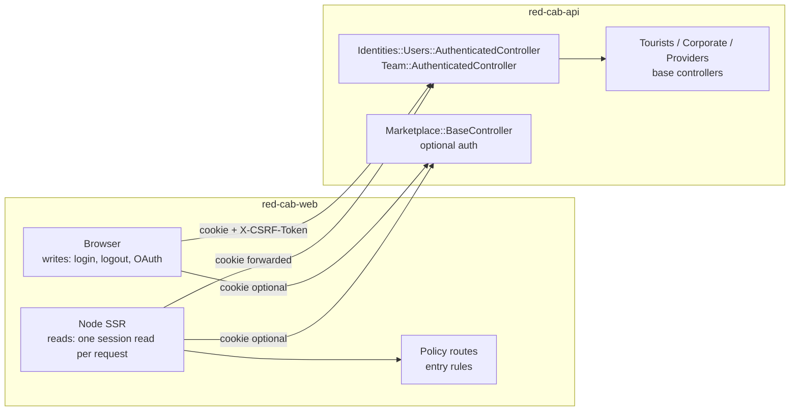

## TL;DR

- This series is the **single source of truth** for authentication across `red-cab-web`, `red-cab-api`, and the contract between them.
- It describes the **target design** from [ADR-018](/docs/architecture/decisions/adr-018-web-authentication-enforcement-model) and [ADR-019](/docs/architecture/decisions/adr-019-session-technology-phase-1-and-2). Each page marks where **today's code** differs.
- Rails decides access on every request. The web only decides where a person goes.
- Read the pages in order the first time. After that, [Entry rules](/docs/engineering/authentication/entry-rules) and the [contract sheet](/docs/engineering/authentication/appendix-web-api-contract) are the lookup pages.

**Status:** Proposed (2026-09-26). Normative once ADR-018 and ADR-019 are Accepted.

## Why this series lives under Engineering

| Option | Verdict |
| --- | --- |
| `docs/architecture/authentication/` | No. The Architecture tier holds decisions (ADR-018, ADR-019). These pages explain **how to build and review** code, for developers and agents |
| `docs/engineering/conventions/` | No. Conventions are one page per repo. Auth spans both repos and needs nine ordered pages |
| **`docs/engineering/authentication/`** | **Yes.** Engineering is the developer and agent tier. It ranks below ADRs and above implementation specs, which is the precedence this series needs |

Precedence stays as the docs root defines it: business rules → requirements → architecture and ADRs → engineering (this series) → implementation specs → code.

## The pages, in reading order

1. [What Red Cab Web knows about a session](/docs/engineering/authentication/what-red-cab-web-knows) — two runtimes, two identity systems, cookie names, current endpoints.
2. [Reading the session](/docs/engineering/authentication/reading-the-session) — virtual roots, session middleware, lazy read, revalidation.
3. [Changing a session](/docs/engineering/authentication/changing-a-session) — login, logout, OAuth, refresh, CSRF.
4. [Policy routes and surfaces](/docs/engineering/authentication/policy-routes-and-surfaces) — the route tree for tourist, corporate, provider, and team.
5. [Policy middleware](/docs/engineering/authentication/policy-middleware) — how guards run on Node, and three edits that switch them off.
6. [Entry rules](/docs/engineering/authentication/entry-rules) — the lookup tables and the `redirect_to` check.
7. [Rails is the boundary](/docs/engineering/authentication/rails-is-the-boundary) — actor base controllers and what the web must not assume.
8. [Worked examples](/docs/engineering/authentication/worked-examples) — sequence diagrams.
9. [Code map](/docs/engineering/authentication/code-map) — every file, grouped like these pages.

Appendices:

- A. [Entry rules specification](/docs/engineering/authentication/appendix-entry-rules-spec) — every rule as a named function with test rows.
- B. [Web↔API contract sheet](/docs/engineering/authentication/appendix-web-api-contract) — endpoints, cookies, CSRF, status meanings.
- C. [Implementation roadmap](/docs/engineering/authentication/implementation-roadmap) — phases, risks, spec backlog, link updates, open questions.

## Three rules that hold on every page

:::info Three rules

1. **No cookie, no call.** A Node request with no session cookie is signed out. Node does not call Rails to ask.
2. **Only `401` means signed out.** `403`, `5xx`, timeouts, and network failures are errors. They never clear a session.
3. **Node reads, the browser writes.** Login, logout, and OAuth run in the browser, with CSRF. Node reads the session. Its only write is the token refresh that [ADR-019](/docs/architecture/decisions/adr-019-session-technology-phase-1-and-2) allows.

:::

## The whole picture

## Words used across the series

| Word | Meaning |
| --- | --- |
| Account | `Identities::Account`. The principal for Tourist, Corporate, and Provider roles (`FR-IAM-009`) |
| Admin | `Identities::Admin`. The separate principal for the Admin Panel at `/team`. Not a marketplace Role |
| `identitiesAccount` | The JSON from `GET identities/accounts/current`, or `null` when signed out |
| `identitiesAdmin` | The JSON from `GET team/identities/admins/current`, or `null` |
| Surface | A role-confined area of the web app: Tourist App, Client Portal, Provider Portal, Admin Panel (`NFR-SEC-004`) |
| Virtual root | A pathless `layout()` at the top of the route tree: `roots/public-root.jsx` or `roots/team-root.jsx` |
| Policy route | A pathless `layout()` that runs one entry rule on Node before its children render |
| Entry rule | A pure function that returns `null` (allow) or a redirect path |
| Today / Target | "Today" is the audited code at `red-cab-web@c4ce884` and `red-cab-api@d8ed9b7`. "Target" is the ADR-018 design |

## What stays the same during the tourist pre–Phase 2 track

- HOCs remain on `/account/**`, login pages, `/corporate/**`, and `/providers/**` until their migration PR.
- Public marketplace routes stay guard-free (`AMB-022`, web-56).
- `ky-client` keeps refresh-on-`401`, with the Phase 0 per-request lock fix.
- See the [roadmap](/docs/engineering/authentication/implementation-roadmap) for exact phase gates.

## Related documents

- [ADR-010](/docs/architecture/decisions/adr-010-identity-and-authorization-architecture), [ADR-017](/docs/architecture/decisions/adr-017-tourist-ui-public-url-architecture), [ADR-018](/docs/architecture/decisions/adr-018-web-authentication-enforcement-model), [ADR-019](/docs/architecture/decisions/adr-019-session-technology-phase-1-and-2)
- [FR-IAM](/docs/product/requirements/functional-requirements/iam), [Non-functional requirements](/docs/product/requirements/non-functional-requirements) (`NFR-SEC-004`, `NFR-SEC-005`)
- [web-56 spec](/docs/engineering/specs/iam/web-56-tourist-access-and-route-contract), [IAM audit 2026-08](/docs/engineering/specs/iam/iam-audit-2026-08)
- [Frontend conventions](/docs/engineering/conventions/frontend), [Backend conventions](/docs/engineering/conventions/backend)
