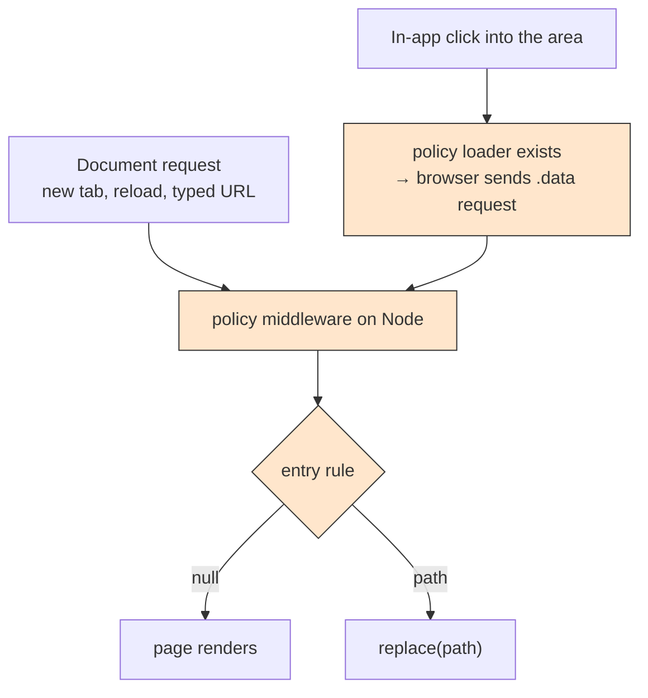

## TL;DR

- A guard is `authAccountGuard.protect(rule)` or `authAdminGuard.protect(rule)`. It reads the session from router context, runs the rule, and throws `replace(path)` when the rule returns a path.
- Server middleware runs only when the browser sends Node a request. On an in-app click, that happens only if a matched route has a server `loader`. **The empty policy loader is what makes the check run.**
- Three edits switch a policy off with no error: deleting its `loader`, adding `shouldRevalidate`, or adding `clientLoader`.
- On an in-app click, a page's `clientLoader` can call Rails before the policy answers. Rails refuses those calls. The redirect still wins.

:::info Three rules

1. **No cookie, no call.** The guard asks the session middleware. It never calls Rails itself.
2. **Only `401` means signed out.** The guard sees `null` only for `401` or no cookie. Other failures reach the error boundary before the rule runs.
3. **Node reads, the browser writes.** A guard reads and redirects. It changes nothing.

:::

## Words this page uses

| Word | Meaning |
| --- | --- |
| Guard | `protect(rule)`. Turns one entry rule into React Router server middleware |
| Policy loader | `export const loader = () => null` on a policy route |
| Route manifest | The build output that tells the browser which exports each route has (`hasLoader`, `hasClientLoader`) |
| `replace()` | A React Router redirect that does not add a history entry |

## The guard

```js
// app/auth/auth-account-guard.js
import { replace } from 'react-router'
import { authAccountSession } from '@/auth/auth-account-session-middleware'

const protect = (rule) => async ({ context, url }) => {
  const { getIdentitiesAccountCurrent } = context.get(authAccountSession.context)
  const identitiesAccount               = await getIdentitiesAccountCurrent()

  // url is the page location. request.url may still carry the .data suffix.
  const redirectPath = rule(identitiesAccount, null, { pathname: url.pathname, search: url.search })

  // replace(), not redirect(): a policy redirect is a correction, not a destination.
  if (redirectPath) throw replace(redirectPath)
}

export const authAccountGuard = {
  protect: protect
}
```

`app/auth/auth-admin-guard.js` is the same, with `authAdminSession`, `getIdentitiesAdminCurrent`, and `rule(null, identitiesAdmin, location)`.

The guard never calls `next()`. React Router continues the chain when a middleware returns without calling it.

**Check in the Phase 3 spike:** that the middleware argument exposes the normalized page `url` on React Router `8.0.0`. If it does not, derive `pathname` from `request.url` and strip the `.data` suffix and `_routes` parameter.

## Why every policy route exports a loader



Most private Red Cab pages use `clientLoader` (for example `booking-list-page.jsx`, every provider page, every team page). A click between two such pages needs nothing from Node, so the browser sends nothing. No request means no middleware.

React Router decides at build time whether a route "has a loader" by checking the export name. The loader's body is never read. So `() => null` is enough to put the policy route on the `.data` request, and one request runs **every** matched middleware.

## When the policy runs

The reference pattern verified this table on React Router `8.3.0`. Red Cab runs `8.0.0`. The Phase 3 spike must repeat the manual test below and record the result here.

| Navigation | Policy runs on Node? |
| --- | --- |
| Document request | Yes |
| In-app click that **enters** the policy's area | Yes. The policy is newly matched |
| In-app click between two pages **inside** the area | No, unless the destination has its own server `loader` |
| Search params change (`?page=2`) | Yes |
| An action succeeds, or fails with `401` / `403` | Yes |
| `revalidate()` | Yes |
| Leave the area and come back | Yes |

Row 3 is acceptable. The policy is the check at the door. Inside the area, Rails refuses any call from a person who lost access. The caller answers with `revalidate()`, and the next request runs the policy.

## Three edits that switch a policy off

| Edit | Effect | Why |
| --- | --- | --- |
| Delete `loader` | In-app clicks into the area skip the check | The route no longer joins the `.data` request |
| Add `shouldRevalidate` | Same | React Router skips the route before it checks for a loader |
| Add `clientLoader` | Same | The route hands its loading to the browser and never joins the request |

A document request still runs the policy in all three cases. So a local "open in a new tab" test passes even when the policy is broken. Test the in-app click.

Add a lint or unit check in Phase 3: every file under `app/routes/policies/` exports `middleware` and `loader`, and does not export `shouldRevalidate` or `clientLoader`.

## Page fetches can start before the policy answers

On an in-app click, React Router starts each matched `clientLoader` before it sends the `.data` request that runs the policy. So a page's own calls to Rails can leave the browser first.

| Navigation | What the policy orders |
| --- | --- |
| Document request | Everything. No child fetch exists yet |
| In-app click, destination has a server `loader` | That loader runs after the middleware, in the same request |
| In-app click, destination has a `clientLoader` | Only rendering. The fetch races the policy. Rails refuses it with `401` or `403` |

This is not a data leak, because Rails refuses the request. It does require two rules:

1. `ky-client` never navigates or clears state on a `401`. Otherwise a raced fetch would fight the policy's redirect.
2. A page that must not fetch before the check uses a server `loader`. See [Rails is the boundary](/docs/engineering/authentication/rails-is-the-boundary#where-page-data-loads).

Do not add `clientMiddleware` to close the gap. It needs a browser copy of the session, and that copy can be stale (ADR-018, alternatives).

## Module layout in `red-cab-web`

| File | Exports | May import |
| --- | --- | --- |
| `app/auth/auth-session-cookies.js` | `authSessionCookies.hasAccountSessionCookie`, `.hasAdminSessionCookie` | nothing |
| `app/auth/auth-safe-redirect.js` | `authSafeRedirect.internalPathOrDefault`, `.loginRedirectPath`, `.redirectTarget`, `.postAuthPath` | `identities-account-constant.js` |
| `app/auth/auth-entry-rules.js` | `authEntryRules.*` (account side) | `auth-safe-redirect`, constants |
| `app/auth/auth-admin-entry-rules.js` | `authAdminEntryRules.*` | `auth-safe-redirect` |
| `app/auth/auth-account-session-middleware.js` | `authAccountSession.{context, middleware}` | `identities-accounts-api`, `auth-session-cookies` |
| `app/auth/auth-admin-session-middleware.js` | `authAdminSession.{context, middleware}` | `team-sessions-api`, `auth-session-cookies` |
| `app/auth/auth-account-guard.js` | `authAccountGuard.protect` | `auth-account-session-middleware` |
| `app/auth/auth-admin-guard.js` | `authAdminGuard.protect` | `auth-admin-session-middleware` |
| `app/routes/policies/*-policy.jsx` | `middleware`, `loader`, default | one guard, one rule file |

Each file has a matching `*.spec.js`. An account file never imports an admin file, and the reverse. `auth-safe-redirect.js` is the only file both sides use.

## How to test a policy by hand

1. Sign in as a tourist. Open `/districts` (no policy).
2. Click the header link to `/account/bookings`. Do **not** open a new tab. This click enters `tourist-required-policy`.
3. In the network tab, confirm a `.data` request to Node whose `_routes` includes the policy route id.
4. Sign out in another tab.
5. Click back to `/districts`, then click `/account/bookings` again.
6. You must land on `/login?redirect_to=%2Faccount%2Fbookings`.

If step 6 fails but a reload redirects, one of the three edits above has switched the policy off.

## Related documents

- Previous: [Policy routes and surfaces](/docs/engineering/authentication/policy-routes-and-surfaces)
- Next: [Entry rules](/docs/engineering/authentication/entry-rules)
- [React Router middleware](https://reactrouter.com/how-to/middleware)
