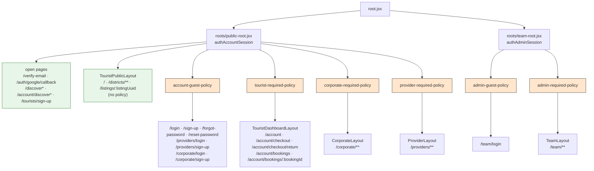

## TL;DR

- Eight policy routes cover every protected or guest-only page. Public marketplace routes have **no** policy.
- A policy is the **parent of the layout**, not a child of it. A person who may not enter never sees the dashboard shell.
- A policy route has exactly three exports: `middleware`, `loader = () => null`, and a default component that renders `<Outlet />`.
- Pages open to every state (`/verify-email`, OAuth callback, legacy redirects) sit **outside** all policies.

:::info Three rules

1. **No cookie, no call.** Public pages never trigger a session read unless a cookie exists.
2. **Only `401` means signed out.** A policy redirects to login only when the session read returned `null`.
3. **Node reads, the browser writes.** Policies only read. They never call a session-changing endpoint.

:::

## Words this page uses

| Word | Meaning |
| --- | --- |
| Surface | A role-confined area: Tourist App, Client Portal, Provider Portal, Admin Panel (`FR-IAM-009`, `NFR-SEC-004`) |
| Policy route | A pathless `layout()` whose `middleware` runs one entry rule |
| Guest policy | A policy for pages only signed-out people should see: login, sign-up, forgot and reset password |
| Required policy | A policy for pages only one Role may see |
| Open page | A page with no policy. Every session state may open it |

## Surfaces and their policies

| Surface | URL prefix | Layout | Policy | Entry rule | Governing IDs |
| --- | --- | --- | --- | --- | --- |
| Tourist App (public) | `/`, `/districts/**`, `/listings/:listingUuid` | `TouristPublicLayout` | **none** | — | `FR-IAM-012`, `AMB-022`, ADR-017 |
| Account guest pages | `/login`, `/sign-up`, `/forgot-password`, `/reset-password`, `/providers/login`, `/providers/sign-up`, `/corporate/login`, `/corporate/sign-up` | Existing auth layouts | `account-guest-policy` | `accountGuest` | `FR-IAM-005` |
| Tourist App (account) | `/account/**` except legacy `/account/discover*` | `TouristDashboardLayout` | `tourist-required-policy` | `touristRequired` | `FR-IAM-009`, `NFR-SEC-005` |
| Client Portal | `/corporate/**` except login and sign-up | `CorporateLayout` | `corporate-required-policy` | `corporateRequired` | `FR-IAM-009`, `FR-IAM-013` |
| Provider Portal | `/providers/**` except login and sign-up | `ProviderLayout` | `provider-required-policy` | `providerRequired` | `FR-IAM-009` |
| Admin guest | `/team/login` | none | `admin-guest-policy` | `adminGuest` | `FR-IAM-009` |
| Admin Panel | `/team/**` | `TeamLayout` | `admin-required-policy` | `adminRequired` | `FR-IAM-009` |

Provider onboarding (no profile yet, pending approval) is **not** a policy. It is a domain gate owned by Onboarding (`INV-6`, `INV-7`, `LC-8`; ADR-018 D5). The provider page loaders handle it, as `ProvidersProfileService.getOnboardingRedirectPath` does today.

## The target route tree



Orange is a policy. Green has no policy.

### `app/routes.js` (target shape)

```js
const routes = [
  layout('roots/public-root.jsx', [
    ...openAccountRoutes,                       // verify-email, auth/google/callback, legacy redirects

    layout('layouts/tourist/tourist-public-layout.jsx', [
      ...marketplaceRoutes                      // '/', districts/**, listings/:listingUuid — no policy
    ]),

    layout('./routes/policies/account-guest-policy.jsx', [
      // Same layout file as above, so it needs its own id. Route ids default to the file path.
      layout('layouts/tourist/tourist-public-layout.jsx', { id: 'tourist-public-layout-guest' }, [
        ...accountGuestRoutes
      ]),
      layout('layouts/provider/provider-public-auth-layout.jsx', [ ...providerGuestRoutes ]),
      layout('layouts/corporate/corporate-public-auth-layout.jsx', [ ...corporateGuestRoutes ])
    ]),

    layout('./routes/policies/tourist-required-policy.jsx', [
      layout('layouts/tourist/tourist-dashboard-layout.jsx', [
        ...prefix('account', touristAccountRoutes)
      ])
    ]),

    layout('./routes/policies/corporate-required-policy.jsx', [
      layout('layouts/corporate/corporate-layout.jsx', [ ...prefix('corporate', corporateRoutes) ])
    ]),

    layout('./routes/policies/provider-required-policy.jsx', [
      layout('layouts/provider/provider-layout.jsx', [ ...prefix('providers', providerRoutes) ])
    ])
  ]),

  layout('roots/team-root.jsx', [
    layout('./routes/policies/admin-guest-policy.jsx', [
      route('team/login', './routes/team/team-login-page.jsx')
    ]),
    layout('./routes/policies/admin-required-policy.jsx', [
      route('team', 'layouts/team/team-layout.jsx', teamRoutes)
    ])
  ]),

  route('*', './routes/catch-all-routes.jsx')
]
```

Route groups move as follows:

| Group | From | To |
| --- | --- | --- |
| `login`, `sign-up`, `forgot-password`, `reset-password` | `marketplace.routes.js` | `accountGuestRoutes` (new export, same file or `identities.routes.js`) |
| `verify-email`, `auth/google/callback`, `tourists/sign-up`, `discover`, `discover/*` | `marketplace.routes.js` | `openAccountRoutes` |
| `account/discover*` legacy redirects | `tourist.routes.js` | `openAccountRoutes` — **must** stay outside `tourist-required-policy`, or guests following old bookmarks would be sent to login (web-56 redirect matrix) |
| `providers/login`, `providers/sign-up`, `corporate/login`, `corporate/sign-up` | inline in `routes.js` | `providerGuestRoutes`, `corporateGuestRoutes` |

URL paths do not change. Only the tree above them changes.

## What a policy route is made of

```jsx
// app/routes/policies/tourist-required-policy.jsx
import { Outlet } from 'react-router'
import { authAccountGuard } from '@/auth/auth-account-guard'
import { authEntryRules } from '@/auth/auth-entry-rules'

export const middleware = [authAccountGuard.protect(authEntryRules.touristRequired)]

// Not empty by accident. A loader makes the middleware run on an in-app click. Never remove it.
export const loader = () => null

export default function TouristRequiredPolicy() {
  return <Outlet />
}
```

| Export | Allowed on a policy route? |
| --- | --- |
| `middleware` | Required |
| `loader` returning `null` | Required |
| default component rendering `<Outlet />` | Required |
| `shouldRevalidate` | **Never** |
| `clientLoader` | **Never** |
| `action`, `clientAction` | Never |
| `meta`, `handle` | Never. The policy is invisible infrastructure |

[Policy middleware](/docs/engineering/authentication/policy-middleware) explains each "never".

## Why the policy wraps the layout

If the policy sat inside `TouristDashboardLayout`, the layout would render (and its own loaders would run) before the rule answered. With the policy outside, a denied person sees nothing of the private shell. It also means one policy per layout, which is easy to review.

## One Role, one home

| Role | Home | Source |
| --- | --- | --- |
| `tourist` | `/account` | `getIdentitiesHomePath` in `identities-auth-utils.js` |
| `provider` | `/providers` | same |
| `corporate` | `/corporate` | same |
| unknown | `/` | same (fallback) |
| admin | `/team` | admin rules |

A signed-in person on another Role's surface is sent to their own home, never to a login page. Login would loop: the guest policy would send them straight back.

A Corporate account on `/account/checkout` goes to `/corporate`. `FR-IAM-012` lets a Corporate Account initiate a booking, but that path is the quotation flow on the Client Portal. Corporate enters Booking only through an accepted quotation ([domain-to-code mapping](/docs/engineering/conventions/domain-to-code-mapping)), and `tourists/**` endpoints require a tourist profile.

## Today vs target

| Surface | Today | Target |
| --- | --- | --- |
| Public marketplace | No guard (`#60` merged) | Unchanged |
| `/account/**` | `withTouristAuth` on each page (6 pages) | `tourist-required-policy` |
| Login pages | `withNoAuth` on each page | `account-guest-policy` |
| `/verify-email` | `withNoAuth` | Open page (ADR-018 D10) |
| `/corporate/**` | `withCorporateAuth` | `corporate-required-policy` |
| `/providers/**` | `withProviderAuth` (13 pages) | `provider-required-policy` |
| `/team/**` | `useEffect` in `team-layout.jsx` | `admin-required-policy` |
| `/team/login` | Redirect in page `useEffect`, unchecked `redirect_to` | `admin-guest-policy` |

## Related documents

- Previous: [Changing a session](/docs/engineering/authentication/changing-a-session)
- Next: [Policy middleware](/docs/engineering/authentication/policy-middleware)
- [Entry rules](/docs/engineering/authentication/entry-rules)
- [web-56 web contract](/docs/engineering/specs/iam/web-56-tourist-access-and-route-contract#web-contract)
