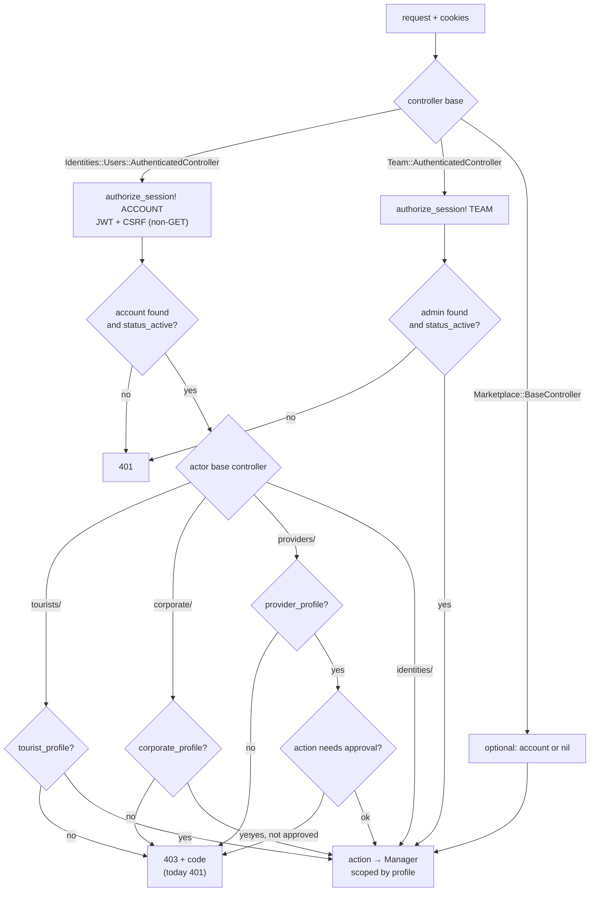

## TL;DR

- Every web guard can be bypassed with `curl`. So every rule that matters is enforced in `red-cab-api`, on every request.
- The chain is: authenticate the principal → check it is active → check the portal (profile presence) → check the action (domain gate) → scope records to the caller.
- `401` = not authenticated. `403` = authenticated but not allowed (ADR-018 D4). `404` = not yours, or not found. `422` = domain rule failed.
- The web may use `role` to pick a surface. It must never use `role`, or anything else it holds, to decide what data is allowed.

:::info Three rules

1. **No cookie, no call.** Rails treats a missing cookie as "not authenticated" (`401`, or guest on `marketplace/`).
2. **Only `401` means signed out.** Rails must not use `401` for "wrong portal". That is `403`.
3. **Node reads, the browser writes.** Rails requires CSRF on every non-`GET` request that uses a session cookie.

:::

## Words this page uses

| Word | Meaning |
| --- | --- |
| Actor base controller | `Tourists::BaseController`, `Corporate::BaseController`, `Providers::BaseController` |
| Portal gate | The actor base controller check: the account has the matching profile (IAM audit §4.3) |
| Domain gate | A rule owned by a bounded context, such as "provider must be approved to publish" (`INV-6`) |
| Scoping | A Manager loads records through the profile it was given, so another person's record is `404` |
| `CurrentRequest` | Per-request attributes set by controllers. Managers never read it. They get keyword arguments |

## The authorization chain

## Controllers and what they enforce

| Controller | Enforces | Failure today | Failure target |
| --- | --- | --- | --- |
| `Identities::Users::AuthenticatedController` | Valid account cookie, CSRF on non-`GET`, account exists and `status_active?` | `401` | `401` |
| `Team::AuthenticatedController` | Valid team cookie, CSRF, admin exists and active | `401` | `401` |
| `Marketplace::BaseController` | Nothing required. Sets account or `nil` | never `401` | never `401` |
| `Tourists::BaseController` | `tourist_profile` present → `CurrentRequest.tourist_profile` | `401` "This area is for tourist accounts…" | `403 tourist_profile_required` |
| `Corporate::BaseController` | `corporate_profile` present | `401` | `403 corporate_profile_required` |
| `Providers::BaseController` | `provider_profile` present | `401` "Please complete provider registration…" | `403 provider_profile_required` |
| `Providers::BaseController#require_approved_provider_profile!` | `status_approved?` on actions that need it | `401` | `403 provider_approval_required` |

Why the change matters: today a tourist whose page calls a `providers/` endpoint gets `401`. `ky-client` refreshes (which **succeeds**, the session is valid), retries, gets `401` again, and the root `ErrorBoundary` sends a signed-in person to `/login`. The guest guard then sends them back. With `403`, nothing refreshes and nothing redirects.

## What the web must never assume

| Assumption | Why it is wrong |
| --- | --- |
| "The HOC or policy hides the page, so the data is safe" | The API endpoint is still reachable. Only Rails protects data |
| "`role === 'provider'` means the provider may publish" | Publishing needs an approved profile and a valid license (`INV-6`, `INV-7`) |
| "The account in context is current" | It is a copy from the last root load. Rails reloads the account on every request |
| "A `401` from any call means logout" | Only after one refresh attempt (ADR-019 R1–R3). And never a `403` |
| "The price in the URL is the price" | Checkout query params carry listing, slot, and passenger count only. Rails computes the price (`PRC-1`, ADR-005) |
| "The client can say which role it is" | Role comes from the account record only. No request may set it |

## Record ownership

Managers receive the scoping profile as a keyword argument (`tourist_profile:`, `provider_profile:`) and load records through it. A booking that belongs to someone else is `404`, not `403`. The web must treat `404` on a detail page as "not found", never as a session problem.

## Where page data loads

| Page kind | Loader | Why |
| --- | --- | --- |
| Public catalog | Server `loader` | SEO (ADR-017, web-56) |
| Account, corporate, provider, team pages | `clientLoader` allowed | `noindex`. Rails refuses a raced fetch ([policy middleware](/docs/engineering/authentication/policy-middleware#page-fetches-can-start-before-the-policy-answers)) |
| A private page whose **first fetch** has a side effect | Server `loader` | Runs after the policy in the same request |

No private page today has a first fetch with a side effect. Checkout creates a CheckoutSession on **submit**, not on load (`tourist-checkout-page.jsx`). Keep it that way.

## Related documents

- Previous: [Entry rules](/docs/engineering/authentication/entry-rules)
- Next: [Worked examples](/docs/engineering/authentication/worked-examples)
- [IAM audit §6 — AuthN / AuthZ model](/docs/engineering/specs/iam/iam-audit-2026-08#6-authn--authz-model)
- [Backend conventions](/docs/engineering/conventions/backend)
