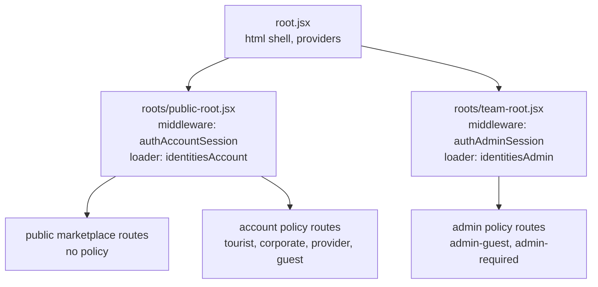

## TL;DR

- Each virtual root mounts one **session middleware**. It reads the current principal **at most once per Node request**, and only when something asks.
- The root `loader` asks, and publishes the result for the header and pages. Policy guards ask the same memoized read, so there is still only one API call.
- `401` becomes `null`. Every other failure is thrown to the error boundary.
- The root re-reads the session after any non-`GET` action, including one that failed with `401` or `403`. It does not re-read on a plain URL change.

:::info Three rules

1. **No cookie, no call.** The middleware checks for the cookie before it builds any request.
2. **Only `401` means signed out.** The middleware catches `401` and rethrows everything else.
3. **Node reads, the browser writes.** The middleware only reads. It forwards any refresh `Set-Cookie` headers (ADR-019 R5).

:::

## Words this page uses

| Word | Meaning |
| --- | --- |
| Session middleware | `authAccountSession.middleware` or `authAdminSession.middleware`. Exported from a virtual root as `middleware` |
| Router context | React Router's per-request `context` (`createContext` from `react-router`). Not React context |
| Lazy read | The API call starts on the first `getIdentitiesAccountCurrent()` call and is memoized for the rest of the request |
| Cookie header | The `Cookie` value Node forwards to Rails. After a refresh it holds the new tokens (`getCookieHeader()`) |
| Revalidation | React Router running matched loaders again after an action or a `revalidate()` call |

## How the routes nest



The two roots never nest inside each other. A request under `/team` never runs the account middleware, and the reverse.

## The session middleware (target)

`app/auth/auth-account-session-middleware.js`:

```js
import { createContext } from 'react-router'
import { identitiesAccountsApi } from '@/api/identities-accounts-api'
import { authSessionCookies } from '@/auth/auth-session-cookies'

const accountSessionContext = createContext(null)

const middleware = async ({ request, context }, next) => {
  const hasSessionCookie = authSessionCookies.hasAccountSessionCookie(request)
  const refreshScope     = { promise: null, setCookieHeaders: [], cookieHeader: request.headers.get('cookie') }

  let accountPromise = null

  const getIdentitiesAccountCurrent = () => {
    if (accountPromise) return accountPromise

    accountPromise = (async () => {
      if (!hasSessionCookie) return null

      try {
        return await identitiesAccountsApi.current({ refreshScope: refreshScope })
      } catch (error) {
        if (error.status === 401) return null

        throw error
      }
    })()

    return accountPromise
  }

  const getCookieHeader = () => refreshScope.cookieHeader

  context.set(accountSessionContext, {
    getIdentitiesAccountCurrent : getIdentitiesAccountCurrent,
    getCookieHeader             : getCookieHeader
  })

  const response = await next()

  for (const setCookieHeader of refreshScope.setCookieHeaders) {
    response.headers.append('Set-Cookie', setCookieHeader)
  }

  if (hasSessionCookie) {
    response.headers.set('Cache-Control', 'private, no-store')
  }

  return response
}

export const authAccountSession = {
  context    : accountSessionContext,
  middleware : middleware
}
```

`refreshScope` is the per-request refresh lock from ADR-019 R2. `ky-client` must use it on Node instead of its module-level `refreshPromise`. The exact option name is set in the Phase 0 spec. The shape above is the contract.

`app/auth/auth-admin-session-middleware.js` is the same file with `hasAdminSessionCookie`, `teamSessionsApi.current`, and `getIdentitiesAdminCurrent`.

## The root loader (target)

```js
// app/roots/public-root.jsx
export const middleware = [authAccountSession.middleware]

export const loader = async ({ context }) => {
  const { getIdentitiesAccountCurrent } = context.get(authAccountSession.context)

  return { identitiesAccount: await getIdentitiesAccountCurrent() }
}
```

The loader no longer copies `Set-Cookie` headers. The middleware does it once for every response (document, `.data`, and thrown redirects).

## Three rules for calling the current endpoint

| # | Rule | Why |
| --- | --- | --- |
| 1 | No session cookie → return `null` without a call | SEO pages cost nothing for anonymous visitors (ADR-018 forces) |
| 2 | Call at most once per request, lazily | The root loader and a policy guard both ask. They share one promise |
| 3 | `401` → `null`. Anything else → throw | An outage must not look like a logout (ADR-018 invariant 2) |

## Other server loaders

A server `loader` that calls a user-scoped API must forward the middleware's cookie header, not the raw request header:

```js
export async function loader({ context }) {
  const { getCookieHeader } = context.get(authAccountSession.context)

  return touristsBookingsBookingApi.index({ cookie: getCookieHeader(), isRefreshDisabled: true })
}
```

Reason: if the middleware refreshed, the raw header still holds the expired access token. A second refresh from the same request would break ADR-019 R2 and R4.

Public marketplace loaders may keep forwarding `request.headers.get('cookie')`. Marketplace endpoints never answer `401` for a session reason, so they never refresh.

## Where the session is kept

| Place | What | Lifetime |
| --- | --- | --- |
| Router context (Node) | The memoized read and cookie header | One request |
| Root loader data | `identitiesAccount` / `identitiesAdmin` | Until the root revalidates |
| `AuthProvider` / `AdminAuthProvider` | A copy of root loader data for components | Same as root loader data |

Target: `AuthProvider` becomes **read-only**. It mirrors root loader data. `onIdentitiesAccountUpdate` is removed once login and logout revalidate (Phase 3). Today login pages call `onIdentitiesAccountUpdate(sessionResponse)` to patch the header.

A stale copy in the browser is safe. Rails checks every request, and the next Node request runs the policy again ([Rails is the boundary](/docs/engineering/authentication/rails-is-the-boundary)).

## When the root reads the session again

| Event | Root re-reads? |
| --- | --- |
| Document request | Yes. Every loader runs |
| In-app click, URL path or search changes | No. `shouldRevalidate` returns `false` when `currentUrl.href !== nextUrl.href` (today and target) |
| Any non-`GET` action, success or failure | Yes. Target `shouldRevalidate` returns `true` for every non-`GET` `formMethod`, including an `actionStatus` of `401` or `403` |
| `revalidate()` after a direct call is refused | Yes |

The policy guard does not depend on root revalidation. It calls `getIdentitiesAccountCurrent()` itself, so it reads fresh data on every Node request it runs in.

Target `shouldRevalidate` for both roots:

```js
export function shouldRevalidate({ formMethod, actionStatus, currentUrl, nextUrl, defaultShouldRevalidate }) {
  const isMutation   = !!formMethod && formMethod.toUpperCase() !== 'GET'
  const isAuthFailed = actionStatus === 401 || actionStatus === 403

  if (isMutation || isAuthFailed) return true
  if (currentUrl?.href !== nextUrl?.href) return false

  return defaultShouldRevalidate
}
```

This is the **only** `shouldRevalidate` in the auth system. Never copy it to a policy route ([policy middleware](/docs/engineering/authentication/policy-middleware)).

## Today vs target

| Topic | Today (`public-root.jsx`, `team-root.jsx`) | Target |
| --- | --- | --- |
| Middleware | None | `authAccountSession` / `authAdminSession` |
| No cookie | Calls the API anyway | No call |
| Error handling | `catch { return { identitiesAccount: null } }` | `401` → `null`, else throw |
| `Set-Cookie` forwarding | Root loader only | Middleware, every response |
| `Cache-Control` | Not set | `private, no-store` when a session cookie is present |
| Refresh lock | Module-level (cross-user leak, ADR-019) | Per request |

## Related documents

- Previous: [What Red Cab Web knows](/docs/engineering/authentication/what-red-cab-web-knows)
- Next: [Changing a session](/docs/engineering/authentication/changing-a-session)
- [ADR-019 refresh rules](/docs/architecture/decisions/adr-019-session-technology-phase-1-and-2#refresh-rules-binding-on-red-cab-web-while-option-a-holds)
