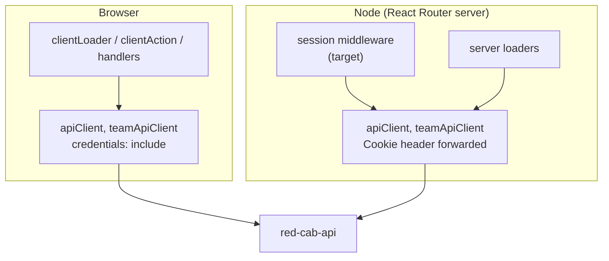

## TL;DR

- `red-cab-web` runs in two places: **Node** (server render and `.data` requests) and the **browser**.
- There are two identity systems: **account** (Tourist, Corporate, Provider) and **team admin**. They share nothing but the `redirect_to` helper.
- The web knows only what Rails returns from two endpoints: `GET identities/accounts/current` and `GET team/identities/admins/current`.
- The web never reads a token, never decodes a JWT, and never judges a session's age.

:::info Three rules

1. **No cookie, no call.** If `rc_access` and `rc_refresh` are both missing, the account is `null`. Node does not ask Rails.
2. **Only `401` means signed out.** Any other failure is an error.
3. **Node reads, the browser writes.** Node forwards cookies. The browser logs in and out.

:::

## Words this page uses

| Word | Meaning |
| --- | --- |
| Node | The React Router server. It renders documents and answers `.data` requests |
| Browser | The React app after hydration. It runs `clientLoader`, `clientAction`, and event handlers |
| Document request | A full page load: new tab, reload, typed URL, email link |
| `.data` request | The request React Router sends to Node on an in-app click when a matched route has a server `loader` |
| Session cookie | Any of `rc_access`, `rc_refresh` (account) or `rc_team_access`, `rc_team_refresh` (admin). All `httponly` |
| CSRF cookie | `CSRF_TOKEN` or `TEAM_CSRF_TOKEN`. Readable by JS. Echoed in the `X-CSRF-Token` header on non-`GET` requests |
| Optional auth | `Marketplace::BaseController` reads the account if a valid cookie exists, and serves the request as a guest otherwise. It never answers `401` for a missing session |

## Two runtimes

| Question | Browser | Node |
| --- | --- | --- |
| How does it send cookies to Rails? | `credentials: 'include'`. The browser attaches cookies for the API host | Copies the incoming `Cookie` header (`request.headers.get('cookie')`) |
| May it log in or out? | Yes | No (ADR-018 invariant 3) |
| May it refresh? | Yes, after a `401`, once per tab at a time (ADR-019 R2) | Only inside the session middleware read, once per request (R4) |
| Where does it keep the session? | React context filled from root loader data | Per-request router context. It dies with the request |

## Two identity systems

| | Account | Team admin |
| --- | --- | --- |
| Principal | `Identities::Account` | `Identities::Admin` |
| Roles | `tourist`, `corporate`, `provider` (`ACCOUNT_ROLE` in `identities-account-constant.js`) | None. Every admin is signed in or not (`IAM-Q4`) |
| Virtual root | `roots/public-root.jsx` | `roots/team-root.jsx` |
| API client | `apiClient` (`VITE_API_REDCAB_URL`) | `teamApiClient` (`VITE_API_TEAM_URL`, falls back to `VITE_API_REDCAB_URL`) |
| Access cookie | `rc_access` | `rc_team_access` |
| Refresh cookie | `rc_refresh` | `rc_team_refresh` |
| CSRF cookie | `CSRF_TOKEN` | `TEAM_CSRF_TOKEN` |
| Redis namespace | `identities_account:<uuid>` | `identities_admin:<uuid>` |
| Current endpoint | `GET identities/accounts/current` | `GET team/identities/admins/current` |
| Refresh endpoint | `PATCH identities/sessions/current` | `PATCH team/identities/admins/sessions/current` |
| React context | `AuthProvider` / `useAuth` | `AdminAuthProvider` / `useAdminAuth` |

An account cookie can never satisfy a team endpoint, and the reverse. Rails checks the cookie name and the namespace (`SessionPrincipal::ACCOUNT` vs `SessionPrincipal::TEAM`).

Cookie name checks must match the **whole name**. `rc_access=` must not match `rc_team_access=`. Test for `name=` at the start of each `;`-separated pair.

## What the web knows about an account

Everything comes from `Identities::UsersAccountBaseSerializer`:

| Field | Type | Web uses it for |
| --- | --- | --- |
| `uuid` | string | Signed-in check |
| `email` | string | Display |
| `first_name`, `last_name` | string or null | Display |
| `role` | `tourist` \| `corporate` \| `provider` | **Surface routing only.** Entry rules pick a surface from it (ADR-018 D5) |
| `language_preference` | `en` \| `ja` \| null | Language UI (`FR-IAM-010`) |
| `is_email_verified` | boolean | Verification banners |
| `should_prompt_language` | boolean | First-login language prompt (`FR-IAM-010`, `FR-IAM-011`) |

What the web does **not** know, and must not guess:

- Whether a provider is approved. Onboarding owns that (`INV-6`, `INV-7`). The provider pages read it from `GET providers/profile`.
- Whether an action is allowed. The API decides per request (ADR-010).
- When the access token expires. The web never reads a token.

## What the web knows about an admin

From `Identities::TeamAdminBaseSerializer`: `uuid`, `email`, `name`. Nothing else.

## Optional auth on `marketplace/`

`Marketplace::BaseController#identify_identities_user` tries the account cookie. If the token is missing, invalid, or expired, or the account is not active, it sets `CurrentRequest.identities_user = nil` and continues. So:

- A marketplace call never answers `401` for a session reason.
- A marketplace call never triggers a web refresh.
- Public catalog pages render the same HTML for guests and signed-in people, except the header.

This is why public routes need no policy (ADR-018 D9, `AMB-022`).

## Today vs target

| Topic | Today | Target |
| --- | --- | --- |
| Session read on a request with no cookie | `GET …/accounts/current` → `401` → `PATCH …/sessions/current` → `401` → `null`. Two wasted calls | No call. `null` |
| Session read on API outage | `null` (looks signed out) | Error boundary |
| Where the account lives on Node | Root loader data only | Router context (middleware) + root loader data |

## Related documents

- Next: [Reading the session](/docs/engineering/authentication/reading-the-session)
- [Contract sheet](/docs/engineering/authentication/appendix-web-api-contract)
- [ADR-018](/docs/architecture/decisions/adr-018-web-authentication-enforcement-model)
