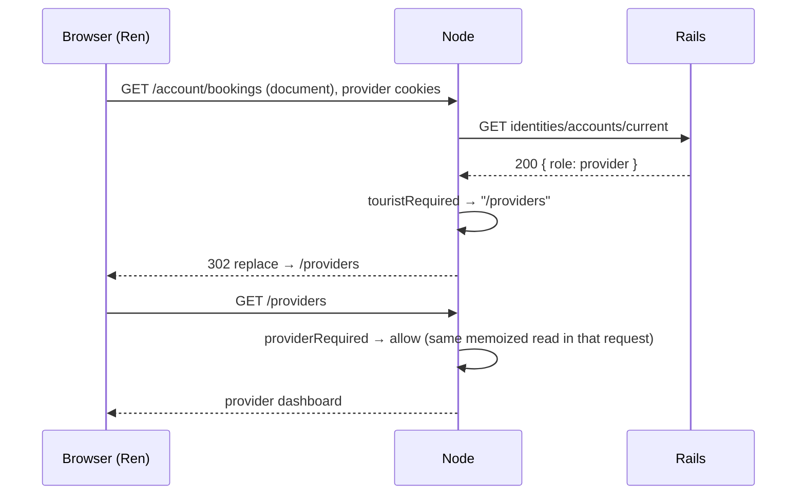
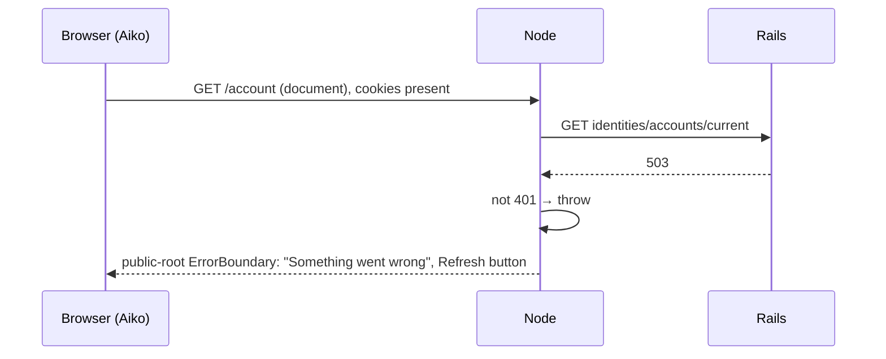
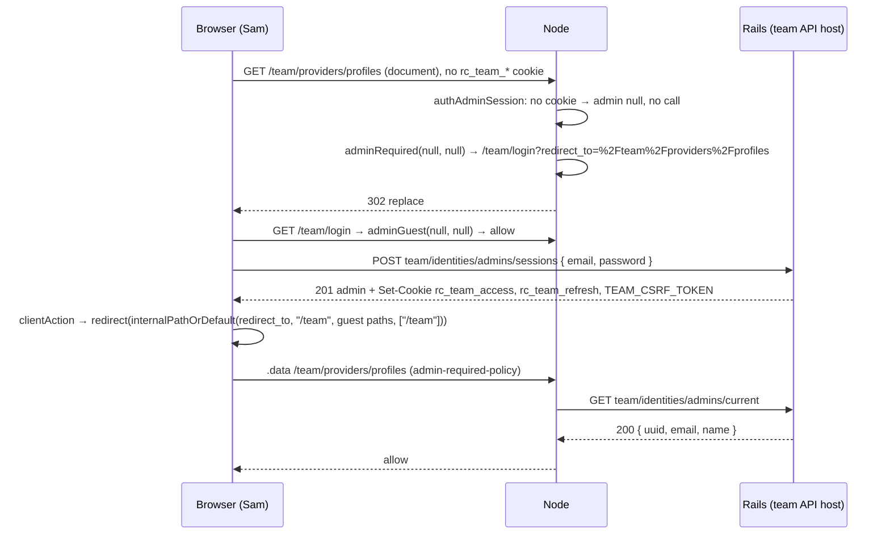

## TL;DR

Five moments, each as a sequence diagram of the **target** design:

1. A guest browses a listing, clicks Book, signs in, and lands on checkout.
2. A signed-in tourist opens `/account/bookings` in a new tab after the access token expired.
3. A provider opens a tourist page.
4. The API is down when a signed-in tourist reloads.
5. A team admin signs in.

:::info Three rules

1. **No cookie, no call.** See example 1, first request.
2. **Only `401` means signed out.** See example 4.
3. **Node reads, the browser writes.** See the login step in examples 1 and 5.

:::

## Words this page uses

| Word | Meaning |
| --- | --- |
| Aiko | A tourist. Account Role `tourist` |
| Ren | A provider. Account Role `provider` |
| Sam | A team admin |
| Node | `red-cab-web` server |
| Rails | `red-cab-api` |

## 1. Guest listing → login → checkout

```mermaid
sequenceDiagram
  participant B as Browser (Aiko)
  participant N as Node
  participant R as Rails

  Note over B,R: Aiko has no cookies
  B->>N: GET /districts/tokyo/areas/shinjuku/listings/{uuid}
  N->>N: authAccountSession: no rc_* cookie → account null, no call
  N->>R: GET marketplace/catalog/listings/{uuid} (+ quote)
  R-->>N: 200 (guest, optional auth)
  N-->>B: HTML, index follow, Book CTA

  B->>B: picks slot; Book → /login?redirect_to=/account/checkout?listing_id=…&availability_slot_id=…&passenger_count=2
  B->>N: .data for /login (account-guest-policy)
  N->>N: no cookie → accountGuest(null) → allow
  N-->>B: login page

  B->>R: POST identities/sessions { email, password }
  R-->>B: 201 account + Set-Cookie rc_access, rc_refresh, CSRF_TOKEN
  B->>B: clientAction → redirect(postAuthPath) = /account/checkout?…
  B->>N: .data for /account/checkout (tourist-required-policy) + root revalidate
  N->>R: GET identities/accounts/current (cookie forwarded)
  R-->>N: 200 { role: tourist }
  N->>N: touristRequired → allow
  N-->>B: route data (identitiesAccount)
  B->>R: checkout clientLoader: marketplace quote / availability
  R-->>B: 200 server price (PRC-1)
```

Points to notice:

- The public page cost **zero** session calls.
- The price on checkout comes from Rails. The URL carries only listing, slot, and passenger count (`PRC-1`, `PRC-2`).
- Checkout, not the Book CTA, is the auth gate (`NFR-SEC-005`, web-56 design decision #5).

## 2. SSR document request with an expired access token

```mermaid
sequenceDiagram
  participant B as Browser (Aiko)
  participant N as Node
  participant R as Rails

  B->>N: GET /account/bookings (document), Cookie: rc_access (expired), rc_refresh, CSRF_TOKEN
  N->>N: session middleware: cookie present; refreshScope for this request
  N->>R: GET identities/accounts/current
  R-->>N: 401
  N->>R: PATCH identities/sessions/current + X-CSRF-Token (per-request lock, R2)
  R-->>N: 200 + Set-Cookie rc_access(new), CSRF_TOKEN(new)
  N->>N: refreshScope.cookieHeader = new cookies; remember Set-Cookie
  N->>R: GET identities/accounts/current (retry once, R6)
  R-->>N: 200 { role: tourist }
  N->>N: touristRequired → allow; render
  N-->>B: HTML + Set-Cookie (appended once by middleware, R5) + Cache-Control private, no-store
  B->>R: bookings clientLoader (new cookies)
  R-->>B: 200
```

If another visitor's request refreshes at the same moment, it uses **its own** `refreshScope`. Nothing is shared between requests. This is the Phase 0 fix.

## 3. A provider opens a tourist page



**Today:** `withTouristAuth` renders `null` for Ren forever. The page is blank.

If Ren's browser calls `GET tourists/bookings/orders` directly (a raced `clientLoader`), target Rails answers `403 tourist_profile_required`. No refresh. No login redirect.

## 4. API outage on reload



**Today:** the root loader's `catch` returns `identitiesAccount: null`. Aiko sees a signed-out header, and `withTouristAuth` sends her to `/login`, which also fails.

## 5. Team admin login



The account middleware never runs under `team-root`. Sam's account cookies, if any, are irrelevant here.

## Related documents

- Previous: [Rails is the boundary](/docs/engineering/authentication/rails-is-the-boundary)
- Next: [Code map](/docs/engineering/authentication/code-map)
