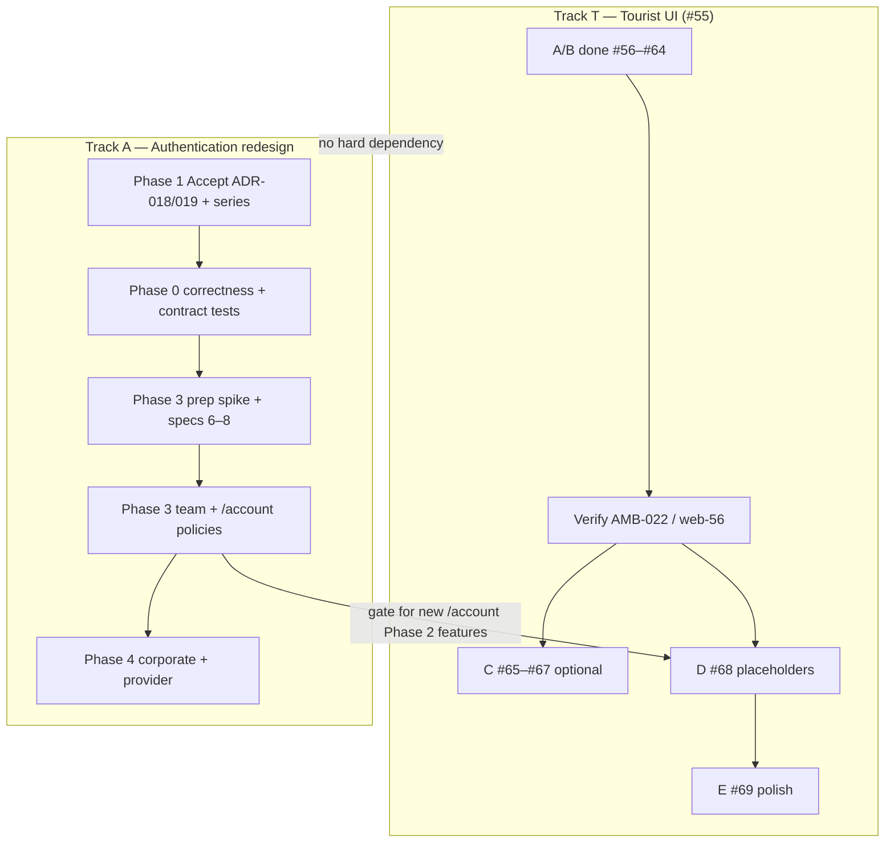

## TL;DR

- Two **parallel tracks** share `red-cab-web` but have different goals: **Tourist UI** (product funnel and chrome) and **Authentication redesign** (policy routes, session contract, production safety).
- **Milestone B** of the tourist track (`red-cab-web#55` issues `#56`–`#64`) is **complete in code**; resume at verification, Milestone C/D (`#65`–`#68`), or polish (`#69`).
- **Auth Phase 0** does not block tourist UI development; it **does** block **production** launch of any authenticated surface.
- **Auth Phase 3** does not block finishing tourist pre–Phase 2; **new Phase 2 tourist features** that add authenticated routes wait for `tourist-required-policy`.
- **Epic `#23`** (split-panel `PublicAuthLayout`) continues for **provider/corporate** portals only; **tourist** IAM chrome is owned by [`web-64`](/docs/engineering/specs/platform/web-64-tourist-account-auth-shell-alignment) (`TouristAuthContent` in shell).

## About this document

Cross-cutting **program** plan for product and engineering leads. It does not replace:

| Document | Owns |
| --- | --- |
| [Tourist UI — pre–Phase 2](/docs/product/planning/roadmap/tourist-ui-pre-phase-2) | Tourist IA, funnel milestones, exit criteria |
| [Authentication implementation roadmap](/docs/engineering/authentication/implementation-roadmap) | Auth phases 0–5, spec backlog, risks, open questions |
| [Authentication series](/docs/engineering/authentication) | Target design and module layout (ADR-018/019) |
| [Phasing roadmap](/docs/product/planning/roadmap) | Backend/product phase boundaries |

**Last aligned with repos:** 2026-09-26 (`red-cab-api@d8ed9b7`, `red-cab-web@c4ce884` per auth roadmap audit). Refresh the [Where we stand](#where-we-stand) section when closing epics or auth phases.

---

## Problem statement

Phase 1 tourist pages existed as scaffolds while backend phases shipped capability. A dedicated **tourist UI** track (`#55`) unified public browse, shell, and funnel. Separately, **ADR-018** replaces client auth HOCs with **policy routes** and pins session-read rules (**ADR-019**).

Without an explicit program plan, teams risk:

- Blocking tourist work waiting for policy migration (unnecessary — HOCs remain legal on unmigrated surfaces).
- Shipping production auth before Phase 0 correctness fixes (refresh isolation, `403` portal gates).
- Re-opening traveler split-panel auth (**`#23` / `#31`**) after **`#64`** intentionally moved tourist IAM into the unified shell.

This document records **how to proceed** from the natural pause after **`#64`**.

---

## Strategic principles

1. **Rails is the boundary.** Web guards shape journeys only; see [ADR-018](/docs/architecture/decisions/adr-018-web-authentication-enforcement-model).
2. **One surface per PR** for auth migration — never HOC and policy on the same subtree.
3. **Spec-first** — auth platform specs under `engineering/specs/iam/auth-platform/` before Phase 0/3 codegen (backlog in [auth roadmap § Implementation spec backlog](/docs/engineering/authentication/implementation-roadmap#implementation-spec-backlog)).
4. **Tourist placeholders before Phase 2 APIs** — Milestone D scaffolds slots; wiring waits on Phase 2 specs and (for new authenticated pages) auth Phase 3.
5. **Docs stay honest** — when code passes a milestone, update the tourist snapshot and this section’s status table.

---

## Two parallel tracks

| Track | Primary outcome | GitHub anchor | Planning doc |
| --- | --- | --- | --- |
| **T — Tourist UI** | Coherent browse → book → manage; Phase 2 UI slots | [red-cab-web#55](https://github.com/markmamba/red-cab-web/issues/55) | [tourist-ui-pre-phase-2](/docs/product/planning/roadmap/tourist-ui-pre-phase-2) |
| **A — Auth redesign** | Safe sessions + policy enforcement on Node | [red-cab-web#77](https://github.com/markmamba/red-cab-web/issues/77) (epic) + children below | [implementation-roadmap](/docs/engineering/authentication/implementation-roadmap) |
| **B — Portal auth UX** | Provider/corporate split-panel and navbar links | [red-cab-web#23](https://github.com/markmamba/red-cab-web/issues/23) | Epic body; **excludes** tourist split-panel post-`#64` |

---

## Where we stand

### Tourist track (`#55`)

| Milestone | Scope | Issue range | Code state (2026-09-26) |
| --- | --- | --- | --- |
| **A — Foundations** | Access, IA, shell | `#56`–`#58` | Closed; specs web-56, web-57, web-58 approved |
| **B — Phase 1 funnel** | Home → discover → listing → checkout → bookings → account/auth chrome | `#59`–`#64` | Closed; includes public routes `#60`, shell alignment `#64` |
| **C — Phase 1 gaps** | Near-me, map pins, sort | `#65`–`#67` | Open |
| **D — Phase 2 placeholders** | Filter/cancel/review/refund/bundle slots | `#68` | Open |
| **E — Visual polish** | Tokens, copy, wireframes | `#69` | Open |

**Pause point:** After `#64` is the correct breakpoint — not mid–Milestone B. Next recommended work: **auth Phase 2 verification checklist** (below) then **`#68`**.

### Authentication redesign

| Auth phase | Blocks tourist UI dev? | Blocks production auth? | Status |
| --- | --- | --- | --- |
| **0** — Correctness + contract | No | **Yes** | Not started (specs not filed) |
| **1** — Accept ADR-018/019 + series | No | No | Proposed — review pending |
| **2** — Tourist access (web-56 / `#60`) | N/A (merged) | No | **Verify** checklist open |
| **3** — Policies: `/team`, `/account`, login | No | Should follow Phase 0 web 1–3 | Not started |
| **4** — `/corporate`, `/providers`; delete HOCs | No | After Phase 3 | Not started |
| **5** — Server sessions | No | Only if ADR-019 superseded | Conditional |

### Epic coordination: `#23` vs `#64`

| Surface | Auth chrome owner | Layout |
| --- | --- | --- |
| Tourist `/login`, `/sign-up`, forgot/reset/verify, OAuth callback | **`#64` / web-64** | `TouristAuthContent` inside `TouristShellLayout` |
| Provider / corporate login and sign-up | **`#23`** children | `PublicAuthLayout` split panel (unchanged by `#64`) |
| Team `/team/login` | Team layout (policy migration Phase 3) | Separate from `#23` |

**Action for epic `#23`:** Treat traveler split-panel migration as **superseded** by web-64; keep marketplace navbar portal links and B2B sign-up work on the epic.

---

## Gates (hard rules)

| Gate | Condition | Unblocks |
| --- | --- | --- |
| **G1 — Production authenticated traffic** | Auth Phase 0 exit criteria met (refresh isolation, root read contract, safe `redirect_to`, API `403` gates, cookie topology OQ #1 recorded) | Launch checkout/bookings/account in production |
| **G2 — Policy PR merge** | Phase 0 web items 1–3 done; Phase 1 accepted; RR 8.0 spike recorded ([policy middleware](/docs/engineering/authentication/policy-middleware)) | Auth Phase 3 implementation PRs |
| **G3 — Phase 2 tourist feature UI** (cancel, review submit, refund status — not placeholders) | `tourist-required-policy` shipped (auth Phase 3 spec 8) | Wire real API on new authenticated tourist routes |
| **G4 — Phase 2 backend** | Product [Phase 2](/docs/product/planning/roadmap/phase-2-marketplace-depth) specs approved | Replace Milestone D stubs with live clients |

Milestone D (**`#68`**) is **not** behind G3 — placeholders on existing pages are explicitly allowed before policies.

---

## Recommended sequencing

### Immediate (planning hygiene)

| # | Work | Owner | Output |
| --- | --- | --- | --- |
| 1 | Complete `#64` manual QA or record waivers | Web | Checklist in [web-64](/docs/engineering/specs/platform/web-64-tourist-account-auth-shell-alignment) |
| 2 | Run auth **Phase 2 verification** (public catalog, guest Book → login → checkout) | Web | Checkboxes in [auth roadmap Phase 2](/docs/engineering/authentication/implementation-roadmap#phase-2--tourist-access-web-56--60) |
| 3 | Auth **Phase 1** review — Accept ADR-018/019; answer/defer OQ 2–4 | Architect + PO | ADR status Accepted |
| 4 | Update epic `#23` description (tourist out of split-panel scope) | PM/Tech lead | GitHub epic only |
| 5 | Refresh tourist roadmap snapshot | Docs | [tourist-ui-pre-phase-2 § snapshot](/docs/product/planning/roadmap/tourist-ui-pre-phase-2#current-implementation-snapshot) |

### Next implementation waves (parallel)

**Wave T (tourist product)**

1. `#68` — Phase 2 placeholder slots (closes major `#55` exit criterion).
2. `#65`–`#67` — as capacity allows (not required for “funnel complete”).
3. `#69` — polish before marketing push.

**Wave A (auth platform)**

1. Draft and approve Phase 0 specs (auth-platform backlog rows 1–5).
2. Implement Phase 0 (API + web); run contract tests; tick IAM audit checkboxes.
3. Draft specs 6–8; spike middleware on React Router 8.0.0.
4. First Phase 3 PR: **team** policies (smaller blast radius) **or** tourist `/account` — one surface per PR.

### GitHub issues ↔ auth phases

Epic: [red-cab-web#77](https://github.com/markmamba/red-cab-web/issues/77) — all items on [2026 RedCab Project](https://github.com/users/markmamba/projects/2).

Spec files use this issue number as `NNN` in `iam/auth-platform/{web|api}-NNN-{slug}.md`.

| Auth backlog # | Phase | Issue | Spec path (create before code) |
| --- | --- | --- | --- |
| — | 1 | [redcab-docs#19](https://github.com/markmamba/redcab-docs/issues/19) | ADR acceptance (no codegen spec required) |
| — | 0 / G1 | [redcab-docs#20](https://github.com/markmamba/redcab-docs/issues/20) | Record OQ1 in ADR-019 |
| — | 2 | [red-cab-web#82](https://github.com/markmamba/red-cab-web/issues/82) | Verification checklist (optional chore spec) |
| 1 | 0 | [red-cab-web#78](https://github.com/markmamba/red-cab-web/issues/78) | `web-78-ssr-refresh-request-scope.md` |
| 2 | 0 | [red-cab-web#79](https://github.com/markmamba/red-cab-web/issues/79) | `web-79-root-session-read-contract.md` |
| 3 | 0 | [red-cab-web#80](https://github.com/markmamba/red-cab-web/issues/80) | `web-80-safe-redirect-helper.md` |
| 4 | 0 | [red-cab-api#145](https://github.com/markmamba/red-cab-api/issues/145) + [red-cab-web#81](https://github.com/markmamba/red-cab-web/issues/81) | `api-145-portal-gate-forbidden.md` |
| 5 | 0 | [red-cab-api#146](https://github.com/markmamba/red-cab-api/issues/146) | `api-146-auth-contract-tests.md` |
| — | 3 | [red-cab-web#83](https://github.com/markmamba/red-cab-web/issues/83) | Spike — record results in `policy-middleware.md` |
| 6 | 3 | [red-cab-web#84](https://github.com/markmamba/red-cab-web/issues/84) | `web-84-auth-core-modules.md` |
| 7 | 3 | [red-cab-web#85](https://github.com/markmamba/red-cab-web/issues/85) | `web-85-team-policy-routes.md` |
| 8 | 3 | [red-cab-web#86](https://github.com/markmamba/red-cab-web/issues/86) | `web-86-tourist-account-policy-routes.md` |
| 9 | 4 | [red-cab-web#87](https://github.com/markmamba/red-cab-web/issues/87) | `web-87-corporate-provider-policy-routes.md` |
| 10 | 4 | [red-cab-web#88](https://github.com/markmamba/red-cab-web/issues/88) | `web-88-remove-auth-hocs.md` |
| 11 | 5 | [red-cab-api#147](https://github.com/markmamba/red-cab-api/issues/147) | Conditional — only if ADR-019 superseded |

---

## Tourist pre–Phase 2 exit criteria (program view)

Cross-check [tourist-ui-pre-phase-2 exit criteria](/docs/product/planning/roadmap/tourist-ui-pre-phase-2#exit-criteria-ready-for-phase-2-tourist-feature-ui):

| Criterion | Program status (2026-09-26) | Next step |
| --- | --- | --- |
| Milestone A decisions recorded | Done (web-56, web-57, web-58) | Mark checkboxes in tourist doc |
| Guest Home → Listing | Implemented (`#60`); **verify** G1-style checklist | [red-cab-web#82](https://github.com/markmamba/red-cab-web/issues/82) |
| Logged-in Book → Checkout → detail | Implemented | Regression on shell changes |
| Unified header/footer (incl. IAM post-`#64`) | Implemented in code; manual QA open | Complete web-64 manual matrix |
| Phase 2 UI slots on pages | Not started | `#68` |
| No client price computation (`PRC-1`) | Ongoing discipline | Review on each tourist PR |
| Listing/checkout URL alignment (`PRC-2`) | Implemented with slug routes | Joint verify at checkout |

**Ready for Phase 2 tourist _feature_ UI** (backend + real clients) additionally requires **G3** and product Phase 2 specs — not merely closing `#55`.

---

## Risks (program-level)

| ID | Risk | Mitigation | Detail |
| --- | --- | --- | --- |
| P-1 | Tourist snapshot misleads agents | Update snapshot when merging `#55` children | [R-11](/docs/engineering/authentication/implementation-roadmap#migration-and-risk-register) |
| P-2 | `#23` reintroduces tourist split-panel | Epic scope edit; cite web-64 | This doc § Epic coordination |
| P-3 | Production launch before Phase 0 | Enforce **G1** in release checklist | ADR-019 concurrency finding |
| P-4 | Half-migrated auth surface | One policy PR per surface | ADR-018 D8; auth R-2 |
| P-5 | Phase 2 feature UI before policies | Enforce **G3** | Auth roadmap Phase 3 gate |

Full auth risk register: [implementation-roadmap § Migration and risk register](/docs/engineering/authentication/implementation-roadmap#migration-and-risk-register).

---

## Open questions (program owners)

Delegated to [auth roadmap open questions](/docs/engineering/authentication/implementation-roadmap#open-questions). Program-critical items:

| # | Question | Program impact |
| --- | --- | --- |
| 1 | Production cookie topology | **G1** — SSR session visibility |
| 4 | Post-auth return to public marketplace URLs | Phase 3 entry rules + tourist funnel UX |

---

## Agent session playbook

1. Read this document to choose **Track T**, **Track A**, or **Track B (`#23`)**.
2. Never implement codegen without an **approved** spec in `docs/engineering/specs/`.
3. For tourist routes: [web-56](/docs/engineering/specs/iam/web-56-tourist-access-and-route-contract) layout table still applies; HOCs on `/account/**` until Phase 3.
4. For auth work: read [Authentication](/docs/engineering/authentication) in order once, then [entry rules](/docs/engineering/authentication/entry-rules) for lookups.
5. After closing an issue, update **Where we stand** here or the tourist snapshot — whichever track moved.

---

## Related documents

- [Planning index](/docs/product/planning)
- [Tourist UI — pre–Phase 2](/docs/product/planning/roadmap/tourist-ui-pre-phase-2)
- [Authentication implementation roadmap](/docs/engineering/authentication/implementation-roadmap)
- [ADR-017 Tourist public URL architecture](/docs/architecture/decisions/adr-017-tourist-ui-public-url-architecture)
- [ADR-018 Web authentication enforcement](/docs/architecture/decisions/adr-018-web-authentication-enforcement-model)
- [ADR-019 Session technology](/docs/architecture/decisions/adr-019-session-technology-phase-1-and-2)
- [red-cab-web#55](https://github.com/markmamba/red-cab-web/issues/55) — tourist epic
- [red-cab-web#77](https://github.com/markmamba/red-cab-web/issues/77) — authentication enforcement epic (ADR-018)
- [red-cab-web#23](https://github.com/markmamba/red-cab-web/issues/23) — portal auth UI epic
