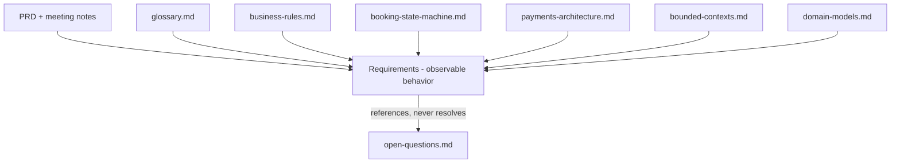

## TL;DR

- Defines **how requirements are written, identified, grouped, and traced** — the entry point to the requirements set.
- FRs describe observable behavior; NFRs describe qualities/constraints on that behavior.
- Requirements are **subordinate** to business rules, lifecycle, and domain ownership (§9 precedence).

## About this document

Requirements architecture and conventions — specification-level only, no implementation detail.

| Topic | Document |
| --- | --- |
| Functional requirements | [Functional Requirements](/docs/requirements/functional-requirements) |
| Non-functional requirements | [Non-Functional Requirements](/docs/requirements/non-functional-requirements) |
| Traceability | [Traceability Matrix](/docs/requirements/traceability-matrix) |
| Terminology | [Glossary](/docs/business-rules/glossary) |
| Rules | [Business Rules](/docs/business-rules/invariants) |
| Open decisions | [Open Questions](/docs/ambiguities/open-questions) |

---

## 1. What a requirement is (and is not)
A **requirement** states an externally observable behavior of the system — something an Actor (Tourist, Corporate Client, Provider, Admin) or an external party could observe from outside the system boundary.

- A requirement describes **what** the system does as observed externally, never **how** it is built.
- A requirement is **not** an invariant, a lifecycle rule, a domain model, or a design decision. Those live in the documents listed in §7 and are *authoritative over* requirements (see §9).
- If a statement cannot be observed from outside the system, it is not a requirement here — it is a rule, a model constraint, or an implementation concern.

## 2. Functional vs non-functional requirements

**Functional requirements (FR)** describe observable behavior: what the system does in response to an Actor action or an event — capabilities, outcomes, permitted and blocked actions, and state-dependent results.
- Example shape: "The system **shall** allow an Approved Provider to publish a Listing that has at least one photo."

**Non-functional requirements (NFR)** describe observable qualities and constraints on that behavior — performance, timeliness, availability, security, localization, auditability, accessibility, and compliance.
- Example shape: "The system **shall** dispatch a booking-confirmation notification within 60 seconds of the triggering event."

The distinction is by *nature of observation*: FRs are about behavior occurring; NFRs are about the qualities/constraints under which behavior occurs. Both are externally observable and both are testable.

## 3. Requirement ID conventions
Requirements use stable, never-reused IDs so they can be traced across documents and over time.

- **Functional:** `FR-<CTX>-<NNN>` — e.g. `FR-BKG-014`.
- **Non-functional:** `NFR-<CAT>-<NNN>` — e.g. `NFR-PERF-003`.

`<CTX>` is the owning bounded-context code (§6). `<CAT>` is a non-functional category code (§3.1). `<NNN>` is a zero-padded sequence within that group.

Rules:
- IDs are **immutable and never reused**. A withdrawn requirement is marked `Deprecated`, not deleted, and its ID is retired.
- A requirement belongs to **exactly one** owning context (the context whose behavior it primarily describes). Cross-context effects are expressed through traceability links, not by multi-owning.
- Each requirement records the PRD story reference(s) it derives from (e.g. `A-03`, `E-10`) for upstream traceability to `notes/redcab-prd.pdf` in the planning repo (not published on this site).

### 3.1 Non-functional categories
- `PERF` performance / latency / throughput
- `TIME` timeliness / SLA (e.g. 60-second notifications)
- `AVAIL` availability / resilience
- `SEC` security / authentication / access control
- `PRIV` privacy / data protection
- `I18N` localization / language
- `AUD` auditability / traceability of financial facts
- `A11Y` accessibility
- `COMP` legal / regulatory compliance

## 4. Normative language rules
Requirements use normative keywords with precise meaning:

- **shall** — mandatory, externally observable behavior. The system is non-conformant if it does not hold.
- **shall not** — mandatory prohibition.
- **may** — genuinely optional behavior; conformance does not depend on it. Used for capabilities offered at the Actor's or operator's discretion.
- **should** — used sparingly for a strong recommendation that is not a conformance condition; prefer resolving "should" into a "shall" or "may" before a requirement is considered final.

Additional language rules:
- Each requirement is a single, testable statement of observable behavior. No solution language (no APIs, endpoints, schemas, frameworks, screens, or algorithms).
- Conditions are expressed in observable terms ("Given an Approved Provider…", "When payment fails…", "Then the system shall…").
- One behavior per requirement; compound behaviors are split so each can be traced and verified independently.

## 5. Traceability philosophy
Traceability exists so every behavior is justified by a source and connected to the rules and models that constrain it.

Each requirement is traceable in three directions:
- **Upstream → source:** the PRD story / meeting-note origin it derives from.
- **Lateral → governing rules and models:** the business rules, lifecycle states, financial invariants, bounded-context ownership, and domain concepts that constrain it (the documents in §7).
- **Downstream → verification:** the acceptance criteria by which the behavior is judged (acceptance criteria are observable conditions, not test implementations).

Principles:
- **No orphan requirements:** every FR/NFR links to at least one source and at least one governing rule or model concept.
- **No orphan rules of record:** material invariants and lifecycle rules should be observable through at least one requirement, or explicitly noted as internal-only (not externally observable) so the gap is intentional.
- The detailed mapping lives in the traceability matrix (a separate document in this set); this README defines the philosophy, not the matrix itself.

## 6. Grouping by bounded context
Functional requirements are grouped by the owning bounded context from [../architecture/bounded-contexts.md](/docs/architecture/bounded-contexts). Context codes:

- `IAM` — Identity & Access (supporting)
- `PRV` — Provider Onboarding & Verification
- `CAT` — Catalog & Inventory (incl. Geography, Pricing, Availability, Search modules)
- `BKG` — Booking & Checkout
- `PAY` — Payments & Payouts
- `COR` — Corporate Quotation & Invoicing
- `REV` — Reviews & Ratings
- `NOT` — Notifications (supporting)

Grouping rules:
- A requirement is owned by the context whose **observable behavior** it describes, consistent with that context's source-of-truth concepts in [../domain/domain-models.md](/docs/domain/domain-models).
- Behavior that spans contexts (e.g. checkout touching Catalog availability and Payments) is owned by the context that the Actor observably interacts with, with lateral trace links to the others.
- Non-functional requirements are grouped by category (§3.1) and may apply to one or many contexts; their scope is stated explicitly.

## 7. Relationship to the authoritative documents
Requirements are downstream of, and bounded by, these documents. Where they overlap, the document below governs and the requirement conforms.

- **[../business-rules/business-rules.md](/docs/business-rules/invariants)** — invariants and operational rules (`INV-`, `LC-`, `PRC-`, `PAY-`, `BKG-`, `CON-`, `OPR-`). Requirements express observable behavior consistent with these; they never weaken or contradict them. Terminology follows [../business-rules/glossary.md](/docs/business-rules/glossary).
- **[../architecture/booking-state-machine.md](/docs/architecture/booking-state-machine)** — the authoritative Booking lifecycle. Requirements about booking behavior reference states/transitions but do not redefine them.
- **[../architecture/payments-architecture.md](/docs/architecture/payments-architecture)** — money-facts vs money-movement, financial invariants (`FIN-`). Requirements about payment behavior conform to these and to the snapshot rules.
- **[../architecture/bounded-contexts.md](/docs/architecture/bounded-contexts)** — defines the owning contexts and their boundaries used for grouping (§6).
- **[../domain/domain-models.md](/docs/domain/domain-models)** — defines the concepts, aggregates, and source-of-truth ownership that requirements describe behavior over. Requirements use these concept names exactly.
- **[../ambiguities/open-questions.md](/docs/ambiguities/open-questions)** — the open-decision register (§8).

## 8. How ambiguities are referenced
Requirements never silently resolve an open question.

- A requirement affected by an unresolved decision **shall** cite the relevant `AMB-###` item from [../ambiguities/open-questions.md](/docs/ambiguities/open-questions).
- If a requirement must be stated before a decision is made, it is written against the **temporary assumption** recorded in that AMB item and is flagged as **Provisional**, citing the AMB ID. It is not treated as final until the AMB item is resolved.
- Where a decision would change *whether or how* a behavior is observable (e.g. authorization vs capture, `AMB-001`), the requirement states the behavior conditionally and defers the contested part to the AMB item rather than inventing an outcome.
- When an AMB item is resolved (via its Decision Log), the dependent Provisional requirements are revisited and finalized.

## 9. Precedence: requirements do not override invariants or lifecycle rules
Requirements are **subordinate** to the rules and models that govern correctness.

- If a requirement appears to conflict with an invariant (`INV-`/`FIN-`), a lifecycle rule (`LC-`/state machine), the pricing authority (`PRC-`), or a domain ownership boundary, the rule/model **prevails** and the requirement is corrected.
- Requirements may **constrain or expose** behavior more specifically than a rule, but may never **relax, contradict, or bypass** one.
- A requirement cannot introduce a new lifecycle transition, alter snapshot immutability, change seat-concurrency guarantees, or move a source-of-truth boundary. Such changes occur only by amending the authoritative document (often via an `AMB-###` resolution), after which requirements follow.

## 10. Documents in this set
- `README.md` (this document) — requirements architecture and conventions.
- `functional-requirements.md` — FRs grouped by bounded context (§6).
- `non-functional-requirements.md` — NFRs grouped by category (§3.1).
- `traceability-matrix.md` — the mapping of PRD stories ↔ requirement IDs ↔ governing rules/contexts ↔ acceptance criteria.

## 11. Lifecycle and conformance of a requirement
- **Status values:** `Draft`, `Provisional` (depends on an open `AMB-###`), `Approved`, `Deprecated`.
- A requirement is **conformant-ready** only when it is `Approved`, has a source link, has at least one governing-rule/model link, and has observable acceptance criteria.
- Provisional requirements are tracked alongside their `AMB-###` dependency and cannot reach `Approved` until that item is resolved.

