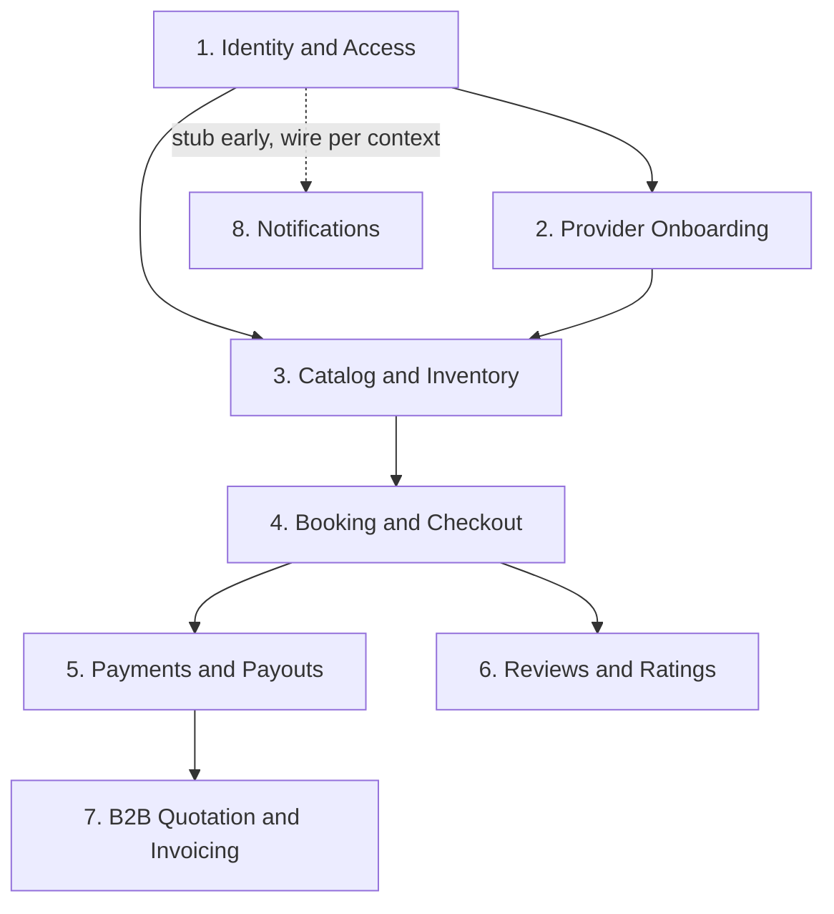

## TL;DR

- **Delivery sequencing** by phase: what ships when, context build order, dependency order, exit criteria.
- Phases are delivery boundaries — the 6+2 context map is fixed; DBML-first for Phase 1–3.
- Use the **Phase overview** table below to open a single phase for review.

## About this document

Roadmap overview — scope, dependency order, phase index, context matrix, and agent playbook.

| Topic | Document |
| --- | --- |
| Phase 0 | [Foundation](/docs/roadmap/phase-0-foundation) |
| Phase 1 | [MVP](/docs/roadmap/phase-1-mvp) |
| Phase 2 | [Marketplace depth](/docs/roadmap/phase-2-marketplace-depth) |
| Phase 3 | [B2B + packages](/docs/roadmap/phase-3-b2b-packages) |
| Requirements | [Requirements](/docs/requirements) |
| Open decisions | [Open Questions](/docs/ambiguities/open-questions) |

---

## How to use this document

- **Phases are delivery boundaries**, not architecture changes. The 6 core + 2 supporting contexts are fixed; phases decide *when* each context's capabilities ship.
- **Exit criteria are observable outcomes** — the condition that means a phase is done. They map to functional requirements where possible; see [../requirements/traceability-matrix.md](/docs/requirements/traceability-matrix).
- **Provisional requirements** (README §8) may ship under a phase's temporary assumption from the ambiguity register. Confirm or resolve the cited `AMB-###` before marking the phase complete.
- **Agent sessions** should pick one context slice per phase step, read that context's requirements + business rules, and implement against [../engineering/backend-conventions.md](/docs/engineering/backend-conventions) and [../engineering/frontend-conventions.md](/docs/engineering/frontend-conventions).
- **DBML-first for Phase 1–3.** Design (or extend) the context's `docs/db/*.dbml` and land migrations **before** Managers/routes/UI for that slice. Conceptual ownership stays in [../architecture/data-model.md](/docs/architecture/data-model); storage shape is owned by DBML in `red-cab-api/docs/db/`.

### Identity & profile model (locked after Phase 0)

| Concern | Owner | Storage |
| --- | --- | --- |
| Auth principal (email, credentials, lockout, language, coarse `role` claim) | IAM | `identities_accounts` |
| Tourist profile | Tourists | `tourists_profiles` |
| Corporate Client profile (org + group size) | B2B | `b2b_corporate_clients` |
| Provider profile / onboarding | PRV | `providers_profiles` (+ type details, licenses, documents, support trial) |
| Platform Admin | IAM (separate principal) | `identities_admins` — **not** a role on `Account` |

Rules:

- Exactly one coarse role per Account; portal authorization prefers **profile presence (+ status)** over the role enum alone.
- No multi-role membership table; no `identities_role_assignments` audit table in baseline.
- Cross-context FKs should prefer stable **profile ids** (`tourist_id`, `provider_id`, `corporate_client_id`) once those contexts write data.

### Implementation checklist legend

Deliverables and exit criteria use checkboxes verified against `red-cab-api/` and `red-cab-web/`:

| Mark  | Meaning                                           |
| ----- | ------------------------------------------------- |
| `[x]` | Done — implemented and wired in that repo         |
| `[~]` | Partial — scaffold or stub exists; not end-to-end |
| `[ ]` | Not started                                       |

Each phase splits tasks into **red-cab-api** and **red-cab-web** so progress is visible per repository. Cross-cutting or joint outcomes appear under **Both repos**.

---

## Scope baseline

| Dimension      | Decision                                                                                                                   |
| -------------- | -------------------------------------------------------------------------------------------------------------------------- |
| Product scope  | Full master PRD (Domains A–G), delivered in phases                                                                         |
| MVP target     | Phase 1 — B2C transfer happy path (browse → book → pay → payout)                                                           |
| Architecture   | Modular monolith — one Rails API, one PostgreSQL DB, one React Router web app                                              |
| Deferred to v2 | Cross-provider multi-day, automated bank reconciliation, OCR license extraction, bundle discounts, dedicated search engine |

---

## Context dependency order

Build contexts in this order within and across phases. Later contexts depend on earlier ones' published contracts.

| Order | Context (code)                             | Rationale                                                          |
| ----- | ------------------------------------------ | ------------------------------------------------------------------ |
| 1     | Identity & Access (`IAM`) + profiles       | Dependency root — principal, role claim, language; Tourist/Corporate/Provider profiles |
| 2     | Provider Onboarding & Verification (`PRV`) | Providers must exist and be Approved before listings               |
| 3     | Catalog & Inventory (`CAT`)                | Geography → Listings → Pricing → Availability → Search modules     |
| 4     | Booking & Checkout (`BKG`)                 | Depends on `calculate_quote()` and guarded seat reservation        |
| 5     | Payments & Payouts (`PAY`)                 | Depends on Booking commission snapshots                            |
| 6     | Reviews & Ratings (`REV`)                  | Depends on Booking completion fact                                 |
| 7     | B2B Quotation & Invoicing (`B2B`)          | Client profile in Phase 0; quotations/invoices in Phase 3          |
| 8     | Notifications (`NOT`)                      | Stub in Phase 0; wire events as each context ships                 |

Within Catalog, build modules in order: **Geography → Listings → Availability → Pricing → Search**.

Within each Phase 1–3 context slice, build in order: **DBML → migrations → models → Managers/routes → web UI**.

---

---

## Phase overview

| Phase | Document | Primary goal | Contexts touched |
| --- | --- | --- | --- |
| **0** | [Foundation](/docs/roadmap/phase-0-foundation) | Runnable repos, IAM + profiles, event bus | IAM, profiles, NOT stub, engineering scaffold |
| **1** | [MVP — B2C happy path](/docs/roadmap/phase-1-mvp) | End-to-end tourist booking + payout | PRV, CAT (basic), BKG, PAY, NOT |
| **2** | [Marketplace depth](/docs/roadmap/phase-2-marketplace-depth) | Reviews, pricing, search, refunds | REV, CAT (advanced), BKG, PRV automation |
| **3** | [B2B + packages](/docs/roadmap/phase-3-b2b-packages) | Quotations, invoices, bank transfer | B2B, BKG manifests, PAY reconciliation |
| **v2** | [Post-baseline](/docs/roadmap/v2-post-baseline) | Unscheduled backlog | Ambiguity register |

---

## Per-phase context matrix

Which contexts receive **new capability** in each phase (✓ = primary build, ◐ = extend/wire, — = no change).

| Context                     | Phase 0 | Phase 1 | Phase 2 | Phase 3 |
| --------------------------- | ------- | ------- | ------- | ------- |
| IAM (`IAM`)                 | ✓       | ◐       | ◐       | ◐       |
| Tourist profiles            | ✓ schema| ◐ gate  | ◐      | ◐       |
| Provider Onboarding (`PRV`) | ✓ schema| ✓ flows | ◐       | —       |
| Catalog (`CAT`)             | —       | ✓       | ✓       | ◐       |
| Booking (`BKG`)             | —       | ✓       | ✓       | ◐       |
| Payments (`PAY`)            | —       | ✓       | ✓       | ✓       |
| Reviews (`REV`)             | —       | —       | ✓       | —       |
| B2B (`B2B`)                 | ✓ client profile | — | — | ✓ quotations/invoices |
| Notifications (`NOT`)       | ✓ stub  | ◐       | ✓       | ◐       |

### DBML file checklist (by phase)

| DBML file | Phase 0 | Phase 1 | Phase 2 | Phase 3 |
| --------- | ------- | ------- | ------- | ------- |
| `identities.dbml` | ✓ | — | — | — |
| `tourists.dbml` | ✓ | — | — | — |
| `providers.dbml` | ✓ schema | ◐ if gaps | ◐ automation fields | — |
| `b2b.dbml` | ✓ corporate client | — | — | ✓ quotations/invoices |
| `notifications.dbml` | ✓ stub | ◐ | ◐ | ◐ |
| `catalog.dbml` | — | ✓ design + migrate | ◐ advanced pricing | ◐ if needed |
| `bookings.dbml` | — | ✓ design + migrate | ◐ cancel/bundle | ◐ manifests/packages |
| `payments.dbml` | — | ✓ design + migrate | ◐ refunds | ◐ reconciliation |
| `reviews.dbml` | — | — | ✓ design + migrate | — |
| `redcab.dbml` | ✓ | ◐ consolidate | ◐ | ◐ |

---

## Agent session playbook

When picking up work in a given phase:

1. Read this document for phase scope, **How to proceed (DBML-first)**, and exit criteria.
2. Read the target context in [../architecture/bounded-contexts.md](/docs/architecture/bounded-contexts) and [../domain/domain-models.md](/docs/domain/domain-models).
3. Confirm profile ownership (Account vs Tourist / Corporate / Provider / Admin) in this document’s **Identity & profile model**.
4. **Schema first:** open or create the context’s `red-cab-api/docs/db/*.dbml`, align with [../architecture/data-model.md](/docs/architecture/data-model), then add migrations + model stubs before Managers/routes/UI.
5. Filter requirements in [../requirements/traceability-matrix.md](/docs/requirements/traceability-matrix) by context and phase.
6. Check [../ambiguities/open-questions.md](/docs/ambiguities/open-questions) for Provisional requirements — use temp assumption or resolve first.
7. Implement using [../engineering/domain-to-code-mapping.md](/docs/engineering/domain-to-code-mapping) and backend/frontend conventions.
8. Gate portal endpoints on the matching **profile** (+ status where required), not role enum alone.
9. Wire domain events per the catalog in bounded-contexts; add notification consumers as NOT matures.
10. Do not ship capabilities listed under **Out of scope** for the current phase.

---

## Related documents

- [../index.md](/docs) — documentation index
- [../architecture/bounded-contexts.md](/docs/architecture/bounded-contexts) — context map and integration contracts
- [../architecture/data-model.md](/docs/architecture/data-model) — conceptual entities and ownership (semantics)
- [../requirements/traceability-matrix.md](/docs/requirements/traceability-matrix) — PRD → requirements → contexts
- [../ambiguities/open-questions.md](/docs/ambiguities/open-questions) — open decisions and temp assumptions
- [../engineering/README.md](/docs/engineering) — implementation conventions
- `red-cab-api/docs/db/` — DBML storage design (identities, tourists, providers, b2b, …)
