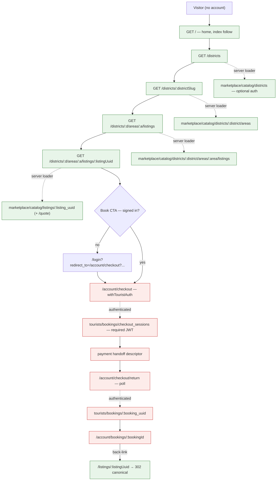

## TL;DR

- `AMB-022` is **RESOLVED — Option A**: public browse of districts, areas, listings and indicative pricing; authentication is required only at checkout initiation.
- Canonical public path family is **`/districts/{districtSlug}/areas/{areaSlug}/listings/{listingUuid}`** per [Geography](/docs/architecture/geography). `/discover` is rejected outright.
- District and Area URL segments are **slugs**; the Listing segment stays a **UUID** for Phase 1 (no listing slug column exists).
- Slug segments **require API work** — all four marketplace geography lookups resolve `find_by(uuid:)` today. Delivered by geography epic [red-cab-api#130](https://github.com/markmamba/red-cab-api/issues/130) ([ADR-016](/docs/architecture/decisions/adr-016-geography-administrative-tree)); blocks web issue #60.
- **URL family unchanged** by the geography tree redesign — `/districts/{districtSlug}/areas/{areaSlug}/listings` is a projection of `catalog_geographies`, not a storage shape change.
- The public funnel currently uses `clientLoader`, so crawlers receive an empty shell. Moving to server `loader` is a **P0 SEO blocker**, not polish.

## About this document

Output of **Session A** of a two-session planning pair. This is a decision record only: no application code changed, no implementation spec drafted. Session B converts §3 into spec `56-tourist-access-model-and-route-contract.md`.

| Topic | Document |
| --- | --- |
| Track plan | [Tourist UI — Pre–Phase 2](/docs/roadmap/tourist-ui-pre-phase-2) |
| Ambiguity register | [Open Questions](/docs/ambiguities/open-questions) (`AMB-022`) |
| URL hierarchy source | [Geography — Discovery and search](/docs/architecture/geography) |
| Geography tree ADR | [ADR-016: Geography Administrative Tree](/docs/architecture/decisions/adr-016-geography-administrative-tree) — storage change; Session A URL family preserved |
| Geography epic | [red-cab-api#130](https://github.com/markmamba/red-cab-api/issues/130) — slug resolution, ancestors on listing payload |
| Frontend conventions | [Frontend Conventions](/docs/engineering/frontend-conventions) |
| Code mapping | [Domain-to-Code Mapping](/docs/engineering/domain-to-code-mapping) |

**Audited:** 2026-09-20 against `red-cab-web` and `red-cab-api` working checkouts, and issues [#55–#69](https://github.com/markmamba/red-cab-web/issues/55) in `markmamba/red-cab-web`. Every finding below cites a file or an issue body; no test suite was executed.

---

## 1. Executive summary

- **`AMB-022` resolves to public browse.** This is the option requirements already encode (`FR-IAM-012`, `NFR-SEC-005`); the only dissent was the Phase 1 roadmap's scheduling row, which is a sequencing note, not a competing decision.
- **Both `FR-IAM-012` and `NFR-SEC-005` move from `Provisional (AMB-022)` to `Approved`.** Their text needs no change — only the status line.
- **`/discover` is rejected.** It is a verb-ish product word, absent from every architecture document, and the Product Owner excluded it from public URLs. Its only advocate is the provisional table in the roadmap and issue #56's proposal.
- **Chosen scheme is the geography.md canonical family**, scoring 26/30 against 16–22 for the alternatives (§3.2). It is the only scheme that expresses District → Area (`FR-CAT-004`, `AMB-020`) in the URL and mirrors the existing marketplace API route shape one-for-one.
- **Slug segments are an API change, not a web-only change.** `Catalog::Districts::MarketplaceShowManager`, `Catalog::Areas::MarketplaceIndexManager`, `Catalog::Areas::MarketplaceShowManager`, and `Catalog::Listings::MarketplaceIndexManager` all resolve geography via `find_by(uuid:)`. The `slug` column exists (unique on districts; unique per district on areas) and is already serialized — only the lookup is missing.
- **Recommendation on param naming: rename to `:district_slug` / `:area_slug`** and resolve strictly by slug, with a temporary UUID fallback inside one resolver service that a follow-up deprecation issue removes. Keeping `:district_id` while feeding it slug values would leave the API lying about its own contract.
- **A second API gap blocks canonical URLs and breadcrumbs:** the listing detail payload embeds `area` (uuid, slug, names, timezone) but no district, so the web cannot construct a listing's canonical path from the listing payload alone.
- **SSR is the sleeper P0.** All three public funnel modules use `clientLoader` (`tourist-catalog-district-page-layout.jsx:23`, `tourist-catalog-listing-list-page.jsx:19`, `tourist-catalog-listing-detail-page.jsx:39`). With SEO priority high, public routes must use server `loader`.
- **Every public funnel page is currently `noindex, nofollow`** and wrapped in `withTouristAuth` at the funnel layout (`tourist-catalog-district-page-layout.jsx:110`). Both invert under this decision.
- **Issue #61 is absorbed into #60.** Listing detail is a leaf of the same route tree and the same page-layout; migrating the funnel without its leaf leaves a broken tree for one PR's duration.

---

## 2. Alignment matrix

| Topic | Source (doc) | Code (today) | Verdict | Resolution |
| --- | --- | --- | --- | --- |
| Guest browse allowed | `FR-IAM-012` *may browse*, status Provisional (`iam.md:71`) | Funnel layout exports `withTouristAuth(...)` (`tourist-catalog-district-page-layout.jsx:110`) | **Code violates source** | Resolve `AMB-022` = A; drop the HOC from public routes (§3.1) |
| Booking gate | `NFR-SEC-005` auth required to initiate booking | Checkout under `/account/checkout` with tourist auth | **Aligned** | No change; reaffirm in spec |
| Guest discovery API | `marketplace/` = optional auth (`domain-to-code-mapping.md:38`) | `Marketplace::BaseController` rescues unauthorized and sets `CurrentRequest.identities_user = nil` | **Aligned** | No change — API was built correctly ahead of the UI |
| Public URL family | `/districts/{district_slug}/areas/{area_slug}/listings` (`geography.md:143`) | `/account/discover/:districtId/:areaId/:listingId` (`tourist.routes.js:10–24`) | **Code violates source** | Adopt geography family (§3.2) |
| Frontend surface prefixes | `/`, `/areas`, `/listings` (`domain-to-code-mapping.md:119`) | `/account/discover/...` | **Both wrong** | Patch the mapping table to the canonical family (§4) |
| Route group file | `marketplace.routes.js` (`domain-to-code-mapping.md:119`, `frontend-conventions.md:101`) | `app/public.routes.js` exporting `marketplaceRoutes` | **Code violates source** | Rename file to `app/marketplace.routes.js` |
| Discover route ownership | Marketplace (public) surface | Registered in `tourist.routes.js` under `prefix('account', …)` | **Code violates source** | Move to `marketplace.routes.js` (§3.4) |
| Robots on public discovery | `index, follow` (`frontend-conventions.md:146`) | `noindex, nofollow` on all four funnel modules | **Code violates source** | Flip on public routes; account routes stay `noindex` |
| Rendering mode | React Router v7 **SSR** (`frontend-conventions.md:29`) | `clientLoader` on all funnel modules | **Code violates source** | Server `loader` on public routes (§3.2 note) |
| District/Area lookup key | Slug is the URL segment (`geography.md:143`) | `find_by(uuid:)` in 4 managers | **Code cannot serve source** | New API issue: slug resolution (§5) |
| Listing URL key | Not specified | `catalog_listings` has `uuid`, no `slug` (`schema.rb:316`) | **Gap** | UUID for Phase 1; listing slug is a deferred follow-up |
| District context on listing | Breadcrumbs need District → Area (`FR-CAT-004`) | `MarketplaceAreaEmbeddedSerializer` has no district | **Gap** | New API issue: embed district (§5) |
| Phase 1 scheduling | "Defer guest-scope UI" (`phase-1-mvp.md:203`) | — | **Stale, not conflicting** | Reword to reflect the resolution (§4) |
| Service type as filter | `FR-CAT-004`, `D-02` | No filter UI yet; no service-type route segment | **Aligned (absent)** | Keep as query param; never a path segment |
| Client-side pricing | `PRC-1` | `formatJpyAmount` formats only; no arithmetic (`catalog-listing-service.js:84`) | **Aligned** | No change |

---

## 3. Architecture decisions (final)

### 3.1 Access model and `AMB-022` disposition

**`AMB-022` — RESOLVED, Option A (2026-09-20, Product Owner).** Visitors may browse Districts, Areas, Listings, and server-computed indicative pricing without an account. An authenticated Tourist or Corporate Account is required to **initiate** a booking — that is, to create a CheckoutSession. There is no partial gate, no price masking, and no "sign in to see pricing" interstitial.

Consequences, all binding on Session B:

1. `FR-IAM-012` and `NFR-SEC-005` become `Approved`. Their normative text is unchanged.
2. Public routes carry **no auth HOC**. Optional auth is an API property (`Marketplace::BaseController`), not a web guard; the web does not need to know whether a visitor is signed in to render a public page.
3. Public routes are `index, follow`. Account routes (`/account/**`) remain `noindex, nofollow`.
4. Prices shown publicly come from the marketplace quote path only — `starting_price_jpy` on list items, `price_breakdown` on detail (`PRC-1` unchanged).
5. The Book CTA on a public listing detail is always rendered. An unauthenticated click routes to `/login?redirect_to=<checkout path with quote params>`; the existing `withTouristAuth` redirect already builds this shape (`with-tourist-auth.jsx:15`). The gate lives at `/account/checkout`, not on the CTA.
6. `INV-8` continues to hide zero-listing Districts and Areas — public exposure does not widen what is discoverable.

### 3.2 Chosen URL scheme

Four schemes were scored 1–5 on six axes (higher is better):

| Scheme | SEO | Deep links | IA clarity | API/route consistency | Migration cost | Phase 2 extensibility | Total |
| --- | --- | --- | --- | --- | --- | --- | --- |
| 1. `/discover/:districtId/:areaId/:listingId` (issue #56 provisional) | 1 | 3 | 2 | 3 | 5 | 2 | **16** |
| 2. `/areas/…`, `/listings/…` (domain-to-code-mapping) | 3 | 4 | 3 | 2 | 4 | 4 | **20** |
| 3. `/listings/:listingId` only (listing-canonical) | 3 | 5 | 2 | 5 | 4 | 3 | **22** |
| 4. `/districts/:districtSlug/areas/:areaSlug/listings[/:listingUuid]` (geography.md) | 5 | 4 | 5 | 4 | 3 | 5 | **26** |

Why the losers lose:

- **Scheme 1** puts opaque UUIDs in every indexable URL and uses a word the Product Owner excluded. Its positional segments are also ambiguous: `/discover/:a/:b` (an area's listings) and `/discover/:a/:b/:c` (a listing) differ only in depth, which makes redirect rules and analytics grouping fragile. It scores well only on migration cost.
- **Scheme 2** drops District from the path, so the URL contradicts the navigation model `AMB-020` locked. A flat `/areas/:areaSlug` also has no API counterpart — every marketplace area endpoint is nested under a district — so the web would resolve district context out of band on every request.
- **Scheme 3** produces the best individual listing URLs and matches `marketplace/catalog/listings/:listing_id` exactly, but it provides no crawlable hub pages. With SEO priority high, geography hub pages are the internal-linking structure that makes listing pages discoverable at all.
- **Scheme 4** is the only scheme already written down in an architecture document, and geography-first hierarchies are what competing transfer marketplaces rank on. It costs an API change; that cost is real and is scheduled explicitly in §5 rather than hidden.

**Decision: Scheme 4.** District and Area segments are slugs (`catalog_districts.slug` unique; `catalog_areas.slug` unique per district). The Listing segment is the listing UUID, because `catalog_listings` has no slug column and inventing one is schema work outside this track.

Two supporting decisions:

- **`/listings/:listingUuid` is retained as a resolver alias**, not a canonical path. It fetches the listing, then **302**s to the canonical nested path. This gives Booking detail and any other surface holding only a listing UUID a link target that does not require geography context. The alias is `noindex` and emits no canonical tag of its own.
- **Public routes use server `loader`, not `clientLoader`.** `ky-client.js` already forwards SSR cookies, so the marketplace modules work unchanged from a server loader. Each public page emits a `<link rel="canonical">` to its own canonical path.

#### Complete route table

| Surface | Path | Route file | Layout | Auth HOC | API module | robots |
| --- | --- | --- | --- | --- | --- | --- |
| Home | `/` | `app/marketplace.routes.js` → `routes/home-page.jsx` | `TouristPublicLayout` | none | `marketplace-catalog-districts-api` (featured districts) | `index, follow` |
| Districts index | `/districts` | `routes/marketplace/catalog-district/marketplace-catalog-district-list-page.jsx` | `TouristPublicLayout` | none | `marketplace-catalog-districts-api.index` | `index, follow` |
| Areas in district | `/districts/:districtSlug` | `routes/marketplace/catalog-district/marketplace-catalog-area-list-page.jsx` | `TouristPublicLayout` | none | `...districts-api.show` + `.areas` | `index, follow` |
| Listings in area | `/districts/:districtSlug/areas/:areaSlug/listings` | `routes/marketplace/catalog-district/marketplace-catalog-listing-list-page.jsx` | `TouristPublicLayout` | none | `marketplace-catalog-listings-api.index` | `index, follow` |
| Listing detail | `/districts/:districtSlug/areas/:areaSlug/listings/:listingUuid` | `routes/marketplace/catalog-district/marketplace-catalog-listing-detail-page.jsx` | `TouristPublicLayout` | none | `marketplace-catalog-listings-api.show` | `index, follow` |
| Listing resolver alias | `/listings/:listingUuid` | `routes/marketplace/catalog-district/marketplace-catalog-listing-resolver.jsx` | — (loader-only, redirects) | none | `marketplace-catalog-listings-api.show` | `noindex, nofollow` |
| Login / sign-up | `/login`, `/sign-up` | `app/marketplace.routes.js` (unchanged) | `PublicAuthLayout` | `withNoAuth` | `identities-*-api` | per existing rules |
| Account home | `/account` | `app/tourist.routes.js` | `TouristDashboardLayout` | `withTouristAuth` | `tourists-identities-accounts-api` | `noindex, nofollow` |
| Checkout | `/account/checkout` | `app/tourist.routes.js` | `TouristDashboardLayout` | `withTouristAuth` | `tourists-bookings-checkout-sessions-api` | `noindex, nofollow` |
| Checkout return | `/account/checkout/return` | `app/tourist.routes.js` | `TouristDashboardLayout` | `withTouristAuth` | `tourists-bookings-checkout-sessions-api` | `noindex, nofollow` |
| Bookings list | `/account/bookings` | `app/tourist.routes.js` | `TouristDashboardLayout` | `withTouristAuth` | `tourists-bookings-booking-api.index` | `noindex, nofollow` |
| Booking detail | `/account/bookings/:bookingId` | `app/tourist.routes.js` | `TouristDashboardLayout` | `withTouristAuth` | `tourists-bookings-booking-api.show` | `noindex, nofollow` |
| Sitemap | `/sitemap.xml` | `routes/marketplace/sitemap.xml.js` (resource route) | — | none | `marketplace-catalog-districts-api` | n/a |

Query-parameter reservations on the listings-in-area route, so Phase 2 does not need new paths: `service_type` (`D-02` filter), `order_by`, `order_dir`, `page`, `date`. Near-me remains a section on `/districts`, not a route.

### 3.3 Redirect matrix

| Old path | New path | Redirect type |
| --- | --- | --- |
| `/account/discover` | `/districts` | 301 |
| `/account/discover/:districtId` | `/districts/{slug resolved from UUID}` | 301 |
| `/account/discover/:districtId/:areaId` | `/districts/{d}/areas/{a}/listings` | 301 |
| `/account/discover/:districtId/:areaId/:listingId` | `/districts/{d}/areas/{a}/listings/{listingUuid}` | 301 |
| `/districts/:districtSlug/areas/:areaSlug` (bare, no `/listings`) | `/districts/:districtSlug/areas/:areaSlug/listings` | 301 |
| `/discover`, `/discover/*` | `/districts` | 301 (defensive; never publicly linked) |
| `/listings/:listingUuid` | canonical nested listing path | 302 (resolver — target varies with the listing's area) |
| Canonical path with a stale district or area slug for that listing | canonical nested listing path | 301 |
| Canonical path where the listing UUID is unknown or unpublished | 404 | none |

Legacy `/account/discover/*` redirects accept UUID segments and must resolve them to slugs, so they depend on the API accepting either key during the transition window (§5). They are retained for **one release after** the new paths ship, then removed by a cleanup issue — the old paths were `noindex` and auth-gated, so they carry no accumulated search equity and only need to survive bookmarks.

### 3.4 Surface and module map

**Moves (web):**

| From | To |
| --- | --- |
| `app/public.routes.js` | `app/marketplace.routes.js` (same `marketplaceRoutes` export) |
| Discover subtree in `app/tourist.routes.js` | `app/marketplace.routes.js` |
| `app/routes/tourist/catalog-district/tourist-catalog-*` (5 modules) | `app/routes/marketplace/catalog-district/marketplace-catalog-*` |

**Stays put:** `app/domains/catalog-listing/**` views and schemas; `app/api/marketplace-catalog-*-api.js` (path constants unchanged apart from the slug values passed in); `app/layouts/tourist/**`; checkout, bookings, and account pages in `app/tourist.routes.js`.

**Changes in place:**

- `tourist-catalog-district-page-layout.jsx` → `marketplace-catalog-district-page-layout.jsx`: drop `withTouristAuth`, flip robots to `index, follow`, convert `clientLoader` to `loader`, rebuild breadcrumbs from slugs.
- `catalog-listing-constant.js`: delete `TOURIST_DISCOVER_PATH`; add `MARKETPLACE_CATALOG_PATHS` with `DISTRICTS`, `district(districtSlug)`, `areaListings(districtSlug, areaSlug)`, `listing(districtSlug, areaSlug, listingUuid)`.
- `catalog-listing-service.js`: replace `buildDiscoverPath(districtId, areaId)` and `buildListingDetailPath(districtId, areaId, listingId)` with slug-taking builders. `buildCheckoutPath` is unchanged — checkout still keys on listing UUID, slot UUID, and passenger count, which keeps `PRC-2` input parity intact.
- `tourist-dashboard-layout.jsx:28` and `tourist-public-layout.jsx`: the nav "Discover" link becomes `/districts` in both shells (label wording is #58's call, but the target is fixed here).

**API (no moves, additive only):** a new `Catalog::Geography::ResolveService` (or equivalently named resolver) becomes the single place district and area path segments are turned into records, replacing four inline `find_by(uuid:)` calls.

### 3.5 Visitor flow

Green is unauthenticated and indexable; red requires a tourist JWT and is `noindex`. The only crossing is the Book CTA.

---

## 4. Doc patch backlog

| Priority | File | Section | Change intent |
| --- | --- | --- | --- |
| P0 | `ambiguities/open-questions.md` | `AMB-022`; Priority index; Decision Log | Mark RESOLVED (Option A, Product Owner, 2026-09-20); move from P1 list to RESOLVED list; add Decision Log row citing this record |
| P0 | `requirements/functional-requirements/iam.md` | `FR-IAM-012` | Status `Provisional (AMB-022)` → `Approved (Decision Log AMB-022)` |
| P0 | `requirements/non-functional-requirements.md` | `NFR-SEC-005`; AMB cross-reference list | Status → `Approved`; update the `AMB-022 (guest scope)` mapping line to point at the resolution |
| P0 | `roadmap/phase-1-mvp.md` | Open decisions table (`AMB-022` row); Resolved decisions paragraph | Remove "Defer guest-scope UI"; move `AMB-022` into the applied-decisions paragraph as public browse with auth at checkout |
| P0 | `roadmap/tourist-ui-pre-phase-2.md` | A1 access model + provisional route map + migration note | Replace the provisional table with §3.2's route table; replace the migration note with §3.3; drop the "working assumption" framing |
| P0 | `engineering/domain-to-code-mapping.md` | Frontend surface → route groups table; Visitor/guest browsing note | `/`, `/areas`, `/listings` → `/`, `/districts`, `/districts/:d/areas/:a/listings`; confirm `marketplace.routes.js`; state that guest discovery resolved to `marketplace/` with optional auth |
| P1 | `architecture/geography.md` | Discovery and search | Add that the Listing segment is a UUID at Phase 1, that slug changes require a 301 from the prior slug, and that slug is the public lookup key for districts and areas |
| P1 | `engineering/frontend-conventions.md` | Routing conventions / Robots | Add the canonical-tag rule, the sitemap resource route, and the rule that indexable public routes use server `loader` rather than `clientLoader` |
| P1 | `roadmap/tourist-ui-pre-phase-2.md` | Exit criteria; current implementation snapshot | Drop the conditional "if provisional `AMB-022` stands"; refresh snapshot rows for public discover and listing detail |
| P2 | `requirements/functional-requirements/cat.md` | `FR-CAT-003`, `FR-CAT-004` | Cross-reference note that discovery of districts, areas, and listings is unauthenticated per the `AMB-022` resolution |

---

## 5. Re-planned sequence

### Web issues (`markmamba/red-cab-web`)

| Issue | Depends on | Parallel with | Notes |
| --- | --- | --- | --- |
| #56 | — | — | Becomes spec `56-tourist-access-model-and-route-contract.md` from this record. Scope narrows to docs + spec; no route code. Its provisional `/discover` table is superseded by §3.2 |
| #57 | #56 | #58 | IA, breadcrumbs, deep links. Breadcrumb data contract is now slug-driven; add the stale-slug 301 rule and the `/listings/:uuid` alias to its deep-link section |
| #58 | #56 | #57 | Shell unification unchanged, plus: nav "Discover" target becomes `/districts` in both layouts |
| #59 | #56, #58 | #60 | Homepage CTA targets `/districts`. Add district hub links for internal linking (SEO priority high) |
| #60 | #56, #57, #58, **API-1** | #59 | **Enlarged**: absorbs #61, owns the route move, slug params, HOC removal, robots flip, `clientLoader` → `loader`, and the redirect matrix |
| #61 | — | — | **Close as absorbed into #60.** Splitting the listing leaf from its parent route tree leaves the tree broken between PRs |
| #62 | #58, #60 | #63, #64 | Unchanged. Reassert that checkout is the single auth gate |
| #63 | #58 | #62, #64 | Unchanged, plus: booking detail back-link uses the `/listings/:uuid` resolver alias |
| #64 | #58 | #62, #63 | Unchanged. Coordinate with #23 |

### New issues to file

| Proposed issue | Repo | Depends on | Notes |
| --- | --- | --- | --- |
| **API-1** — resolve marketplace district and area path segments by slug | `red-cab-api` | — | Tracked as geography epic [#130](https://github.com/markmamba/red-cab-api/issues/130). Rename route params to `:district_slug` / `:area_slug` in `marketplace_routes.rb`; introduce one geography resolver service against `catalog_geographies`; replace the four `find_by(uuid:)` lookups; temporary UUID fallback in the resolver so legacy redirects and the web cutover are not simultaneous. **Blocks #60** |
| **API-2** — embed district in marketplace area and listing payloads | `red-cab-api` | — | Add a district embed (uuid, slug, names) to `MarketplaceAreaEmbeddedSerializer` / listing detail DTO so the web can build canonical paths and breadcrumbs from a listing payload. **Blocks #60** (parallel with API-1) |
| **API-3** — remove the UUID fallback from marketplace geography resolution | `red-cab-api` | API-1, #60 deployed | Deprecation cleanup in the PR-08 style; slug-only afterwards |
| **WEB-1** — remove legacy `/account/discover` redirects | `red-cab-web` | #60 shipped one release | Drops the legacy tier from the redirect matrix |
| **WEB-2** — sitemap.xml and canonical tags for public discovery | `red-cab-web` | #60 | Could fold into #60; kept separate so SEO plumbing is reviewable on its own |
| **CAT-1** — add `slug` to `catalog_listings` and adopt slug listing URLs | `red-cab-api` + `red-cab-web` | API-1, #60 | Deferred beyond this track. Needs a DBML change, uniqueness scope, backfill, and a 301 from the UUID path |

Critical path: **API-1 + API-2 → #60 → #61(closed)/#62** with #57, #58, #59 running alongside. API-1 and API-2 are small and independent of each other, so they can be one milestone even if they are two PRs.

---

## 6. Risks

1. **Slug-based routing depends on an API change the web track does not own.** If API-1 slips, #60 either stalls or ships UUID paths that immediately need a second migration. Mitigation: file API-1 and API-2 now, before #57 and #58 start, and keep the UUID fallback so the two repos can deploy independently.
2. **Slug mutability.** `geography.md:81` allows admins to edit commercially important labels after seed, and slugs are derived from `name_en`. An edited slug silently 404s indexed URLs. Mitigation: treat district and area slugs as immutable once published, or add slug-history redirects. Recorded as an open question (§7).
3. **UUIDs in indexable listing URLs.** With SEO priority high, a 36-character opaque segment is the weakest part of an otherwise strong scheme, and CAT-1 later forces a second 301 tier on the highest-value pages. Mitigation: canonical tags from day one so the later move consolidates cleanly.
4. **The `clientLoader` → `loader` conversion is larger than a robots flip.** Server loaders execute in Node, forward cookies explicitly, and surface errors differently. If underestimated inside #60, SEO ships broken while the URLs look correct. Mitigation: size it as its own task within #60 and verify with a no-JavaScript fetch of each public route.
5. **Publicly exposed pricing broadens the `PRC-1` blast radius.** Listing list items compute a starting price per row via `CalculateQuoteService`, and the index manager raises `UnprocessableContent` when any listing lacks an active pricing policy (`marketplace_index_manager.rb`) — so one misconfigured listing can 422 a whole indexable area page. Mitigation: Session B should flag this for a Catalog-side robustness issue; it is not a web fix.

---

## 7. Open questions for the Product Owner

1. **Are district and area slugs immutable after first publication?** Recommended answer: yes for slugs; labels stay editable. If no, slug-history redirects become part of API-1.
2. **Is the homepage a marketing landing page or the districts index itself?** Recommended answer: distinct landing page at `/` with district hub links, so `/districts` stays a clean paginated index.
3. **Does the listing-slug follow-up (CAT-1) belong in this track or Phase 2?** Recommended answer: Phase 2, tracked now so the URL move is planned rather than discovered.

---

## 8. Deferred to Session B

Session B must produce, from this record and nothing new:

1. **Spec `redcab-docs/docs/specs/56-tourist-access-model-and-route-contract.md`** from `_template.md`, `status: approved` only after `review-implementation-spec`, with governing docs `FR-IAM-012`, `NFR-SEC-005`, `FR-CAT-003/004/005/007`, `AMB-020`, `AMB-022`, `PRC-1`, `INV-8`, and [Geography](/docs/architecture/geography).
2. **The auth-gate matrix and SEO meta table per surface**, satisfying #56's acceptance criteria, derived from §3.2 rather than restated freehand.
3. **The file-level migration plan for #60** — old path to new path per module, the `loader` conversion list, the constant and path-builder renames in §3.4, and the redirect implementation approach in React Router v7 (resource route versus loader-level `redirect`).
4. **API-1 and API-2 issue bodies**, including the resolver service name, param rename, fallback removal criteria, and serializer shape for the district embed.
5. **The doc patches in §4**, applied as a single reviewable docs commit that lands *before* code, per the spec-first rule.
6. **Issue hygiene:** close #61 as absorbed, edit #56's provisional route table, edit #60's acceptance criteria to include listing detail, robots, SSR, and the API dependency.
7. **Two verification checklists** — a no-JavaScript fetch of every public route, and a redirect test per row of §3.3.

Session B does not revisit `AMB-022`, the URL scheme, or the web/API split. Those are settled here.
