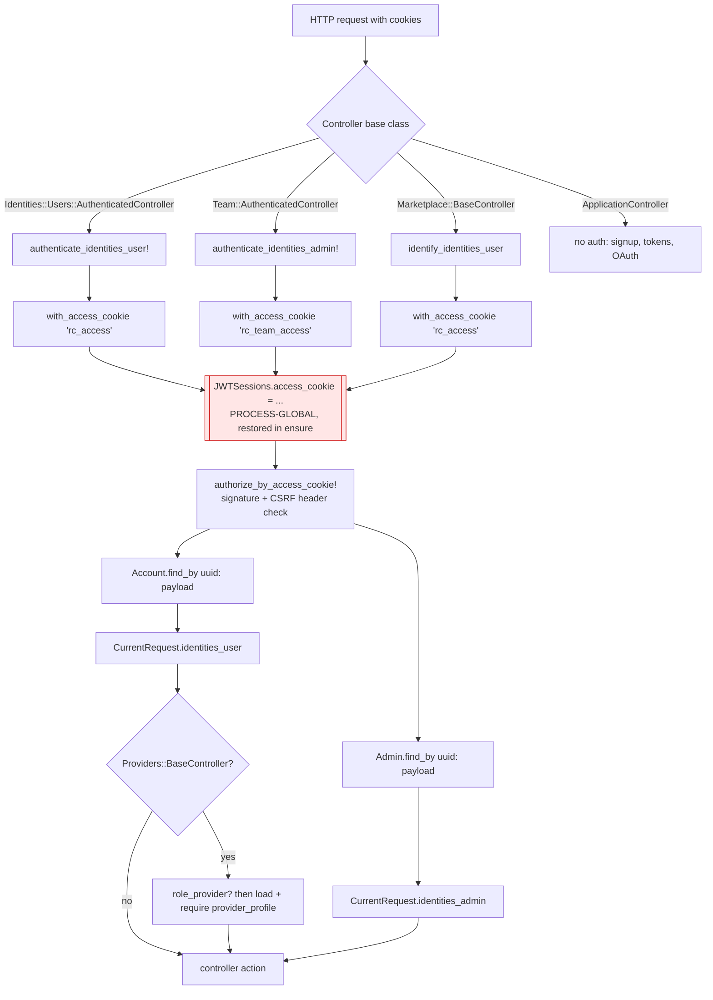
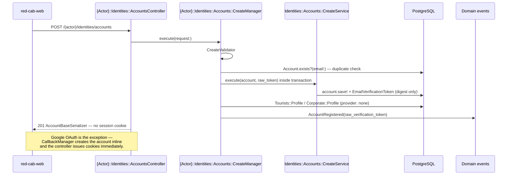
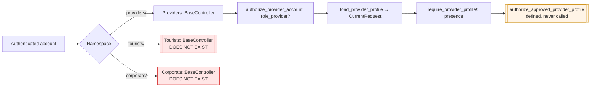
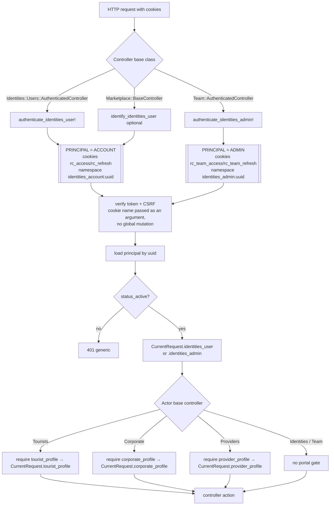
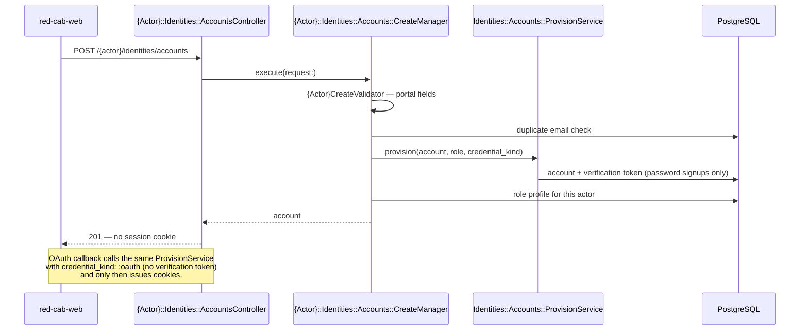
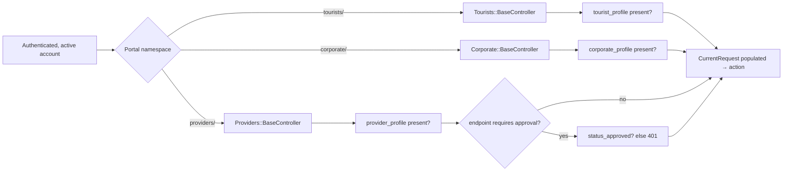

## TL;DR

- The IAM **shape** is right: thin `Identities::Account`, separate `Identities::Admin`, per-principal JWT namespaces, actor-scoped signup. Keep it.
- The IAM **state** is not shippable. Two `ref: cleanup` commits inverted token-validity logic; password reset is broken for real users and accepts already-used expired tokens.
- An uncommitted working-tree change removes `GET /identities/accounts/current`, which `red-cab-web` and the existing integration test both call.
- Fix correctness and security first (PR-01 → PR-03). Consolidate the API surface second (PR-04 → PR-06). Reduce duplication last (PR-07 → PR-08).

## About this document

Audit of the Identity & Access layer of `red-cab-api`, covering session lifecycle, account signup and read/update, the `identities_*` schema, and how authentication and authorization interact across actor namespaces.

| Topic | Document |
| --- | --- |
| Roadmap overview | [Phasing Roadmap](/docs/roadmap) |
| Foundation phase | [Phase 0](/docs/roadmap/phase-0-foundation) |
| Identity context | [Identity & Access](/docs/architecture/bounded-contexts/identity) |
| Identity ADR | [ADR-010](/docs/architecture/decisions/adr-010-identity-and-authorization-architecture) |
| IAM requirements | [FR-IAM](/docs/requirements/functional-requirements/iam) |

**Audited:** 2026-08-11 against `red-cab-api` at `d8a244b` plus uncommitted working-tree changes, and `red-cab-web` at its current checkout.

**Method:** static reading of every file in the scope list below, plus `git log -S` archaeology on the two managers that regressed. The test suite could **not** be executed locally — `bundle` cannot materialize the lockfile against the active Ruby (3.4.3 via mise), so `bin/rails test` aborts before boot. Every finding below is therefore backed by a file/line citation or a commit diff, never by a test run. Re-running the suite is the first task in PR-01.

---

## Pull request index

Each note below is scoped to one reviewable PR. Read them in order; later PRs assume earlier ones landed.

| PR | Phase | Scope | Breaking |
| --- | --- | --- | --- |
| [PR-01](/docs/roadmap/notes/pr-01-restore-account-current-route) | 0 | Restore `GET /identities/accounts/current`; unbreak the web contract | No (restores) |
| [PR-02](/docs/roadmap/notes/pr-02-iam-security-fixes) | 0 | Token validity inversions, archived-account login, lockout counter, OAuth linking gate | No |
| [PR-03](/docs/roadmap/notes/pr-03-session-cookie-manager-thread-safety) | 0 | Remove global `JWTSessions.access_cookie` mutation; collapse duplicated session code | No |
| [PR-04](/docs/roadmap/notes/pr-04-account-current-patch) | 1 | Add `PATCH /identities/accounts/current` (full profile update on `identities_accounts`) | No (additive) |
| [PR-05](/docs/roadmap/notes/pr-05-actor-base-controllers) | 1 | `Tourists::BaseController`, `Corporate::BaseController`, full `CurrentRequest` | No (additive) |
| [PR-06](/docs/roadmap/notes/pr-06-session-surface-symmetry) | 1 | Principal reads on the principal resource; align account and team session shapes | No (additive) |
| [PR-07](/docs/roadmap/notes/pr-07-oauth-account-provisioning) | 2 | OAuth reuses one account-provisioning path; stop hardcoding tourist | No |
| [PR-08](/docs/roadmap/notes/pr-08-deprecations) | 3 | Remove `PATCH …/language_preference`, duplicate logout route, dead code | **Yes** |

---

## 1. Executive summary

1. The bounded-context split is correct and should not change: `identities_accounts` holds credentials, personal name, coarse role, lockout, and language; org and verification data live in `corporate_profiles` and `providers_profiles`. No schema migration is needed for this audit.
2. `Identities::Admin` is correctly a separate principal with separate cookies (`rc_team_access` / `rc_team_refresh`) and a separate JWT namespace prefix. Namespace isolation holds.
3. **Password reset is broken and unsafe.** `password_resets/confirm_manager.rb:40-43` raises when the token *is* valid and proceeds when it is *used and expired* — a stale reset link is replayable forever. Introduced by `669689f` ("ref: cleanup logic in password reset").
4. **Email verification no longer expires.** `email_verifications/confirm_manager.rb:41` uses `||` where De Morgan requires `&&`, so any unused token is accepted regardless of `expires_at`. Introduced by `dee3c10`.
5. **The working tree currently breaks the account read endpoint.** `config/routes/identities_routes.rb:3` was changed from `get 'current'` to `get ''`; `red-cab-web/app/api/identities-accounts-api.js:24` and `test/integration/identities/accounts/show_integration_test.rb:21` both target `/current`. Revert this before anything else.
6. **Archived accounts can sign in.** `sessions/create_manager.rb` checks only `locked?`, then unconditionally writes `status: active` — a soft-deleted account logs in *and* resurrects itself. The admin login path gets this right (`status_active?`), so the two principals disagree.
7. **Lockout is effectively one-strike after the first lockout.** `failed_login_count` is only reset on a *successful* login, so once an account has hit five failures, every subsequent single failure re-locks it for 15 minutes. This contradicts OPR-1.
8. **`SessionCookieManager` mutates process-global state per request.** `with_access_cookie` assigns `JWTSessions.access_cookie` and restores it in `ensure`; Puma runs three threads per worker, so a team request can read the user cookie name and vice versa.
9. **OAuth links a Google identity to an existing account without checking that Google verified the email**, allowing takeover of a password account whose address an attacker can assert at a federated IdP.
10. **Password reset does not revoke live sessions.** A compromised session survives the password change it was supposed to end.
11. The account API surface is column-specific: `PATCH /identities/accounts/language_preference` is the only mutation, so `first_name` and `last_name` are stored, serialized nowhere, and unreachable. Consolidating on `PATCH /identities/accounts/current` removes one route, one Request, one Validator, and one Manager name from the surface.
12. Authorization is implemented for exactly one actor. `Providers::BaseController` gates on role plus profile presence; `Tourists::BaseController` and `Corporate::BaseController` do not exist, and `CurrentRequest` has no `tourist_profile` or `corporate_profile` despite `.ai/instructions.md` documenting both.
13. Session refresh and logout are written twice — once per principal — with the only differences being three constants. One parameterized path removes about 60 duplicated lines.
14. Serializer and error-payload contracts drift: `AccountBaseSerializer` and `AdminSessionSerializer` skip the actor prefix the conventions require, and four managers pass a JSON *string* as `request:` where the convention is a parsed hash.
15. Per-request account reload from Postgres is **acceptable** and should stay. It is one indexed lookup on `uuid`, and it is what makes lockout, archival, and role changes take effect immediately. Do not put role claims in the JWT.

---

## 2. Current architecture

### 2.1 Request authentication pipeline (current)

The red node is finding **IAM-05**: every authenticated request writes a module-level attribute that all threads in the worker share.

### 2.2 Account signup and session issuance (current)

### 2.3 Actor authorization chain (current)

### 2.4 Endpoint map

Routes as defined in the **working tree**. The `GET /identities/accounts` row is the uncommitted regression; at `HEAD` it reads `/identities/accounts/current`.

| Method + path | Controller#action | Auth | Manager | Tables touched |
| --- | --- | --- | --- | --- |
| `POST /tourists/identities/accounts` | `Tourists::Identities::AccountsController#create` | none | `Tourists::…::CreateManager` | `identities_accounts`, `identities_email_verification_tokens`, `tourists_profiles` |
| `POST /corporate/identities/accounts` | `Corporate::Identities::AccountsController#create` | none | `Corporate::…::CreateManager` | `identities_accounts`, `identities_email_verification_tokens`, `corporate_profiles` |
| `POST /providers/identities/accounts` | `Providers::Identities::AccountsController#create` | none | `Providers::…::CreateManager` | `identities_accounts`, `identities_email_verification_tokens` |
| `POST /identities/sessions` | `Identities::SessionsController#create` | none | `Identities::Sessions::CreateManager` | `identities_accounts` (read + lockout write) |
| `PATCH /identities/sessions/current` | `Identities::SessionsController#update` | refresh-by-access | — (controller-only) | `identities_accounts` (read) |
| `DELETE /identities/sessions/current` | `Identities::SessionsController#destroy` | access + CSRF | — | none |
| `DELETE /identities/sessions` | `Identities::SessionsController#destroy` | access + CSRF | — | none — duplicate route |
| `GET /identities/accounts` | `Identities::AccountsController#show` | access | — (reads `CurrentRequest`) | `identities_accounts` (read) |
| `PATCH /identities/accounts/current` | `Identities::AccountsController#update` | access + CSRF | `Identities::Accounts::UpdateManager` | `identities_accounts` |
| `PATCH /identities/accounts/language_preference` | *(stale route — 404)* | — | — | — |
| `POST /identities/email_verifications/confirm` | `Identities::EmailVerificationsController#confirm` | none | `…::EmailVerifications::ConfirmManager` | `identities_email_verification_tokens`, `identities_accounts` |
| `POST /identities/email_verifications/resend` | `#resend` | none | `…::EmailVerifications::ResendManager` | `identities_email_verification_tokens` |
| `POST /identities/password_resets/request` | `Identities::PasswordResetsController#create` | none | `…::PasswordResets::CreateManager` | `identities_password_reset_tokens` |
| `PATCH /identities/password_resets/confirm` | `#confirm` | none | `…::PasswordResets::ConfirmManager` | `identities_password_reset_tokens`, `identities_accounts` |
| `GET /identities/oauth/google` | `Identities::Oauth::GoogleController#show` | none | `…::Oauth::Google::ShowManager` | none (Redis state store) |
| `GET \| POST /identities/oauth/google/callback` | `#callback` | none | `…::Oauth::Google::CallbackManager` | `identities_oauth_identities`, `identities_accounts`, `tourists_profiles` |
| `POST /team/identities/admins/sessions` | `Team::…::SessionsController#create` | none | `Identities::Admins::Sessions::CreateManager` | `identities_admins` |
| `GET /team/identities/admins/sessions/current` | `#show` | team access | — | `identities_admins` (read) |
| `PATCH /team/identities/admins/sessions/current` | `#update` | team refresh-by-access | — | `identities_admins` (read) |
| `DELETE /team/identities/admins/sessions/current` | `#destroy` | team access + CSRF | — | none |

### 2.5 Column ownership today

Ownership is already correct. Recording it so future PRs do not drift.

| Concern | Table | Notes |
| --- | --- | --- |
| Login identifier, password digest, OAuth-nullable | `identities_accounts.email`, `.password_digest` | `has_secure_password validations: false` — validation stays in Validators |
| Personal name | `identities_accounts.first_name`, `.last_name` | Stored and written at signup; **never serialized, never updatable** |
| Coarse role claim | `identities_accounts.role` | Denormalized; must match exactly one profile row |
| Language preference | `identities_accounts.language_preference` | Nullable until first explicit selection (FR-IAM-010) |
| Lockout | `identities_accounts.failed_login_count`, `.locked_until`, `.status` | OPR-1 |
| Email verification state | `identities_accounts.is_email_verified`, `.email_verified_at` + token table | Digest-only tokens |
| Tourist role data | `tourists_profiles` | Only `status` today |
| Corporate org data | `corporate_profiles.organization_name`, `.group_size_range` | Correctly outside IAM |
| Provider verification data | `providers_profiles` + satellites | Correctly outside IAM |
| Internal staff principal | `identities_admins` | Single `name`, no role column |

---

## 3. Findings

Severity: **Critical** = data loss, account takeover, or a broken production path. **High** = security weakening or a wrong-behavior bug users will hit. **Medium** = architecture/consistency debt with a real maintenance cost. **Low** = cosmetic or dead code.

| ID | Sev | Area | Finding | Evidence | Recommendation |
| --- | --- | --- | --- | --- | --- |
| IAM-01 | Critical | Security | Password-reset token validity is inverted: valid tokens are rejected, and a token that is both **used and expired** is accepted, so an old reset link resets the password forever. | `app/domains/identities/password_resets/confirm_manager.rb:40-43`; regression diff in `669689f` | Restore `used_at.present? \|\| expires_at <= Time.current` → raise. [PR-02](/docs/roadmap/notes/pr-02-iam-security-fixes) |
| IAM-02 | Critical | API surface | Uncommitted change moves the account read from `/identities/accounts/current` to `/identities/accounts`; web and tests both call `/current`, so SSR hydration 404s. | `config/routes/identities_routes.rb:3` (working tree) vs `red-cab-web/app/api/identities-accounts-api.js:24` and `test/integration/identities/accounts/show_integration_test.rb:21` | Revert to `get 'current'`. [PR-01](/docs/roadmap/notes/pr-01-restore-account-current-route) |
| IAM-03 | Critical | Security | Archived accounts authenticate successfully and are silently un-archived by the login write. | `app/domains/identities/sessions/create_manager.rb:32-48` — only `locked?` is checked, then `status: active` is written unconditionally | Reject unless `status_active?` or a lock that has expired; never write `active` over `archived`. [PR-02](/docs/roadmap/notes/pr-02-iam-security-fixes) |
| IAM-04 | High | Security | Email-verification tokens never expire — `verified_at.nil? \|\| expires_at >= now` is true for any unused token. | `app/domains/identities/email_verifications/confirm_manager.rb:41`; regression diff in `dee3c10` | Change `\|\|` to `&&`. [PR-02](/docs/roadmap/notes/pr-02-iam-security-fixes) |
| IAM-05 | High | Security | `with_access_cookie` assigns the process-global `JWTSessions.access_cookie`; with `threads 3,3` a concurrent team and user request can each read the other's cookie name. | `app/controllers/concerns/session_cookie_manager.rb:202-209`; `config/puma.rb:27-28` | Pass the cookie token into jwt_sessions per call instead of mutating global state. [PR-03](/docs/roadmap/notes/pr-03-session-cookie-manager-thread-safety) |
| IAM-06 | High | Security | A successful password reset leaves every existing JWT session valid. | `app/domains/identities/password_resets/confirm_manager.rb:47-59` — no session flush | Flush the account's JWT namespace after commit. [PR-02](/docs/roadmap/notes/pr-02-iam-security-fixes) |
| IAM-07 | High | Security | `failed_login_count` is only zeroed on successful login, so after the first lockout expires a single wrong password re-locks for 15 minutes, permanently. | `app/domains/identities/sessions/create_manager.rb:32-33, 68-90` | Reset the counter when the lock window lapses. [PR-02](/docs/roadmap/notes/pr-02-iam-security-fixes) |
| IAM-08 | High | Security | Google identities are linked to an existing password account by email match without requiring `google_profile.is_email_verified`. | `app/domains/identities/oauth/google/callback_manager.rb:75-88, 189-206` | Refuse to link unless the IdP asserts a verified email. [PR-02](/docs/roadmap/notes/pr-02-iam-security-fixes) |
| IAM-09 | High | AuthZ | Authenticated requests never re-check account state, so a session issued before a lock or archive keeps working until the token expires. | `app/controllers/identities/users/authenticated_controller.rb:11-26` | Reject non-active accounts in the authenticate filter. [PR-02](/docs/roadmap/notes/pr-02-iam-security-fixes) |
| IAM-10 | Medium | API surface | ~~Account mutation is column-specific~~ **Fixed (PR-04):** `PATCH /identities/accounts/current` updates profile fields; stale `language_preference` route line remains until PR-08. | `config/routes/identities_routes.rb`; `app/domains/identities/accounts/update_manager.rb` | Done — [PR-04](/docs/roadmap/notes/pr-04-account-current-patch) |
| IAM-11 | Medium | Duplication | Refresh and logout exist twice, differing only in three constants. | `app/controllers/concerns/session_cookie_manager.rb:32-65, 87-149` | Parameterize by a principal descriptor. [PR-03](/docs/roadmap/notes/pr-03-session-cookie-manager-thread-safety) |
| IAM-12 | Medium | CurrentRequest | `tourist_profile` and `corporate_profile` are documented but absent, so downstream Managers cannot be handed a tourist context. | `app/models/current_request.rb:3-5` vs `.ai/instructions.md` § CurrentRequest | Add both attributes with a documented setter. [PR-05](/docs/roadmap/notes/pr-05-actor-base-controllers) |
| IAM-13 | Medium | AuthZ | `Tourists::BaseController` and `Corporate::BaseController` are documented in the inheritance chain but not implemented; nothing enforces the tourist or corporate portal gate. | `app/controllers/` listing; `.ai/instructions.md` § Controller Inheritance Chain | Implement both. [PR-05](/docs/roadmap/notes/pr-05-actor-base-controllers) |
| IAM-14 | Medium | AuthZ | The gate rule is stated as "profile presence over role alone" but only providers implement it, and they check role *and* profile with two different error messages. | `docs/db/identities.dbml:25`; `app/controllers/providers/base_controller.rb:10-46` | Standardize on profile presence as the gate; keep role as a routing hint. [PR-05](/docs/roadmap/notes/pr-05-actor-base-controllers) |
| IAM-15 | Medium | Duplication | OAuth builds accounts and tourist profiles inline, bypassing `Identities::Accounts::CreateService`, and hardcodes `role: tourist` for every new federated account. | `app/domains/identities/oauth/google/callback_manager.rb:123-150` | Route OAuth signup through one provisioning path. [PR-07](/docs/roadmap/notes/pr-07-oauth-account-provisioning) |
| IAM-16 | Medium | Naming | Admin login reads `Identities::Account::MAX_FAILED_ATTEMPTS` and `LOCKOUT_DURATION`, coupling the internal principal to the external one, and never publishes a lockout event. | `app/domains/identities/admins/sessions/create_manager.rb:75-78` | Give `Identities::Admin` its own constants. [PR-02](/docs/roadmap/notes/pr-02-iam-security-fixes) |
| IAM-17 | Medium | Convention | Four managers pass `request.to_json` (a String) as the error `request:` payload where the convention is `JSON.parse(request.to_json, symbolize_names: true)`. | `identities/admins/sessions/create_manager.rb:66`; `tourists\|corporate\|providers/identities/accounts/create_manager.rb:26, 36` | Normalize to a parsed hash. [PR-06](/docs/roadmap/notes/pr-06-session-surface-symmetry) |
| IAM-18 | Medium | API surface | `DELETE /identities/sessions` and `DELETE /identities/sessions/current` both map to `destroy`. | `config/routes/identities_routes.rb:20-21`; both covered in `test/integration/identities/sessions/destroy_integration_test.rb` | Keep `/current`, deprecate the bare path. [PR-08](/docs/roadmap/notes/pr-08-deprecations) |
| IAM-19 | Medium | Convention | Admin login accepts either flat or `session`-nested params; account login accepts flat only — and `red-cab-web` sends nested for team, flat for accounts. | `identities/admins/sessions/create_request.rb:18-22` vs `identities/sessions/create_request.rb:17-20`; `red-cab-web/app/api/team-sessions-api.js:9` | Pick flat everywhere. [PR-06](/docs/roadmap/notes/pr-06-session-surface-symmetry) |
| IAM-20 | Medium | Naming | `Identities::AccountBaseSerializer` and `Identities::AdminSessionSerializer` do not follow `{Domain}::{Actor}{Model}{Base…}Serializer`, and `AdminSessionSerializer` names a session while serializing an admin. | `app/domains/identities/account_base_serializer.rb`, `admin_session_serializer.rb` | Rename in the deprecation PR. [PR-08](/docs/roadmap/notes/pr-08-deprecations) |
| IAM-21 | Medium | Duplication | `identify_account_session` is dead; `Marketplace::BaseController` reimplements optional auth with its own rescue. | `session_cookie_manager.rb:79-85` vs `marketplace/base_controller.rb:10-20` | Use the concern method or delete it. [PR-03](/docs/roadmap/notes/pr-03-session-cookie-manager-thread-safety) |
| IAM-22 | Medium | Convention | `Identities::Admin` uses bare `has_secure_password`, adding model-level validations; `Identities::Account` correctly passes `validations: false`. | `app/domains/identities/admin.rb:6` vs `account.rb:9` | Match `Account`. [PR-02](/docs/roadmap/notes/pr-02-iam-security-fixes) |
| IAM-23 | Medium | Convention | Corporate and provider signup emit `messages: { email: 'string' }` instead of an array, breaking the documented error envelope that clients index into. | `corporate/identities/accounts/create_manager.rb:32`; `providers/identities/accounts/create_manager.rb:32` | Wrap in an array, as tourists already does. [PR-06](/docs/roadmap/notes/pr-06-session-surface-symmetry) |
| IAM-24 | Low | Docs | Stale comment `# GET /identities/accounts/show` describes a path that never existed. | `app/controllers/identities/accounts_controller.rb:4` | Delete with PR-01. |
| IAM-25 | Low | Dead code | `Marketplace::BaseController` exists with no routes — `config/routes/marketplace_routes.rb` is empty. | file is 0 bytes | Leave; Phase 1 Catalog will use it. |
| IAM-26 | Low | Contract | Team sidebar links `/team/identities/accounts`, which has no API route. | `red-cab-web/app/layouts/team/team-sidebar-config.js:85` | Hide until built. |
| IAM-27 | Low | Security | `ApplicationController#cookie_domain` is defined but never passed to `set_session_cookie`. | `application_controller.rb:100-102`; `session_cookie_manager.rb:211-220` | Keep host-only cookies; delete the unused helper or wire it deliberately. [PR-03](/docs/roadmap/notes/pr-03-session-cookie-manager-thread-safety) |
| IAM-28 | Low | Dead code | `authorize_approved_provider_profile` is defined but never invoked as a filter anywhere. | `providers/base_controller.rb:23-37` | Invoke it from the endpoints that require approval, or delete. [PR-05](/docs/roadmap/notes/pr-05-actor-base-controllers) |
| IAM-29 | Low | Test gap | No integration coverage for account login, OAuth callback cookie issuance, or actor signup HTTP responses; `test/integration/identities/` covers only accounts show, language preference, sessions update/destroy, password reset confirm, and OAuth show/callback. | `test/integration/identities/` listing | Add per PR. |

### 3.1 Explicitly correct — no action

Recording these so a future audit does not re-litigate them:

- **JWT payload minimalism.** The token carries only `identities_account_uuid`; every request reloads the account. One indexed `uuid` lookup is cheap, and it is what makes lockout and archival effective immediately. Adding role claims would create a revocation problem for no measurable gain. **Keep as is.**
- **Cookie namespace isolation.** `identities_account:<uuid>` and `identities_admin:<uuid>` prefixes plus four distinct cookie names mean a user token can never satisfy a team endpoint. Correct.
- **Digest-only tokens.** Both token tables store `Digest::SHA256` digests and are append-only. Correct, and matches the DBML.
- **Generic credential errors.** Both login managers return the same `'The email or password you entered is incorrect.'` for unknown email, wrong password, and active lockout, with `skip_sentry: true`. Matches FR-IAM-006 and OPR-1.
- **Password-reset request enumeration resistance.** `PasswordResets::CreateManager` returns the same message for unknown and OAuth-only accounts and creates no token. Correct.
- **CSRF.** jwt_sessions enforces the masked CSRF header on non-GET requests; the integration tests assert 401 without it. Correct.
- **Schema shape.** `identities_accounts` carries exactly credentials, name, role, language, lockout, and verification state. Org and verification data are already in profiles. **No migration needed.**

---

## 4. Target architecture

### 4.1 Request authentication pipeline (target)

Two changes from today: the principal descriptor is passed rather than assigned globally (PR-03), and account state is re-checked on every request (PR-02).

### 4.2 Account signup and session issuance (target)

### 4.3 Actor authorization chain (target)

**The gate is profile presence, not the role enum.** `role` stays on the account as a denormalized routing hint for the frontend's post-login redirect; it is never the authorization decision. This resolves IAM-14 and makes the DBML note (`docs/db/identities.dbml:25`) true.

### 4.4 Target endpoint map

Changes are marked; everything unmarked stays exactly as it is today.

| Method + path | Action | Change |
| --- | --- | --- |
| `POST /{actor}/identities/accounts` | signup | unchanged |
| `POST /identities/sessions` | login | unchanged |
| `PATCH /identities/sessions/current` | refresh | unchanged |
| `DELETE /identities/sessions/current` | logout | unchanged |
| ~~`DELETE /identities/sessions`~~ | logout | **removed** (PR-08) |
| `GET /identities/accounts/current` | read principal | restored (PR-01) |
| `PATCH /identities/accounts/current` | update profile (names, email, language) | **shipped** (PR-04) |
| ~~`PATCH /identities/accounts/language_preference`~~ | stale route line | **removed** (PR-08) |
| `POST /identities/email_verifications/confirm \| resend` | — | unchanged |
| `POST /identities/password_resets/request`, `PATCH …/confirm` | — | unchanged |
| `GET /identities/oauth/google`, `GET\|POST …/callback` | — | unchanged |
| `POST /team/identities/admins/sessions` | admin login | unchanged |
| `PATCH \| DELETE /team/identities/admins/sessions/current` | refresh, logout | unchanged |
| `GET /team/identities/admins/current` | read admin principal | **new** (PR-06) |
| ~~`GET /team/identities/admins/sessions/current`~~ | read admin principal | **removed** (PR-08) |

**Rule:** a session resource owns lifecycle only — `POST` to create, `PATCH current` to refresh, `DELETE current` to end. "Who am I" is a read on the *principal* resource: `/identities/accounts/current` for accounts, `/team/identities/admins/current` for admins. Today the account side follows this rule and the team side does not.

### 4.5 Class naming map

| Concern | Current | Target | PR |
| --- | --- | --- | --- |
| Account read | none (controller reads `CurrentRequest`) | unchanged — no Manager needed for a `CurrentRequest` echo | — |
| Account update | `Identities::Accounts::UpdateLanguagePreference{Request,Validator,Manager}` | `Identities::Accounts::Update{Request,Validator,Manager}` | PR-04 |
| Account provisioning | `Identities::Accounts::CreateService` | `Identities::Accounts::ProvisionService` (adds `credential_kind`) | PR-07 |
| Admin read | `Team::…::SessionsController#show` | `Team::Identities::AdminsController#show` | PR-06 |
| Account principal serializer | `Identities::AccountBaseSerializer` | `Identities::UsersAccountBaseSerializer` | PR-08 |
| Admin principal serializer | `Identities::AdminSessionSerializer` | `Identities::TeamAdminBaseSerializer` | PR-08 |
| Session cookies | `SessionCookieManager` with per-principal method pairs | same concern, one parameterized path + `SessionPrincipal` descriptor | PR-03 |

---

## 5. Schema recommendations

**No migration is required by this audit.** `identities_accounts` already holds exactly the auth-principal concerns, and role data already lives in profiles.

| Column | Owner today | Correct? | Migration |
| --- | --- | --- | --- |
| `email`, `password_digest` | `identities_accounts` | Yes | No |
| `first_name`, `last_name` | `identities_accounts` | Yes — one person, one name, independent of portal | No |
| `role` | `identities_accounts` | Yes as a *hint*; must stop being the authorization gate | No |
| `language_preference` | `identities_accounts` | Yes — nullable-until-chosen is load-bearing for FR-IAM-011 | No |
| `failed_login_count`, `locked_until`, `status` | `identities_accounts` | Yes | No |
| `is_email_verified`, `email_verified_at` | `identities_accounts` | Yes | No |
| `organization_name`, `group_size_range` | `corporate_profiles` | Yes | No |
| provider verification fields | `providers_profiles` + satellites | Yes | No |
| `name` (single field) | `identities_admins` | Yes — internal display name, deliberately not split | No |

Two schema-adjacent notes, both **deferred**, not recommended now:

- There is no DB-level guarantee that `role` matches the existing profile row. The invariant is documented in `docs/db/identities.dbml:71` and enforced nowhere. Once authorization moves to profile presence (PR-05) the invariant stops being security-critical, so a constraint is not worth the migration. Revisit if `role` ever gains a second consumer.
- `identities_admins` has no role or permission column, so every admin is omnipotent. Fine for Phase 1; it becomes a real gap when the team portal gains destructive financial actions. Tracked as an open question below.

---

## 6. AuthN / AuthZ model

The two concerns are currently entangled: `Providers::BaseController` performs an authorization check (`role_provider?`) and raises `UnauthorizedError` (401), which is an *authentication* status code. The target separates them cleanly.

| Question | Layer | Where it is answered | Failure |
| --- | --- | --- | --- |
| Is this request carrying a valid, unexpired, CSRF-matched token? | AuthN | `SessionCookieManager` + jwt_sessions | 401 |
| Which principal is it, and does that record still exist and is it active? | AuthN | `Identities::Users::AuthenticatedController` / `Team::AuthenticatedController` | 401 |
| Is this principal allowed in *this portal*? | AuthZ | `{Actor}::BaseController` — profile presence | 403 |
| Is this principal allowed to perform *this action*? | AuthZ | `{Actor}::BaseController` filter (e.g. approved provider) or a Validator when the rule is a domain invariant | 403 or 422 |
| Does this principal own *this record*? | AuthZ | Manager, via the scoping profile passed as a keyword argument | 404 |

Rules that follow, and that PRs 02–05 implement:

1. **Managers never read `CurrentRequest`.** They receive `identities_account:`, `tourist_profile:`, `corporate_profile:`, or `provider_profile:` as keyword arguments. Already honored everywhere in IAM today — keep it that way.
2. **Controllers never validate credentials.** `SessionCookieManager` only issues, refreshes, and clears cookies; it is called *after* a Manager returns a principal. Already honored.
3. **Portal membership is profile presence.** Role is a hint for redirects, never a gate.
4. **Record ownership is a Manager concern**, scoped by the profile it was handed — never by re-reading the role.
5. **Status is re-checked per request**, not just at login (IAM-09).

**Status code caveat:** every authorization failure in IAM today returns `Errors::UnauthorizedError` (401), which tells `red-cab-web`'s ky client to attempt a token refresh and retry — pointless work for a request that will never succeed. Introducing a 403 `Errors::ForbiddenError` is the correct fix but is a coordinated API + web change; it is called out as an open question rather than folded into PR-05.

---

## 7. Phased refactor plan

**Phase 0 — stop the bleeding. No API contract change.**

- [ ] [PR-01](/docs/roadmap/notes/pr-01-restore-account-current-route) — revert the working-tree route change; get the suite green and runnable
- [ ] [PR-02](/docs/roadmap/notes/pr-02-iam-security-fixes) — IAM-01, IAM-03, IAM-04, IAM-06, IAM-07, IAM-08, IAM-09, IAM-16, IAM-22
- [ ] [PR-03](/docs/roadmap/notes/pr-03-session-cookie-manager-thread-safety) — IAM-05, IAM-11, IAM-21, IAM-27

**Phase 1 — additive. Old routes keep working.**

- [x] [PR-04](/docs/roadmap/notes/pr-04-account-current-patch) — `PATCH /identities/accounts/current`; `UpdateLanguagePreference*` removed
- [ ] [PR-05](/docs/roadmap/notes/pr-05-actor-base-controllers) — tourist and corporate base controllers, `CurrentRequest` completion, profile-presence gate
- [ ] [PR-06](/docs/roadmap/notes/pr-06-session-surface-symmetry) — `GET /team/identities/admins/current`; normalize param shapes and error payloads

**Phase 2 — internal consolidation, no contract change.**

- [ ] [PR-07](/docs/roadmap/notes/pr-07-oauth-account-provisioning) — one provisioning path for password and OAuth signup

**Phase 3 — deprecate and remove. Breaking; requires a web release first.**

- [ ] [PR-08](/docs/roadmap/notes/pr-08-deprecations) — remove `PATCH …/language_preference`, `DELETE /identities/sessions`, `GET …/admins/sessions/current`; rename serializers

---

## 8. Open questions

| ID | Question | Why it needs a human | Working assumption |
| --- | --- | --- | --- |
| IAM-Q1 | Should an unverified account be able to log in at all? `Sessions::CreateManager` does not check `is_email_verified`, and `.ai/instructions.md` only says signup issues no cookie. | Product gating decision with a real conversion cost | Login is allowed; the frontend gates features on `is_email_verified` |
| IAM-Q2 | Should authorization failures return 403 instead of 401? Today they return 401, which makes the web client burn a refresh round-trip on every denied request. | Coordinated API + web contract change | Keep 401 until PR-05 ships, then revisit |
| IAM-Q3 | Can one person hold two roles (a tourist who also runs a tour business)? The schema enforces one `role` and one profile per account per table. | Product decision that determines whether `role` can ever be dropped | One role per account; a second business identity needs a second account |
| IAM-Q4 | Does `identities_admins` need roles or permissions before the team portal gains destructive financial actions (commission rates, payouts)? | Security posture for internal staff | Every admin is omnipotent in Phase 1 |
| IAM-Q5 | Should a Google sign-in for a brand-new user always create a tourist, or should the portal that initiated the OAuth flow decide? | Determines whether providers and corporate clients can onboard via Google | Tourist only, per Phase 0 |
| IAM-Q6 | Should a password reset revoke sessions on *all* devices, or preserve the requesting device? | UX vs security tradeoff | Revoke everything (PR-02) |
| IAM-Q7 | AMB-016 — is 5 attempts / 15 minutes final? | Still open in the ambiguity register | 5 / 15 min |

---

## 9. Out of scope

Deliberately untouched by every PR in this set:

- **Catalog, Bookings, Payments, Reviews, Corporate quotations.** Pricing authority, booking snapshot immutability, and the seat-reservation guard are not affected by any change here. No IAM PR touches `Catalog::Availability::ReserveSeatsManager` or any snapshot column.
- **Notifications delivery.** `AccountRegistered`, `AccountLocked`, `LanguagePreferenceChanged`, and `PasswordResetRequested` are published today and keep their exact payloads. PR-02 adds no new event; an admin lockout event is noted as follow-up, not built.
- **Schema migrations.** No `identities_*` table changes. See § 5.
- **`red-cab-web` beyond contract impact.** PR-01 restores the contract the web app already expects. PR-04 requires web to send the full account payload on update. PR-06 is additive until PR-08.
- **The JWT library choice and token TTLs.** `jwt_sessions` with Redis storage is fine; no change proposed.
- **Marketplace optional-auth routes.** `config/routes/marketplace_routes.rb` is empty and belongs to Phase 1 Catalog work.

---

## 10. Self-assessment

| Criterion | Score | Reasoning |
| --- | --- | --- |
| Consistency | 4/5 | Sessions, accounts, and team converge on one rule (lifecycle on session, identity on principal) and one gate (profile presence). Loses a point because the 401-vs-403 split is deferred to an open question. |
| Simplicity | 4/5 | Net −2 routes, −2 classes, −60 duplicated lines. Loses a point because PR-03 adds a `SessionPrincipal` descriptor — a new concept, justified only by the thread-safety fix. |
| Security | 5/5 | Fixes two token inversions, archived-account login, session survival across password reset, the OAuth linking hole, and a cross-thread cookie race. Nothing is weakened. |
| DDD fit | 5/5 | IAM stays credentials-only. No profile data moves in, no schema change, role stops leaking into authorization decisions. |
| Convention fit | 5/5 | Matches `.ai/instructions.md` naming, routing, and simple Request → Validator → Manager pattern for account update. |
| Migratability | 5/5 | Phase 0 is contract-neutral, Phase 1 is additive, and only Phase 3 breaks — after the web app has already moved. Every PR is independently revertable. |

**Overall: 27/30.** The weak points are both deliberate deferrals (403 status codes, and the breadth of `UpdateManager`) rather than unresolved design problems.

---

## 11. Recommended Phase 1 PR scope

If only one PR ships from this audit, it must be **[PR-01](/docs/roadmap/notes/pr-01-restore-account-current-route) combined with [PR-02](/docs/roadmap/notes/pr-02-iam-security-fixes)** — a broken account read and a replayable password reset are both live-traffic problems.

The recommended *Phase 1* PR, once Phase 0 has landed, is **[PR-04](/docs/roadmap/notes/pr-04-account-current-patch)**: it is additive, it is the consolidation the audit was asked to prioritize, and it unblocks the account-settings screen that `first_name` / `last_name` have been waiting on since Phase 0. Its full PR description is in that note.
